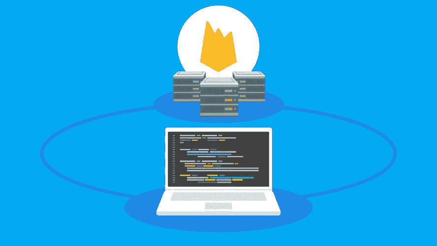
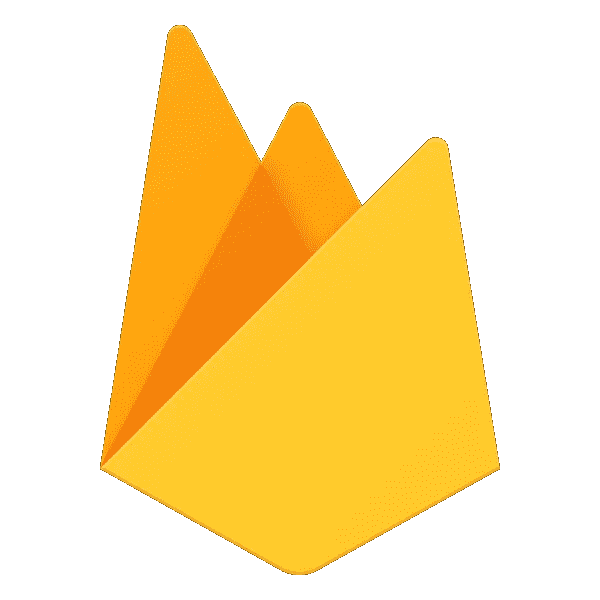

# 使用 Firebase 实现无服务器化

> 原文：<https://towardsdatascience.com/go-serverless-with-firebase-5348dedb70e9?source=collection_archive---------6----------------------->

## 关于无服务器什么，为什么和如何？

# 什么是无服务器架构？



Firebase Cloud Function

简而言之，**无服务器架构**是一种编程范式，专注于直接为 web 端点编写函数，而不是经历设置服务器、路由请求、定义 REST 资源，然后创建 GET、POST 和 PUT 方法的整个过程。还在迷茫？用程序员的术语来说，我们只需要编写方法体，其他的都是由服务提供商现成提供的。

最常见的无服务器服务提供商是亚马逊，他们有[的 AWS Lambda](https://aws.amazon.com/lambda/) 服务。这是一种高度可扩展的解决方案，广泛用于企业级应用。这些服务大部分要么与[亚马逊发电机](https://aws.amazon.com/dynamodb/?nc2=h_m1)一起使用，要么与 [MongoDB Atlas](https://www.mongodb.com/cloud/atlas) 一起使用。从 AWS 开始并构建一个应用程序是相当麻烦的，尽管它有如此多的功能和酷的集成。所以让我们用 Firebase 做同样的事情吧！！:)

# 为什么选择无服务器架构？

除了简单性，无服务器架构几乎没有其他优势。由于您只对 web 服务的逻辑进行编程，可伸缩性将不再是一个问题。您将只为执行次数付费，这意味着未使用的功能不会收费。Firebase 通过其身份验证平台简化了身份验证方式。毕竟，这也有不好的一面。您可能不了解底层硬件，因此在某些情况下，您必须遵循它们提供的标准硬件 API。但是对于存储，谷歌提供谷歌存储，AWS 为此提供 S3 存储桶。

# 怎么会？

我觉得这是最有意思的事情。让我们使用 **firebase 云函数**制作一个简单的应用程序，这是他们对无服务器架构的称呼。

## 第一步

1.  转到[https://firebase.google.com/](https://firebase.google.com/)
2.  转到控制台
3.  添加项目，给一个名字，然后按下创建
4.  选择“确定”后，您将被定向到 firebase 控制台
5.  在**开发**部分，转到**功能**

## 第二步

现在您已经创建了一个应用程序，您将有一些 NPM 软件包要安装。

安装 Firebase CLI 工具

```
$ npm install -g firebase-tools
```

现在使用工具登录

```
$ firebase login
```

您将被要求通过打开浏览器登录。相应地登录。现在使用下面的命令启动项目。

```
$ firebase init
```

选择**云函数**并按回车键，然后选择创建的项目并按回车键。在同一个项目文件夹中，创建一个名为 functions 的文件夹，转到该文件夹并启动一个节点项目，如下所示。

```
$ npm init
$ npm install firebase-functions@latest firebase-admin@latest --save
```

现在创建一个 ***index.js*** 文件并创建函数，假设它是一个普通的节点 js 服务器端代码。示例代码如下。

如果您熟悉 Node JS，很明显这个函数会将查询参数和主体参数返回给用户。

## 第三步

您现在可以部署应用程序了。为此，我们可以使用以下命令。

```
$ firebase deploy --only functions
```

一旦部署结束，您将获得函数 URL。您可以将其粘贴到浏览器上并发送 GET 请求，或者通过 REST API 测试工具发送请求。



Firebase

工作量很大吗？一旦你将这些步骤分类，你就可以专注于编写函数了，上面的代码是我唯一需要自己编写的代码；-).您可以轻松地与 Firebase 数据库、存储或身份验证连接，构建一个完整的应用程序。另外，你可以用免费的配额做很多事情。

我希望你喜欢读这篇文章。启动你的下一个项目，干杯！！

文件:[https://firebase.google.com/docs/functions/get-started](https://firebase.google.com/docs/functions/get-started?authuser=0)
视频系列:[https://www.youtube.com/watch?v=EvV9Vk9iOCQ](https://www.youtube.com/watch?v=EvV9Vk9iOCQ)