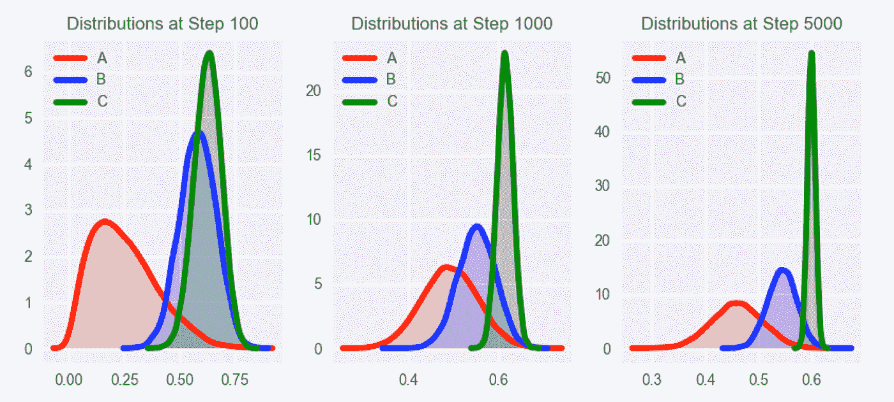

# 上帝不玩骰子，但我们玩

> 原文：<https://towardsdatascience.com/god-doesnt-play-dice-but-we-do-how-we-learned-to-love-multi-armed-banditry-c88177d0158a?source=collection_archive---------9----------------------->

## **或者说，我们是如何学会爱上多种武器的土匪行为的**

如今个性化无处不在。从网飞电影推荐到优化行动号召的字体大小，在有记载的历史中，从来没有像福克纳的小说那样投入如此多的存在主义的悲伤和精神能量，让人们点击闪烁的图标。每个人现在都在做 A/B 测试，从他们的电子商务前端到他们的电子邮件营销活动；你(或者你的 UX 设计师)可能也不例外。真正的问题是，你真的需要知道“[家庭错误率](https://en.wikipedia.org/wiki/Family-wise_error_rate)”是什么(你应该知道)，或者有其他方法吗？

有！如果传统的 A/B 测试可以描述为掷硬币，两组有不同的转换概率，那么多臂强盗(MAB)就像掷骰子。更重要的是，如果我们真的是为了乐趣和利润而玩，我们可以把正常的骰子换成有负荷或有偏见的骰子，某些方面比其他方面更有可能被掷出

We’re about to go from ashy to classy

在这种情况下，就像我们这些四处游荡的恶棍一样，我们在任何给定的时刻都在赌该选择哪个选项；就像我们这些聪明的流浪儿一样，随着时间的推移，我们试图通过选择期望值较高的选项来最大化我们的收益，而不是选择期望值较低的选项，并试图在我们学习新信息时调整相对频率。

MAB 的好处在于，它旨在平衡收集信息的需求和收集信息的成本。感兴趣的 KPI(例如点击率)可以在开始时直接优化。但是我们需要确定如何给骰子的每一面分配权重。有许多方法可以实现这一点，如[ε贪婪](https://jamesmccaffrey.wordpress.com/2017/11/30/the-epsilon-greedy-algorithm/)或[置信上限](http://banditalgs.com/2016/09/18/the-upper-confidence-bound-algorithm/)，但 [Thompson 采样](https://en.wikipedia.org/wiki/Thompson_sampling)是一个特别优雅的解决方案(顺便提一下，这也是 WeWork 的首选 MAB 策略)。简而言之，这是一种基于某个选项是最佳选项的概率来选择选项的有效方法。

假设我们有三种类型的登录页面，每个页面都有不同的副本和千年美学，因此有不同但未知的引发转换事件的概率。我们需要在每个页面的可能转换率上定义一个概率分布(通常是一个 [Beta](https://en.wikipedia.org/wiki/Beta_distribution) 分布)。预期的转换以及我们估计的不确定性将被很好地编码到与其登录页面相关的每个发行版中。

通过汤普森抽样，我们将从每个登录页面的相关概率分布中随机抽取。然后，我们获取具有最大采样值的登录页面，简单地将其提供给用户，并记录结果。重复这个过程，直到你的产品经理满意或者宇宙的热寂，无论哪个更快。

Left: A state of maximum entropy. Right: Also a state of maximum entropy.

这一过程隐含地优化了登录页面，使其具有最大的预期转换率和最少的估计不确定性(在文献中称为“利用”)，同时仍然允许选择具有较低预期转换率和较高不确定性的选项(“探索”)。随着时间的推移，每个页面被选择的频率将与该选项是最佳选项的概率一致。随着时间的推移，我们可以最大限度地提高转化的数量，从而最大限度地提高贵组织最终销售的产品数量(在我们的案例中，是桌子和潮人的产品)。

这里真正强大的是这些分布不是静态的。当我们观察用户如何响应登录页面时，我们可以获取这些信息并更新每个选项的底层分布，以反映新数据中的信息，如下所示。

事实上，如果您对每个登录页面的预期转换没有先入为主的概念，您可以从每个页面的相同分布开始，简单地“让数据自己说话”开始时，选择是随机的，然后随着收集到更多的数据来更新分布，开始倾向于最高性能的选项。在这个例子中，登录页面“C”逐渐成为明显的赢家。

Bandits 允许从探索到利用的平稳过渡，并且可以更快更有效，因为它们实时地将流量转移到获胜的变化，而不是强迫你等到测试期结束。如果自动化和持续优化是你的目标，它们是有用的工具。

也就是说，A/B 测试仍然有一席之地，特别是如果统计的严格性和不确定性估计很重要的话。真正的诀窍是在给定的情况下找到合适的工具，并理解其中的利弊。

临别赠言:我们建议你拿出一小部分流量，用于随机选择。这个调整对抗了数据收集过程中的偏见，并确保您有一个无偏见的随机基线来评估您的 bandit 的功效。它还可以抵御不可预见的外部或季节性变化的影响，这些变化可能会彻底改变分布的参数。