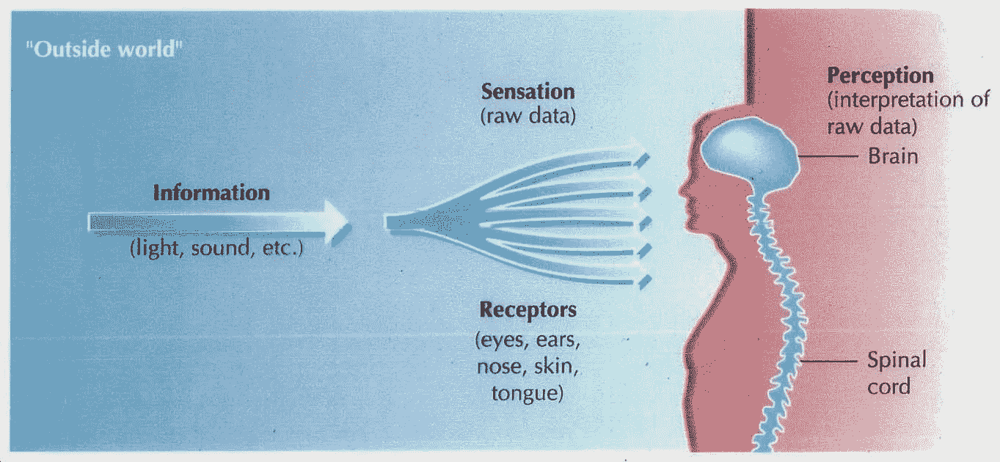
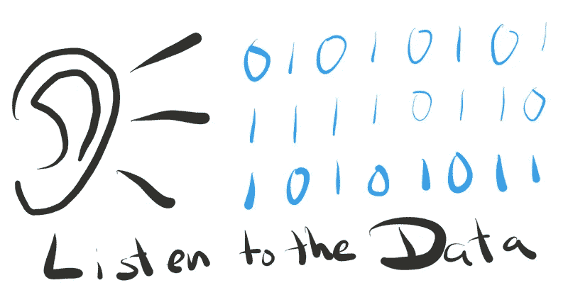

# 超越敏捷数据科学工作流

> 原文：<https://towardsdatascience.com/going-beyond-with-agile-data-science-fcff5aaa9f0c?source=collection_archive---------6----------------------->

## 超越我的眼睛所看到的，是我应用于生活中每一个方面的东西。在本文中，我将展示敏捷数据科学工作流如何在这方面帮助我。

我们生活在一个复杂的世界，我们生活在一个文化的世界。这意味着我们不能选择成为没有文化的生物。我们出生了，就是这样，你已经在那里了。你无法选择你的身份，父母，城市等等。然后我们学习，从生活和学校，我们的朋友，我们的家庭。

这个过程创造了一种看待事物的方式，一种思考世界、思考我们自己和我们周围事物的方式。我们的感官向世界敞开我们的大门，我们听到，我们感觉到，我们品尝到，我们看到。当我提到“超越”或类似的东西时，我指的是我们所有感官的结合，即我们从各个角度所感知的东西。

我们从“外部世界”获得数据，我们的身体和大脑分析我们获得的原始数据，然后我们“解释”事物。

# 建模世界

这是什么“解读”？只是我们从所获得的信息中学到了如何反应、思考、感受和理解。当我们理解时，我们正在解码形成这个复杂事物的各个部分，并将我们一开始获得的原始数据转化为有用和简单的东西。

我们通过**建模**来做到这一点。这是理解“现实”，我们周围的世界，但创造一个更高层次的原型来描述我们所看到的，听到的和感觉到的东西的过程，但这是一个代表性的东西，而不是“实际”或“真实”的东西。

# 更进一步

我们不呆在那里。我们的世界模型，或者说过程，有另一部分。我们认为特定的事物意味着什么，以及我们对它的感受。

**ME JUMPING TO CONCLUSIONS**

当我年轻的时候，我对很多很多事情有很多偏见。在见到人和事之前就对他们下结论。我不认为我是一个人。

我们习惯于很快下结论，而不是分析事情的每一面。我们习惯于看到我们眼睛所看到的，并“相信我们的直觉”。

遗憾的是，在我们的文化中占主导地位的常识是**亚里士多德式的**和**中世纪式的**。这意味着直觉在试图理解世界时会失败很多次，而且这种“常识”有时会伴随着判断，这种判断会在我们看待事物的方式上产生偏见。

在这种情况下，向前看意味着向前迈一步，把你的判断、常识和直觉放在一边，真正分析一种情况。我们应该为我们周围发生的每一件事都这样做，问问我们自己你正在做的、思考的和感知的事情是否真的正确。这是非常接近笛卡尔的****的东西。****

# **为什么要超越数据科学？**

> **在一个难以预测未来的世界里，商业成功构建系统的能力离不开能力。**

**那么数据科学和这些有什么关系呢？实际上，超越我们的常识和直觉是解决复杂商业问题的唯一途径。**

**在一个充满直观模型的世界里，颠覆和进步来自超越，用数据去理解肉眼或“专家的眼光”看不到的东西。**

**由 [Russell Jurney](https://medium.com/u/6b00541c45c8?source=post_page-----fcff5aaa9f0c--------------------------------) 提出的敏捷数据科学工作流程是理解数据科学和敏捷如何以及为什么帮助我们以创造性的方式超越、看到更多和解决问题的一种令人惊讶的方式。**

****

**[https://www.oreilly.com/ideas/a-manifesto-for-agile-data-science](https://www.oreilly.com/ideas/a-manifesto-for-agile-data-science)**

**[敏捷数据科学宣言](https://www.oreilly.com/ideas/a-manifesto-for-agile-data-science)(我们应该把敏捷数据科学工作流程放在这里)引领我们走向这一点。**一次又一次地重复**，重新思考业务流程和需求，**尝试**很多，**倾听数据要说什么**，理解并鼓励业务部门理解数据的意见必须始终包含在产品讨论中，找到解决问题的**关键路径**然后组织团队完成问题，**走得更远**，让模型解决问题，当然使用我们的专业知识来帮助他们，但不要偏袒他们**

**从**了解业务**及其需求到**部署**解决方案，我们需要从上、下、侧面看更大的画面。清空我们头脑中的直觉，每个人都可以加入到解决方案中，相信我们的模型所说的过程，并理解它是如何解决问题的。**

**最后，我想记住并声明，每个模型都假设一些事情，在这里，模型可以表示一种理解世界如何工作的方式，以随机森林分类器来判断交易是否是欺诈性的。我们需要理解这些假设，它们可能在开始时并不清晰，但它们确实存在。在机器学习和深度学习中，更容易看到这些假设是什么，它们在提出算法的论文中，也在代码中，所以在使用 ML 或 DL 库导入模型之前，理解它从数据和过程中假设什么，这将使“调试”变得容易得多。**

**感谢你阅读这篇文章。希望你在这里发现了一些有趣的东西:)**

**如果你有问题，就在推特上加我**

** [## 法维奥·巴斯克斯(@法维奥·巴斯克斯)|推特

### Favio Vázquez 的最新推文(@FavioVaz)。数据科学家。物理学家和计算工程师。我有一个…

twitter.com](https://twitter.com/faviovaz) 

还有 LinkedIn。

 [## Favio Vázquez -首席数据科学家- OXXO | LinkedIn

### 查看 Favio Vázquez 在世界上最大的职业社区 LinkedIn 上的个人资料。Favio 有 15 个工作职位列在…

linkedin.com](http://linkedin.com/in/faviovazquez/) 

那里见:)**