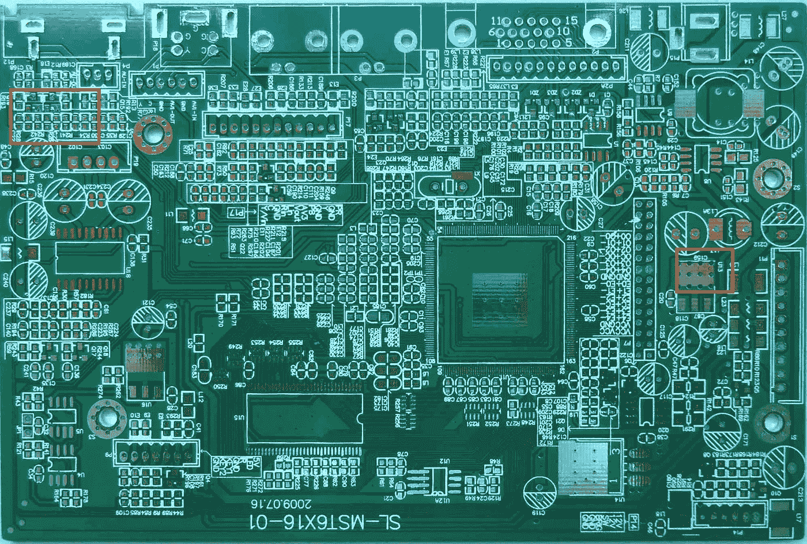
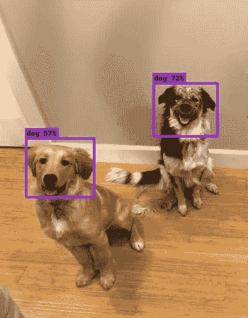
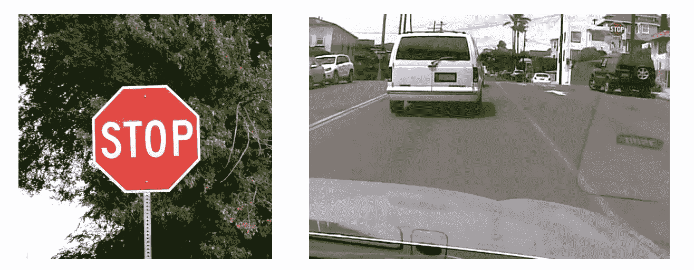
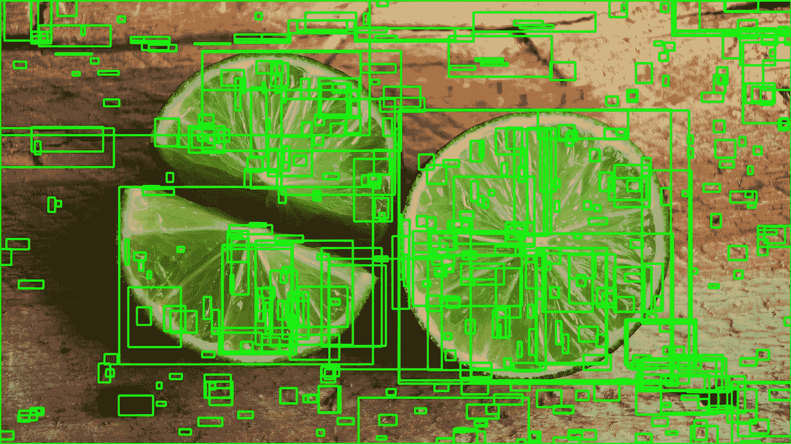
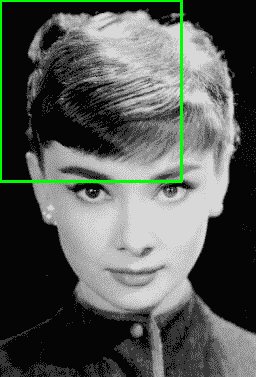
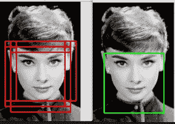
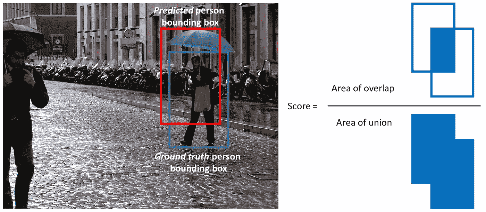
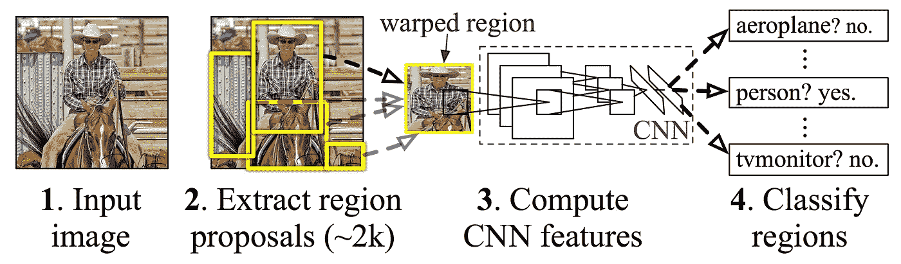
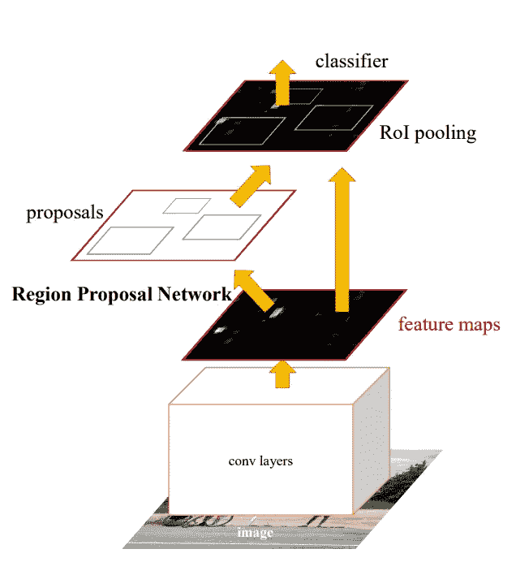

# 深入到对象检测

> 原文：<https://towardsdatascience.com/going-deep-into-object-detection-bed442d92b34?source=collection_archive---------2----------------------->

随着基于深度学习的计算机视觉模型的最新进展，对象检测应用程序比以往任何时候都更容易开发。除了显著的性能改进，这些技术还利用了大量的图像数据集来减少对大型数据集的需求。此外，由于目前的方法侧重于完整的端到端管道，性能也有了显著提高，实现了实时用例。

类似于我写的关于不同图像分类架构的[博客文章](/an-overview-of-image-classification-networks-3fb4ff6fa61b)，我将介绍两种对象检测架构。我将讨论 SSD 和更快的 RCNN，它们目前都可以在 Tensorflow 检测 API 中使用。

首先，我将介绍对象检测中的一些关键概念，然后举例说明如何在 SSD 和更快的 RCNN 中实现这些概念。

## 图像分类与目标检测

人们经常混淆图像分类和对象检测场景。一般来说，如果你想把一幅图像归入某个类别，你就使用图像分类。另一方面，如果您的目标是识别图像中对象的位置，例如计算对象实例的数量，则可以使用对象检测。

Illustrating the difference between classification and object detection.

然而，这两种情况之间有一些重叠。如果您想要将图像分类到某个类别中，可能会出现执行分类所需的对象或特征相对于整个图像来说太小的情况。在这种情况下，即使您对对象的确切位置或数量不感兴趣，您也可以通过对象检测而不是图像分类获得更好的性能。

想象一下，你需要检查电路板，并将其分为缺陷或正确。虽然这本质上是一个分类问题，但缺陷可能太小，用图像分类模型无法察觉。构建对象检测数据集将花费更多的时间，但它很可能会产生更好的模型。

An example of an IC board with defects.

使用图像分类模型，您可以生成完整图像的图像特征(通过传统或深度学习方法)。这些特征是图像的集合。使用对象检测，您可以在更细粒度、更精细的图像区域级别上完成这项工作。在前一种情况下，您可能会失去对分类信号的跟踪，而在后一种情况下，信号可能会以更适合用例的方式保存下来。

## 数据要求

为了训练自定义模型，您需要带标签的数据。对象检测环境中的标记数据是具有相应边界框坐标和标记的图像，即左下和右上(x，y)坐标+类别。

The normalised bounding box coordinates for the dogs in the image are e.g. [0.1, 0.44, 0.34, 0.56] and [0.72, 0.57, 0.87, 0.77]

一个经常被问到的问题是这样的:为了在问题 X 上做物体检测，我需要多少张图片？相反，更重要的是正确理解模型将在哪些场景中部署。每个类别有大量(例如> 100 个，可能> 1000 个)**代表性**图像是至关重要的。在这种情况下，代表性意味着它们应该与模型将被使用的场景范围相对应。如果您正在构建一个将在汽车上运行的交通标志检测模型，您必须使用在不同天气、照明和相机条件下拍摄的图像。对象检测模型并不神奇，实际上相当愚蠢。如果模型没有足够的数据来学习一般模式，它在生产中就不会有很好的表现。

While the image on the left is clear and easy to detect, ultimately, you should train on data which better reflects the use case.

## 通用对象检测框架

通常，在对象检测框架中有三个步骤。
1。首先，使用模型或算法来生成感兴趣的区域或区域提议。这些区域提议是跨越整个图像的一大组边界框(即，对象定位组件)。
2。在第二步中，为每个边界框提取视觉特征，对它们进行评估，并基于视觉特征确定提议中是否存在以及存在哪些对象(即，对象分类组件)。
3。在最后的后处理步骤中，重叠的框被组合成单个边界框(即，非最大抑制)。

## 区域提议

有几种不同的方法可以生成区域建议。最初，“选择性搜索”算法用于生成对象建议。莉莉艾·翁在她的博客文章中对这个算法做了详尽的解释。简而言之，选择性搜索是一种基于聚类的方法，它试图对像素进行分组，并基于生成的聚类生成建议。

An example of selective search applied to an image. A threshold can be tuned in the SS algorithm to generate more or fewer proposals.

其他方法使用从图像中提取的更复杂的视觉特征来生成区域(例如，基于来自深度学习模型的特征)或者采用强力方法来生成区域。这些强力方法类似于应用于图像的滑动窗口，具有多种比率和比例。这些区域是自动生成的，不考虑图像特征。

An example of the sliding window approach. Each of the bounding boxes will be used as a region of interest (ROI).

区域提议生成的一个重要权衡是区域的数量与计算复杂度。生成的区域越多，找到该对象的可能性就越大。另一方面，如果您详尽地生成所有可能的建议，则不可能实时运行对象检测器。在某些情况下，可以使用问题特定信息来减少 ROI 的数量(例如，行人的比率通常约为 1.5，因此生成比率为 0.25 的 ROI 是没有用的)。

## 特征抽出

特征提取的目标是将可变尺寸的图像缩减为一组固定的视觉特征。图像分类模型通常使用强视觉特征提取方法来构建。它们是否基于传统的计算机视觉方法(例如，基于滤波器的方法、直方图方法等)。)或深度学习方法，它们都具有完全相同的目标:从输入图像中提取代表手头任务的特征，并使用这些特征来确定图像的类别。在对象检测框架中，人们通常使用预训练的图像分类模型来提取视觉特征，因为这些模型往往能够相当好地概括(例如，在 MS CoCo 数据集上训练的模型能够提取相当一般的特征)。然而，为了改进模型，建议试验不同的方法。我在博客上发表的关于迁移学习的文章清楚地区分了不同类型的迁移学习以及它们的优缺点([一般](/transfer-learning-leveraging-insights-from-large-data-sets-d5435071ec5a)和[应用](/applying-transfer-learning-in-nlp-and-cv-d4aaddd7ca90))。

## 非最大抑制

非最大值抑制的一般思想是将一帧中的检测数量减少到存在的对象的实际数量。如果框架中的对象相当大，并且已经生成了 2000 个以上的对象提议，则很可能其中一些提议彼此之间以及与对象之间会有显著的重叠。观看 Coursera 上的这个[视频](https://www.coursera.org/learn/convolutional-neural-networks/lecture/dvrjH/non-max-suppression)，了解更多关于 NMS 的信息。NMS 技术通常是不同检测框架的标准，但这是一个重要的步骤，可能需要根据场景调整超参数。

An example of NMS in the context of face detection.

## 评估指标

在对象识别任务中使用的最常见的评估度量是“mAP”，它代表“**平均精度”**。它是一个从 0 到 100 的数字，通常值越高越好，但是它的值不同于分类中的精度度量。

每个边界框将有一个相关的分数(该框包含对象的可能性)。基于预测，通过改变分数阈值来计算每个类别的精确召回曲线(PR 曲线)。平均精度(AP)是 PR 曲线下的面积。首先计算每个类别的 AP，然后对不同类别进行平均。最终结果是地图。

注意，如果检测具有大于某个阈值(通常为 0.5)的与地面实况框的联合' (IoU 或重叠)的'**交集，则该检测为真阳性。我们通常不使用 mAP，而是使用 mAP@0.5 或 mAP@0.25 来指代所使用的 IoU。**

A visualisation of the definition of IoU.

# 张量流检测 API

Tensorflow 检测 API 在一个包中汇集了许多上述想法，允许您使用 Tensorflow 后端快速迭代不同的配置。通过 API，您可以使用配置文件定义对象检测模型，Tensorflow 检测 API 负责将所有必要的元素组织在一起。

## 普罗托斯

为了更好地理解不同的支持组件是什么，请看一下包含功能定义的' [protos 文件夹](https://github.com/tensorflow/models/tree/master/research/object_detection/protos)。特别是，在微调模型时，train、eval、ssd、faster_rcnn 和预处理原型非常重要。

## 单次多盒探测器

*概述*
[SSD 架构](https://arxiv.org/pdf/1512.02325.pdf)由谷歌的研究人员于 2016 年发布。它提出了一个目标检测模型使用单一的深度神经网络结合区域建议和特征提取。

使用不同纵横比和比例的一组默认框，并将其应用于特征地图。由于这些特征图是通过将图像通过图像分类网络来计算的，因此可以在单个步骤中提取边界框的特征提取。为每个默认边界框中的每个对象类别生成分数。为了更好地适应地面真值框，为每个框计算调整偏移量。

The SSD network leveraging feature maps from VGG-16

卷积网络中不同的特征图对应不同的感受野，用于自然处理不同尺度的对象。因为所有计算都封装在单个网络中，并且实现了相当高的计算速度(例如，对于 300 × 300 输入 59 FPS)。

*用法* 关于用法，我们将研究 SSD 的不同[示例配置文件](https://github.com/tensorflow/models/tree/master/research/object_detection/samples/configs)。在利用 SSD 架构时，有几个参数非常重要，我们将逐一介绍。

首先，不同的分类网络有不同的优势和劣势(见这篇[博文](/an-overview-of-image-classification-networks-3fb4ff6fa61b)的概述)。例如，Inceptionv3 网络经过训练，可以很好地检测不同尺度的物体，而 ResNet 架构总体上实现了非常高的精度。另一方面，Mobilenet 是一种经过训练的网络，可以最大限度地减少所需的计算资源。ImageNet 上的特征提取网络的性能、参数的数量以及对其进行训练的原始数据集是性能/速度折衷的良好代表。特征提取器在‘feature _ extractor’部分定义。

第二组明显的参数是默认框和纵横比的设置。根据问题的类型，分析标记数据的边界框的各种纵横比和比例是值得的。设置纵横比和比例将确保网络不会进行不必要的计算。您可以在“ssd_anchor_generator”部分对这些进行调整。请注意，增加更多的比例和纵横比会带来更好的性能，但通常回报会减少。

第三，在训练模型时，在“数据增强选项”和“图像大小调整”部分设置图像大小和数据增强选项是很重要的。较大图像尺寸将执行得更好，因为小的对象通常难以检测，但是它将具有显著的计算成本。数据扩充在 SSD 的环境中尤其重要，以便能够检测不同尺度的对象(甚至在训练数据中可能不存在的尺度)。

最后，调整“train_config ”,设置学习率和批量大小对于减少过度拟合是很重要的，并且将高度依赖于您拥有的数据集的大小。

## 更快的 R-CNN

*概述*
更快的 R-CNN 是由微软的研究人员开发的。它基于 R-CNN，使用多阶段方法进行目标检测。R-CNN 使用选择性搜索来确定地区建议，将这些建议通过分类网络，然后使用 SVM 对不同地区进行分类。

An overview of the R-CNN architecture. The NMS phase is not shown.

更快的 R-CNN，类似 SSD，是一种端到端的方式。更快的 R-CNN 没有使用默认的边界框，而是使用区域提议网络(RPN)来生成一组固定的区域。RPN 使用来自图像分类网络的卷积特征，实现几乎无成本的区域提议。RPN 被实现为预测每个位置的对象边界和对象性分数的完全卷积网络。

An overview of Faster-RCNN

请注意，RPN 的设置与 SSD 网络类似(即，它不会凭空预测边界框)。RPN 网络与跨特征地图的滑动窗口一起工作。在每个滑动窗口位置或锚，一组建议被计算出不同的比例和长宽比。与 SSD 类似，RPN 的结果是基于锚点的“调整”边界框。

不同的组件被组合在单个设置中，并且被端到端或分多个阶段训练(以提高稳定性)。对 RPN 的另一种解释是，它引导网络“关注”感兴趣的区域。

*用法* 更快的 R-CNN 的大部分使用细节与 SSD 的类似。在 raw mAP 方面，更快的 R-CNN 通常优于 SSD，但它需要更高的计算能力。

Fast-RCNN 检测器的一个重要部分是“第一阶段锚生成器”，它定义了由 RPN 生成的锚。本节中的步幅定义了滑动窗口的步幅。请注意，尤其是在尝试检测小物体时(如果步幅过大，您可能会错过它们)。

尽管 fast-RCNN 论文的作者没有使用广泛的数据扩充，但仍然建议在处理较小的数据集时使用它。

## 结论

还有几个对象检测架构，我还没有提到。尤其是在查看实时应用程序时，Yolov2 经常被杜撰为一种重要的架构(相当类似于 SSD)。每当这篇博文被添加到 Tensorflow 检测 API 时，我都会更新。

# 问题

如果你有任何问题，我很乐意在评论中阅读。如果你想收到我博客上的更新，请在 [Medium](https://medium.com/@lars.hulstaert) 或 [Twitter](https://twitter.com/LarsHulstaert) 上关注我！