# 各付各的:我如何利用数据科学和机器学习在阿姆斯特丹找到一间公寓——第一部分

> 原文：<https://towardsdatascience.com/going-dutch-how-i-used-data-science-and-machine-learning-to-find-an-apartment-in-amsterdam-part-def30d6799e4?source=collection_archive---------2----------------------->

**阿姆斯特丹的房地产市场**正在经历一场难以置信的危机，自 2013 年以来，阿姆斯特丹[的房价每年以两位数的速度飙升。虽然房主有很多理由笑，但对那些想买房或租房的人来说就不一样了。](https://www.nytimes.com/2017/07/05/realestate/real-estate-in-amsterdam.html)

作为一名前往旧大陆的**数据科学家**，这对我来说是一个有趣的话题。在**阿姆斯特丹**，据说房产租赁市场和房产购买市场一样疯狂。我决定利用一些工具( **Python、Pandas、Matplotlib、**[**leav**](https://github.com/python-visualization/folium)**、**[**plot . ly**](https://plot.ly)**和 SciKit-Learn** )来仔细研究一下这个城市的租赁市场格局，以便尝试回答以下问题:

*   一般租赁价格分布是什么样的？
*   哪些是最热门的地区？
*   哪个地区开始狩猎会更有趣？

最后，但同样重要的是，蛋糕上的樱桃:

*   我们能够预测公寓租金价格吗？

我的方法分为以下几个步骤:

*   获取数据:使用 Python，我能够从一些网站上收集出租公寓的数据。
*   数据清理:这通常是任何数据分析过程中最长的部分。在这种情况下，为了正确处理数据格式、删除异常值等，清理数据是很重要的。
*   **EDA:** 一些**探索性的数据分析**为了可视化，更好的理解我们的数据。
*   **预测分析**:在这一步，我创建了一个机器学习模型，用我得到的数据集对它进行了训练和测试，以预测阿姆斯特丹公寓的租金价格。
*   **特征工程**:通过调整我们的数据和添加地理特征，概念化一个更健壮的模型

# 所以…我们各付各的吧

“各付各的”可以理解为在餐馆或其他场合分摊账单。根据[城市词典](https://www.urbandictionary.com/define.php?term=go%20Dutch)，荷兰人在金钱上有点吝啬是出了名的——这并非巧合，我完全认同这一点。这个表达来自几个世纪前；英国与荷兰的竞争，尤其是在[英荷战争](https://en.wikipedia.org/wiki/Anglo-Dutch_Wars)期间，催生了包括荷兰语在内的一些词汇，这些词汇宣扬了某些负面的刻板印象。

回到我们的分析，我们将*各付各的*，以便找到一些便宜货。

由于我们管道中的“*获取我们的数据*”步骤，我们能够以 CSV 格式获得包含截至 2018 年 2 月阿姆斯特丹 1182 套出租公寓的数据集。

我们首先从这些数据中创建一个熊猫数据框架。

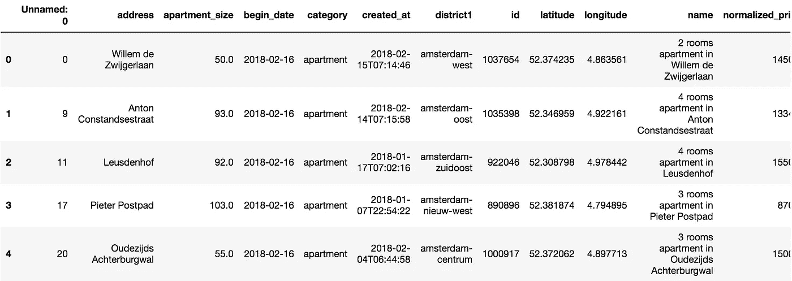

我们已经知道我们正在处理一个包含 1182 个观察值的数据集。现在让我们来看看什么是我们的变量和它们的数据类型。

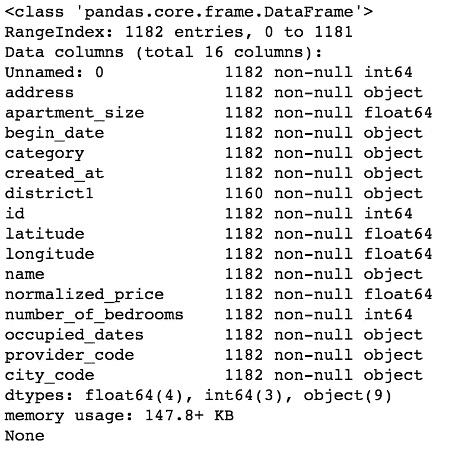

现在来看一些统计数据——让我们来看一些汇总和分散测量。

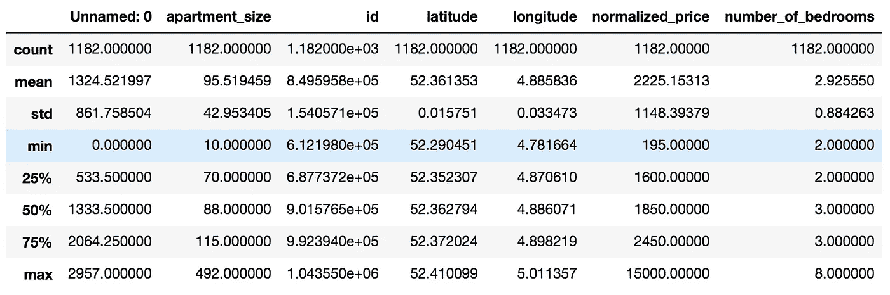

此时，我们能够在数据集上得出一些观察结果:

*   有一个*“未命名:0”*列，似乎没有保存重要信息。我们会放弃的。
*   我们有一些数据类型为*“object”*的变量。如果我们需要分析数字或字符串数据，这可能是一个问题。我们将把它转换成适当的数据类型。
*   “卧室数量”的最小值是 2。同时,“公寓大小”的最小值是 10。把两间卧室放在 10 平方米的空间里听起来有点挑战，不是吗？事实证明，在荷兰，公寓的评估是基于房间的数量，而不是卧室的数量。因此，对于我们的数据集，当我们说卧室的最小数量是 2 时，我们实际上是指**房间**的最小数量是 2(一个卧室和一个客厅)。
*   一些列，如**名称、提供商代码、开始日期**和**城市代码**似乎没有为我们的分析增加多少价值，所以我们将删除它们。
*   我们有一些日期时间字段。但是，无法使用包含此数据类型的数据集创建预测模型。然后我们将这些字段转换成整数， [Unix Epoch](https://en.wikipedia.org/wiki/Unix_time) 编码。
*   平均公寓租金价格约为。【2225.13 欧元。公寓租金价格的标准偏差约为。【1148.40 欧元。因此，关于 normalized_price，我们的数据是**过度分散的，**因为**分散指数**(均值方差)约为 **592.68。**

# 一些基本的 EDA —探索性数据分析

除了做一些清理工作，作为数据科学家，我们的工作是向我们的数据提出一些问题。

我们已经看到了大多数变量的四分位数、最小值、最大值和平均值的一些信息。然而，我更喜欢视觉。所以让我们跳进去，生成一个 [Plot.ly](https://plot.ly) **box plot，**这样我们就可以看到我们数据的快照了。

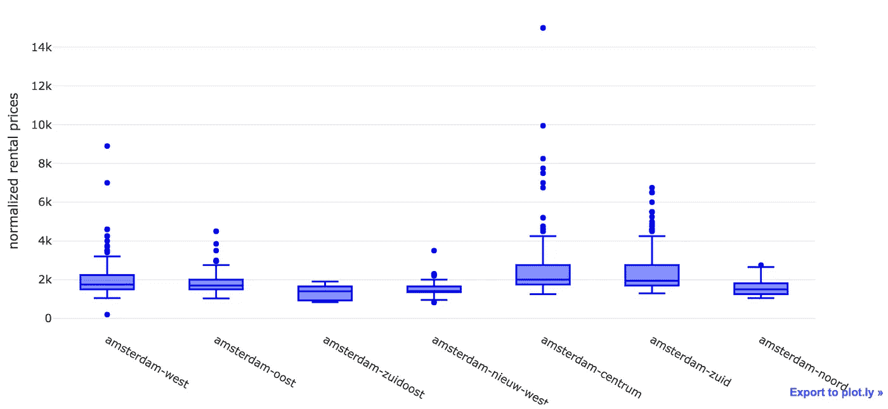

看起来我们有很多异常值——特别是阿姆斯特丹市中心的公寓。我猜有很多人想住在运河和博物馆附近——这不能怪他们。

让我们通过创建我们的数据子集来减少离群值的数量——也许对 **normalized_price** 的一个好的限制是欧元 3K。

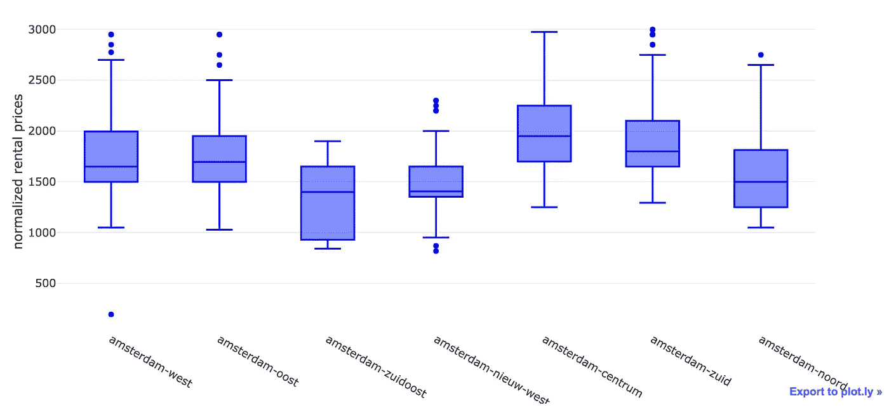

我们能够去除大部分异常值。初步分析来看，阿姆斯特丹 Zuidoost(T21)和阿姆斯特丹 Nieuw West(T23)看起来很适合我们找房子。

现在让我们看看数据的分布。

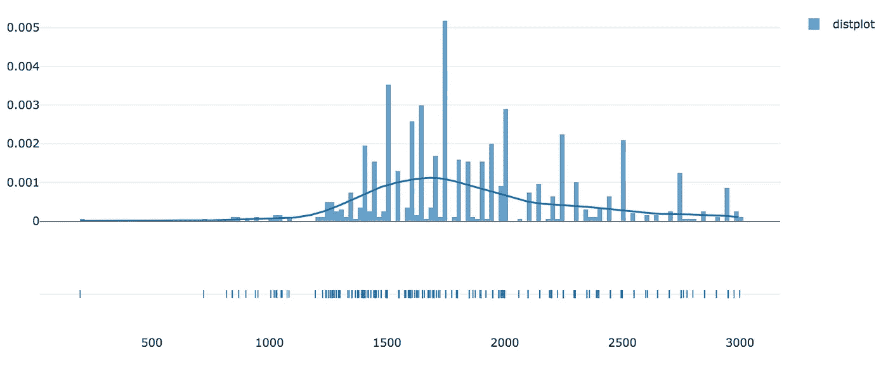

通过目测我们的分布，我们可以注意到它偏离了正态分布。

但不是[偏态](https://en.wikipedia.org/wiki/Skewness) ( *偏态*约为 0.5915)也不是[峰态](https://en.wikipedia.org/wiki/Kurtosis) ( *峰度*约为 0.2774)。

高**偏度**和**峰值**通常表示创建预测模型的问题，因为一些算法对具有(几乎)正态分布的训练数据做出一些假设。峰值可能会影响算法计算误差的方式，从而增加预测的偏差。

作为一名**数据科学家**，人们应该意识到这些可能的警告。幸运的是，我们没有这个问题。所以我们继续分析。我们将利用 seaborn 来生成一个 pairplot。配对图非常有用，因为它们为数据科学家提供了一种简单的方法来可视化特定数据集中变量之间的关系。

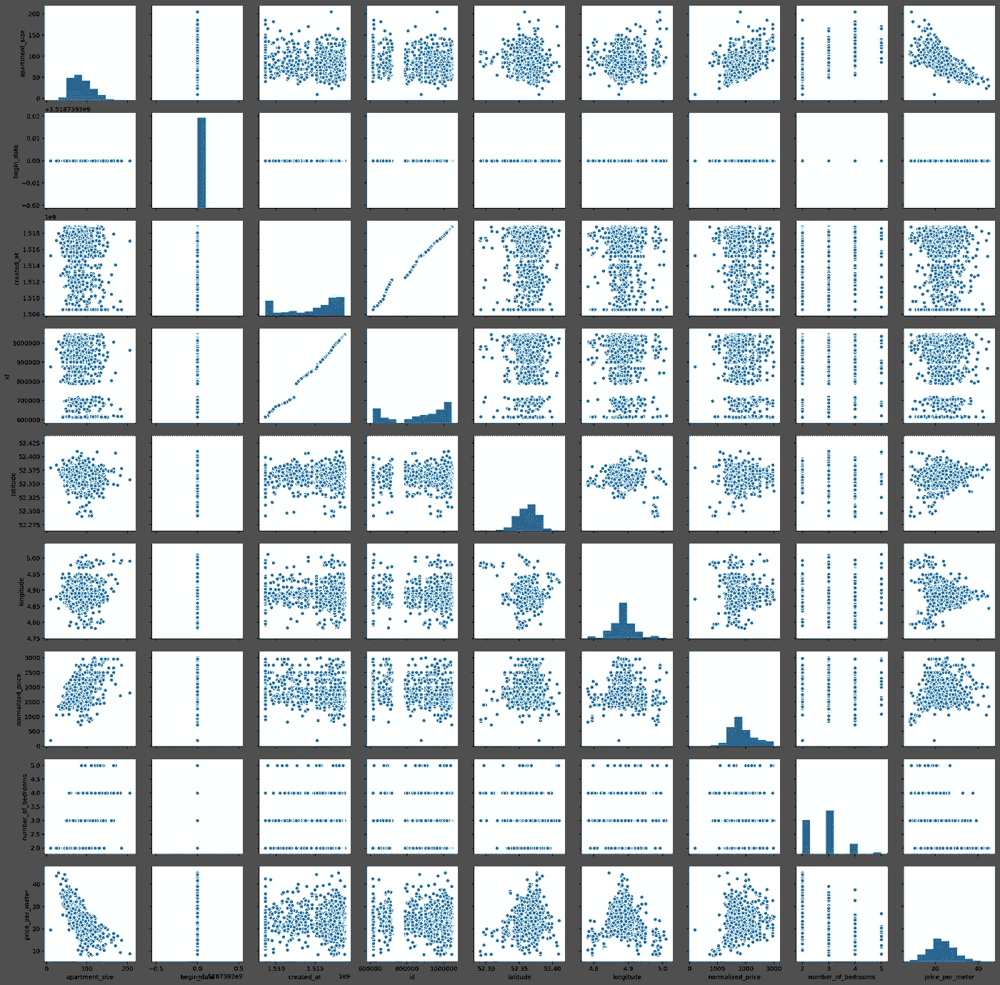

有趣的是，我们有一些近乎线性的关系。诚然，它们中的大多数一开始都有点琐碎，例如 **normalized_price** 对 **apartment_size** 。但我们也可以看到一些其他有趣的关系——例如，**公寓大小**与**每米价格**，这似乎是一种几乎线性的负相关关系。

让我们继续，借助 Seaborn 的 [热图](https://en.wikipedia.org/wiki/Heat_map)绘制每个变量之间的[皮尔逊相关](https://en.wikipedia.org/wiki/Pearson_correlation_coefficient)值。**热图**(或**热图**)是数据的图形矩阵表示，其中各个值用颜色表示。除了是一个新术语之外，“*热图*的概念已经存在了几个世纪，只是有不同的名称(例如*阴影矩阵*)。

一些有趣的发现:

1.  正如最初从我们的**配对图中注意到的，每平方米价格**和公寓面积确实有相当大的负**皮尔逊相关指数**(-0.7)。也就是说，粗略地说，公寓越小，每平方米的价格越高——每平方米价格上涨的 70%左右可以由公寓面积的减少来解释。这可能是由很多因素造成的，但我个人的猜测是对小公寓的需求更高。阿姆斯特丹正在巩固自己作为来自欧盟和世界各地的年轻人的目的地的地位，这些年轻人通常是单身，或者已婚但没有孩子。此外，即使在有孩子的家庭中，每个家庭的孩子数量在过去几年也快速下降。最后，较小的地方对这类公众来说更实惠。这些言论既没有科学依据，也没有统计依据——只是单纯的观察和猜测。
2.  **标准化价格**和**公寓面积**的皮尔逊相关指数为 0.54。这意味着它们是相关的，但没那么相关。这是意料之中的，因为租赁价格可能包含其他因素，如位置、公寓条件等。
3.  有两条白线与 **begin_date** 变量相关。结果，对于每一次观察，这个变量的值等于 **16/02/2018** 。所以很明显，在**开始日期**和我们数据集中的其他变量之间没有线性关系。因此，我们将放弃这个变量。
4.  经度和 **normalized_price** 的相关性可以忽略不计，几乎为零。对于**经度**和**每米价格**之间的相关性也可以这样说。

# 近距离观察

由于我们的 pairplot 和 heatmap，我们已经看到了一些变量之间的相关性。让我们放大这些关系，首先是规模与奖金，然后是规模与价格(对数标度)。我们还将调查**价格**和**纬度(对数标度)**之间的关系，因为我们有兴趣知道哪些是最热门的狩猎地区。此外，尽管在上一步中获得了相关性，我们还将调查**大小**和**纬度**(对数标度)之间的关系。难道古老的&黄金地产咒语[T21【地段、地段、地段 对阿姆斯特丹适用吗？这句口头禅也会决定公寓的大小吗？](https://www.thebalance.com/what-location-means-in-real-estate-1798766)

我们会找到答案的。

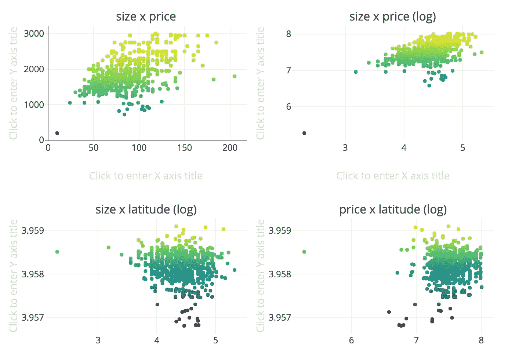

嗯，我们不能真的说这些变量之间有**线性**关系，至少目前没有。请注意，我们对一些图使用了对数标度，以尝试消除由于标度之间的差异而可能产生的失真。

这是这条线的终点吗？

# 尽头

我们对模型中变量之间的一些关系做了一些检查。我们无法想象**标准化价格**或**每米价格**与**纬度、**经度和**经度之间的任何关系。**

然而，我想对这些价格在地理上的表现有一个更直观的看法。如果我们能看到阿姆斯特丹的地图，描绘出哪些地区更贵/更便宜，会怎么样？

使用[叶子](https://github.com/python-visualization/folium)，我能够创建下面的可视化。

*   **圆圈尺寸**根据公寓尺寸定义，使用 0-1 的标度，其中 1 =最大公寓尺寸，0 =最小公寓尺寸。
*   **红圈**代表**高** **价格与面积比**的公寓
*   **绿色圆圈**代表相反的情况——价格与面积比**低的公寓**
*   每个圆圈在被点击时会显示一个文本框，其中包含以欧元为单位的**月租金**，以及以平方米为单位的**公寓面积**。

在视频的前几秒钟，我们可以看到运河之间的一些红点，靠近**阿姆斯特丹中心**。当我们离开这一地区，走近其他地区，如**阿姆斯特丹祖伊德**、**阿姆斯特丹祖伊杜斯特**、**阿姆斯特丹西**和**阿姆斯特丹北**时，我们能够看到这种模式的变化——大部分是由大绿圈组成的绿点。也许这些地方提供一些不错的交易。使用我们创建的地图，可以定义一条路径来开始寻找一个地方。

所以也许价格和位置终究是有关系的？

也许这就是*线*的终点了。也许这些变量之间没有*线性*关系。

# 走向绿色:随机森林

**随机森林**或**随机决策森林**是一种用于[分类](https://en.wikipedia.org/wiki/Statistical_classification)、[回归](https://en.wikipedia.org/wiki/Regression_analysis)等任务的[集成学习](https://en.wikipedia.org/wiki/Ensemble_learning)方法，通过在训练时构建大量[决策树](https://en.wikipedia.org/wiki/Decision_tree_learning)并输出类(分类)或单个树的均值预测(回归)的[模式](https://en.wikipedia.org/wiki/Mode_(statistics))的类来操作。随机决策树纠正了决策树的习惯，即[过度适应](https://en.wikipedia.org/wiki/Overfitting)到它们的[训练集](https://en.wikipedia.org/wiki/Test_set)，并且在检测数据中的[非线性关系](https://sciencing.com/non-linear-relationship-10003107.html)时非常有用。

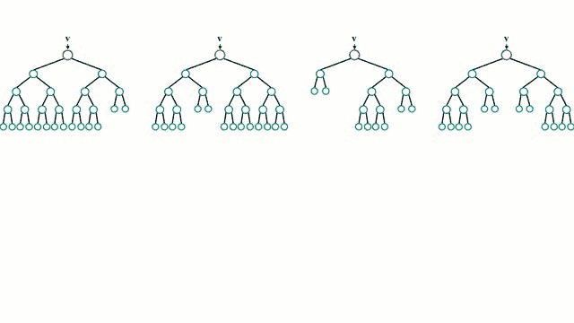

This.

**随机森林**是我最喜欢的**机器学习**算法之一，由于一些特征:

*   **随机森林几乎不需要数据准备**。由于它们的逻辑，随机森林不需要对数据进行缩放。这消除了清理和/或扩展数据的部分负担
*   **随机森林可以训练的非常快**。旨在使单个树多样化的随机特征子集同时也是一个很好的性能优化
*   **随机森林**很难出错。例如，与神经网络相反，它们对超参数不那么敏感。

这样的例子不胜枚举。我们将利用这种力量，尝试用我们目前掌握的数据来预测公寓租赁价格。我们的*目标变量*为我们的 R **随机森林回归变量，**即我们将尝试预测的变量，将是 **normalized_price** 。

但在此之前，我们需要做一些功能工程。我们将使用 [Scikit-learn](http://scikit-learn.org/stable/) 的**随机森林**实现，这需要我们对**分类变量**进行一些编码。在我们的例子中是**地区 1** 和**地址**。其次，我们还会去掉一些不重要的功能。最后，我们需要删除 **price_per_meter，**我们创建的一个变量，它是 **normalized_price** 的代理——否则我们将会有数据泄漏，因为我们的模型将能够“*欺骗*”并轻松猜测公寓价格。

# 培训和测试

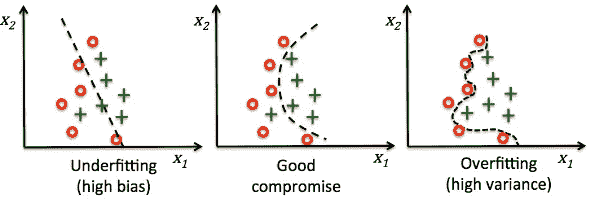

How overfitting usually looks like.

**过度拟合**发生在模型捕捉到数据中的噪声和异常值以及潜在模式时。这些模型通常具有高方差和低偏差。这些模型通常很复杂，像决策树、SVM 或神经网络，容易过度拟合。这就像一个足球运动员，除了是一个非常好的前锋，他在其他位置上表现很差，比如中场或者防守。他太擅长达成目标了，然而在其他事情上却做得极其糟糕。

测试过度配合的一种常见方法是设置单独的**训练**和**测试**。在我们的例子中，我们将使用由数据集的 70%组成的**训练集**，使用剩余的 30%作为我们的**测试集**。如果在预测训练集的目标变量时，我们的模型得到了很高的分数，但在预测测试集时却得到了很低的分数，那么我们可能会过度拟合。

# 摊牌

在训练和测试我们的模型之后，我们能够得到下面的结果。

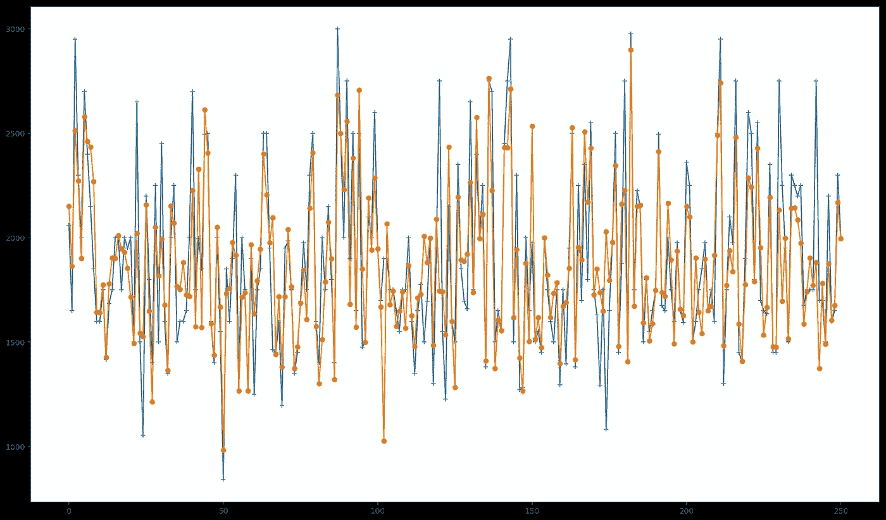

Predicted Values in Orange; Actual Values in Blue.

从图中我们可以看到，我们的模型在预测公寓租金价格方面做得不错。使用我们的模型，我们能够获得 0.70******的分数**，其中 1 代表可能的最佳分数，而-1 代表可能的最差分数。****

****请注意，这是我们的基线模型。在本系列的第二篇文章中，我[将事情扩展了一点，以便在模型分数上获得大约 10%的提高。](/going-dutch-part-2-improving-a-machine-learning-model-using-geographical-data-a8492b67b885)****

# ****你可能也会喜欢****

**** [## 保持机器学习模型在正确的轨道上:MLflow 入门，第 1 部分

### 了解为什么模型跟踪和 MLflow 对于成功的机器学习项目至关重要

mlopshowto.com](https://mlopshowto.com/keeping-your-machine-learning-models-on-the-right-track-getting-started-with-mlflow-part-1-f8ca857b5971)  [## 各付各的，第 2 部分:使用地理数据改进机器学习模型

### 一切开始的地方

towardsdatascience.com](/going-dutch-part-2-improving-a-machine-learning-model-using-geographical-data-a8492b67b885)****