# 各付各的，第 2 部分:使用地理数据改进机器学习模型

> 原文：<https://towardsdatascience.com/going-dutch-part-2-improving-a-machine-learning-model-using-geographical-data-a8492b67b885?source=collection_archive---------5----------------------->


# 一切开始的地方

[在我之前的帖子](/going-dutch-how-i-used-data-science-and-machine-learning-to-find-an-apartment-in-amsterdam-part-def30d6799e4)中，我描述了使用**数据科学**和**机器学习**在**阿姆斯特丹**寻找**公寓**的过程。使用从互联网上获得的公寓租金数据，我能够探索和可视化这些数据。作为可视化部分的一部分，我可以创建下面的地图:

最终，我能够使用这些数据来**构建**、**训练**和**测试**一个使用**随机森林**的**预测模型**。有可能达到 **R2** 得分 **0.70，**这对于基线模型来说是一个很好的衡量标准。测试集的预测值与实际值的对比结果如下图所示:

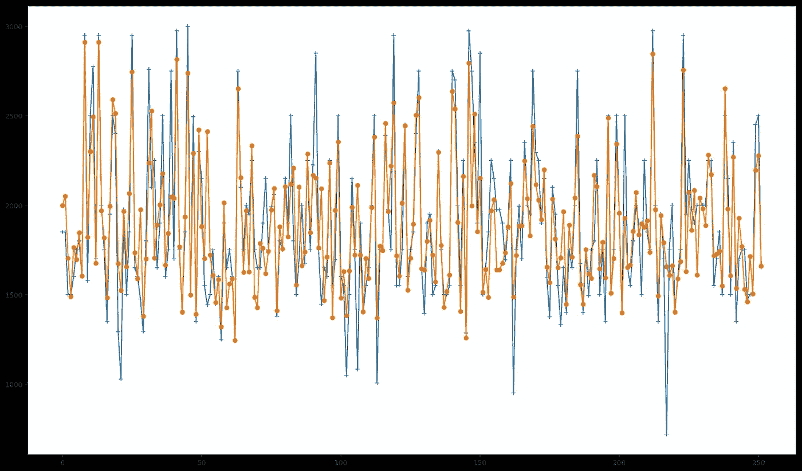

从这些数据中创建一个**预测模型**的想法是为了有一个好的参数，以便知道租赁列表是否有一个**公平价格**。这将允许我们找到一些便宜的或者扭曲的东西。这背后的**推理**是，如果我遇到任何一套公寓的**租赁价格**比我们的模型预测的**低得多**，这可能意味着一笔好交易。最终，这被证明是在阿姆斯特丹找房子的一种有效方式，因为我能够专注于特定的区域，发现一些好的交易，并在我来到这座城市的第一天找到一套公寓。****


After finding an apartment in AMS

现在回到我们的模型。作为一个基线模型，在预测质量方面有潜在的改进空间。下面的管道已经成为我最喜欢的处理数据问题的方法:

1.  从**基线模型**开始
2.  检查**结果**
3.  **改进**模型
4.  **重复**直到结果令人满意

所以我们现在到了第三步。我们需要改进我们的模型。在上一篇文章中，我列出了我如此喜欢**随机森林**的原因，其中之一是你不需要花很多时间调优**超参数**(例如**神经网络**就是这种情况)。虽然这是一件好事，但另一方面，为了改进我们的模型，它给我们施加了一些限制。我们几乎只剩下工作和改进我们的数据，而不是试图通过调整参数来改进我们的预测模型。

这就是**数据科学**的妙处之一。有时候这感觉像是一项调查工作:你需要寻找线索并把这些点联系起来。就好像真相就在那里。


Look! An empty apartment in Amsterdam!

所以现在我们知道，我们需要处理我们的数据，并使它变得更好。但是怎么做呢？

在我们的原始数据集中，我们能够应用一些特征工程来创建一些与公寓位置相关的变量。我们为一些分类特征创建了虚拟变量，例如**地址**和**地区**。这样，我们最终为每个地址和地区类别创建了一个变量，它们的值可以是 0 或 1。但是我们在分析中忽略了一个方面。

# 北方的威尼斯

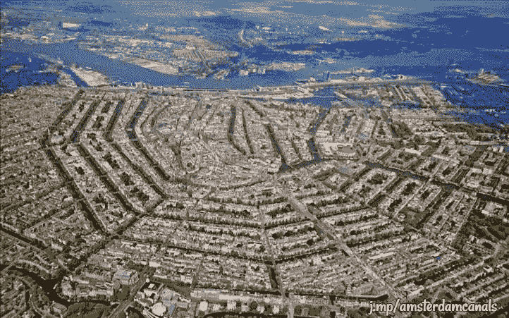

阿姆斯特丹有一百多公里长的[*grachten*](https://en.wikipedia.org/wiki/Gracht)([canals](https://en.wikipedia.org/wiki/Canal))，大约 90 个岛屿和 1500 座桥梁。沿着主要运河有 1550 座纪念性建筑。17 世纪的运河圈地区，包括 Prinsengracht、Keizersgracht、Herengracht 和 Jordaan，在 2010 年被联合国教科文组织列为世界遗产[T21，为阿姆斯特丹赢得了“北方威尼斯](https://en.wikipedia.org/wiki/World_Heritage_site)”的美誉。

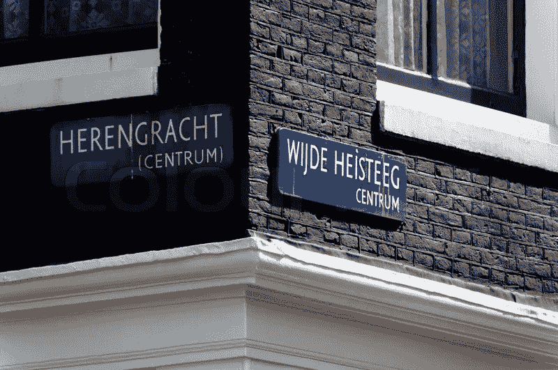

阿姆斯特丹的**地址**通常包含一些信息，可以让人们知道一个地方是否坐落在运河前面——所谓的“*运河房屋*”。位于 **Leidsegracht** 的公寓最有可能看到运河的景色，而位于 **Leidsestraat、**的公寓就不一样了。也有建筑物位于广场内的情况，例如**广场上的一些建筑物**。

不用说，运河房子有额外的吸引力，因为它们提供了美丽的景色。在脸书群体中，可以看到运河房屋在挂牌后几个小时内就被出租。


Who wants to live in a Canal House?

我们将从公寓地址中提取这些信息，以创建另外三个变量: *gracht* 、 *straat* 和 *plein* ，可能的值为 0 和 1。为这些变量创建单独的变量，而不是仅创建一个具有不同可能值(如 1、2、3)的变量的原因是，在这种情况下，我们会将其视为一个连续变量，诱使我们的模型考虑这一重要性尺度。我们将有希望发现运河房屋是否真的如此受欢迎。

# 位置，位置，位置

通过观察我们的模型的**特征重要性**排名中的前 15 个最重要的特征，我们能够注意到，除了**纬度**和**经度**之外，许多与**地址**和**地区**相关的虚拟变量对于我们的模型是有价值的，以便正确地进行预测。所以我们可以说，位置数据肯定大有可为。

我们将详细阐述这一点。但问题是，怎么做？


Restaurants, bars and cafes near Leidseplein, Amsterdam.

# 走向社交

阿姆斯特丹除了拥有大约 80 万居民(对于西欧国家的首都来说，这个数字很小)之外，还遍布酒吧、咖啡馆和餐馆，拥有欧洲最好的公共交通系统之一。但是，重要的是要想清楚我们的目标主体:**人**。我们在这里的主要目的是*了解人们在寻找公寓时的行为*。我们需要将我们的目标分成不同的群体，这样我们就可以了解他们在住房和位置方面的需求。有人可能会说，靠近酒吧、咖啡馆和餐馆对某些人来说是有吸引力的。其他人可能愿意住在离公园和学校更近的地方，比如有小孩的夫妇。这两类人也可能对住在公共交通附近感兴趣，比如电车和公共汽车站。


Amsterdam Centraal Station

这给了我们一些建立假设的提示。靠近这些类型的地方会影响公寓租金价格吗？

为了测试这个假设，我们需要将这些数据输入到我们的模型中。

Yelp 是一个社交平台，它宣传自己的宗旨是“*将人们与当地伟大的企业联系起来”*。它列出了诸如酒吧、餐馆、学校和许多其他类型的兴趣点——世界各地的*兴趣点*，允许用户对这些地方写评论。2018 年，在 Q1，Yelp 每月平均有 3000 万独立访客通过 Yelp 应用程序访问 Yelp，7000 万独立访客通过移动网络访问 Yelp。通过 Yelp 的[融合 API](https://www.yelp.com/developers/documentation/v3) 可以很容易地提取 POI 信息，将纬度和经度作为参数。

Yelp 在其数据库中列出了一些地点类别(不幸的是，没有关于*咖啡店*的类别)。我们对以下内容感兴趣:

**活跃的生活**:公园、健身房、网球场、篮球场

**酒吧**:酒吧和酒馆

**咖啡馆**:不言自明

**教育**:幼儿园、高中和大学

**酒店/旅游**:酒店、汽车租赁店、旅游信息点

**交通**:电车/公共汽车站和地铁站

对于这些类别中的每一个，Yelp 都列出了包含其纬度和经度的 POI。

我们的方法是:

1.  **查询**Yelp Fusion API**以获取阿姆斯特丹上述类别的兴趣点数据**
2.  **计算**每个**公寓**和每个 **POI** 之间的米距离。
3.  **计算**每个类别中有多少**个 poi**位于每个**公寓**的 **250 米半径**内。这些数字将成为我们数据集中的变量。

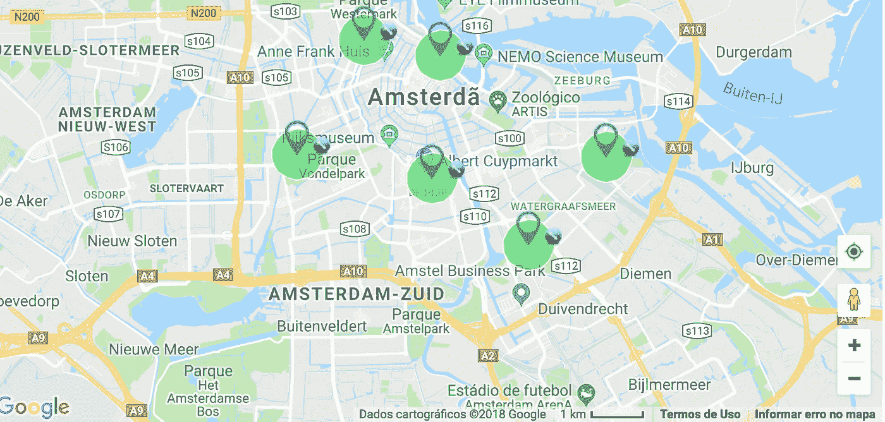

通过使用 Yelp 的 Fusion API，我们已经能够获取目标范围内每个类别的 50 个兴趣点的地理数据。

在我们开始计算每个 POI 和每个公寓之间的距离之前，请记住:**纬度**和**经度**是**角度**的度量。

**纬度**是指[赤道](https://en.wikipedia.org/wiki/Equator)以北或以南的度数。**经度**被测量为本初子午线[线](https://en.wikipedia.org/wiki/Prime_meridian_(Greenwich))以东或以西的度数。这两个角度的组合可用于精确定位地球表面的确切位置。

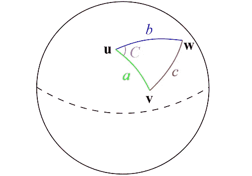

如上图所示，地球表面两点之间最快的路径是"[大圆路径](https://en.wikipedia.org/wiki/Great_circle)"，换句话说，这条路径包含了你可以在地球上画出的与两点相交的最长圆的一部分。并且，由于这是使用以角度表示的坐标的球体上的圆形路径，距离的所有属性将由三角公式给出。

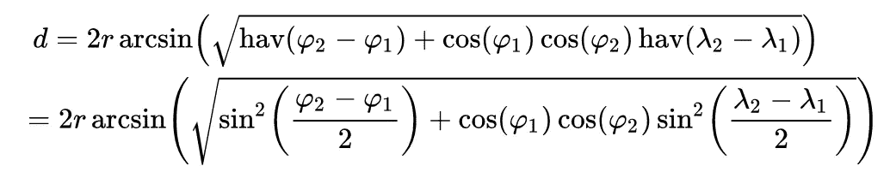

Haversine Formula.

地球上两点之间的最短距离可以用[哈弗辛公式](https://en.wikipedia.org/wiki/Haversine_formula)计算出来。在 Python 中，它看起来像这样:

```
from math import sin, cos, sqrt, atan2, radians

# approximate radius of earth in km
R = 6373.0

lat1 = radians(52.2296756)
lon1 = radians(21.0122287)
lat2 = radians(52.406374)
lon2 = radians(16.9251681)

dlon = lon2 - lon1
dlat = lat2 - lat1

a = sin(dlat / 2)**2 + cos(lat1) * cos(lat2) * sin(dlon / 2)**2
c = 2 * atan2(sqrt(a), sqrt(1 - a))

distance = R * c
```

现在我们知道了如何计算两点之间的距离，对于每个公寓，我们将计算每个类别中有多少个 POI 位于 250 米半径范围内。

将这些数据连接到我们之前的数据集中后，让我们看一下它的样子——注意右侧的最后几列:

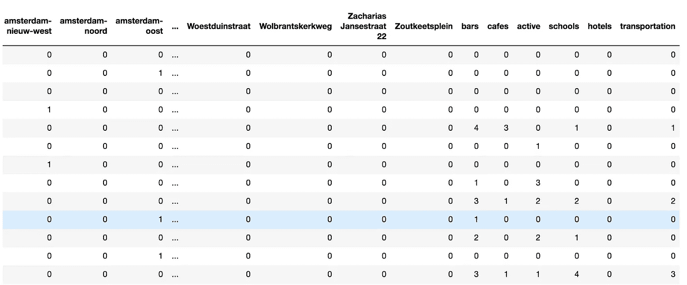

# 把所有的放在一起

让我们看看添加这些变量后的数据集。

我们将从获得描述性统计的一些度量开始:

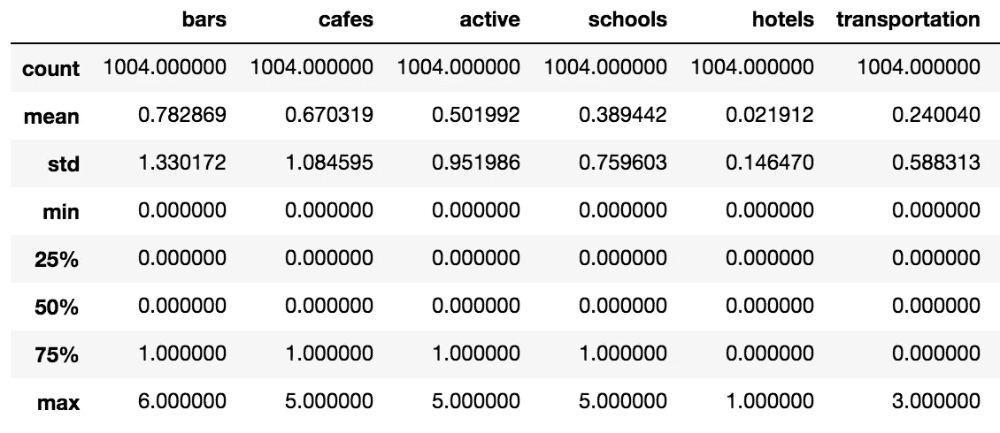

*   公寓在 250 米半径范围内平均有 0.7828 个酒吧。对于那些喜欢去喝一杯啤酒而不需要走太多路的人来说，这是个好消息。
*   **咖啡馆**似乎也遍布整个城市，平均每个公寓步行距离内有 0.6703 个 POI。
*   公寓 250 米内**交通** POI 平均数量接近于零。

我们现在将为这些变量生成一些**箱线图**，看看它们如何影响 **normalized_price** 。

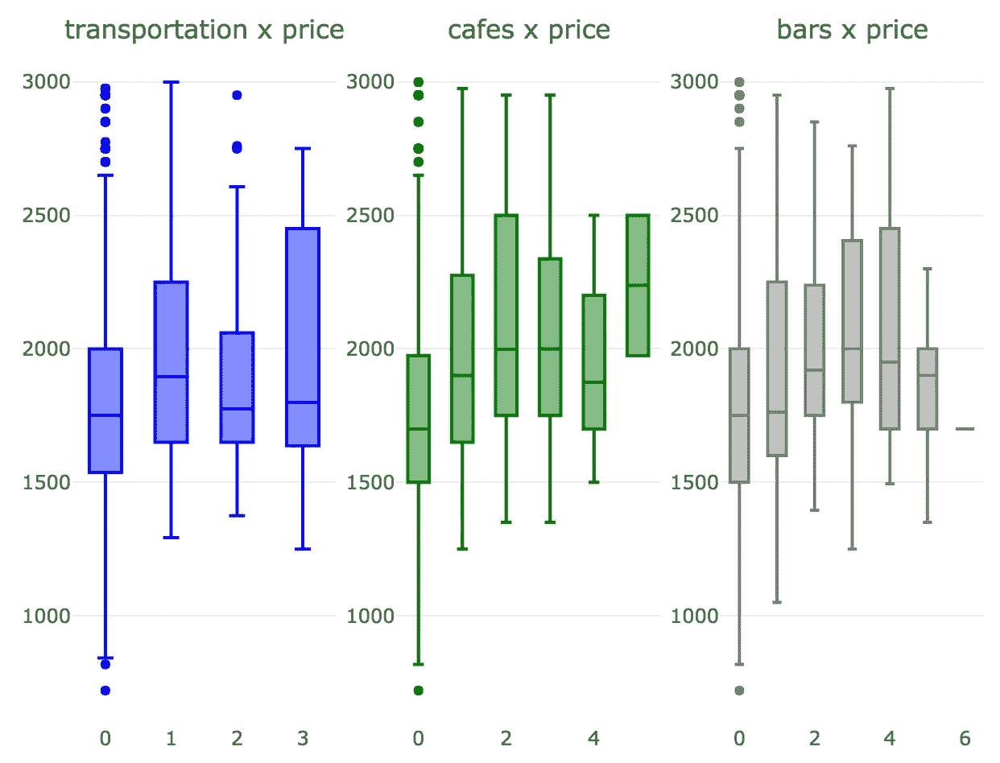

看起来这三个变量确实对 **normalized_price** 有重大影响。

那么 **gracht** 、 **straat** 和 **plein** 呢？


不出所料，运河别墅和广场公寓的价格都略高。对于位于普通街道的公寓，价格略低。

现在，我们将总结所有内容，并通过模型中引入的新变量和我们的目标变量 **normalized_price** 之间的 **Pearson Correlation** 矩阵生成热图。

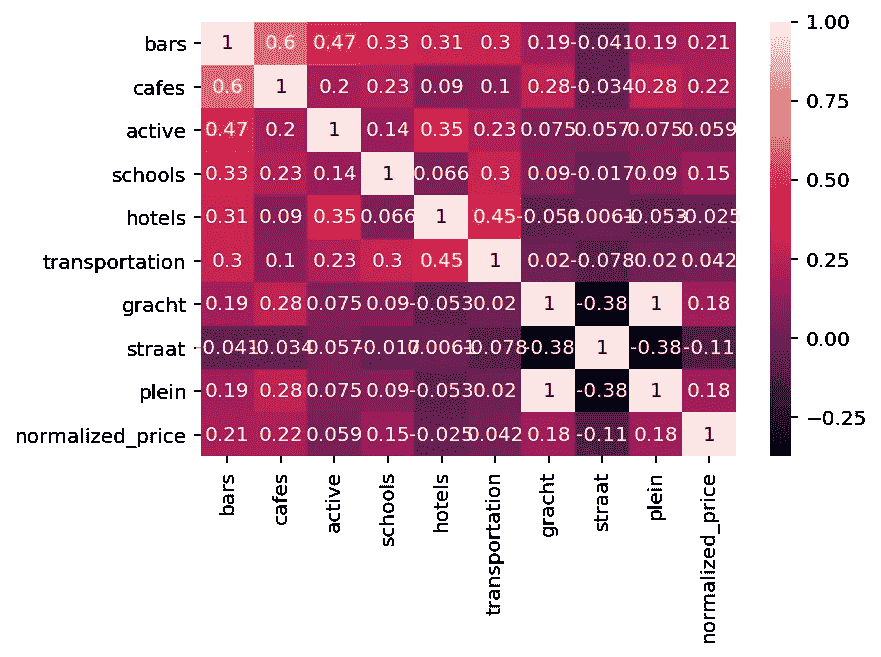

不幸的是，我们的**热图**没有提供我们的新变量和 **normalized_price** 之间显著相关性的任何迹象。但是，这并不意味着它们之间没有任何关系，只是意味着没有显著的线性关系。

# 走向绿色，第 2 部分

既然我们丰富了我们的数据集，现在是时候用新数据训练我们的模型，看看它的表现如何。

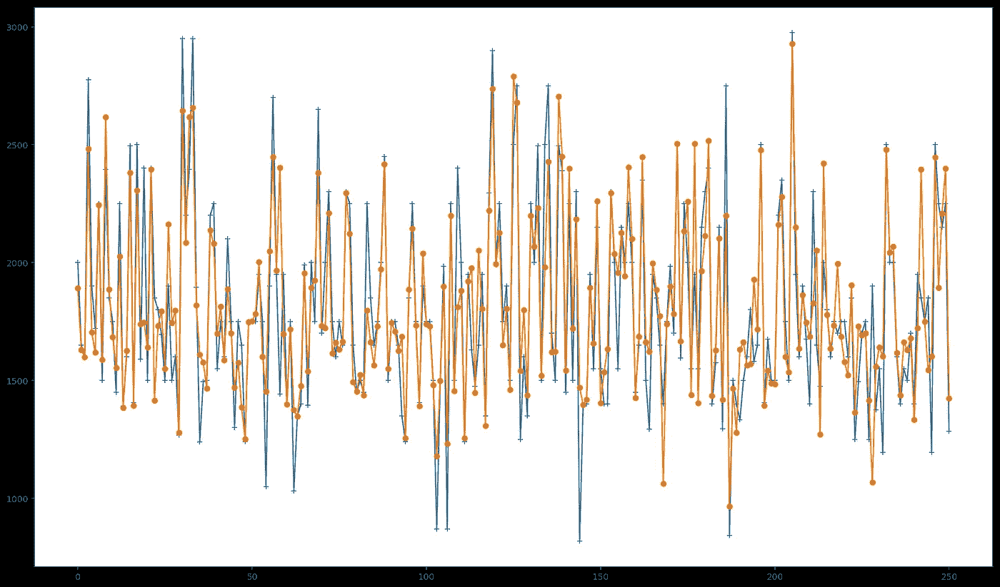

How our new predictions perform. Predicted values in orange, actual values in blue.

考虑到我们的基准模型，我们能够将我们的 **R2 得分**从 **0.70** 提高到 **0.75 —** 大约 **7.14%** 。

上面的图描绘了我们获得的新预测值与实际值的比较。特别是在预测接近最高和最低价格的值时，可能会看到一个小的改进。

就特性的重要性而言，发生了一些有趣的事情。我们引入的一些新变量变得非常重要，从而降低了其他变量的重要性。注意由**地址生成的虚拟变量**变量是如何失去重要性的。就**区**变量而言，它们甚至不再是前 15 个最重要变量的一部分。如果我们想把这些变量从模型中去掉，我们的结果可能不会有太大的不同。

有趣的是，250 米半径范围内的交通 POI 数量不如该距离内的咖啡馆数量重要。一种可能的猜测是，交通更加均匀地分散在整个城市——大多数公寓靠近电车、公共汽车或地铁站，而咖啡馆可能集中在更中心的地区。

我们研究了大量可用的地理数据。也许让我们的模型变得更好的一个方法是获取诸如建筑建造日期、公寓条件和其他特征的信息。我们甚至可以利用地理数据，将变量建立在 POI 半径大于 250 米的范围内。也可以探索 Yelp 的其他类别，如商店、杂货店等，看看它们如何影响租赁价格。

# 关键要点

*   提高一个模型的预测能力不是一件小事，可能需要一点创造力来找到使我们的数据更丰富、更全面的方法
*   有时一个小的模型改进需要相当多的工作
*   在预测分析管道中，获取、理解、清理和丰富您的数据是一个关键步骤，但有时会被忽视；这也是最耗时的任务——在这种情况下，这也是最有趣的部分

这是两部分系列的第二部分。点击这里查看《T2》第一部:

[](/going-dutch-how-i-used-data-science-and-machine-learning-to-find-an-apartment-in-amsterdam-part-def30d6799e4) [## 各付各的:我如何使用数据科学和机器学习在阿姆斯特丹找到一间公寓——部分…

### 阿姆斯特丹的房地产市场正在经历一场令人难以置信的危机，房地产价格以两位数的速度飙升…

towardsdatascience.com](/going-dutch-how-i-used-data-science-and-machine-learning-to-find-an-apartment-in-amsterdam-part-def30d6799e4) 

如果你喜欢这篇文章，你可能也会喜欢:

[](https://mlopshowto.com/keeping-your-machine-learning-models-on-the-right-track-getting-started-with-mlflow-part-1-f8ca857b5971) [## 保持机器学习模型在正确的轨道上:MLflow 入门，第 1 部分

### 了解为什么模型跟踪和 MLflow 对于成功的机器学习项目至关重要

mlopshowto.com](https://mlopshowto.com/keeping-your-machine-learning-models-on-the-right-track-getting-started-with-mlflow-part-1-f8ca857b5971) [](/detecting-financial-fraud-using-machine-learning-three-ways-of-winning-the-war-against-imbalanced-a03f8815cce9) [## 使用机器学习检测金融欺诈:赢得对不平衡数据的战争

### 机器学习和人工智能会在这场战斗中成为伟大的盟友吗？

towardsdatascience.com](/detecting-financial-fraud-using-machine-learning-three-ways-of-winning-the-war-against-imbalanced-a03f8815cce9)