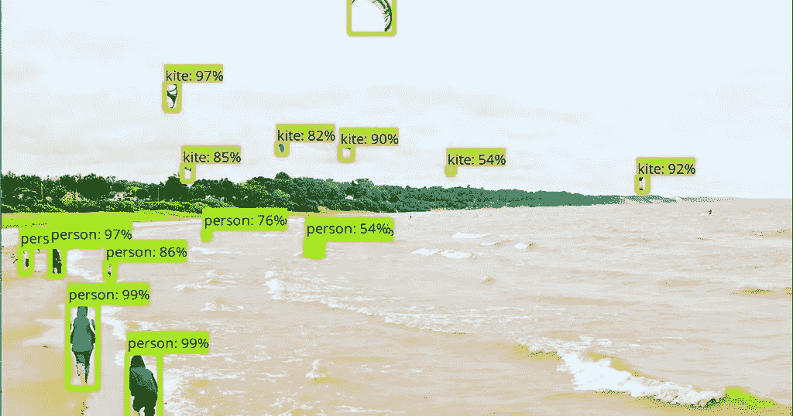
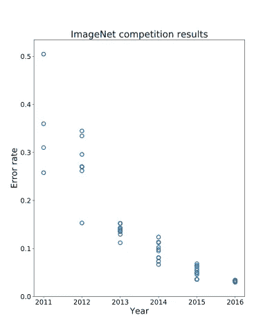

# 谷歌人工智能的新物体探测竞赛

> 原文：<https://towardsdatascience.com/google-ais-new-object-detection-competition-6dde25cf099d?source=collection_archive---------7----------------------->

> 我为学习者写了一份名为《强大的知识》的时事通讯。每一期都包含链接和最佳内容的关键课程，包括引文、书籍、文章、播客和视频。每一个人都是为了学习如何过上更明智、更快乐、更充实的生活而被挑选出来的。 [**在这里报名**](https://mighty-knowledge.ck.page/b2d4518f88) 。

就在几天前，谷歌人工智能在 Kaggle 上发起了一项名为开放图像挑战的物体检测比赛。很高兴看到计算机视觉社区已经有一段时间没有这么大规模的竞争了。

几年来，ImageNet 一直是计算机视觉领域的“黄金标准”竞赛。许多团队每年都在竞争 ImageNet 数据集上的最低错误率。由于深度学习，我们最近看到了图像识别任务的巨大进步，甚至超过了人类水平的准确性。在下面的图表中，我们可以看到像 ImageNet 这样大规模的竞争如何帮助加速该领域的研究，特别是在 2012 年开始的最初几年。

Error rate history on ImageNet (showing best result per team and up to 10 entries per year)

ImageNet 是一个巨大的竞争，有 1000 个不同的类和 120 万个训练图像！庞大的数据规模是 ImageNet 如此具有挑战性的真正原因。我们从如此大规模的竞赛中获得的一个非常重要的东西(当然除了学习如何很好地对图像进行分类)是我们可以用于其他任务的特征提取器。在 ImageNet 上预先训练的特征提取网络用于许多其他计算机视觉任务，包括对象检测、分割和跟踪。此外，网络的一般风格或设计通常用于这些其他任务。例如，快捷连接最初用于 2015 年获奖的 ImageNet 条目，此后一直用于计算机视觉中的绝大多数 CNN！这是一件很棒的事情，当我们可以在一个简单的任务上工作时，它会对更复杂但相关的任务产生巨大的影响。

谷歌人工智能在 Kaggle 上举办的新物体检测比赛是朝着这个积极方向迈出的一步。到目前为止，COCO 检测一直是物体检测的最大挑战。但是，与 ImageNet 相比，它非常小。COCO 只有 80 个类别，330K 图片。它远没有你在现实世界中看到的那么复杂。许多从业者经常发现在野外进行物体检测极具挑战性。至少 ImageNet 有足够大的数据集和足够多的类，这对于预训练和使用网络进行迁移学习非常有用。也许有了足够大的数据集，我们的物体检测器就能同样适用于迁移学习。

这就是新的竞争的由来！ [Google AI](https://ai.google/) 已经公开发布了[开放图像数据集](https://storage.googleapis.com/openimages/web/index.html)。Open Images 沿袭了 PASCAL VOC、ImageNet 和 COCO 的传统，如今规模空前。

开放图像挑战赛基于开放图像数据集。挑战赛的训练集包含:

*   1.7 米训练图像上 500 个对象类别的 12 米包围盒注释
*   具有多个对象的复杂场景的图像–平均每幅图像 7 个盒子
*   各种各样的图像，包含全新的对象，如“软呢帽”和“雪人”
*   反映打开图像类之间关系的类层次结构

除了对象检测轨迹，比赛还包括视觉关系检测轨迹，以检测特定关系中的对象对，例如“弹吉他的女人”、“桌子上的啤酒”、“车内的狗”、“拿咖啡的男人”等。你可以在这里找到更多关于数据集[的信息。这个数据集令人惊叹的地方在于它的多样性。数据集](https://storage.googleapis.com/openimages/web/factsfigures.html)[中的所有 600 个类在这里](https://storage.googleapis.com/openimages/2018_04/bbox_labels_600_hierarchy_visualizer/circle.html)有一个很好的可视化，在这里你可以看到类的分解和层次结构；真的挺多样化的。我们还可以[观察到](https://storage.googleapis.com/openimages/web/factsfigures.html)有一个非常宽的类频率范围。这意味着我们不能天真地平等对待所有的职业；我们被迫考虑职业分布，更真实的风格！这个数据集的健壮性无疑让我们更接近于创建对野外部署更有用的模型。

如果你喜欢奖品，还有 30，000 美元的奖金池！此外，挑战的结果将在 2018 年欧洲计算机视觉会议[的研讨会上公布。它正在德国慕尼黑举行，这肯定会是一次不错的旅行！](https://eccv2018.org/)

也很高兴看到比赛在 Kaggle 上举行。挑战的核心往往是通过看到竞争对手的许多不同方法而获得的巨大知识来源。如此大规模和复杂的挑战将有望带来最好的研究和新的想法，可以应用于整个计算机视觉领域，就像 ImageNet 所做的那样！