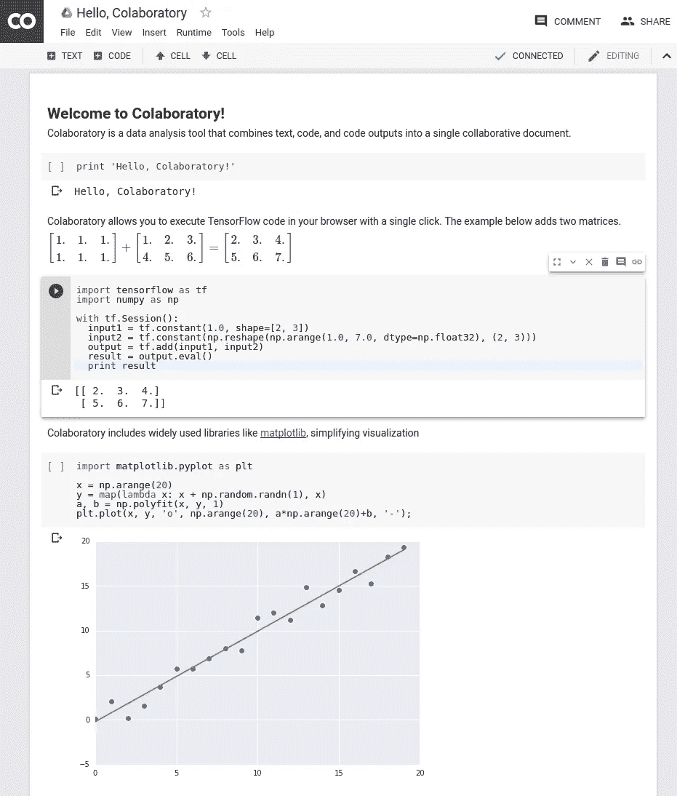
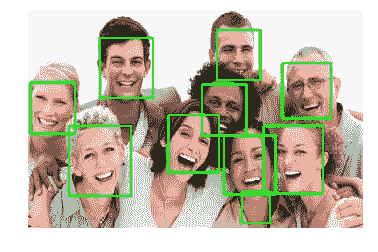

# Google 联合实验室—简化数据科学工作流程

> 原文：<https://towardsdatascience.com/google-colaboratory-simplifying-data-science-workflow-c70059386323?source=collection_archive---------1----------------------->

谷歌最近公开了其数据科学和机器学习工作流的内部工具，名为[合作实验室](https://research.google.com/colaboratory/faq.html)。虽然它非常类似于 Jupyter Notebook,但真正的价值来自这项服务目前提供的免费计算能力。协作功能，类似于 Google Docs，允许小团队紧密合作，快速构建小型原型。总的来说，这个工具与谷歌成为“[人工智能第一](https://www.youtube.com/watch?v=5WRJYEA-mwY)”公司的愿景紧密相连。

Example Notebook ([Source](https://research.google.com/colaboratory/screenshot.png))

这个工具对于初学者来说也是非常强大的，因为它附带了 Python 2.7 环境和所有主要的 Python 库。他们不再需要首先经历各种安装过程，而是可以立即开始编写代码。

例如，我使用 [OpenCV](https://opencv-python-tutroals.readthedocs.io/en/latest/) 创建了一个简短的关于人脸识别的[公共合作笔记本](https://drive.google.com/file/d/0B7-sJqBiyjCcRmFkMzl6cy1iN0k/view?usp=sharing)，这是以机器学习为核心的计算机视觉的主题之一。为了运行笔记本，建议用户将笔记本复制到他们自己的实验室，从那里他们将能够运行代码。

要开始使用笔记本，运行所有现有的单元以加载库和底层数据是很重要的。然后，您可以在新的代码单元格中执行新版本的`findfaces('<---IMAGE_URL--->')`函数，将`<---IMAGE_URL--->`替换为网络上任何图像的 URL，例如`http://epilepsyu.com/wp-content/uploads/2014/01/happy-people-1050x600.jpg`。这将使用新的 URL 获取图像，并在代码单元格下生成已识别图像的输出。如果照片包含由 OpenCV 算法拾取的人脸，那么将提供这些人脸的总数以及显示图像上识别的人脸位置的方块。

Example Output ([Source](https://colab.research.google.com/notebook#fileId=0B7-sJqBiyjCcRmFkMzl6cy1iN0k&scrollTo=GxlcKsXObcsm))

我相信，对于那些刚刚开始编码的人来说，使用 Google 协作工具可以真正改变游戏规则。它允许我们快速开始执行脚本，而不用担心底层架构。上面提到的笔记本就是一个很好的例子，因为它的用户只需要插入一个新的功能。如果他或她对底层代码感兴趣，他们也可以看一看，并按照他们感兴趣的方式进行调整。

因此，最近引入的脚本更改的影响可以被快速识别，从而缩短开发反馈周期。笔记本也非常容易共享，并支持评论，允许从社区的不同成员那里收集反馈。

你还在等什么？试试看[这里](https://colab.research.google.com/notebook)。