# [谷歌]连续可微分指数线性单位与互动代码[手动反推与 TF ]

> 原文：<https://towardsdatascience.com/google-continuously-differentiable-exponential-linear-units-with-interactive-code-manual-back-fcbe7f84e79?source=collection_archive---------10----------------------->

Image from this [website](https://pixabay.com/en/fractal-math-geometry-science-1943527/)

Jonathan T. Barron 是谷歌的一名研究人员，他提出了 CELU()，意为“ [*”连续可微的指数线性单位*](https://arxiv.org/abs/1704.07483) *”。简言之，这个新的激活函数在任何地方都是可微的。(对于一般的 ELU，当α值不为 1 时，它不是处处可微的。)*

由于我最近报道了“ [*【通过指数线性单元(ELUs)*](https://arxiv.org/abs/1511.07289) ”快速准确的深度网络学习”(请[单击此处阅读博文](/iclr-2016-fast-and-accurate-deep-networks-learning-by-exponential-linear-units-elus-with-c0cdbb71bb02))，接下来报道这篇文章自然是有意义的。最后，为了好玩，让我们用不同的优化方法来训练我们的网络。

***情况 a)用 ADAM 优化器自动微分(***[***【MNIST】***](http://yann.lecun.com/exdb/mnist/)***数据集)
情况 b)用 ADAM 优化器自动微分(***[***cifar 10***](https://www.cs.toronto.edu/~kriz/cifar.html)***数据集)
情况 c)用***[***AMSGrad 优化器***](https://medium.com/@SeoJaeDuk/implementation-of-optimization-for-deep-learning-highlights-in-2017-feat-sebastian-ruder-61e2cbe9b7cb)[***膨胀背 Pro***](/outperforming-tensorflows-default-auto-differentiation-optimizers-with-interactive-code-manual-e587a82d340e) ***p 带***[***AMSGrad 优化器***](https://medium.com/@SeoJaeDuk/implementation-of-optimization-for-deep-learning-highlights-in-2017-feat-sebastian-ruder-61e2cbe9b7cb)***(***[***cifar 10***](https://www.cs.toronto.edu/~kriz/cifar.html)***数据集***

**连续可微的指数线性单位**

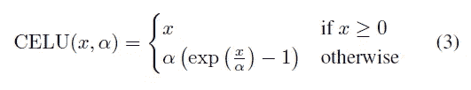

**左图**→CELU 方程式()
**右图**→ELU 方程式()

以上是 CELU()的方程式，我们已经可以看出它与 ELU()的原始方程式并无多大不同。只有一个区别，当 x 小于零时，用α除 x 值。现在让我们看看这个激活函数是怎样的。

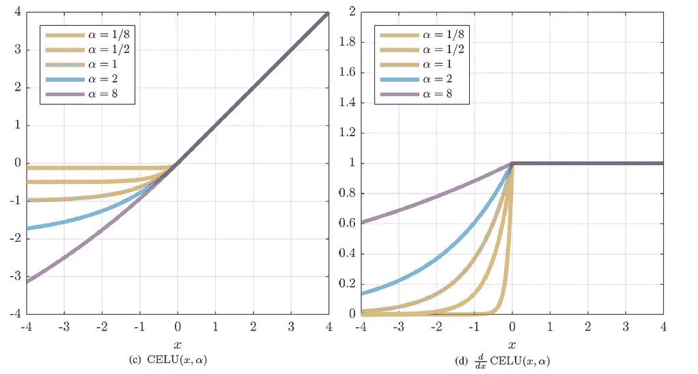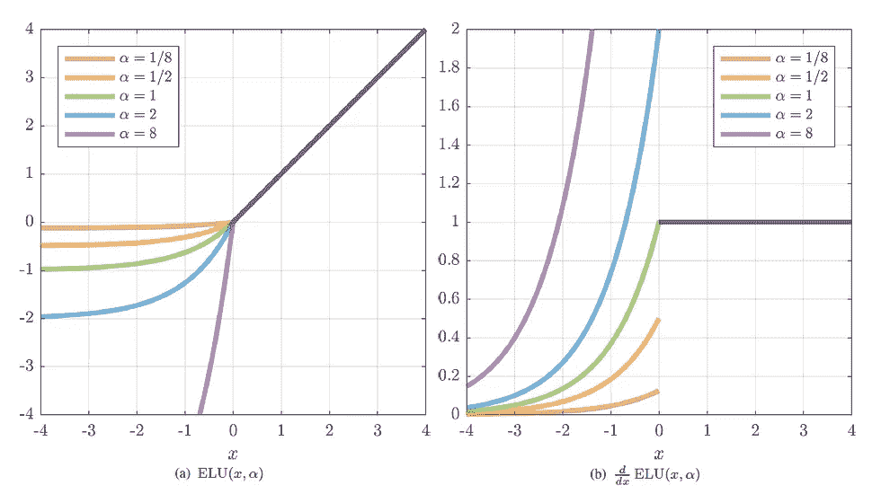

**左图**→CELU()和它的导数绘制时的样子
**右图**→ELU()和它的导数绘制时的样子

在最右边的图像(ELU()的导数)上，我们可以观察到函数不是连续的，然而对于 CELU()的导数，我们可以观察到函数在任何地方都是连续的。现在让我们看看如何实现 CELU()及其衍生物。

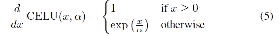

首先让我们看看 CELU()对输入 x 的导数

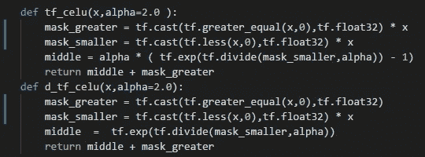

当用 python ( [Tensorflow](https://www.tensorflow.org/) )实现时，它看起来像上面的东西，请注意我已经将 alpha 值设置为 2。

**网络架构**

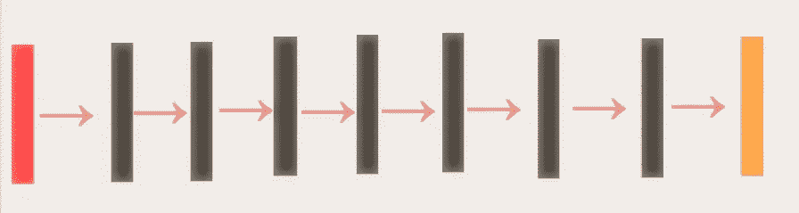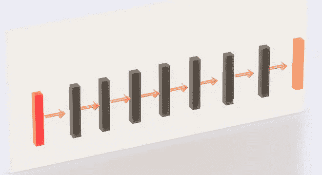

**红色矩形** →输入图像(32*32*3)
**黑色矩形** →与 CELU 卷积()有/无均值合并
**橙色矩形** → Softmax 进行分类

我要使用的网络是七层网络，采用平均池操作。由于我们将使用 MNIST 数据集以及 CIFAR 10 数据集，因此对平均池的数量进行了相应的调整，以适应图像尺寸。

**案例 1)结果:用 ADAM 优化器自动微分(MNIST 数据集)**

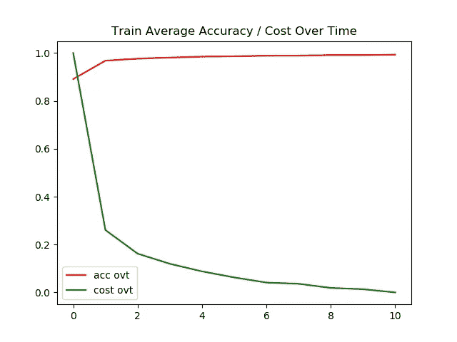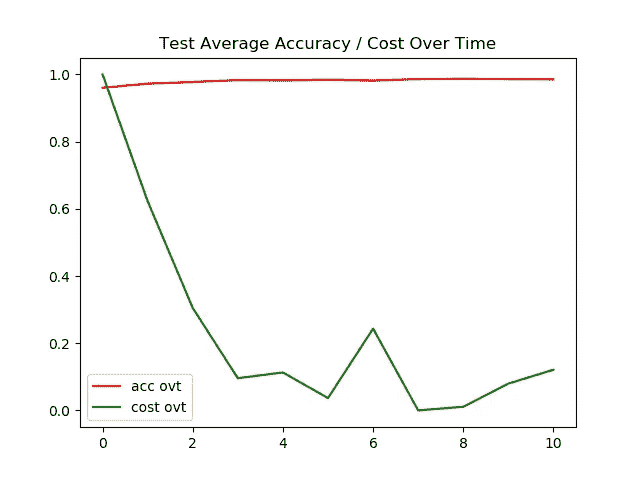

**左图** →一段时间内的训练精度/成本
**右图** →一段时间内的测试精度/成本

对于 MNIST 数据集，测试图像和训练图像的准确率都达到了 95%以上。我对训练/测试图像的超时成本进行了标准化，以使图形看起来更漂亮。

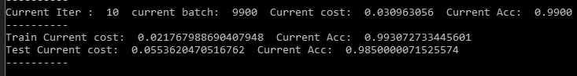

测试和训练图像的最终准确度都是 98+%。

**情况 2)结果:用 ADAM 优化器自动微分(**[**cifar 10**](https://www.cs.toronto.edu/~kriz/cifar.html)**数据集)**

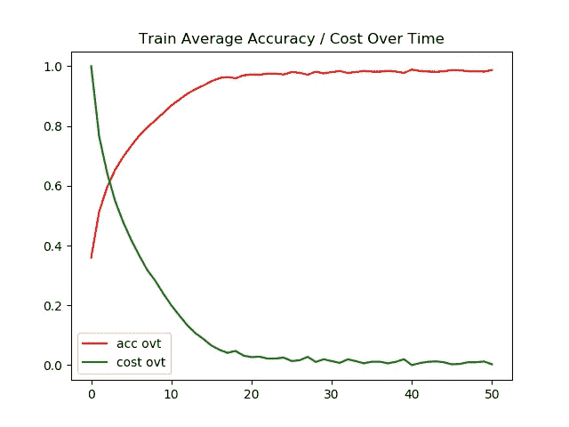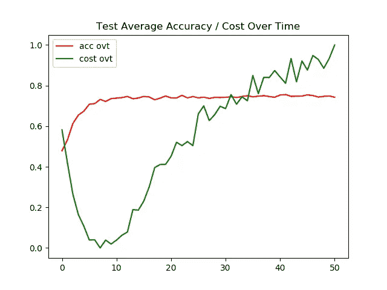

**左图** →一段时间内的训练精度/成本
**右图** →一段时间内的测试精度/成本

现在我们可以观察到模型开始遭受过度拟合。特别是使用 Adam optimizer，测试图像的准确率停滞在 74%。

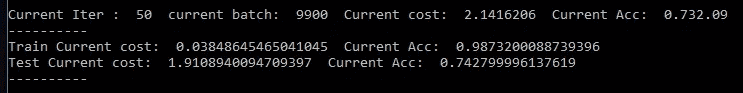

测试图像的最终准确率为 74%，而训练图像的最终准确率为 99%，这表明我们的模型过度拟合。

**案例 3)结果:手动回柱带** [**AMSGrad 优化器**](https://medium.com/@SeoJaeDuk/implementation-of-optimization-for-deep-learning-highlights-in-2017-feat-sebastian-ruder-61e2cbe9b7cb)**(**[**cifar 10**](https://www.cs.toronto.edu/~kriz/cifar.html)**数据集)**

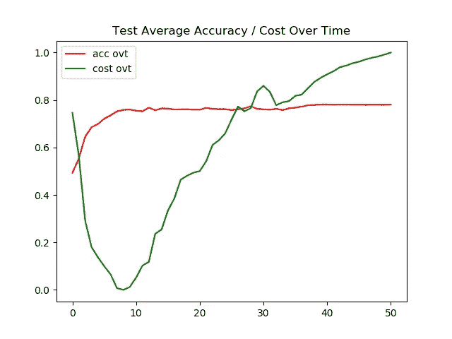

**左图** →一段时间内的训练精度/成本
**右图** →一段时间内的测试精度/成本

对于这个实验，AMSGrad 比常规的 Adam 优化器做得更好。尽管测试图像的准确性不能超过 80%，并且模型仍然存在过度拟合的问题，但给出的结果比 Adam 好 4%。

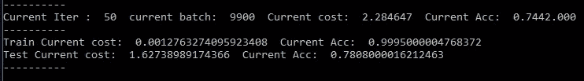

测试图像的最终精度为 78%,表明该模型仍然过拟合，但比使用没有任何正则化技术的常规 Adam 的结果好 4%,还不错。

**案例 4)结果:** [**扩背 Pro**](/outperforming-tensorflows-default-auto-differentiation-optimizers-with-interactive-code-manual-e587a82d340e) **p 带** [**AMSGrad 优化器**](https://medium.com/@SeoJaeDuk/implementation-of-optimization-for-deep-learning-highlights-in-2017-feat-sebastian-ruder-61e2cbe9b7cb)**(**[**cifar 10**](https://www.cs.toronto.edu/~kriz/cifar.html)**数据集)**

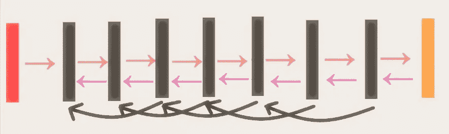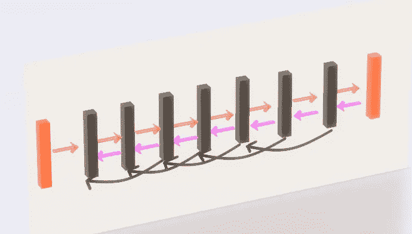

**紫色箭头** →反向传播的常规梯度流
**黑色弯箭头** →增大梯度流的扩张后支柱

记住这个架构，让我们看看我们的网络在测试图像上的表现。

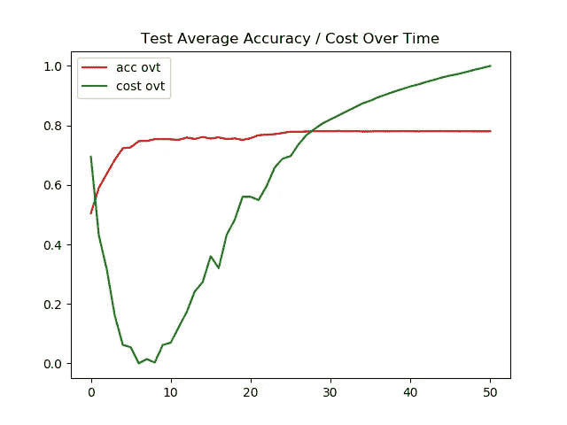

**左图** →一段时间内的训练精度/成本
**右图** →一段时间内的测试精度/成本

同样，它比常规的 Adam 优化器做得更好，但是它不能在测试图像上达到 80%的准确率。(仍然)

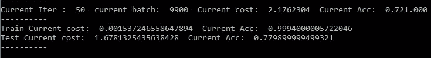

测试图像的最终准确率为 77%，比 AMSGrad 的常规反向传播低 1%，但比常规 Adam 好 3%。

**交互代码**

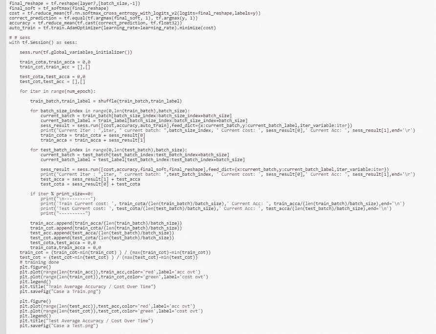

对于 Google Colab，你需要一个 Google 帐户来查看代码，而且你不能在 Google Colab 中运行只读脚本，所以在你的操场上做一个副本。最后，我永远不会请求允许访问你在 Google Drive 上的文件，仅供参考。编码快乐！同样为了透明，我在训练期间上传了所有的日志。

要访问案例 a 的[代码，请点击这里](https://colab.research.google.com/drive/1L5Q82L7wiyotZdqWyGCrTp8lg75LBvDf)，要访问[日志，请点击这里](https://github.com/JaeDukSeo/Daily-Neural-Network-Practice-2/blob/master/NeuralNetwork/ContinuouslyELU/a/casea.txt)。
访问[案例 b 的代码请点击此处，](https://colab.research.google.com/drive/1TDIqohEHD3clDaBAp_DGZU-fyBZRoqvR)访问[日志请点击此处。](https://github.com/JaeDukSeo/Daily-Neural-Network-Practice-2/blob/master/NeuralNetwork/ContinuouslyELU/b/caseb.txt)
访问[案例 c 的代码请点击此处，](https://colab.research.google.com/drive/1t6UptCq9jFgL3aHdLqmZNwywpU-z4Vi1)访问[日志请点击此处。](https://github.com/JaeDukSeo/Daily-Neural-Network-Practice-2/blob/master/NeuralNetwork/ContinuouslyELU/c/casec.txt)
要访问[案例 d 的代码，请点击此处](https://colab.research.google.com/drive/1GeOpa_BjGOyMdy5Xv5vbpKFJt-Nby12T)，要访问[日志，请点击此处。](https://github.com/JaeDukSeo/Daily-Neural-Network-Practice-2/blob/master/NeuralNetwork/ContinuouslyELU/d/cased.txt)

**最后的话**

有趣的是，根据训练方式的不同，每个网络的表现也各不相同。CELU()似乎比 ELU()的激活函数表现得更好(至少对我来说是这样)。

如果发现任何错误，请发电子邮件到 jae.duk.seo@gmail.com 给我，如果你希望看到我所有写作的列表，请[在这里查看我的网站](https://jaedukseo.me/)。

与此同时，在我的 twitter 上关注我[这里](https://twitter.com/JaeDukSeo)，访问[我的网站](https://jaedukseo.me/)，或者我的 [Youtube 频道](https://www.youtube.com/c/JaeDukSeo)了解更多内容。我还实现了[广残网，请点击这里查看博文 pos](https://medium.com/@SeoJaeDuk/wide-residual-networks-with-interactive-code-5e190f8f25ec) t。

**参考**

1.  乔恩·巴伦。(2018).Jon Barron . info . 2018 年 5 月 8 日检索，来自[https://jonbarron.info/](https://jonbarron.info/)
2.  j . t . Barron(2017 年)。连续可微指数线性单位。arXiv 预印本 arXiv:1704.07483。
3.  [ICLR 2016]通过指数线性单元(ELUs)进行快速准确的深度网络学习，具有…(2018).走向数据科学。2018 年 5 月 8 日检索，来自[https://towards data science . com/iclr-2016-fast-and-accurate-deep-networks-learning-by-index-linear-units-elus-with-c 0 cdbb 71 bb 02](/iclr-2016-fast-and-accurate-deep-networks-learning-by-exponential-linear-units-elus-with-c0cdbb71bb02)
4.  克利夫特博士、安特辛纳、t .和霍克雷特博士(2015 年)。通过指数线性单元(ELUs)进行快速准确的深度网络学习。Arxiv.org。检索于 2018 年 5 月 8 日，来自 https://arxiv.org/abs/1511.07289
5.  张量流。(2018).张量流。检索于 2018 年 5 月 9 日，来自 https://www.tensorflow.org/
6.  CIFAR-10 和 CIFAR-100 数据集。(2018).Cs.toronto.edu。检索于 2018 年 5 月 9 日，来自[https://www.cs.toronto.edu/~kriz/cifar.html](https://www.cs.toronto.edu/~kriz/cifar.html)
7.  MNIST 手写数字数据库，Yann LeCun，Corinna Cortes 和 Chris Burges。(2018).Yann.lecun.com。检索于 2018 年 5 月 9 日，来自[http://yann.lecun.com/exdb/mnist/](http://yann.lecun.com/exdb/mnist/)