# [ Google DeepMind ] —利用交互式代码进行医学图像分割的深度学习

> 原文：<https://towardsdatascience.com/google-deepmind-deep-learning-for-medical-image-segmentation-with-interactive-code-4634b6fd6a3a?source=collection_archive---------5----------------------->

Gif from this [website](https://giphy.com/gifs/ge-dogs-brain-scans-ge8rBpX40ZjR6/download)

[Matthew Lai](https://matthewlai.ca/blog/) 是 Deep Mind 的研究工程师，也是“ [*长颈鹿，利用深度强化学习下棋*](https://arxiv.org/abs/1509.01549) 的创造者。但是他的硕士 Msc 项目是在 MRI 图像上，也就是“ [*医学图像分割的深度学习*](https://arxiv.org/pdf/1505.02000.pdf) ”，所以我想深入看看他的项目。

因为这不是一篇传统的会议论文，而是一个主要项目，我会用不同的方式来处理这个问题。我会做一个论文总结(对我不知道的东西做笔记)和实施。

请注意，在原始论文中，Matthew 使用了 ADNI 老年痴呆症 MRI 数据集，不幸的是，我无法获得这些数据，所以我将使用“ [*驱动:用于血管提取的数字视网膜图像*](https://www.isi.uu.nl/Research/Databases/DRIVE/) ”数据集。还请注意，由于使用了不同的数据集，以及硬件限制，网络架构与原始论文的差异很小，但是我试图保持总体结构相似。

**2.2 网络节点和激活功能**

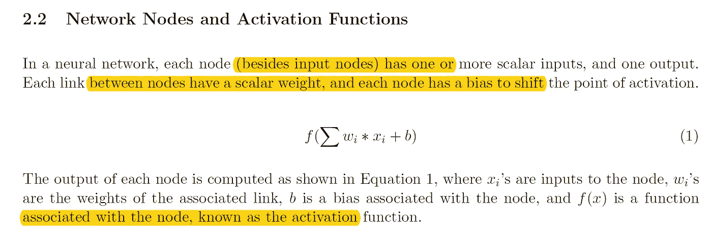

在这里我了解到激活功能必须满足三个标准。(我只认识其中两个。)并且它们是差分的、非线性的和单调的。(我不知道单调。)

**微分** →执行反向传播
**非线性** →赋予模型计算非线性函数的能力
**单调** →防止产生更多的局部最小值

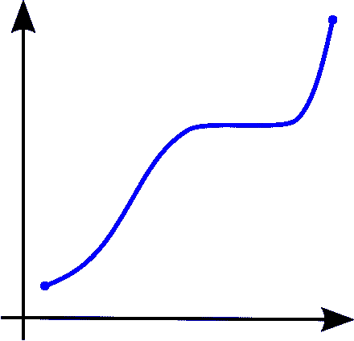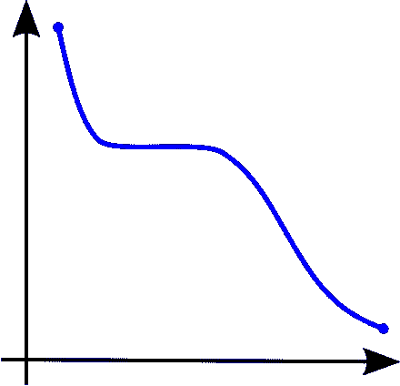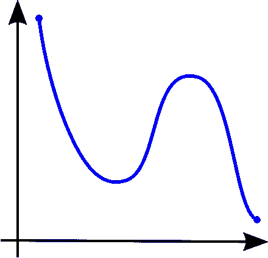

Image from [Wiki](https://en.wikipedia.org/wiki/Monotonic_function)

**左图** →单调递增的函数
**中图** →单调递减的函数
**右图** →非单调的函数

**2.3 训练神经网络**

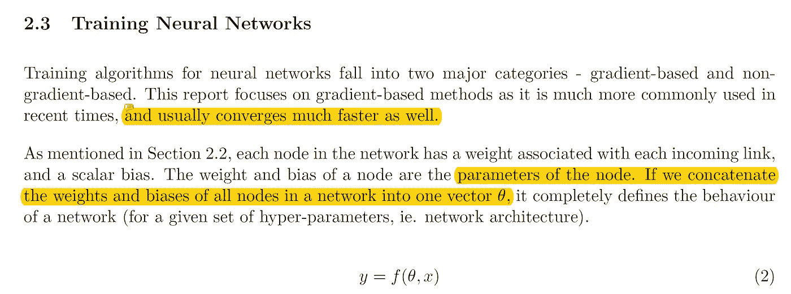

在这里，我了解到 Rprop 反向传播的存在，这种反向传播方法只考虑偏导数的符号，而不考虑大小。如果您想了解更多信息，请[点击此处](https://en.wikipedia.org/wiki/Rprop)。

**3.1 为什么要建立深度网络？**

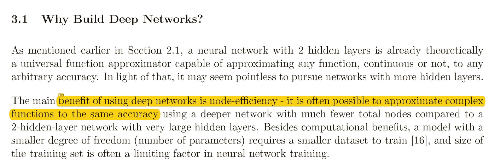

在这里，我了解到我们需要使用深度神经网络的确切原因。我学到了几件事…

1.  从理论上讲，用两层模型来模拟任何功能都是可能的，这意味着我们真的不需要一个比两层更深的模型。
2.  但是使用深度神经网络的好处其实是节点效率。当我们有一个更小但更深的神经网络时，用更高的精度逼近复杂函数是可能的。

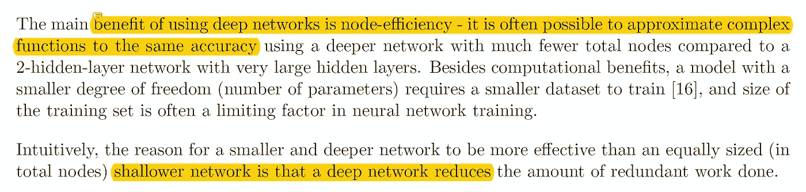

本质上，更小更深的神经网络更有效，因为(每个节点)完成的冗余工作量减少了。

**3.2 消失渐变**

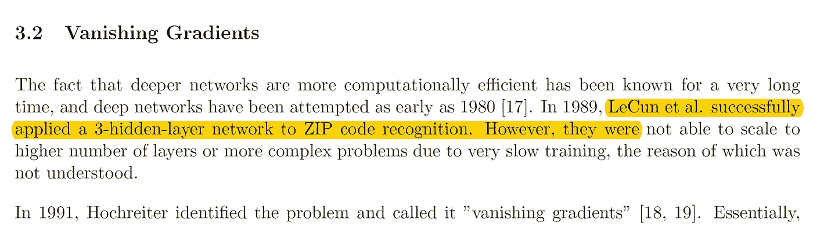

在这里，我学到了三种解决消失梯度问题的方法。我已经知道了辍学和 ReLU，但我从来不知道 ReLU 激活功能是用来克服消失梯度。我也不知道分层预训练。

***3.2.1 方案一:分层预训练***

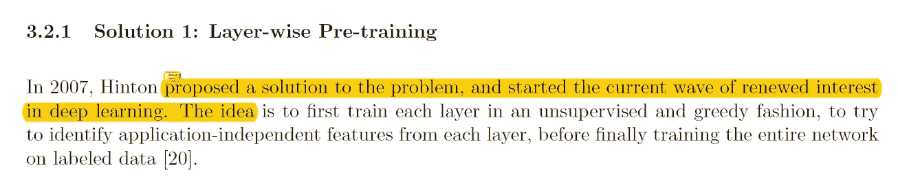

这个想法非常有趣，因为我们将首先以无人监督的方式训练每一层，然后一起使用它。

***3.2.2 解决方案 2:整流线性激活单元***

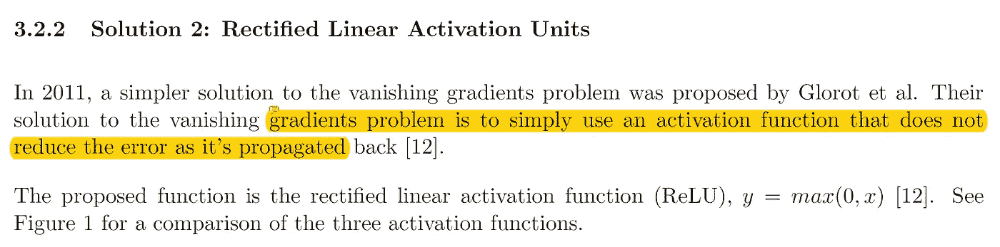

虽然 ReLU()激活可能在两个方面存在问题，因为

a.0 处没有导数。
b .正区域内没有边界。
然而，它仍然可以使用，因为它们在进行反向传播时不会降低梯度(导数为 1)。我不知道 ReLU()激活层是用来克服渐变消失问题的。

***3.3 辍学***

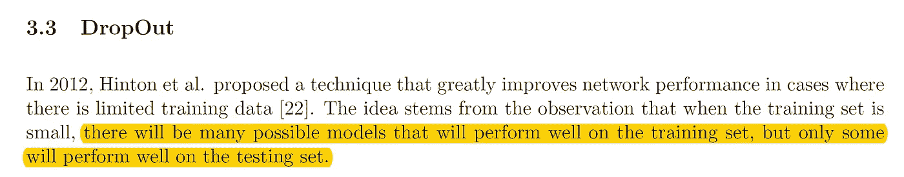

通过丢弃某些节点的值，我们可以使每个节点独立地从另一个节点进化，这使得网络更加健壮。

**3.5 使深网变浅**

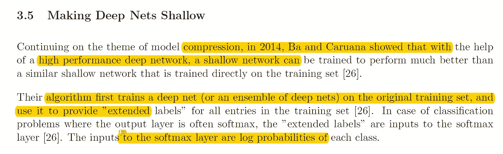

在这里，我学到了一种提高网络性能的方法，这种方法非常有趣。来自论文“ [*深网真的需要深吗？*](https://arxiv.org/abs/1312.6184) “我们可以看到一个深度 NN 被训练来指导一个较浅网络的情况。并且这种引导的浅层网络比用给定数据直接训练的浅层网络表现得更好。

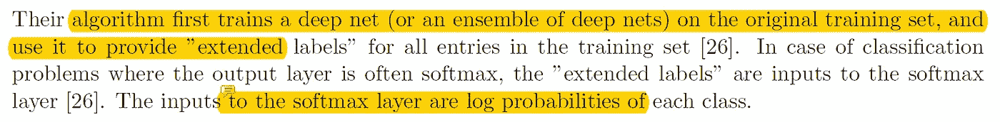

**网络架构(描述形式)**

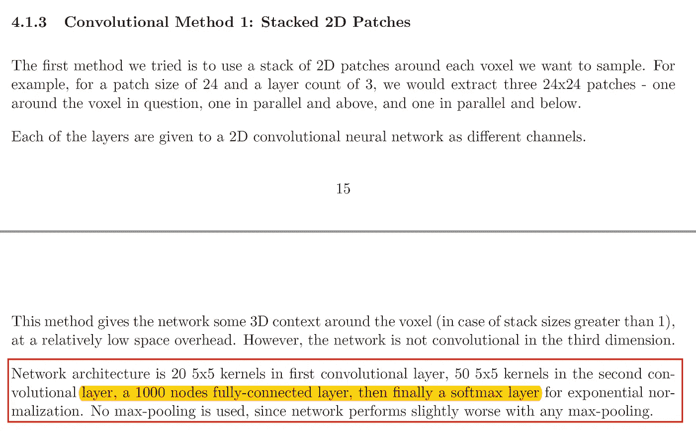

**红框** →网络架构描述

因为其他两个网络与这个非常相似，所以我们只实现第一个。我从未真正使用全连接网络进行过分段，但我认为这会非常有趣。此外，请注意，由于使用不同的数据集，我将增加一个层，只是为了适应我们的数据。然而，网络的一般结构是相似的。

**网络架构(图形形式)**

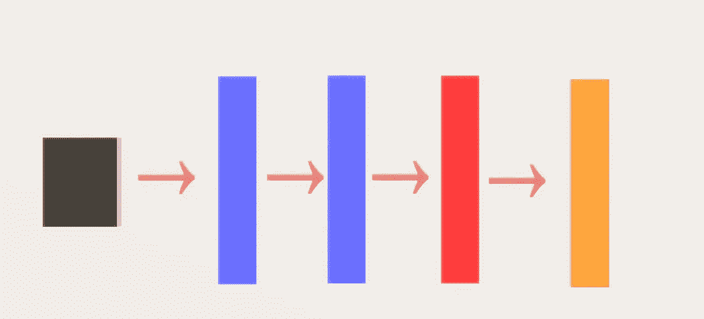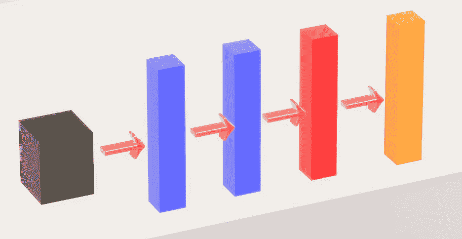

**黑色矩形** →输入图像
**蓝色矩形** →卷积层
**红色矩形** →全连通层(输入图像矢量化)
**橙色矩形** →软 max 层

网络本身很简单，现在让我们来看看 OOP 的形式。此外，为了克服消失梯度，让我们使用 ReLU()激活功能，并 tanh()激活在完全连接的层。

> **注意**由于硬件限制，我不得不将两个卷积层的滤波器大小减半，以及批量大小(2)。

**红线** →添加图层

整个网络(由于其深度)可以在一个屏幕截图中查看。最后，我们将使用随机梯度下降优化器。

**结果**

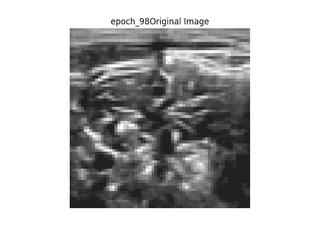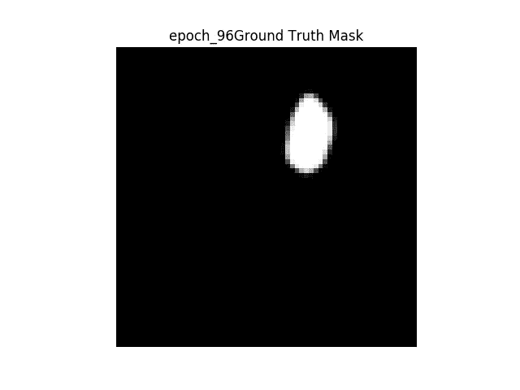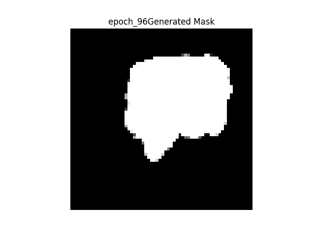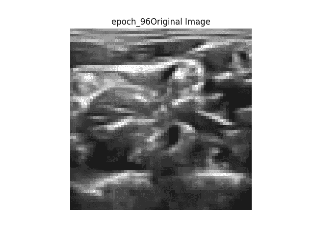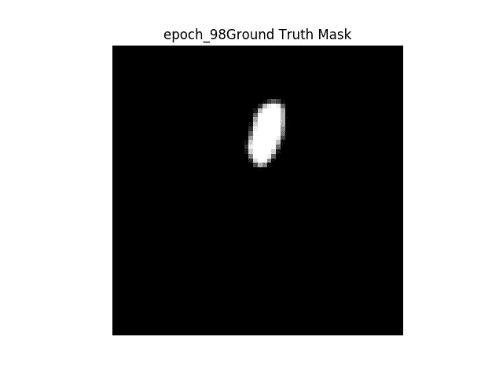

**右图** →原图
**中图** →二值掩码
**地面真相左图** →从网络生成二值掩码

网络给出的结果很差，但是我相信这是由于我使用了不同的数据集。我没有 ADNI 老年痴呆症的核磁共振数据集，但我相信网络的最终输出不是图像的矢量化版本。可能是海马体所在位置的坐标等等…

**GIF 格式的结果**

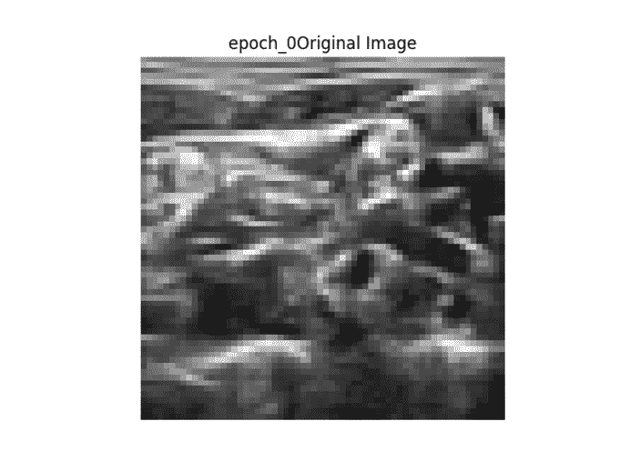

**显示图像的顺序** → 1。原图→ 2。地面真实二进制掩码→ 3。生成的二进制掩码→ 4。原始图像上的地面真实遮罩叠加→ 5。原始图像上生成的蒙版覆盖。

如上所述，随着训练的继续，我们可以看到所生成的滤波器变得更加清晰，但是所生成的掩模不会从一幅图像改变到另一幅图像，并且在正确分割图像方面表现不佳。

**互动代码/透明度**

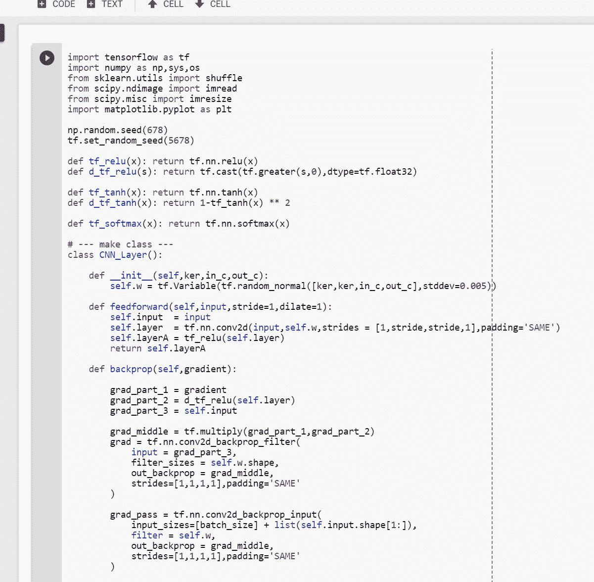

对于 Google Colab，你需要一个 Google 帐户来查看代码，而且你不能在 Google Colab 中运行只读脚本，所以在你的操场上复制一份。最后，我永远不会请求允许访问你在 Google Drive 上的文件，仅供参考。编码快乐！

要访问 Google Colab 上的代码，[请点击这里。](https://colab.research.google.com/drive/1ilCOiqlyfpj6eEa8EfR1XB5sV0m9JnXF)

*   *注**:我不想在 github 上存放私人医疗数据，因为我可能会违反他们的数据使用政策。所以这段代码不能直接在线运行。
*   为了让这个实验更加透明，我上传了我所有的命令输出到我的 Github，如果你想看[，请点击这里。](https://github.com/JaeDukSeo/Only_Numpy_Basic/blob/master/U-net/math.txt)

**最后的话**

这篇硕士论文在英语和内容方面都写得非常好，我希望在我做硕士论文时能写出类似的内容。

如果发现任何错误，请发电子邮件到 jae.duk.seo@gmail.com 给我，如果你想看我所有写作的列表，请点击这里查看我的网站。

同时，在我的推特[这里](https://twitter.com/JaeDukSeo)关注我，访问[我的网站](https://jaedukseo.me/)，或者我的 [Youtube 频道](https://www.youtube.com/c/JaeDukSeo)了解更多内容。如果你感兴趣，我还在这里做了解耦神经网络[的比较。](https://becominghuman.ai/only-numpy-implementing-and-comparing-combination-of-google-brains-decoupled-neural-interfaces-6712e758c1af)

**参考**

1.  赖，男(2015)。长颈鹿:利用深度强化学习下棋。Arxiv.org。检索于 2018 年 4 月 8 日，来自[https://arxiv.org/abs/1509.01549](https://arxiv.org/abs/1509.01549)
2.  赖，男(2015)。用于医学图像分割的深度学习。Arxiv.org。检索于 2018 年 4 月 8 日，来自[https://arxiv.org/abs/1505.02000](https://arxiv.org/abs/1505.02000)
3.  单调函数。(2018).En.wikipedia.org。检索于 2018 年 4 月 8 日，来自[https://en.wikipedia.org/wiki/Monotonic_function](https://en.wikipedia.org/wiki/Monotonic_function)
4.  Rprop。(2018).En.wikipedia.org。检索于 2018 年 4 月 8 日，来自[https://en.wikipedia.org/wiki/Rprop](https://en.wikipedia.org/wiki/Rprop)
5.  驱动:用于血管提取的数字视网膜图像。(2018).isi . uu . nl . 2018 年 4 月 8 日检索，来自[https://www.isi.uu.nl/Research/Databases/DRIVE/](https://www.isi.uu.nl/Research/Databases/DRIVE/)
6.  ADNI |阿尔茨海默病神经影像倡议。(2018).Adni.loni.usc.edu。检索于 2018 年 4 月 8 日，来自[http://adni.loni.usc.edu/](http://adni.loni.usc.edu/)
7.  导数双曲线。(2018).Math.com。2018 年 4 月 8 日检索，来自[http://www.math.com/tables/derivatives/more/hyperbolics.htm](http://www.math.com/tables/derivatives/more/hyperbolics.htm)
8.  j . brown lee(2017 年)。深度学习的 Adam 优化算法的温和介绍-机器学习掌握。机器学习精通。检索于 2018 年 4 月 8 日，来自[https://machine learning mastery . com/Adam-optimization-algorithm-for-deep-learning/](https://machinelearningmastery.com/adam-optimization-algorithm-for-deep-learning/)