# 【谷歌/ ICLR 2017 /论文摘要】反事实的梯度

> 原文：<https://towardsdatascience.com/google-iclr-2017-paper-summary-gradients-of-counterfactuals-6306510935f2?source=collection_archive---------6----------------------->

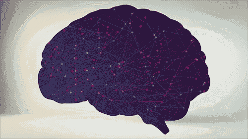

GIF from this [website](https://giphy.com/gifs/education-neuroscience-ojmB7lOn3VUU8)

[Mukund Sundararajan](https://arxiv.org/search?searchtype=author&query=Sundararajan%2C+M) ，是论文“[神经元](https://arxiv.org/abs/1805.12233)有多重要？”的作者之一(我也做了论文总结[这里](/nips2018-google-paper-summary-how-important-is-a-neuron-3de4b085eb03))。但是今天我想看看他之前的论文“反事实的梯度”。

> **请注意，这篇帖子是为了我未来的自己复习这篇论文上的材料，而不是从头再看一遍。**

Paper from this [website](https://arxiv.org/abs/1611.02639)

**摘要**

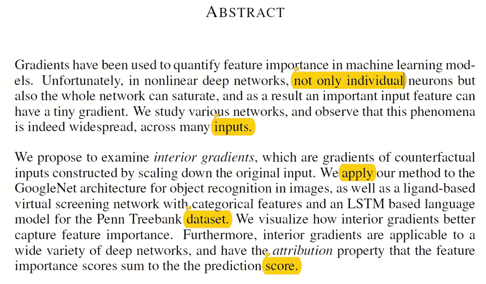

执行分类时，梯度可用于识别哪些要素对网络很重要。然而，在深度神经网络中，不仅神经元，而且整个网络都可能遭受饱和。且导致给出小梯度值，即使对于非常重要的特征也是如此。

在这项工作中，作者提出了内部梯度，这是反事实输入的梯度。(缩小原始输入)。该方法不仅易于实现，而且能更好地捕捉特征的重要性。

**简介**

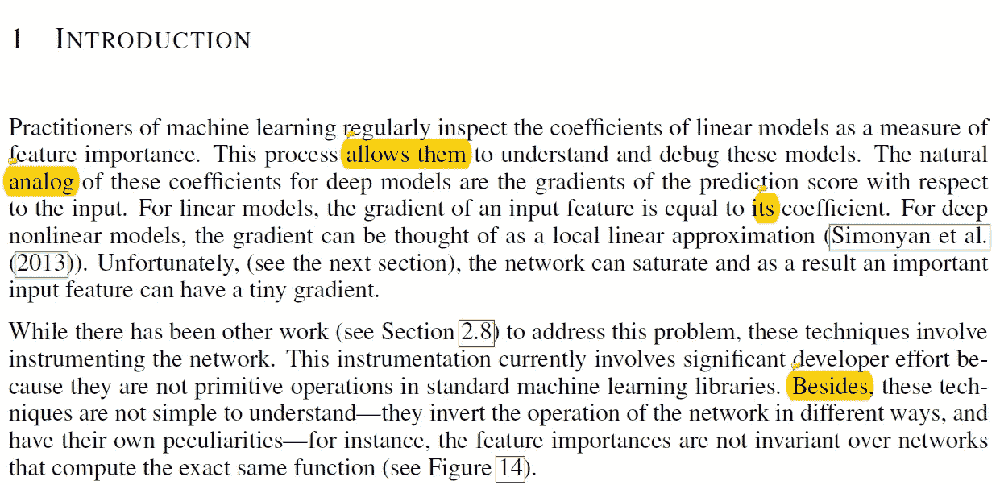

同样，梯度可以用来确定哪些特征是重要的。然而，由于网络内的饱和，重要特征可能具有非常小的梯度。以前有过克服这个问题的工作，但是它们需要开发者做大量的工作。相比之下，内部渐变非常容易实现，只需要最小的变化。(仅输入值)

**我们(作者)的手法**

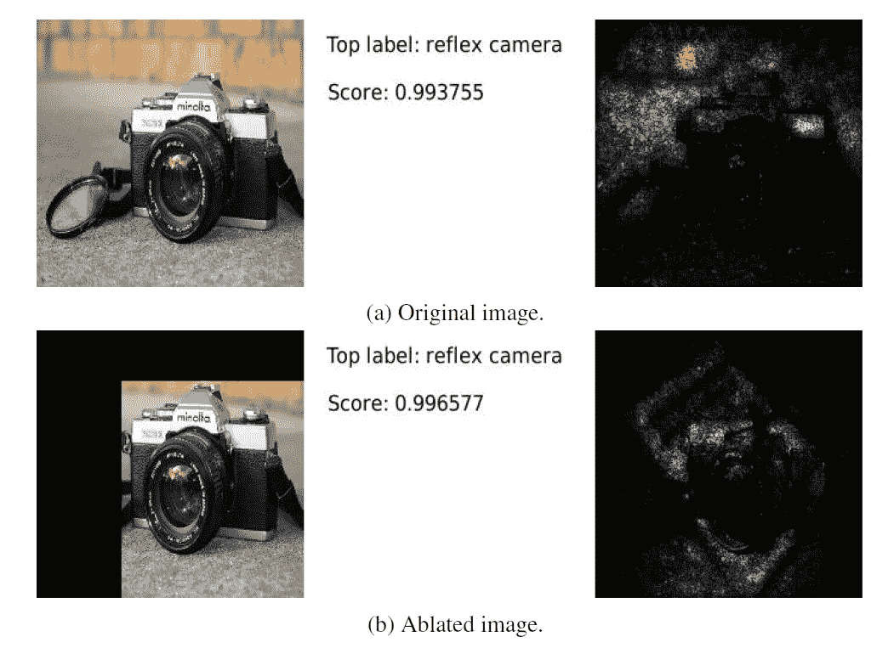

作者首先从调查梯度如何用于测量特征重要性开始，他们决定使用 GoogleNet。如上所述，当我们直接可视化与原始图像重叠的归一化梯度时，我们不能准确地说出为什么网络将该图像分类为相机。

凭直觉，我们应该期望镜头区域和相机整体的渐变比左上区域更亮。因此，作者从原始图像中裁剪掉了左边部分，然而，即使这样做了，我们也可以观察到图像中最奇怪的部分梯度最强。

**饱和度**

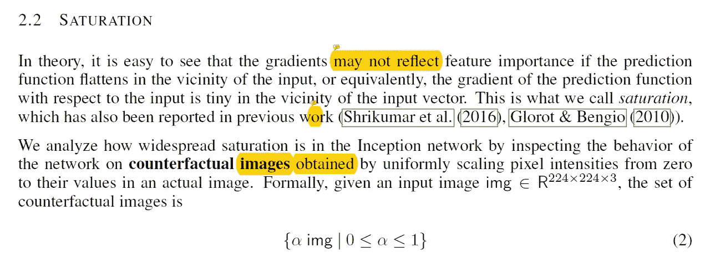

从上面的实验中，我们已经知道，由于网络中的饱和，梯度有可能表现出奇怪的行为。为了捕捉网络中饱和度的分布范围，作者提出了反事实输入。并且这些输入可以通过将α值乘以原始图像来获得。

通过大量的实验，作者发现饱和度在谷歌网络中广泛分布。(更具体地说，甚至在中间层以及最终软最大层和预软最大层中。)此外，作者还注意到，当输入值乘以低 alpha 值时，网络中会有更多的活动。(如 0.02)。

最后，众所周知的事实是，梯度的饱和会阻止模型收敛到高质量的最小值，如果发生这种情况，网络的性能会受到严重影响。然而，当网络中仍然存在饱和时，GoogleNet 具有很好的性能测量，因此作者做出了以下假设。

> 我们的假设是，重要特征的梯度在训练过程的早期没有饱和。梯度仅在特征已经被充分学习之后饱和，即，输入远离决策边界。

**内部梯度**

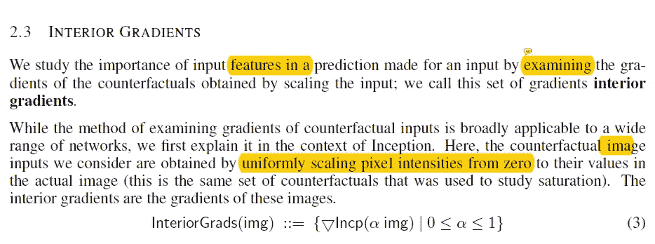

在本节中，作者描述了如何创建反事实输入，并指出这样一个事实，即我们可以通过在颜色维度上对它们求和来聚合所有的最终渐变。当我们在每个比例因子α下可视化这些梯度时，我们得到如下结果。

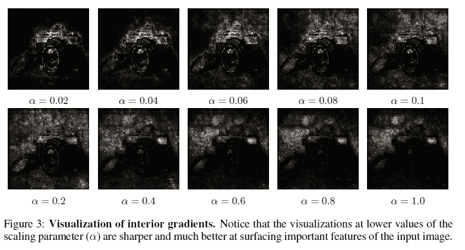

我们可以观察到，随着比例因子的降低，网络将该图像归类为相机的原因变得更有意义。当我们绘制最终梯度的绝对幅度时，我们得到如下图。

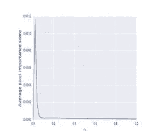

这表明随着α值的增加，最终梯度的值由于饱和而减小。

**累积内部渐变**

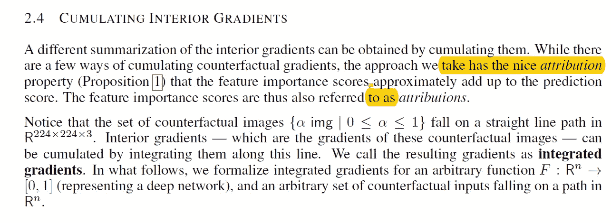

在本节中，作者通过将不同 alpha 值的所有梯度值相加来扩展内部梯度。他们用一种非常聪明的方式做到了这一点，他们不是有多个α值，比如说 100，而是取α从 0 到 1 的所有可能值的积分。最后，他们用黎曼和来逼近积分梯度。

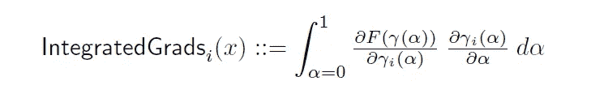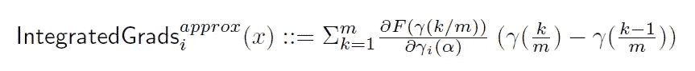

**左图** →积分梯度的原始方程
**右图** →用黎曼和近似积分

这个方法最好的部分就是简单地说，我们只是一遍又一遍地计算梯度。但是使用了缩小版本的输入，所以实现起来非常简单和自然。当我们将得到的积分梯度可视化时，我们会得到如下结果。

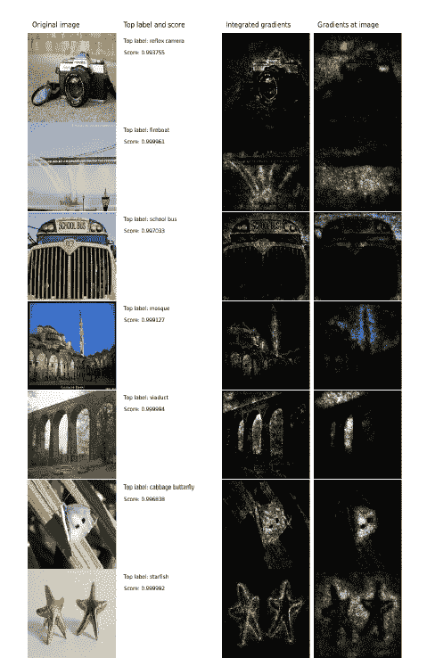

**评估/调试网络/讨论**

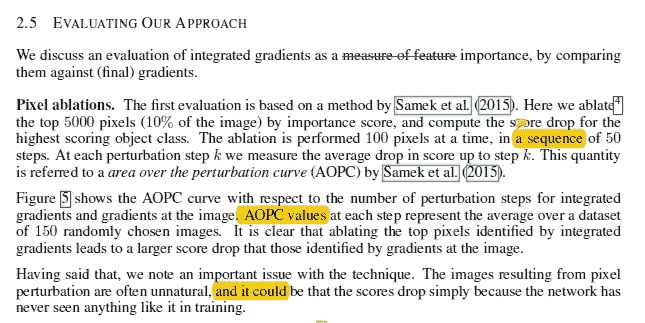

总之，在本节中，作者进行了额外的实验来评估积分梯度。(例如像素烧蚀或比较最高有效梯度的边界框)并且当与纯梯度相比时，积分梯度给出了更好的结果。(如果您希望查看更多示例，请[点击此处](https://github.com/ankurtaly/Integrated-Gradients)。)

在精度要求较高的环境中，例如医疗诊断，了解网络中的情况非常重要。并且更准确地知道哪些特征贡献给哪些类，积分梯度可以用作获得更多洞察的工具。

最后，作者讨论了这种方法的局限性。

**a .无法捕获特征交互** →模型可以执行一些操作，将某些特征组合在一起。重要的分数没有办法代表这些组合。

**b .特征相关性→** 如果相似的特征出现多次，模型可以为其中任何一个分配权重。(或者两者都有)。但是这些重量可能不是人类能够理解的。

**相关工作**

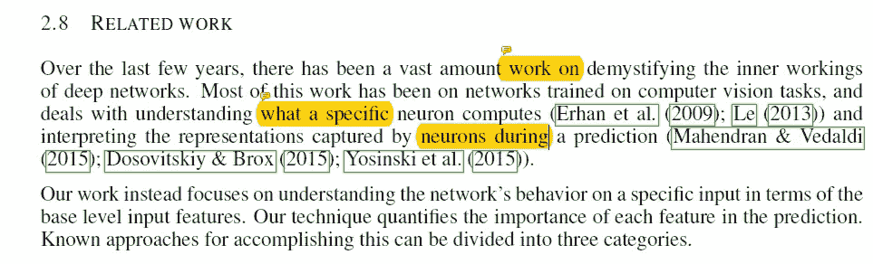

在本节中，作者讨论了不同研究人员提出的其他方法，希望揭开神经网络内部工作的神秘面纱。

**基于梯度的方法** →使用纯梯度或内部/整体梯度

**基于分数反向传播的方法** → [深度提升](https://arxiv.org/abs/1704.02685)、[逐层相关传播](https://arxiv.org/abs/1604.00825)、[反卷积网络](https://arxiv.org/abs/1311.2901)、导向反向传播

基于模型近似的方法 → [我为什么要相信你？](http://www.kdd.org/kdd2016/papers/files/rfp0573-ribeiroA.pdf)

**应用于其他网络**

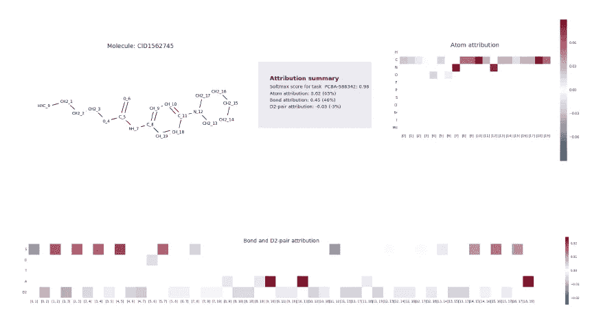

我不会深入每个实验的细节，但简而言之作者已经进行了两次实验。(一个与药物有关，另一个与语言建模有关。)通过使用积分梯度，他们能够确定哪些特征对模型做出预测起着最重要的作用。让他们更深入地了解模型在做什么。

**结论**

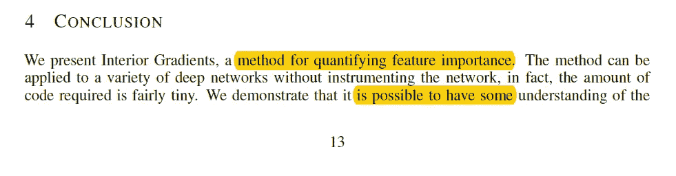

总之，作者提供了一种新的和简单的方法来衡量特征的重要性。并提供了广泛的实验，表明内部/积分梯度如何优于传统的梯度方法。

**遗言**

我真的相信这篇论文打开了研究神经网络的大门。总的来说，这是一篇相当长的论文，所以我没有包括很多内容和细节，如果你有时间，我强烈推荐你阅读这篇论文。

如果发现任何错误，请发电子邮件到 jae.duk.seo@gmail.com 给我，如果你希望看到我所有写作的列表，请[在这里查看我的网站](https://jaedukseo.me/)。

同时，在我的推特[这里](https://twitter.com/JaeDukSeo)关注我，并访问[我的网站](https://jaedukseo.me/)，或我的 [Youtube 频道](https://www.youtube.com/c/JaeDukSeo)了解更多内容。我也实现了[广残网，请点击这里查看博文 pos](https://medium.com/@SeoJaeDuk/wide-residual-networks-with-interactive-code-5e190f8f25ec) t。

**参考**

1.  Sundararajan，m .，Taly，a .，和 Yan，Q. (2016 年)。反事实的梯度。Arxiv.org。检索于 2018 年 6 月 15 日，来自[https://arxiv.org/abs/1611.02639](https://arxiv.org/abs/1611.02639)
2.  Dhamdhere，m . Sundararajan 和 q . Yan(2018 年)。一个神经元有多重要？。Arxiv.org。检索于 2018 年 6 月 15 日，来自[https://arxiv.org/abs/1805.12233](https://arxiv.org/abs/1805.12233)
3.  【NIPS2018/ Google /论文摘要】一个神经元有多重要？。(2018).走向数据科学。检索于 2018 年 6 月 15 日，来自[https://towards data science . com/nips 2018-Google-paper-summary-how-importance-is-a-neuron-3d E4 b 085 EB 03](/nips2018-google-paper-summary-how-important-is-a-neuron-3de4b085eb03)
4.  ankurtaly/集成渐变。(2018).GitHub。检索于 2018 年 6 月 15 日，来自[https://github.com/ankurtaly/Integrated-Gradients](https://github.com/ankurtaly/Integrated-Gradients)
5.  斯普林根贝格，j .，多索维茨基，a .，布罗克斯，t .，&里德米勒，M. (2014)。追求简单:全卷积网。Arxiv.org。检索于 2018 年 6 月 15 日，来自[https://arxiv.org/abs/1412.6806](https://arxiv.org/abs/1412.6806)
6.  m .泽勒和 r .弗格斯(2013 年)。可视化和理解卷积网络。Arxiv.org。检索于 2018 年 6 月 15 日，来自[https://arxiv.org/abs/1311.2901](https://arxiv.org/abs/1311.2901)
7.  宾德，a .，蒙塔冯，g .，巴赫，s .，M：ller，k .，& Samek，W. (2016 年)。具有局部重正化层的神经网络的逐层相关性传播。Arxiv.org。检索于 2018 年 6 月 15 日，来自 https://arxiv.org/abs/1604.00825
8.  Shrikumar，a .，Greenside，p .，和 Kundaje，A. (2017 年)。通过传播激活差异学习重要特征。Arxiv.org。检索于 2018 年 6 月 15 日，来自 https://arxiv.org/abs/1704.02685
9.  (2018).Kdd.org。检索于 2018 年 6 月 15 日，来自[http://www . KDD . org/KDD 2016/papers/files/RFP 0573-ribeiroa . pdf](http://www.kdd.org/kdd2016/papers/files/rfp0573-ribeiroA.pdf)

Photo by [Dollar Gill](https://unsplash.com/photos/yqNRxWNrC04?utm_source=unsplash&utm_medium=referral&utm_content=creditCopyText) on [Unsplash](https://unsplash.com/search/photos/photography?utm_source=unsplash&utm_medium=referral&utm_content=creditCopyText)