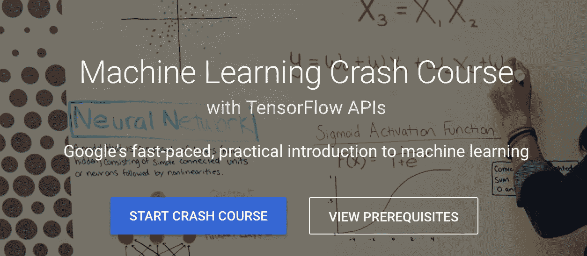
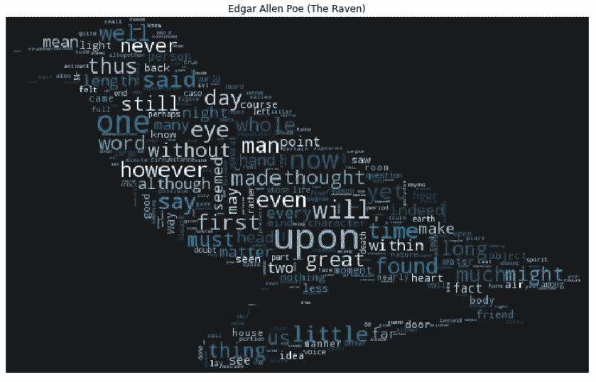
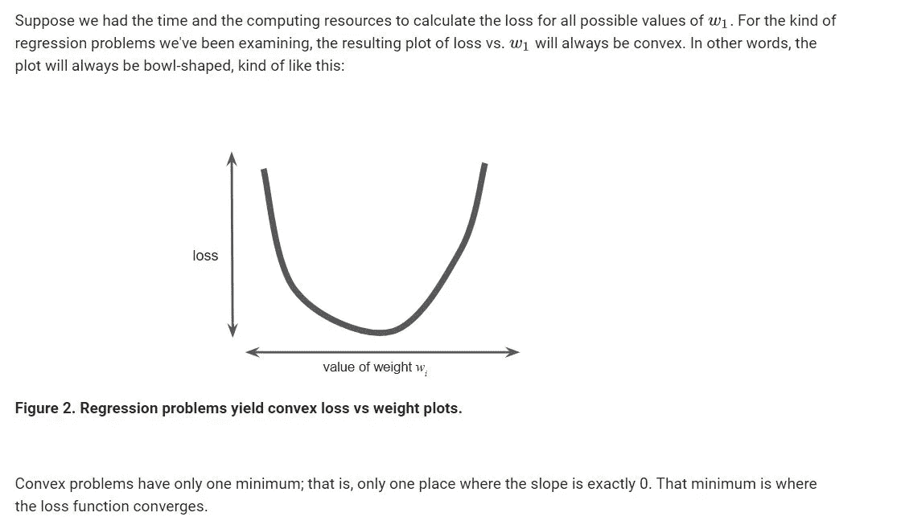

# 谷歌知道如何教学

> 原文：<https://towardsdatascience.com/google-knows-how-to-teach-45e531ab3ada?source=collection_archive---------8----------------------->

Google’s Machine Learning Crash Course

足够了！我受够了！”我脑袋里面的声音就是这样在磨了几个小时几天的学习机学习之后对我吼的。虽然我已经习惯了，但这次听起来很严肃。真的很严重！“嗯，好吧。那你想做什么？”我相当礼貌地问道。我刚说完这句话，就得到回应，“抓点数据。运行一些代码。做一些分析。给我看一些图，图表”。从这些话中可以明显看出，我的内在自我并不厌倦机器学习。它受够了过多的学习和研究，却很少尝试和实施。所以我浏览了保存的内核、笔记本、GitHub repos 和博客帖子的列表，做了一些实践，我选择了这个——[**幽灵作者认证！**](https://www.kaggle.com/c/spooky-author-identification)

在接下来的大约两个小时里，我们忙于解决那个卡格尔问题。事实上，我在我跟随的 Kaggle 中发现了一个非常有用的笔记本( [**这里**](https://www.kaggle.com/arthurtok/spooky-nlp-and-topic-modelling-tutorial) **)** 。我喜欢文字云，在看完这本笔记本后，我开始知道如何制作一个！

The Raven word-cloud, with font size varying according to the frequency of the words

> 当我看着那些巧妙的文字云感到高兴时，我的手机发出嗡嗡声，要求一些 Twitter 通知。这是我在转发中发现的:

接下来的一秒钟，我上了博客，从那里我进入了速成班( [**这里**](https://developers.google.com/machine-learning/crash-course/ml-intro) )。接下来发生了三件事:第一，我注意到视频没有播放。我重新加载，尝试了不同的模块，然后从 Chrome 切换到另一个浏览器，它工作了。问题出在 Chrome 浏览器的广告拦截扩展上。当它被禁用时，视频工作正常。我使用“反馈”按钮让他们了解这个问题。第二，左边的主题列表涵盖了许多重要的 ML 主题，我的注意力开始增长。第三，我内心愤怒的声音又回来了，“减少损失、一般化、逻辑回归、神经网络……再来一句理论，我就要把你大脑里的神经元烧掉，我是认真的”。然而这一次，我做出了不同的回应，“我现在不想听你说！”当两个你爱的东西走到一起(ML 和 Google)，你无法阻止自己用双手去抓住它。接下来的几个小时，我忙着看视频，看笔记，跑步练习，完成了速成班的一半。你猜怎么着，粘在上面的不仅仅是我。我的抱怨，叫喊，愤怒的内心声音也加入进来。

谷歌的机器学习速成班现在将在我的机器学习推荐资源列表中。尽管它自称为速成课程，但任何完成包括视频、笔记、练习和游戏任务在内的所有课程内容的人都会意识到，这不仅仅是一门速成课程。它不仅让我更好地了解了许多事情，还帮助我理解了一些我以前不知道的方法和概念。

**“Dude, this is what convex means! You heard about it in all those courses and wondered what it is” — my inner voice after it joined me and got glued to this course.**

这不是我从谷歌找到的第一个对机器学习真正有帮助的资源。Jason Mayes 机器学习 101 课程有非常生动的幻灯片，很好地解释了 ML 的概念。它有 101 张很好的机器学习内容的幻灯片，有很好的设计和很好的例子。

例子让理解更容易。这正是 Martin Gorner 在他关于深度学习的几个小时会议中所做的。虽然这不像神经网络上的任何 MOOC 那么大，但 Martin 通过分解神经网络并展示其各个部分的功能，很好地解释了神经网络是如何工作的。在几个小时的时间里，你将了解数据是如何输入网络的，权重和偏差是如何添加的，为什么我们需要激活函数，如何通过正则化、剔除和许多其他有用的技术来提高精度。这也有助于我理解 TensforFlow 是如何工作的。

 [## 学 TensorFlow 和深度学习，没有博士| Google Cloud 大数据和机器学习…

### 这个 3 小时的课程为开发人员提供了深度学习基础知识的快速介绍

cloud.google.com](https://cloud.google.com/blog/big-data/2017/01/learn-tensorflow-and-deep-learning-without-a-phd) 

除了所有这些资源之外，当我浏览谷歌的一些网站时，还会不时地发现许多其他资源。Google 的[**Tech Dev Guide**](https://techdevguide.withgoogle.com/)**和[**Learn With Google AI**](https://ai.google/education#?modal_active=none)都有非常好的资源，无论是学习还是准备面试。在博客文章 [**机器学习的规则**](https://developers.google.com/machine-learning/rules-of-ml/?utm_source=google-ai&utm_medium=card-image&utm_campaign=training-hub&utm_content=ml-rules) **，**中，作者列出了 43 条规则，每一条都用一个例子解释了它是如何在 Google Play、Google Plus 等谷歌产品中实现或使用的。[**Google code labs**](https://codelabs.developers.google.com/)是另一个非常有用的资源，有一系列 Google 产品和技术的简单教程。谷歌的博客页面(像 [**这个**](https://research.googleblog.com/) 和 [**这个**](https://developers.googleblog.com/) **)** 也是找到一些非常有趣的文章和更新的好来源。**

**通过 MOOCs、Youtube、博客和许多来自大学、学者、研究人员、学生和博客作者的其他途径，可以获得数百门课程，拥有一些来自科技公司的学习资源也很好。谷歌似乎在这方面做得很好。我希望谷歌和其他科技公司为任何愿意学习的人提供更多这样的开放资源。**

> **虽然这里列出的大部分资源都是关于机器学习的，这也是我一直生活的地方，但在过去的一年里，我也遇到了许多其他技术和产品的资源。探索谷歌开发人员和其他谷歌网站将会带来宝贵的学习和实践资源。**
> 
> **你觉得这篇文章有用吗？欢迎留下任何反馈/意见。感谢阅读！！**

*****连接:*** [***领英***](https://www.linkedin.com/in/avinash-kappa/)*[***推特***](http://twitter.com/avinashso13) ***和我的*** [***博客***](https://theimgclist.github.io/) ***。******