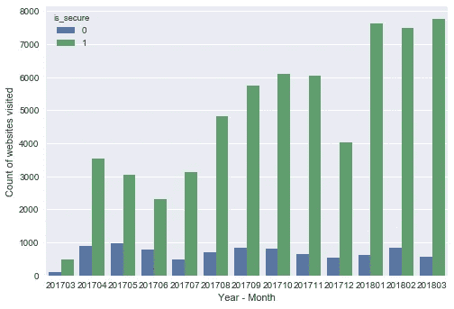
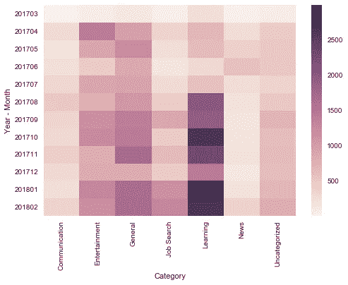
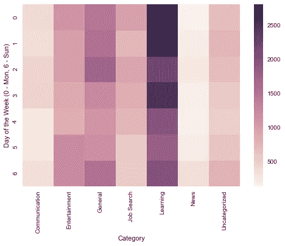
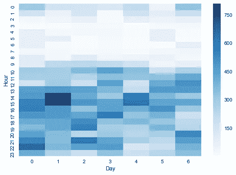
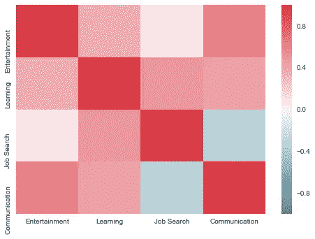

# 谷歌无所不知——第一部分——Chrome 浏览模式

> 原文：<https://towardsdatascience.com/google-knows-it-all-part-1-chrome-browsing-patterns-979d0f1c7ebd?source=collection_archive---------6----------------------->

剑桥分析公司和脸书事件引起了关于数据隐私和安全的轩然大波。虽然只有脸书在社交媒体上成为攻击目标，但你的数据正被互联网上每一个你与之互动的实体所收集。而且通常收集是为了让你的体验更好。当你真的很饿的时候，谁不喜欢一个应用程序上的食物推荐。它让你变得懒惰，但也节省了你的时间。

我请求**谷歌**给我**发送我的**数据，为此他们花了大约一个**日**。我对数据的粒度感到震惊。从我一年前访问的 URL(在 leaf 处)，到我每次给任何应用程序我的位置许可时我的位置数据(关于我的高度、速度、方向、垂直精度等等的数据)，它都有。基本上，他们已经把我在谷歌应用程序中搜索过的所有东西都储存起来了。

我想用我的**浏览**数据，看看我是否能从中获得一些有用的东西。我用的是 python 3.6，所有的计算都是在熊猫 3.6 中完成的。 **Json、datetime、tldextract** 和 **regex** 是我导入来清理数据的主要包。我特别崇拜《海底世界》中的调色板，并把它用在我的想象中。

简要地；我提取了 json 文件，清理了它，从 URL 数据中提取了域、子域、安全等，并将不同的域分为这 7 类；

一、**学习**——从 coursera 到 stack overflow 到 piazza 的一切

二。**娱乐** —网飞，脸书，…

三。**沟通** — Whatsapp，Messenger，GroupMe，Gmail，…

四。找工作——是的，我必须把它写进去，因为我开始在这上面花了很多时间

动词 （verb 的缩写）常规——从普通的谷歌搜索到预订机票到点餐，无所不包

不及物动词新闻——自从我加入科技公司后，就没怎么看了。

七。**未分类的**——所有其他的东西

上述分类是基于提取的域名完成的。

***背景*** : *我有 2017 年 3 月到 2018 年 2 月的数据。2017 年 6 月，我辞去了分析顾问的工作，并于 2018 年 8 月加入佐治亚理工学院。这可能有助于下面图表的上下文*

自从加入 Tech，我发现我的互联网使用量明显增加。

被访问的**安全网页**的数量有所增加，而对不安全网页的访问基本保持不变。12 月份也可以看到下降。(寒假！)

下面的**热图**可以告诉你我是什么时候开始在 Tech 读硕士的。从 2017 年 8 月开始，**学习**网站突然增加，12 月略有下降。**‘求职’**2018 年一二月也变得更黑了。**‘娱乐’**秋季学期最后两个月也降了，所以我知道 2018 年三四月该期待什么了！

深入挖掘一周水平的分析，我总是在一周开始时学习，但随着时间的推移它会下降。真的可以在这里责怪自己。**另一方面，随着时间的推移，“娱乐”会略有增加。**随着时间的推移，“求职”再次下降。也许是周日晚上的负罪感引发了周一学习和求职的突然增加。****

*****注意:在我加入 GeorgiaTech 后，我将下图的数据限制为日期。*****

********

****深入研究一个小时的分析，你会发现大部分的**学习**在上午 9 点左右开始，也就是课程开始的时候，在下午 3-4 点左右达到高峰。娱乐活动也在那段时间达到高峰，这要归功于欧洲足球比赛。你可以从凌晨 2 点到 8 点的干燥区域推断出我的睡眠模式。****

********

****另一个有趣的分析是在日时 T21 水平上进行的。在周日(第六天)下午 4-6 点左右有一个特殊的下降。这是由于日常杂货店访问目标/Publix。不出所料，星期五(第 4 天)比其他时间早结束，星期六比其他时间晚开始。****

********

****这最后的视觉化就是看看我在这些独立的类别中工作时有多有效。****

********

****很明显，在找工作的时候，我的沟通能力下降了。求职和娱乐的相关性也很低(或不太高)，这很好。学习和娱乐不太相关，当娱乐节目开始时，交流增加。****

****同样的代码可以在这里找到:[https://github . com/jehlokhande 93/BrowsingHistoryVisualization](https://github.com/jehlokhande93/BrowsingHistoryVisualization)****

**** [## Jeh Lokhande -数据科学家实习生- Cox Communications | LinkedIn

### 查看全球最大的职业社区 LinkedIn 上 Jeh Lokhande 的个人资料。Jeh 列出了 6 项工作…

www.linkedin.com](https://www.linkedin.com/in/jehlokhande/)****