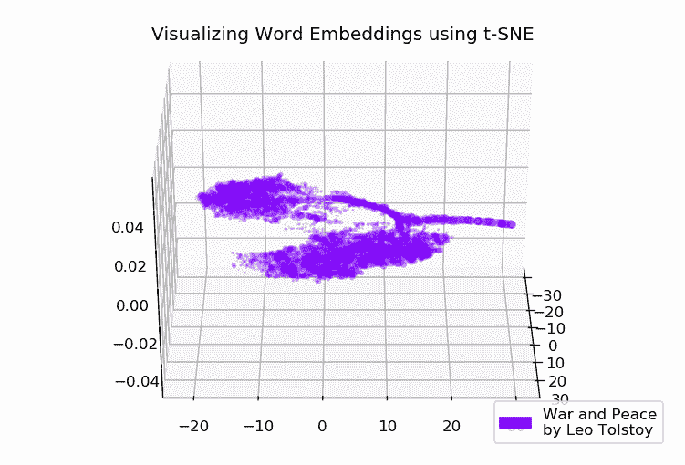
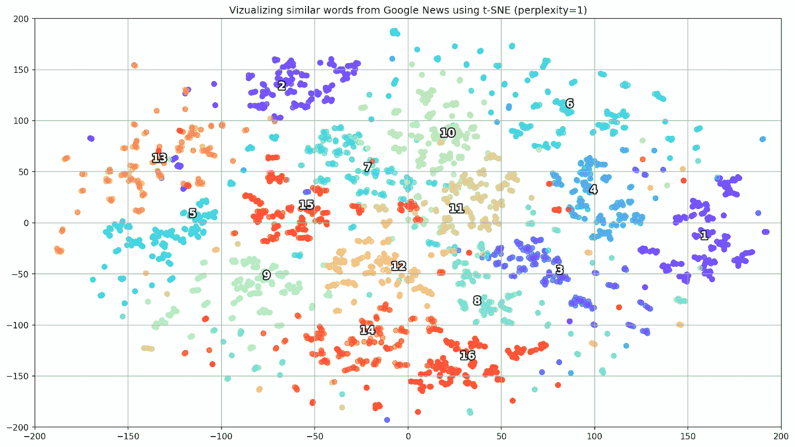
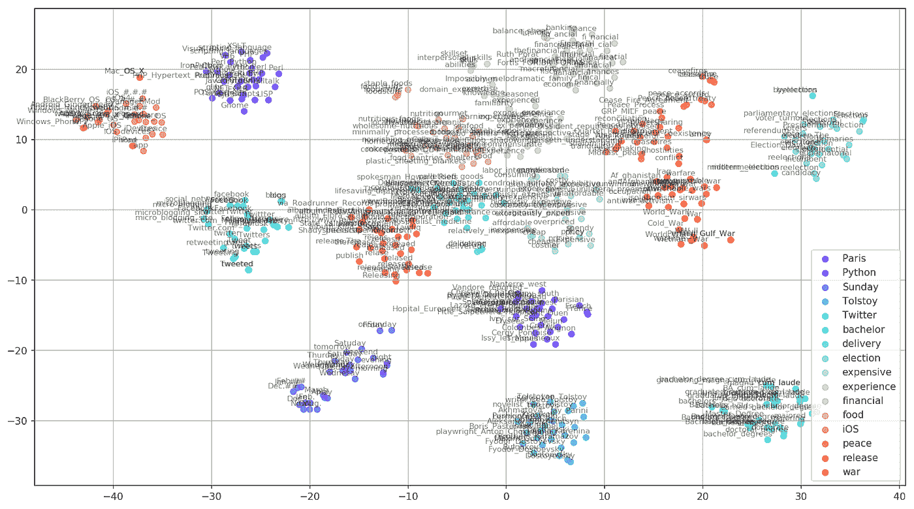
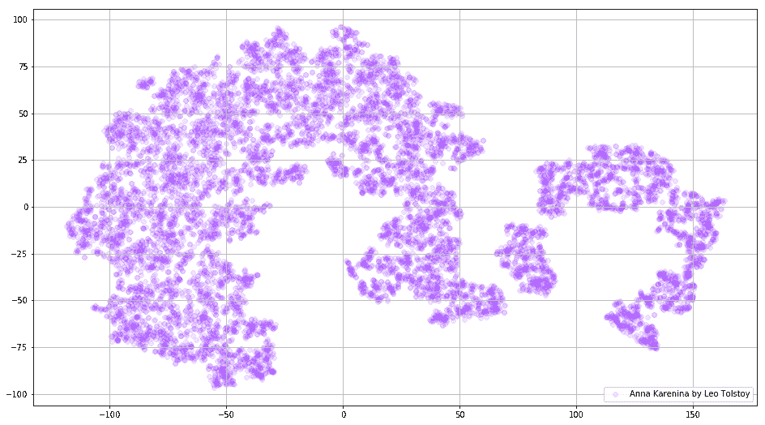
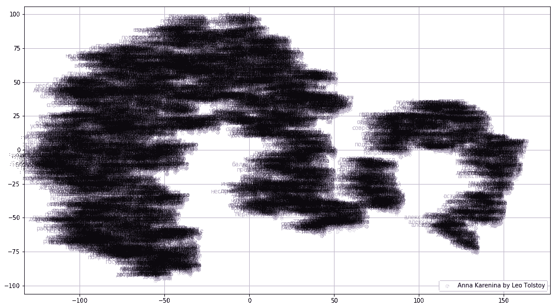
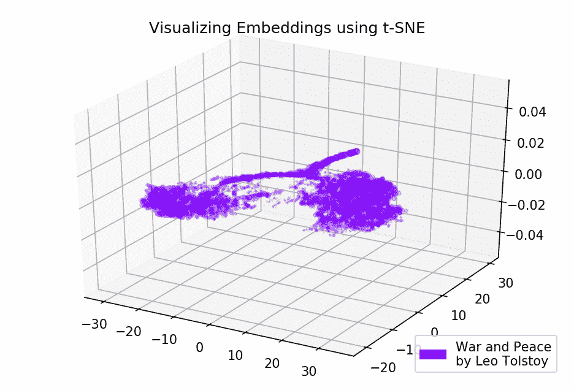

# 谷歌新闻和列夫·托尔斯泰:使用 t-SNE 可视化 Word2Vec 单词嵌入

> 原文：<https://towardsdatascience.com/google-news-and-leo-tolstoy-visualizing-word2vec-word-embeddings-with-t-sne-11558d8bd4d?source=collection_archive---------0----------------------->

每个人都以独特的方式感知文本，不管这个人是在网上看新闻，还是看世界知名的经典小说。这也适用于各种算法和机器学习技术，它们以更数学的方式理解文本，即使用高维向量空间。

本文致力于使用 t-SNE 可视化高维 Word2Vec 单词嵌入。可视化有助于理解 Word2Vec 如何工作，以及如何在神经网络或其他机器学习算法中使用它们之前解释从文本中捕获的向量之间的关系。作为训练数据，我们将使用来自谷歌新闻的文章和俄罗斯作家列夫·托尔斯泰的经典文学作品，托尔斯泰被认为是有史以来最伟大的作家之一。

我们通过 t-SNE 算法的简要概述，然后使用 Word2Vec 进行单词嵌入计算，最后，在 2D 和 3D 空间中使用 t-SNE 进行单词向量可视化。我们将使用 Jupyter Notebook 用 Python 编写我们的脚本。

# t 分布随机邻居嵌入

T-SNE 是一种用于数据可视化的机器学习算法，它基于非线性降维技术。t-SNE 的基本思想是在保持点之间相对成对距离的情况下降低维度空间。换句话说，该算法将多维数据映射到两个或更多维，其中最初彼此远离的点也位于远处，并且靠近的点也转换成靠近的点。可以说，t-SNE 正在寻找一种新的数据表示方法，在这种方法中，相邻关系被保留。t-SNE 整个逻辑的详细描述可以在原始文章[1]中找到。

# Word2Vec 模型

首先，我们应该获得单词的矢量表示。为此，我选择了 Word2vec [2]，这是一个计算效率高的预测模型，用于从原始文本数据中学习多维单词嵌入。Word2Vec 的关键概念是定位在训练语料库中共享共同上下文的单词，这些单词在向量空间中与其他单词相比非常接近。

作为可视化的输入数据，我们将使用来自谷歌新闻的文章和列夫·托尔斯泰的几部小说。在谷歌新闻数据集(大约 1000 亿字)的一部分上训练的预训练向量是由谷歌在[官方页面](https://code.google.com/archive/p/word2vec/)发布的，所以我们将使用它。

除了预训练的模型，我们将使用 Gensim [3]库在托尔斯泰的小说上训练另一个模型。Word2Vec 将句子作为输入数据，产生单词向量作为输出。首先，需要下载预先训练的 Punkt 句子标记器，它将一个文本分成一系列句子，考虑缩写词，搭配和词，这些词可能指示句子的开始或结束。默认情况下，NLTK 数据包不包括预先训练的俄语 Punkt 分词器，所以我们将来自[https://github.com/mhq/train_punkt](https://github.com/mhq/train_punkt)的第三方模型。

在 Word2Vec 训练阶段，使用了以下超参数:

*   特征向量的维数是 200。
*   句子中被分析单词之间的最大距离是 5。
*   忽略每个语料库中总频率低于 5 的所有单词。

# 使用 t-SNE 可视化单词嵌入

在需要可视化位于多维空间中的对象之间的相似性的情况下，T-SNE 非常有用。对于大型数据集，制作易读的 t-SNE 图变得越来越困难，因此常见的做法是可视化最相似单词的组。

让我们从预先训练的 Google 新闻模型的词汇表中选择几个词，并准备词向量用于可视化。

The effect of various perplexity values on the shape of words clusters

接下来，我们进入本文最吸引人的部分，SNE 霸王龙的构型。在这一节中，我们应该注意下面的超参数。

*   *部件的数量*，即输出空间的尺寸。
*   *困惑值*，其在 t-SNE 的上下文中可以被视为有效邻居数量的平滑测量。它与许多其他流形学习者中使用的最近邻的数量有关(见上图)。根据[1]，建议在 5 到 50 之间选择一个值。
*   *嵌入的初始初始化类型*。

值得一提的是，t-SNE 有一个非凸的目标函数，使用随机初始化的梯度下降优化将其最小化，因此不同的运行会产生略有不同的结果。

下面是使用 Matplotlib 创建 2D 散点图的脚本，Matplotlib 是 Python 中最流行的数据可视化库之一。

*Clusters of similar words from Google News (preplexity=15)*

在某些情况下，为了看到全貌，一次绘制所有单词向量可能是有用的。现在让我们来分析《安娜·卡列尼娜》，这是一部充满激情、阴谋、悲剧和救赎的史诗小说。

Visualization of the Word2Vec model trained on Anna Karenina

如果我们在 3D 空间中映射初始嵌入，则整个画面可以提供更多信息。这一次让我们来看看《战争与和平》，它是世界文学的核心小说之一，也是托尔斯泰最伟大的文学成就之一。

Visualization of the Word2Vec model trained on War and Peace

# 结果呢

这是从 Word2Vec 和 t-SNE 的角度看文本的样子。我们为谷歌新闻中的相似词汇绘制了一个信息量很大的图表，并为托尔斯泰的小说绘制了两个图表。还有一件事，GIFs！gif 很牛逼，但是绘制 gif 和绘制常规图形几乎是一样的。所以，我决定不在文章中提及它们，但是您可以在源代码中找到生成动画的代码。

Github 提供了源代码。

 [## sismetanin/word2vec-tsne

### 谷歌新闻和列夫托尔斯泰:使用 t-SNE 可视化 Word2Vec 单词嵌入。

github.com](https://github.com/sismetanin/word2vec-tsne) 

# 参考

1.  长度 Maate 和 G. Hinton，“使用 t-SNE 可视化数据”，*《机器学习研究杂志》*，第 9 卷，第 2579-2605 页，2008 年。
2.  T.Mikolov，I. Sutskever，K. Chen，G. Corrado 和 J. Dean，“单词和短语的分布式表示及其组合性”，*神经信息处理系统进展*，第 3111–3119 页，2013 年。
3.  R.Rehurek 和 P. Sojka，“大型语料库主题建模的软件框架”，*LREC 2010 年自然语言处理框架新挑战研讨会论文集*，2010 年。