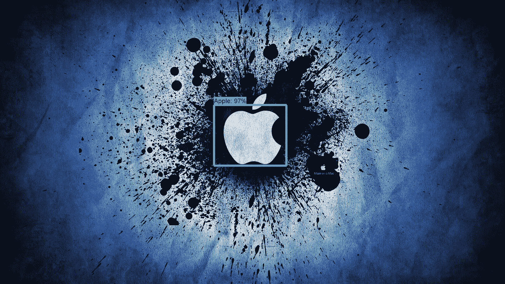
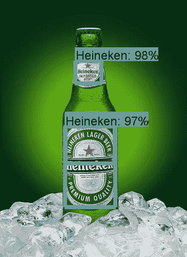
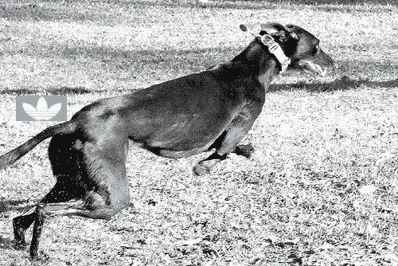
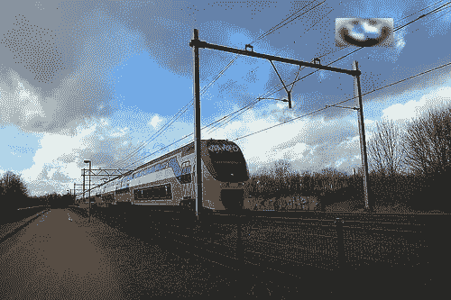
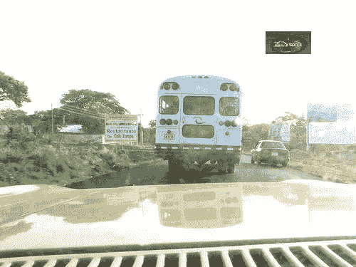
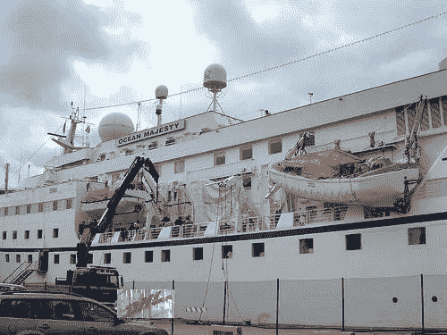
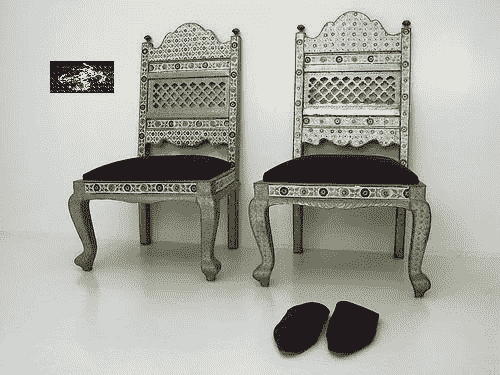
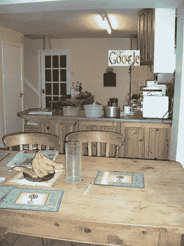

# 谷歌对象检测 API 检测品牌标志第 1 部分

> 原文：<https://towardsdatascience.com/google-object-detection-api-to-detect-brand-logos-fd9e113725d8?source=collection_archive---------3----------------------->

Brand Logos Object Detection

Google 已经分享了它的 Object Detecion API 和非常好的文档来帮助我们在自己的数据集上训练一个新的模型。文档可在[使用云机器学习引擎](https://cloud.google.com/blog/big-data/2017/06/training-an-object-detector-using-cloud-machine-learning-engine)训练对象检测器获得。指南解释得很清楚，只要按照步骤做一些改动就可以了。我试图训练检测品牌标志的模型，并发现结果适合这篇博文。

# **数据集**

我使用的是 [Flick-27 logo 数据集](http://image.ntua.gr/iva/datasets/flickr_logos/)，它是公开可用的，有从 Flickr 下载的 27 个品牌的图片。它为每个类有 30 张图片。总共 810 幅图像用于训练。虽然它对于深度学习问题来说是一个非常小的数据集，但是使用数据扩充技术，它可以膨胀到适合于训练对象检测模型的更大的数据集。

一个大的数据集 [flickr-32](http://www.multimedia-computing.de/flickrlogos/) 也有更多的例子。对于训练数据集的 32 个类别中的每一个，它具有 70 个图像，而对于测试和验证数据集，它对于每个类别具有 10 个图像。它还有 6000 张没有标识的图片。但是它没有注释(图像中徽标周围的边框)。这就是为什么它更适合于标识(对象)识别而不是标识(对象)检测。

# **数据增强**

因为 flick-27 是一个非常小的数据集，只有 810 张图像，所以数据扩充是训练前非常重要的一部分。为了增加数据，我从给定的图像中裁剪出每一个标志，并进行一些变换，如水平翻转、垂直翻转、添加噪声、旋转、模糊等。然后将每个转换后的图像粘贴到一些随机位置上没有徽标的图像上，并记录位置坐标，这些坐标将作为以后训练的注释。在这之后，我从仅仅 810 张图片中得到了大约 15000 个例子。我使用[视觉对象类挑战 2012 数据集](http://academictorrents.com/details/df0aad374e63b3214ef9e92e178580ce27570e59/tech&hit=1&dllist=1)作为无徽标数据集。

Augmented data

# **迁移学习**

迁移学习是深度学习的一个重要概念。在迁移学习中，我们通过将输入作为自己的数据集来重新训练已经训练好的模型。这样我们可以减少训练所需的数据量和训练时间。训练利用来自已经训练的模型的权重，并开始学习新的权重来学习分类新的数据。这是一种非常有效的技术。

我使用了在牛津 Pet 数据集上训练的 SSD Mobilenet 模型作为基础模型，而在同一牛津 Pet 数据集上训练的更快的 RCNN 被用于[使用例如云机器学习引擎](https://cloud.google.com/blog/big-data/2017/06/training-an-object-detector-using-cloud-machine-learning-engine)训练对象检测器。与 RCNN 或更快的 RCNN 等更大的模型相比，使用 SSD mobilenet 作为模型更小、更快。模型训练的大小只有 22MB。

更多经过训练的迁移学习模型可以在[检测模型动物园](https://github.com/tensorflow/models/blob/master/object_detection/g3doc/detection_model_zoo.md)找到。

# 培养

由于训练步骤已经在原帖[使用云机器学习引擎](https://cloud.google.com/blog/big-data/2017/06/training-an-object-detector-using-cloud-machine-learning-engine)训练物体检测器中做了很好的解释，我就不在这里解释了。然而，更多的帖子会有所帮助

[如何用 TensorFlow 的物体检测器 API 训练自己的物体检测器](https://medium.com/towards-data-science/how-to-train-your-own-object-detector-with-tensorflows-object-detector-api-bec72ecfe1d9)

[用 Tensorflow 和 OpenCV 构建实时物体识别 App](https://medium.com/towards-data-science/building-a-real-time-object-recognition-app-with-tensorflow-and-opencv-b7a2b4ebdc32)

# 结论

我尝试使用 Flickr-27 数据集为品牌标志检测的对象检测进行训练，我发现了一些好的结果和大量的学习。

我观察到，它在高清晰度图像上工作得非常好，而在图像中的较小对象上不太准确。这是 SSD mobilenet 模型的一个折衷。但 SSD mobilenet 可以与高清摄像头一起实时使用，以获得更高的准确性，与 GPU 一起使用，以实现更快的实时检测。

# **下一个**

我计划将来用更多的图片在 Flickr-47 数据集上训练它，以获得更好的准确性。

用高清摄像头和 GPU 在实时视频流上测试它。

尝试 SSD Inception 模型，而不是 Mobilenet，以便在较小的对象上获得更好的准确性。

**第二部分:**[https://medium . com/forward-data-science/Google-object-detection-API-to-detect-brand-logos-Part-2-384055 e4e 109](https://medium.com/towards-data-science/google-object-detection-api-to-detect-brand-logos-part-2-384055e4e109)