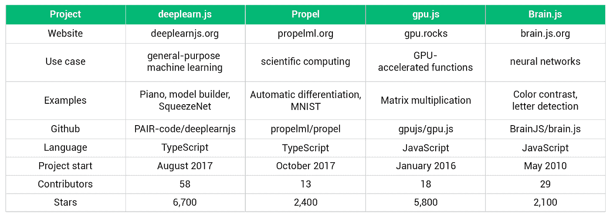

# JavaScript 中的 GPU 加速神经网络

> 原文：<https://towardsdatascience.com/gpu-accelerated-neural-networks-in-javascript-195d6f8e69ef?source=collection_archive---------3----------------------->

据 [Octoverse 2017](https://octoverse.github.com) 报道，JavaScript 是 Github 上最受欢迎的语言。用 pull 请求的数量来衡量，JavaScript 的活跃程度可以与 Python、Java 和 Go 的总和相媲美。

JavaScript 已经征服了网络，并在服务器、手机、桌面和其他平台上取得了进展。

与此同时，GPU 加速的使用已经远远超出了计算机图形学的范围，现在已经成为机器学习不可或缺的一部分。

用深度架构训练神经网络是一个计算密集型过程，已经在机器智能的许多重要领域产生了最先进的结果。

本文着眼于这些趋势的持续融合，并概述了将 GPU 加速的神经网络引入 JavaScript 世界的项目。

[Community logo for JavaScript](https://github.com/voodootikigod/logo.js)

# 概述

下面列出的所有项目都得到积极维护，在 Github 上有数千颗星，并通过 NPM 或 CDNs 分发。

它们都通过 [WebGL](https://developer.mozilla.org/en-US/docs/Web/API/WebGL_API) 在浏览器中实现 GPU 加速，如果没有合适的显卡，则退回到 CPU。

旨在运行现有模型的库(尤其是那些用 Python 框架训练的)不包括在本概述中。

最终，有四个项目成功上榜。

虽然 deeplearn.js 的功能集面向神经网络，但它可以被描述为一个通用的机器学习框架。Propel 是一个科学计算库，提供自动微分。Gpu.js 提供了一种在 Gpu 上运行 JavaScript 函数的便捷方式。Brain.js 是一个更老的神经网络库的延续，使用 gpu.js 进行硬件加速。

我打算保留这篇文章，并将其扩展成一个 Github 库。如果你看到相关消息，请告诉我。

# Deeplearn.js

[Deeplearn.js](https://deeplearnjs.org/) 是四个项目中最受欢迎的，被描述为“机器智能的硬件加速 JavaScript 库”。它得到了谷歌大脑团队和一个由 50 多名贡献者组成的社区的支持。两位主要作者是[丹尼尔·斯米尔科夫](https://smilkov.com/)和[尼基尔·苏拉特](https://github.com/nsthorat)。

Definition of a convolutional layer in deeplearn.js

deeplearn.js 以 TypeScript 编写，并模仿 Tensorflow，支持 Google Brain 旗舰开源项目中提供的越来越多的功能子集。API 本质上有三个部分。

第一部分涵盖了用于[创建、初始化和转换张量](http://www.deeplearnjs.org/docs/api/index.html#Tensors-Creation)的函数，张量是保存数据的类似数组的结构。

API 的下一部分提供了在张量上执行的[操作](http://www.deeplearnjs.org/docs/api/index.html#Operations-Arithmetic)。这包括基本的数学运算、归约、归一化和卷积。在这一点上，对递归神经网络的支持是初步的，但确实包括长短期记忆网络单元的堆栈。

第三部分围绕模型训练展开。所有流行的优化器，从[随机梯度下降](http://www.deeplearnjs.org/docs/api/index.html#dl.train.sgd)到[亚当](http://www.deeplearnjs.org/docs/api/index.html#dl.train.adam)，都包括在内。另一方面，交叉熵损失是参考文献中提到的唯一损失函数。

API 的其余部分用于设置环境和管理资源。

node.js 中的实验性 GPU 加速可以通过 [headless-gl](https://github.com/stackgl/headless-gl) 实现(参见[第 49 期](https://github.com/PAIR-code/deeplearnjs/issues/49))。

该项目网站有许多令人难忘的[演示](http://www.deeplearnjs.org/index.html#demos)。这些包括通过递归神经网络进行的钢琴演奏，建立模型的视觉界面和基于 SqueezeNet(一种参数数量相对较少的图像分类器)的网络摄像头应用程序。

# 推进

[Propel](http://propelml.org) 被描述为“JavaScript 的差异化编程”。两位主要作者[瑞安·达尔](http://tinyclouds.org/)和[伯特·贝尔德](https://github.com/piscisaureus)的工作得到了 11 位撰稿人的补充。

A feed-forward neural network with three layers trained with Propel on the MNIST data set

自动微分(AD)是这个项目的核心，让我们不再需要手动指定导数。对于用支持的张量运算定义的给定函数 *f(x)* ，梯度函数可以用 [*grad*](http://propelml.org/docs/#grad) 得到。多变量箱由[多 grad](http://propelml.org/docs/#multigrad) 覆盖。

除了 AD，这个项目的走向似乎并不完全明朗。虽然网站上提到“类似 numpy 的基础设施”是一个目标，但该 API 在[“重度开发”](https://github.com/propelml/propel#user-content-status-and-examples)下，包括与[神经网络](http://propelml.org/docs/#conv2d)和[计算机视觉](http://propelml.org/docs/#imread)相关的功能。使用 [load](http://propelml.org/docs/#load) 函数，npy 文件的内容可以被解析并作为张量使用。

在浏览器环境中，Propel 利用 deeplearn.js 中的 WebGL 功能。对于 Node 中的 GPU 加速，该项目使用 TensorFlow 的 C API。

# gpu.js

虽然我的大部分经验是使用 CUDA 而不是 WebGL，但我可以证明 GPU 编程的耗时本质。因此，当我看到 [gpu.js](http://gpu.rocks/) 时，我感到惊喜。该项目在 Github 上有大约 5700 颗星，其受欢迎程度可与 deeplearn.js 媲美，并有 18 名贡献者。随着时间的推移，一些个人做出了重大贡献。罗伯特·普卢默是主要作者。

Matrix multiplication with gpu.js: The Hello World equivalent in GPU programming

在当前的上下文中，内核是在 GPU 而不是 CPU 上执行的功能。有了 gpu.js，内核可以用 JavaScript 的子集[来编写。代码然后被编译并在 GPU 上运行。](https://github.com/gpujs/gpu.js#creating-and-running-functions)[节点。通过 OpenCL 的 JS 支持](https://github.com/mikeseven/node-opencl/issues/55)已经在几周前添加了。

多达三维的数字和数字数组被用作输入和输出。除了[基本数学运算](https://github.com/gpujs/gpu.js#supported-math-functions)，gpu.js 还支持局部变量、循环和 if/else 语句。

为了实现代码重用和更模块化的设计，可以注册定制函数[然后在内核代码中使用。](https://github.com/gpujs/gpu.js#adding-custom-functions)

在内核的 JavaScript 定义中， *this* 对象提供了[线程标识符](https://github.com/gpujs/gpu.js#dynamic-sized-via-constants)，并保存了在实际内核内部为[常量](https://github.com/gpujs/gpu.js#dynamic-sized-via-constants)但在外部为动态的值。

该项目专门研究加速的 JavaScript 函数，并不试图提供一个神经网络框架。为此，我们可以求助于依赖于 gpu.js 的库。

# Brain.js

[Brain.js](http://brain.js.org) 是 [harthur/brain](https://github.com/harthur/brain) 的继任者，这是一个历史可以追溯到 2010 年古代的存储库。

总共有近 30 人对这两个资料库作出了贡献。

对 [GPU 加速神经网络](https://github.com/BrainJS/brain.js/blob/40568af9c45fcb9467f8344c62c6ffadfd8f3155/src/neural-network-gpu.js)的支持基于 gpu.js，可以说是该项目最近历史上最重要的发展。

除了前馈网络，Brain.js 还包括三种重要类型的[递归神经网络](https://github.com/BrainJS/brain.js#neural-network-types)的实现:经典的 Elman 网络、长短期记忆网络和最近的带门控递归单元的网络。

资源库中包含的演示还处于早期阶段。主页上显示了学习色彩对比度偏好的神经网络。[另外两个演示](https://github.com/BrainJS/brain.js/tree/develop/examples)，一个涉及对用 ASCII 符号绘制的字符的检测，可以在源代码中找到。

用于机器学习的加速 JavaScript 库的出现有几个有趣的含义。

在线课程可以将与机器学习或 GPU 计算相关的练习直接集成到 web 应用程序中。学生不必跨不同的操作系统和软件版本建立单独的开发环境。

许多基于神经网络的演示可以更容易地部署，不再需要服务器端 API。

对机器学习感兴趣的 JavaScript 开发者可以充分利用他们的专业技能，在集成问题上花费更少的时间。

此外，可以更有效地利用客户端可用的计算资源。毕竟，并不是所有的显卡都一直被用于虚拟现实和加密货币挖掘。

明确地说，在这一点上，我不提倡将本文中提到的库用于任务关键型神经网络。Python 生态系统仍然是大多数应用程序的首选。

然而，看到过去 12 个月取得的进展令人鼓舞。一年前，deeplearn.js 和 Propel 都不存在。gpu.js 存储库中的活动水平相对较低，Brain.js 不支持 gpu 加速。

随着时间的推移，这些项目将在某些方面与已建立的框架竞争，并启用 JavaScript 独一无二适合的全新应用程序。

# 感谢您的阅读！如果你喜欢这篇文章，请点击拍手按钮并关注我，以获得更多关于机器学习最新发展的信息。

# 关于这个话题的介绍，可以看看我的[机器从头学习](/machine-learning-from-scratch-part-1-76603dececa6)系列。