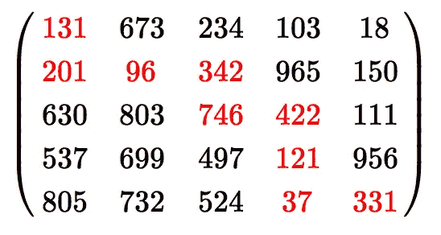
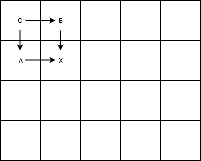
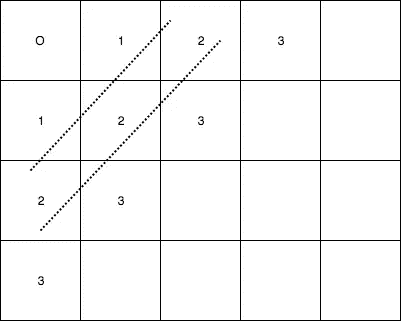

# GPU 优化的动态编程

> 原文：<https://towardsdatascience.com/gpu-optimized-dynamic-programming-8d5ba3d7064f?source=collection_archive---------4----------------------->

## 利用 GPU 计算能力开发动态编程的并行性。

Source: [link](http://www.mandurahmail.com.au/story/4326806/new-campaign-to-keep-drivers-safe-on-rural-roads/)

我们来考虑一下 ***路径和:项目欧拉问题 81 中的两路***([环节](https://projecteuler.net/problem=81))。探索解的动态编程范式和 GPU 优化是我们感兴趣的问题。

Project Euler: 81

您需要通过向右或向下移动矩阵中具有最小单元聚合和的单元，从左上向右下遍历。所以在左边的图中，红色区域展示了满足给定条件的路径。

# 动态程序建模

对于上述任务，我们可以如下对动态程序建模。

Dynamic Approach

我们可以从原点 ***O*** 开始遍历，并向右或向下移动。如果我们移动到 B 的成本是 ***成本(O + B)*** ，移动到 **A** 给出 ***成本(O + A)*** 。我们在拐角处没有选择的余地。考虑移动到 x 点，我们有两个选择。因此，现在正确的值是 ***min(Cost(A + X)，Cost(B + X))*** 。同样，我们可以遍历整个矩阵，更新从其 ***顶部*** 和 ***左侧*** 双亲到特定单元的最小范围。这需要 **O(mn)** 的迭代次数，在我们的例子中我们考虑 ***80 x 80*** 导致我们***6400***次迭代。现在让我们从 GPU 的角度来考虑这个问题。在 GPU 中，所有的单元都是同时计算的。

GPU Computation

如所展示的，尽管在整个矩阵的初始迭代中立刻计算了所有单元，但是只有具有标记 **1** 的单元将被计算为具有正确的值。仅仅一次迭代之后，带有标记 **2** 的单元将不会计算出正确的值，因为此时带有标记 **1** 的单元不具有正确的值。同样，我们必须多次运行程序，以获得单元格中的正确数字。在图中，标有相同数字的单元可以并行计算，这是动态程序中可用的并行度。我们对 GPU 所要做的就是虚线所示的正确的*行刷*次数，但是有多少呢？它显然是行数和列数的总和。因此，时间复杂度是 **O(m+n)** 在我们的例子中是 160。这是一个巨大的收获。然而，由于我们一次又一次地计算整个矩阵，我们需要存储原始矩阵，从而增加了程序的空间复杂度。

# 示例代码

## pom.xml 和 DynamicProgramming.java

用这种方法可以很快地得到非常大的矩阵的结果。迭代次数的上限是行数和列数之和，而不是乘积。我在代码中使用的数据集可以在项目欧拉问题 81 的网页上找到。

链接:[https://projecteuler.net/problem=81](https://projecteuler.net/problem=81)