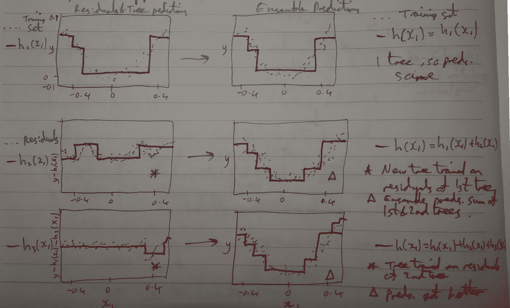
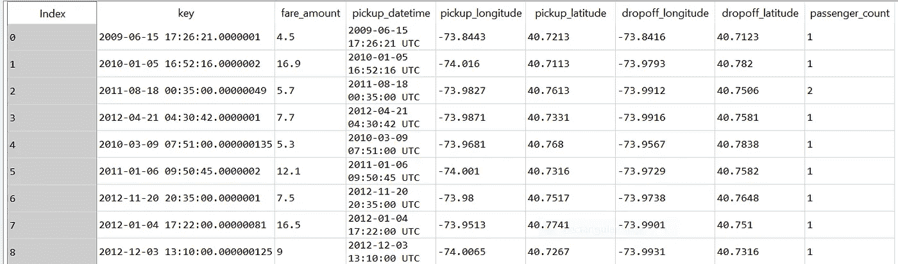
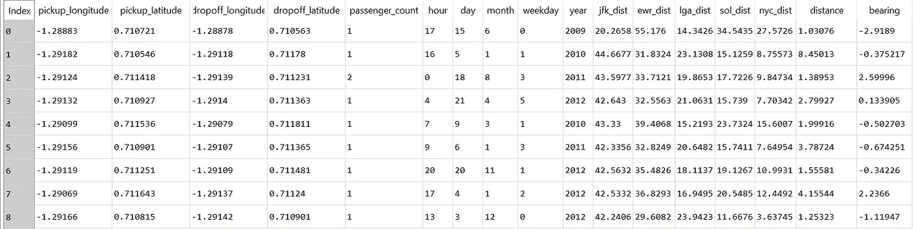

# 使用随机森林的梯度推进在纽约出租车费用预测挑战中的应用

> 原文：<https://towardsdatascience.com/gradient-boosting-using-random-forests-for-application-on-the-new-york-taxi-fare-prediction-f6101c592bf9?source=collection_archive---------15----------------------->


在这篇短文中，我将描述使用随机森林的梯度推进在 Kaggle 上的纽约出租车费用预测挑战中的应用。我还将比较两个最流行的软件包:微软的 [LightGBM](https://github.com/Microsoft/LightGBM) 和 Yandex 的 [CatBoost](https://github.com/catboost/catboost) 。

首先我将简要地谈论随机森林。随机森林基本上是决策树的集合，通常通过 bagging 方法训练，其中最大样本数设置为训练集的大小。在构建树的同时，每次都有一个分裂，并且从完整的 *p* 预测值集中选择随机样本的 *m* 预测值作为分裂候选值。这些 m 个预测值中只有一个被选择。在每次分裂时选择 m 个预测值的新样本。通常情况下，*m*√*p:*每次分割时考虑的预测值数量大约等于预测值总数的根。这具有以下效果:

*   将树彼此去相关
*   交易较高的偏差和较低的方差

随机森林有助于快速了解哪些特征很重要，尤其是在特征选择方面。

**Boosting** 是一种将几个弱学习者组合成一个强学习者的技术。您按顺序训练预测器，每次都试图纠正前一个预测器。不涉及 bagging(减少统计学习方法方差的通用程序)。每棵树都适合原始数据集的修改版本。

在我们谈论梯度增强之前，我们必须了解一下 Adaboost。自适应增强关注前一个欠适应的训练实例。增加错误分类的训练实例的相对权重，然后使用更新的权重训练第二分类器，等等。

类似于梯度下降，但不是改变单个预测参数来最小化成本函数，Adaboost 将预测器添加到集成中，逐渐使其更好。一旦训练了所有预测器，集成就像装袋一样进行预测，只是预测器具有不同的权重。然而，这种技术不能并行化，并且与装袋和粘贴相比不能很好地扩展。

**渐变增强**，和 Adaboost 一样也是一种序列技术。然而，在每次迭代中，新的预测器被拟合到由前一个预测器产生的残差，而不是使用实例权重。

整体算法如下:

1.  使决策树回归器适合训练集
2.  根据 1 产生的残差训练第二个决策树回归器。
3.  根据 2 产生的剩余误差训练第三个回归变量。
4.  通过将所有树的预测相加，使用这三棵树的集合对新实例进行预测。



Schematic of how gradient boosting works.


现在说说代码:这个代码大量借用了 Kaggle 上的 Sylas。评估指标是 RMSE(均方根误差)。首先，您需要导入库，然后从 csv 文件输入数据。我们将使用 LightGBM。注意 **nrows** 参数。你做得越高，你应该得到的分数就越好，但是跑的时间就越长。

```
import numpy as np 
import pandas as pd
from sklearn.model_selection import train_test_split
import lightgbm as lgbm
import gc# Reading Data
train_df =  pd.read_csv('train.csv', nrows = 800000)
#Drop rows with null values
train_df = train_df.dropna(how = 'any', axis = 'rows')def clean_df(df):
    return df[(df.fare_amount > 0)  & (df.fare_amount <= 500) &
          # (df.passenger_count >= 0) & (df.passenger_count <= 8)  &
           ((df.pickup_longitude != 0) & (df.pickup_latitude != 0) & (df.dropoff_longitude != 0) & (df.dropoff_latitude != 0) )]train_df = clean_df(train_df)
```

Train_df 基本上包含纽约出租车的所有信息，包括上下车地点、乘客、日期和时间以及票价本身。



How train_df looks like

现在我们需要定义几个要调用的函数。

```
# To Compute Haversine distance
def sphere_dist(pickup_lat, pickup_lon, dropoff_lat, dropoff_lon):
    """
    Return distance along great radius between pickup and dropoff coordinates.
    """
    #Define earth radius (km)
    R_earth = 6371
    #Convert degrees to radians
    pickup_lat, pickup_lon, dropoff_lat, dropoff_lon = map(np.radians,
                                                             [pickup_lat, pickup_lon, 
                                                              dropoff_lat, dropoff_lon])
    #Compute distances along lat, lon dimensions
    dlat = dropoff_lat - pickup_lat
    dlon = dropoff_lon - pickup_lon

    #Compute haversine distance
    a = np.sin(dlat/2.0)**2 + np.cos(pickup_lat) * np.cos(dropoff_lat) * np.sin(dlon/2.0)**2
    return 2 * R_earth * np.arcsin(np.sqrt(a))def sphere_dist_bear(pickup_lat, pickup_lon, dropoff_lat, dropoff_lon):
    """
    Return distance along great radius between pickup and dropoff coordinates.
    """
    #Define earth radius (km)
    R_earth = 6371
    #Convert degrees to radians
    pickup_lat, pickup_lon, dropoff_lat, dropoff_lon = map(np.radians,
                                                             [pickup_lat, pickup_lon, 
                                                              dropoff_lat, dropoff_lon])
    #Compute distances along lat, lon dimensions
    dlat = dropoff_lat - pickup_lat
    dlon = pickup_lon - dropoff_lon

    #Compute bearing distance
    a = np.arctan2(np.sin(dlon * np.cos(dropoff_lat)),np.cos(pickup_lat) * np.sin(dropoff_lat) - np.sin(pickup_lat) * np.cos(dropoff_lat) * np.cos(dlon))
    return adef radian_conv(degree):
    """
    Return radian.
    """
    return  np.radians(degree)def add_airport_dist(dataset):
    """
    Return minumum distance from pickup or dropoff coordinates to each airport.
    JFK: John F. Kennedy International Airport
    EWR: Newark Liberty International Airport
    LGA: LaGuardia Airport
    SOL: Statue of Liberty 
    NYC: Newyork Central
    """
    jfk_coord = (40.639722, -73.778889)
    ewr_coord = (40.6925, -74.168611)
    lga_coord = (40.77725, -73.872611)
    sol_coord = (40.6892,-74.0445) # Statue of Liberty
    nyc_coord = (40.7141667,-74.0063889) 

    pickup_lat = dataset['pickup_latitude']
    dropoff_lat = dataset['dropoff_latitude']
    pickup_lon = dataset['pickup_longitude']
    dropoff_lon = dataset['dropoff_longitude']

    pickup_jfk = sphere_dist(pickup_lat, pickup_lon, jfk_coord[0], jfk_coord[1]) 
    dropoff_jfk = sphere_dist(jfk_coord[0], jfk_coord[1], dropoff_lat, dropoff_lon) 
    pickup_ewr = sphere_dist(pickup_lat, pickup_lon, ewr_coord[0], ewr_coord[1])
    dropoff_ewr = sphere_dist(ewr_coord[0], ewr_coord[1], dropoff_lat, dropoff_lon) 
    pickup_lga = sphere_dist(pickup_lat, pickup_lon, lga_coord[0], lga_coord[1]) 
    dropoff_lga = sphere_dist(lga_coord[0], lga_coord[1], dropoff_lat, dropoff_lon)
    pickup_sol = sphere_dist(pickup_lat, pickup_lon, sol_coord[0], sol_coord[1]) 
    dropoff_sol = sphere_dist(sol_coord[0], sol_coord[1], dropoff_lat, dropoff_lon)
    pickup_nyc = sphere_dist(pickup_lat, pickup_lon, nyc_coord[0], nyc_coord[1]) 
    dropoff_nyc = sphere_dist(nyc_coord[0], nyc_coord[1], dropoff_lat, dropoff_lon)

    dataset['jfk_dist'] = pickup_jfk + dropoff_jfk
    dataset['ewr_dist'] = pickup_ewr + dropoff_ewr
    dataset['lga_dist'] = pickup_lga + dropoff_lga
    dataset['sol_dist'] = pickup_sol + dropoff_sol
    dataset['nyc_dist'] = pickup_nyc + dropoff_nyc

    return dataset

def add_datetime_info(dataset):
    #Convert to datetime format
    dataset['pickup_datetime'] = pd.to_datetime(dataset['pickup_datetime'],format="%Y-%m-%d %H:%M:%S UTC")

    dataset['hour'] = dataset.pickup_datetime.dt.hour
    dataset['day'] = dataset.pickup_datetime.dt.day
    dataset['month'] = dataset.pickup_datetime.dt.month
    dataset['weekday'] = dataset.pickup_datetime.dt.weekday
    dataset['year'] = dataset.pickup_datetime.dt.year

    return dataset
```

上面的代码主要计算哈弗线距离，它计算两个纬度经度点之间的距离。我们还希望以合适的日期和时间格式获得到机场的距离以及旅程的持续时间，以便稍后进行处理。

现在让我们修改 train_df，使这些附加属性从上面的函数中计算出来。

```
train_df = add_datetime_info(train_df)
train_df = add_airport_dist(train_df)
train_df['distance'] = sphere_dist(train_df['pickup_latitude'], train_df['pickup_longitude'], 
                                   train_df['dropoff_latitude'] , train_df['dropoff_longitude'])train_df['bearing'] = sphere_dist_bear(train_df['pickup_latitude'], train_df['pickup_longitude'], 
                                   train_df['dropoff_latitude'] , train_df['dropoff_longitude'])                                    
train_df['pickup_latitude'] = radian_conv(train_df['pickup_latitude'])
train_df['pickup_longitude'] = radian_conv(train_df['pickup_longitude'])
train_df['dropoff_latitude'] = radian_conv(train_df['dropoff_latitude'])
train_df['dropoff_longitude'] = radian_conv(train_df['dropoff_longitude'])train_df.drop(columns=['key', 'pickup_datetime'], inplace=True)y = train_df['fare_amount']
train_df = train_df.drop(columns=['fare_amount'])print(train_df.head())x_train,x_test,y_train,y_test = train_test_split(train_df,y,random_state=123,test_size=0.10)
```

Train_df 现在有了这些附加列:



train_df with the additional columns after data processing.

我们可以去掉 train_df，因为我们现在已经将数据分为 x_train 和 x_test 以及 y_train 和 y_test。

```
del train_df
del y
gc.collect()
```

现在的关键部分是设置用于 LightGBM 的参数。我调整的关键参数是 max_bin，learning_rate，num_leaves。另一个重要参数是升压类型。在这里，我尝试了 dart([droppets meet Multiple Additive Regression Trees](https://arxiv.org/abs/1505.01866))，因为它应该有助于实现更高的准确性。

```
params = {
        'boosting_type':'dart',
        'objective': 'regression',
        'nthread': 4,
        'num_leaves': 31,
        'learning_rate': 0.05,
        'max_depth': -1,
        'subsample': 0.8,
        'bagging_fraction' : 1,
        'max_bin' : 5000 ,
        'bagging_freq': 20,
        'colsample_bytree': 0.6,
        'metric': 'rmse',
        'min_split_gain': 0.5,
        'min_child_weight': 1,
        'min_child_samples': 10,
        'scale_pos_weight':1,
        'zero_as_missing': True,
        'seed':0,
        'num_rounds':50000
    }
```

现在我们开始使用 LightGBM，并将这些参数输入模型。我们删除最后不需要的数据帧以节省内存。

```
train_set = lgbm.Dataset(x_train, y_train, silent=False,categorical_feature=['year','month','day','weekday'])
valid_set = lgbm.Dataset(x_test, y_test, silent=False,categorical_feature=['year','month','day','weekday'])
model = lgbm.train(params, train_set = train_set, num_boost_round=10000,early_stopping_rounds=500,verbose_eval=500, valid_sets=valid_set)
del x_train
del y_train
del x_test
del y_test
gc.collect()
```

我们现在可以测试模型并将结果输入到 test_df 数据帧中。

```
test_df =  pd.read_csv('test.csv')
print(test_df.head())
test_df = add_datetime_info(test_df)
test_df = add_airport_dist(test_df)
test_df['distance'] = sphere_dist(test_df['pickup_latitude'], test_df['pickup_longitude'], 
                                   test_df['dropoff_latitude'] , test_df['dropoff_longitude'])test_df['bearing'] = sphere_dist_bear(test_df['pickup_latitude'], test_df['pickup_longitude'], 
                                    test_df['dropoff_latitude'] , test_df['dropoff_longitude'])  
test_df['pickup_latitude'] = radian_conv(test_df['pickup_latitude'])
test_df['pickup_longitude'] = radian_conv(test_df['pickup_longitude'])
test_df['dropoff_latitude'] = radian_conv(test_df['dropoff_latitude'])
test_df['dropoff_longitude'] = radian_conv(test_df['dropoff_longitude'])test_key = test_df['key']
test_df = test_df.drop(columns=['key', 'pickup_datetime'])
```

最后输出模型预测，并输入到 Kaggle 的提交文件中！

```
prediction = model.predict(test_df, num_iteration = model.best_iteration)      
submission = pd.DataFrame({
        "key": test_key,
        "fare_amount": prediction
})submission.to_csv('taxi_fare_submission_800k.csv',index=False)
```

我使用 dart boosting 方法在整个 22m 行中取得的最好成绩是 2.88。我在总共 1488 支队伍中取得了第 79 名。


现在让我们来看看 Yandex 的 Catboost。因为我们已经有了所需格式的数据，所以使用 CatBoost 只需要几行代码。

```
from catboost import Pool, CatBoostRegressortrain_pool = Pool(x_train, y_train, cat_features=[5,6,7,8])
test_pool = Pool(x_test, y_test, cat_features=[5,6,7,8])
model = CatBoostRegressor(iterations=4000, depth=10, learning_rate=1, loss_function='RMSE')
model.fit(train_pool)
preds2 = model.predict(test_df)
print(preds2)submission = pd.DataFrame({
        "key": test_key,
        "fare_amount": prediction
})submission.to_csv('taxi_fare_submission_800k_cat_boost_it4k_depth10.csv',index=False)
```

使用 Catboost，我使用全部 22m 行只处理了 3.13。

为了优化模型的参数，以及正确地比较 LightGBM 和 CatBoost，我们需要进行更多的实验，并很好地了解决策树和随机森林的作用。

看看其他人用类似的方法用 LightGBM 和 CatBooost 实现了什么会很有趣。