# 梯度下降算法及其变体

> 原文：<https://towardsdatascience.com/gradient-descent-algorithm-and-its-variants-10f652806a3?source=collection_archive---------0----------------------->

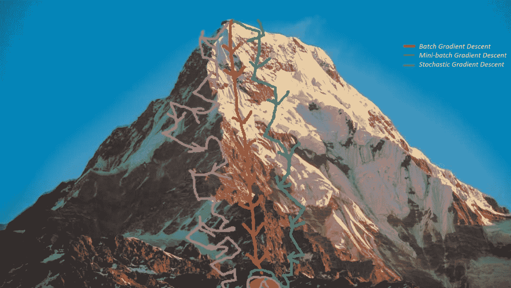

**Figure 1:** Trajectory towards local minimum

**优化**是指最小化/最大化一个由 *x* 参数化的目标函数 *f(x)* 的任务。在机器/深度学习术语中，它的任务是最小化由模型参数 *w* ∈ R^d.优化算法(在最小化的情况下)参数化的成本/损失函数 *J(w)* 具有以下目标之一:

*   找到目标函数的全局最小值。如果目标函数是凸的，即任何局部最小值都是全局最小值，这是可行的。
*   找到目标函数在其邻域内的最低可能值。如果目标函数不像大多数深度学习问题那样是凸的，通常就是这种情况。

有三种优化算法:

*   非迭代优化算法，仅求解一个点。
*   本质上是迭代的优化算法，并且收敛到可接受的解决方案，而不管参数初始化，例如应用于逻辑回归的梯度下降。
*   本质上是迭代的优化算法，应用于一组具有非凸成本函数的问题，如神经网络。因此，参数的初始化对于加快收敛速度和降低错误率起着至关重要的作用。

**梯度下降**是*机器学习*和*深度学习*中最常见的优化算法。它是一种一阶优化算法。这意味着在对参数进行更新时，它只考虑一阶导数。在每次迭代中，我们在目标函数 *J(w)* w.r.t 的梯度的相反方向上更新参数，其中梯度给出最陡上升的方向。我们在每次迭代中达到局部最小值的步长由学习速率α决定。因此，我们沿着斜坡的方向下山，直到我们到达一个局部最小值。

在本文中，我们将介绍梯度下降算法及其变体:*批量梯度下降、小批量梯度下降和随机梯度下降*。

让我们先看看梯度下降是如何对逻辑回归起作用的，然后再详细讨论它的变体。为了简单起见，我们假设 logistic 回归模型只有两个参数:权重 *w* 和偏差 *b* 。

1.将重量 *w* 和偏差 *b* 初始化为任意随机数。

2.为学习率α选择一个值。学习率决定了每次迭代的步长。

*   如果α非常小，则需要很长时间才能收敛，并且计算量很大。
*   如果α很大，它可能无法收敛并超过最小值。

因此，针对不同的α值绘制成本函数，并选择恰好在第一个不收敛的值之前的α值，这样我们就有了一个收敛的非常快速的学习算法(见图 2)。

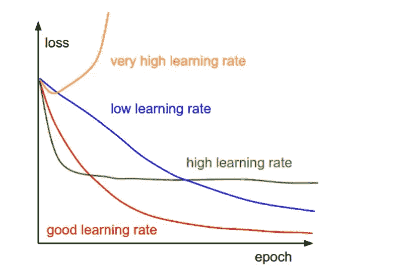

**Figure 2:** Gradient descent with different learning rates. [Source](http://cs231n.github.io/neural-networks-3/)

*   最常用的费率有: *0.001，0.003，0.01，0.03，0.1，0.3* 。

3.如果数据的比例非常不同，请确保对数据进行缩放。如果我们不缩放数据，水平曲线(等高线)会更窄更高，这意味着需要更长的时间来收敛(见图 3)。

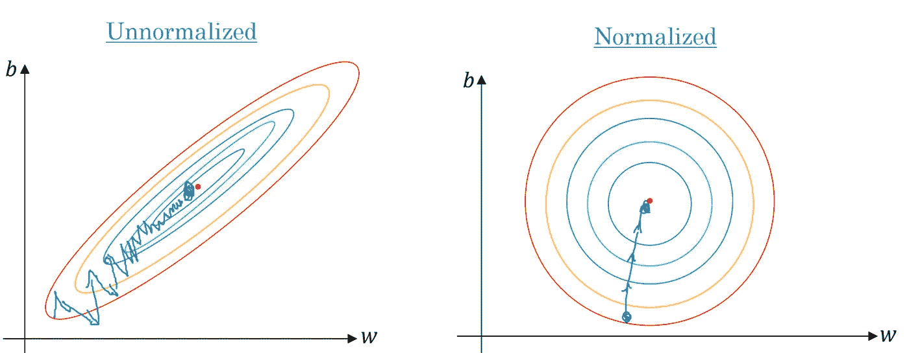

**Figure 3:** Gradient descent: normalized versus unnormalized level curves.

调整数据，使μ = 0，σ = 1。下面是每个示例的缩放公式:

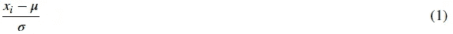

4.在每次迭代中，取成本函数 *J(w)* w.r.t 每个参数(梯度)的偏导数:

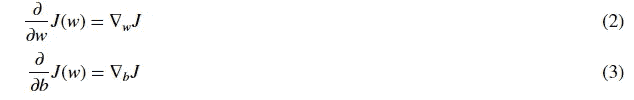

更新方程是:

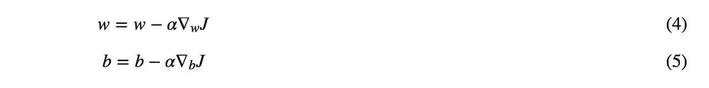

*   为了便于说明，我们假设我们没有偏见。如果 *w 的当前值的斜率为> 0* ，这意味着我们处于最优 *w** 的右边。因此，更新将是负的，并将开始接近最佳值 *w* *。然而，如果它是负的，更新将是正的，并将增加当前值 *w* 以收敛到最优值 *w* *(见图 4):

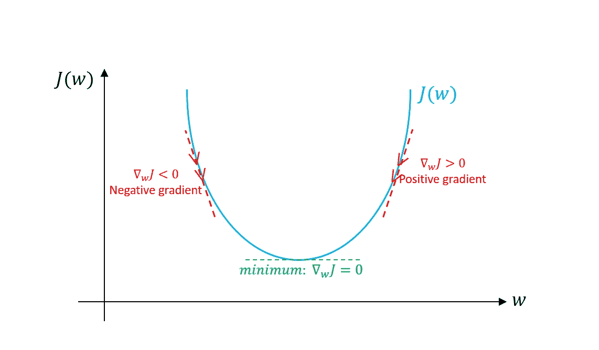

**Figure 4:** Gradient descent. An illustration of how gradient descent algorithm uses the first derivative of the loss function to follow downhill it’s minimum.

*   继续该过程，直到成本函数收敛。也就是说，直到误差曲线变得平坦不变。
*   此外，在每次迭代中，步长将位于产生最大变化的方向，因为它垂直于每步的高程曲线。

现在让我们讨论梯度下降算法的三种变体。它们之间的主要区别是我们在计算每个学习步骤的梯度时使用的数据量。它们之间的权衡是梯度的精度与执行每个参数更新(学习步骤)的时间复杂度。

# 批量梯度下降

批量梯度下降是指在对参数进行更新时，我们对每次迭代的所有示例进行求和。因此，对于每次更新，我们必须总结所有示例:

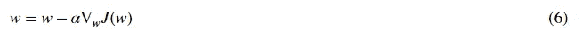

```
for i in range(num_epochs):
    grad = compute_gradient(data, params)
    params = params — learning_rate * grad
```

主要优势:

*   我们可以在训练时使用固定的学习率，而不用担心学习率衰减。
*   它具有朝向最小值的直线轨迹，并且如果损失函数是凸的，它保证在理论上收敛到全局最小值，并且如果损失函数不是凸的，它保证收敛到局部最小值。
*   它对梯度有无偏估计。例子越多，标准误差越低。

主要缺点:

*   即使我们可以使用矢量化实现，浏览所有示例仍然会很慢，尤其是当我们有大型数据集时。
*   学习的每一步都是在看完所有的例子之后进行的，有些例子可能是多余的，对更新没有太大帮助。

# 小批量梯度下降

小批量梯度下降法不是遍历所有样品，而是根据批量大小对少量样品进行汇总。因此，学习发生在每个小批量的 *b* 示例上:

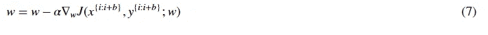

*   打乱训练数据集以避免预先存在的示例顺序。
*   根据批量大小将训练数据集划分为 *b* 个小批量。如果训练集大小不能被批大小整除，则剩余的将是它自己的批。

```
for i in range(num_epochs):
    np.random.shuffle(data)
    for batch in radom_minibatches(data, batch_size=32):
        grad = compute_gradient(batch, params)
        params = params — learning_rate * grad
```

批量大小是我们可以调整的。通常选择 2 的幂，如 32、64、128、256、512 等。其背后的原因是因为一些硬件，如 GPU，在普通批量大小如 2 的幂的情况下，可以实现更好的运行时间。

主要优势:

*   比批处理版本快，因为它经历的例子比批处理(所有例子)少得多。
*   随机选择例子将有助于避免多余的例子或非常相似的例子，对学习没有太大帮助。
*   利用批量大小< size of training set, it adds noise to the learning process that helps improving generalization error.
*   Even though with more examples the estimate would have lower standard error, the return is less than linear compared to the computational burden we incur.

The main disadvantages:

*   It won’t converge. On each iteration, the learning step may go back and forth due to the noise. Therefore, it wanders around the minimum region but never converges.
*   Due to the noise, the learning steps have more oscillations (see figure 4) and requires adding learning-decay to decrease the learning rate as we become closer to the minimum.

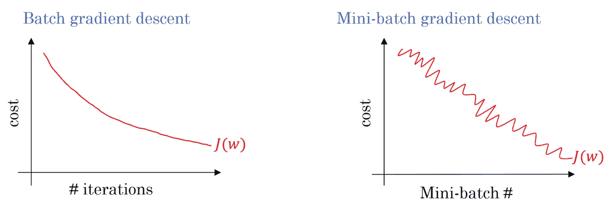

**Figure 5:** Gradient descent: batch versus mini-batch loss function

With large training datasets, we don’t usually need more than 2–10 passes over all training examples (epochs). Note: with batch size *b = m* (训练样本数)，我们得到批量梯度下降。

# 随机梯度下降

随机梯度下降(SGD)不是遍历所有示例，而是对每个示例(x^i,y^i).)执行参数更新因此，学习发生在每一个例子上:

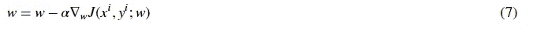

*   打乱训练数据集以避免预先存在的示例顺序。
*   将训练数据集划分为 m 个*示例。*

```
for i in range(num_epochs):
    np.random.shuffle(data)
    for example in data:
        grad = compute_gradient(example, params)
        params = params — learning_rate * grad
```

它分享了小批量版本的大部分优点和缺点。以下是特定于 SGD 的选项:

*   与有助于改善泛化误差的小批量相比，它给学习过程添加了更多的噪声。然而，这将增加运行时间。
*   我们不能在 1 个例子上使用矢量化，速度变得非常慢。此外，由于我们在每个学习步骤中仅使用一个示例，因此差异变得很大。

下图显示了梯度下降的变量及其朝向最小值的方向:

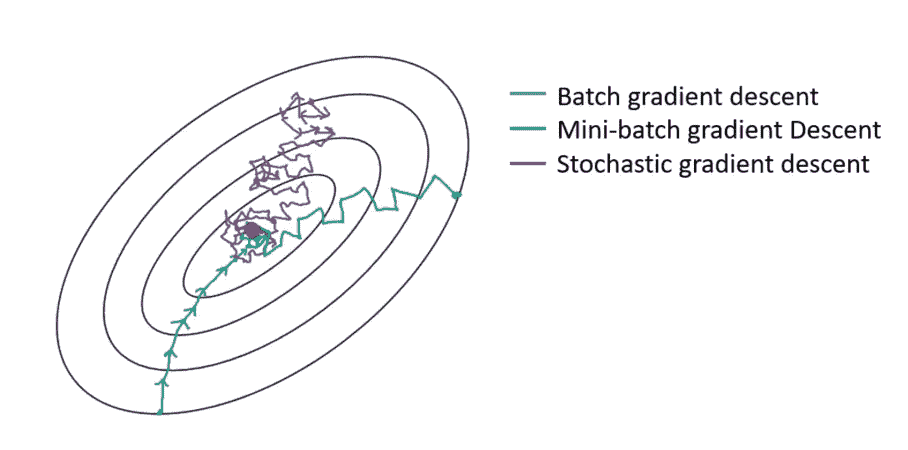

**Figure 6:** Gradient descent variants’ trajectory towards minimum

如上图所示，与小批量相比，SGD 方向噪音很大。

# 挑战

以下是关于梯度下降算法及其变体(主要是批处理和小批处理)的一些挑战:

*   梯度下降是一种一阶优化算法，这意味着它不考虑成本函数的二阶导数。然而，函数的曲率影响每个学习步骤的大小。梯度测量曲线的陡度，而二阶导数测量曲线的曲率。因此，如果:

1.  二阶导数= 0→曲率呈线性。因此，步长=学习率α。
2.  二阶导数> 0 →曲率向上。因此，步长< the learning rate α and may lead to divergence.
3.  Second derivative < 0 → the curvature is going downward. Therefore, the step size >即学习速率α。

结果，看起来对梯度有希望的方向可能不是这样，并且可能导致学习过程变慢或者甚至发散。

*   如果 Hessian 矩阵具有较差的条件数，即最大曲率的方向比最小曲率的方向具有更大的曲率。这将导致代价函数在某些方向上非常敏感，而在另一些方向上不敏感。因此，它会使梯度变得更难，因为看起来对梯度有希望的方向可能不会导致成本函数的大变化(见图 7)。

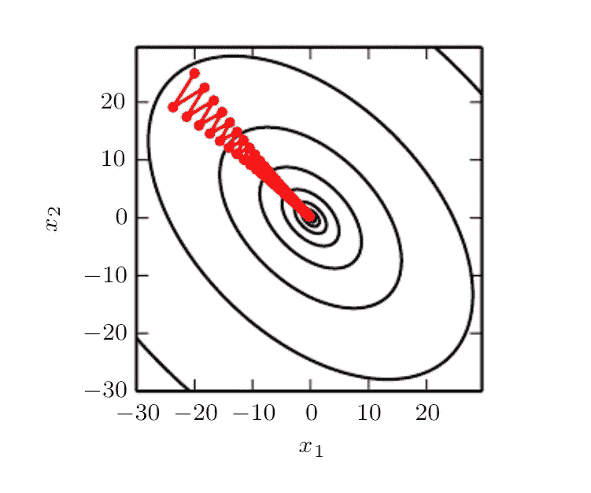

**Figure 7:** Gradient descent fails to exploit the curvature information contained in the Hessian matrix. [Source](http://www.deeplearningbook.org/contents/numerical.html)

*   梯度 gTg 的范数应该随着每个学习步骤缓慢降低，因为曲线变得越来越平坦，并且曲线的陡度将降低。然而，我们看到，由于曲线的曲率，梯度的范数在增加。尽管如此，即使梯度的标准在增加，我们也能够实现非常低的错误率(见图 8)。

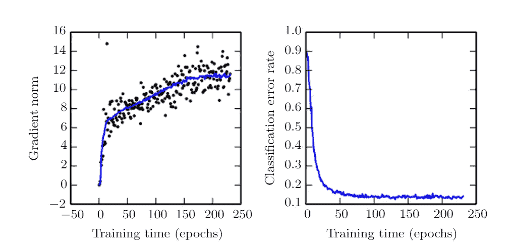

**Figure 8:** Gradient norm. [Source](http://www.deeplearningbook.org/contents/optimization.html)

*   在小维度中，局部极小是常见的；然而，在大尺寸中，鞍点更常见。鞍点是指函数在某些方向上向上弯曲，在其他方向上向下弯曲。换句话说，鞍点从一个方向看起来像最小值，从另一个方向看起来像最大值(见图 9)。当 hessian 矩阵的至少一个特征值为负，而其余特征值为正时，会发生这种情况。

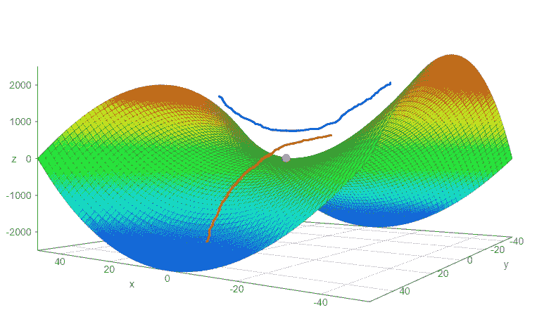

**Figure 9:** Saddle point

*   如前所述，选择一个合适的学习速度是很难的。此外，对于小批量梯度下降，我们必须在训练过程中调整学习速率，以确保它收敛到局部最小值，而不是在它周围徘徊。计算学习率的衰减率也很困难，并且随着不同的数据集而变化。
*   所有参数更新具有相同的学习率；然而，我们可能希望对一些参数进行更大的更新，这些参数的方向导数比其他参数更符合朝向最小值的轨迹。

*原载于 2017 年 12 月 21 日*[*imaddabbura . github . io*](https://imaddabbura.github.io/posts/optimization-algorithms/gradient-descent.html)*。*