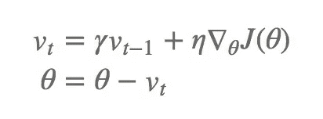
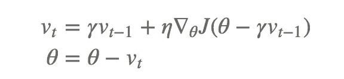
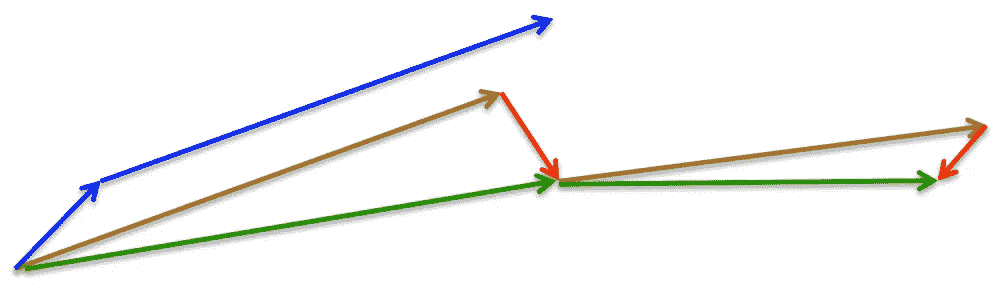
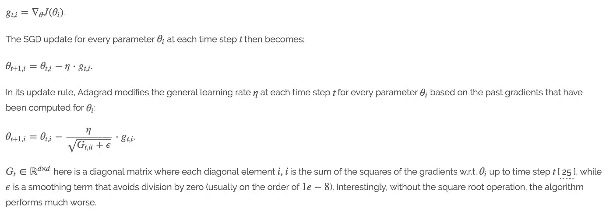

# 梯度下降算法和自适应学习率调整方法

> 原文：<https://towardsdatascience.com/gradient-descent-algorithms-and-adaptive-learning-rate-adjustment-methods-79c701b086be?source=collection_archive---------0----------------------->

这里有一个快速简明的总结供参考。更多详细解释请阅读:[http://ruder.io/optimizing-gradient-descent/](http://ruder.io/optimizing-gradient-descent/)

## 批量梯度下降

普通梯度下降，也称为批量梯度下降，计算整个训练数据集的成本函数相对于参数θ的梯度。

## 随机梯度下降

相反，随机梯度下降(SGD)对每个训练示例 x(i)和标签 y(i)的*执行参数更新*

## 小批量梯度下降

小批量梯度下降最终取两者之长，对 n 个训练样本的每一个小批量进行更新。

# 挑战

然而，普通的小批量梯度下降并不能保证良好的收敛性，但也带来了一些需要解决的挑战:

*   选择一个合适的学习速度可能很困难。学习率太小会导致收敛速度非常慢，而学习率太大会阻碍收敛，并导致损失函数在最小值附近波动，甚至发散。
*   学习率时间表[ [11](http://ruder.io/optimizing-gradient-descent/index.html#fn:11) ]尝试通过例如退火来调整训练期间的学习率，即根据预定义的时间表或当各时期之间的目标变化低于阈值时降低学习率。然而，这些时间表和阈值必须提前定义，因此无法适应数据集的特征[ [10](http://ruder.io/optimizing-gradient-descent/index.html#fn:10) ]。
*   此外，相同的学习率适用于所有参数更新。如果我们的数据很稀疏，并且我们的要素具有非常不同的频率，我们可能不希望将所有要素更新到相同的程度，而是对很少出现的要素执行更大的更新。
*   最小化神经网络常见的高度非凸误差函数的另一个关键挑战是避免陷入其众多次优局部最小值。Dauphin 等人[ [19](http://ruder.io/optimizing-gradient-descent/index.html#fn:19) ]认为，困难实际上不是来自局部最小值，而是来自鞍点，即一个维度向上倾斜而另一个维度向下倾斜的点。这些鞍点通常被相同误差的平台所包围，这使得 SGD 很难逃脱，因为梯度在所有维度上都接近于零。

# 梯度下降优化算法

## 动力

SGD 在穿越峡谷时有困难，峡谷是指表面在一个维度上比另一个维度上弯曲得更陡峭的区域，这在局部最优解附近很常见。在这些场景中，SGD 在峡谷的斜坡上振荡，同时沿着底部朝着局部最优值缓慢前进，如下图所示。这有助于在相关方向上加速 SGD 并抑制振荡

SGD without momentum (left) v/s SGD with momentum

## 内斯特罗夫加速梯度

Momentum 首先计算当前梯度(图 4 中的蓝色小向量)，然后在更新的累积梯度(蓝色大向量)的方向上进行大跳跃，NAG 首先在先前累积梯度(棕色向量)的方向上进行大跳跃，测量梯度，然后进行校正(红色向量)，这导致完整的 NAG 更新(绿色向量)。这种预先更新防止我们走得太快，并提高了响应能力，从而显著提高了 RNNs 在许多任务上的性能

图 4:内斯特罗夫更新(来源: [G .辛顿的讲座 6c](http://www.cs.toronto.edu/~tijmen/csc321/slides/lecture_slides_lec6.pdf)

## 阿达格拉德

上述方法使更新适应我们的误差函数的斜率，并依次加速 SGD。Adagrad 根据每个参数的重要性调整更新，以执行更大或更小的更新。

我们将 g(t，I)设为目标函数 w.r.t .在时间步长 t 对参数θi 的梯度:

Adagrad 的一个主要好处是，它消除了手动调整学习速率的需要。大多数实现使用默认值 0.01，并保持不变。

Adagrad 的主要缺点是它在分母中累积平方梯度:因为每个增加的项都是正的，所以累积和在训练期间保持增长。这进而导致学习速率收缩，并最终变得无穷小，此时算法不再能够获得额外的知识。

## 阿达德尔塔

Adadelta [ [6](http://ruder.io/optimizing-gradient-descent/index.html#fn:6) ]是 Adagrad 的一个扩展，旨在降低其激进的、单调递减的学习速率。不是累积所有过去的平方梯度，而是将累积的过去梯度的窗口限制到某个固定大小的 ww。

## RMSprop

RMSprop 和 Adadelta 都是在同一时间独立开发的，因为需要解决 Adagrad 的学习率急剧下降的问题。RMSprop 将学习率除以梯度平方的指数衰减平均值。

## 圣经》和《古兰经》传统中）亚当（人类第一人的名字

自适应矩估计是当今最流行的方法。

ADAM 计算每个参数的自适应学习率。除了存储像 Adadelta 和 RMSprop 这样的过去平方梯度 vt 的指数衰减平均值之外，Adam 还保持过去梯度 mt 的指数衰减平均值，类似于动量

## 那达慕

Adam 可以被视为 RMSprop 和 momentum 的组合。我们也看到内斯特罗夫加速梯度(NAG)优于普通动量。因此，Nadam(内斯特罗夫加速自适应矩估计)[ [24](http://ruder.io/optimizing-gradient-descent/index.html#fn:24) ]结合了 adam 和 NAG。

演职员表:*塞巴斯蒂安·鲁德(2016)。梯度下降优化算法综述。arXiv 预印本 arXiv:1609.04747。*