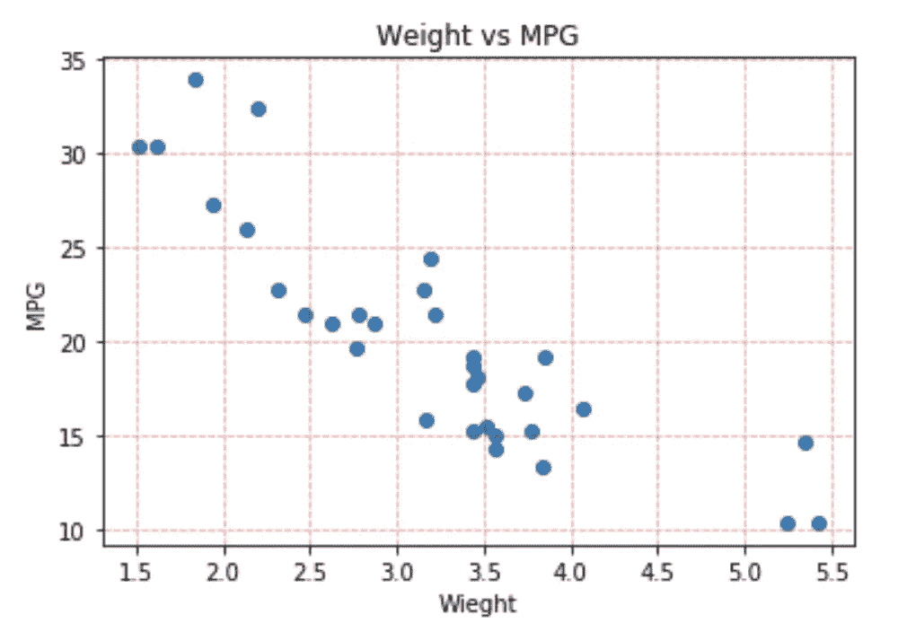
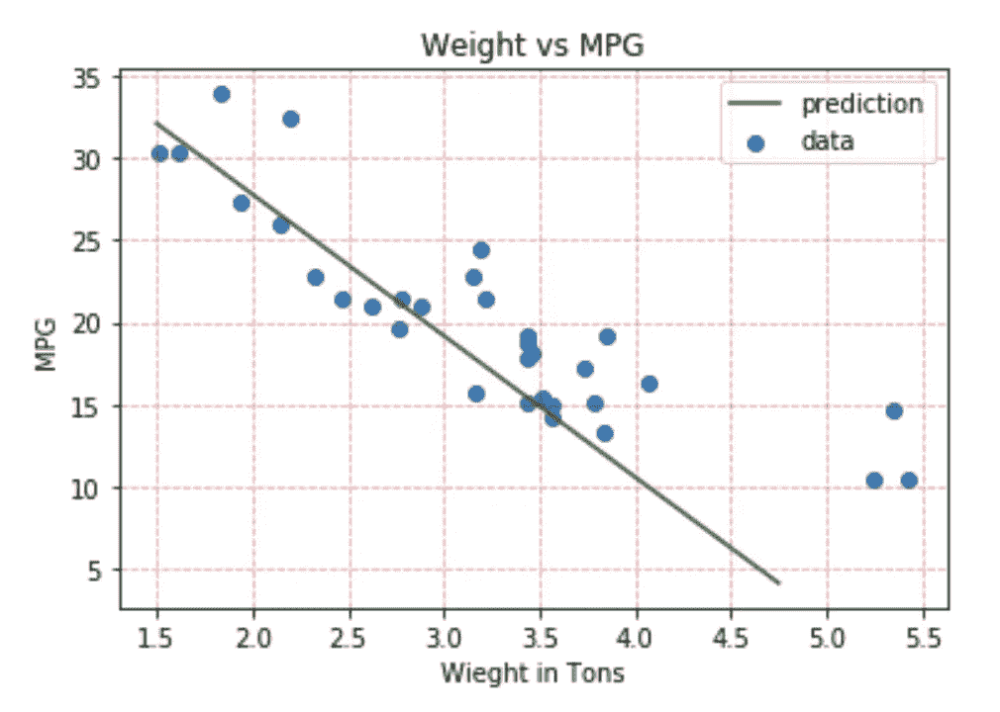
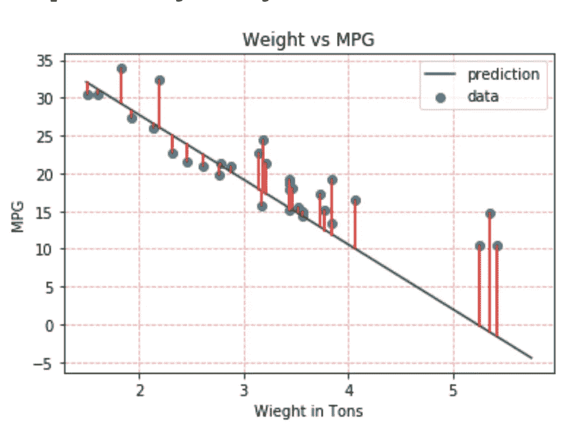
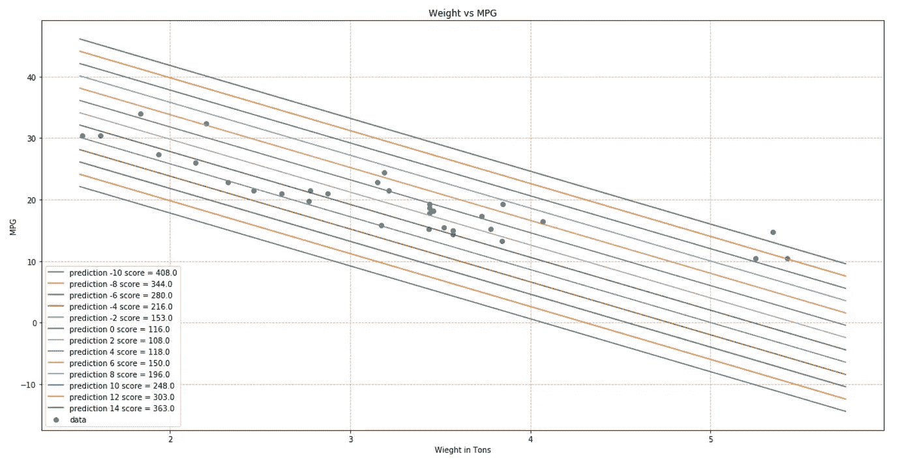
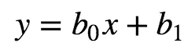
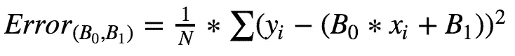
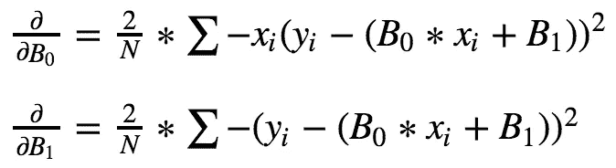
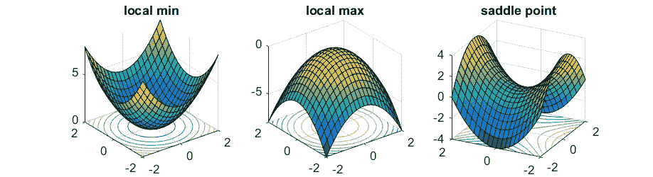

# 可视化梯度下降

> 原文：<https://towardsdatascience.com/gradient-descent-d3a58eb72404?source=collection_archive---------13----------------------->

梯度下降是一种非常强大的算法，是许多现代机器学习算法的基础。我们将涵盖对什么是梯度下降的直观理解，它如何连接到微积分，以及我们如何在数据科学中使用它。

**目标**

*   使用汽车数据集预测 MPG
*   理解术语**残差**的含义以及它如何定义我们的成本函数
*   对误差函数求微分以找到最小值

要求

*   以前有机器学习和微积分的经验

## **入门:下载数据**

对于本教程，我们必须做的第一件事是下载我们在示例中使用的数据集。我发现了一个数据集，其中有汽车的 mpg，我将在教程中使用。[这里是下载数据集的链接，请跟随](https://figshare.com/articles/Motor_Trend_Car_Road_Tests/3122005)。否则，你可以只是跟着视觉。如果您想在本教程的任何一个步骤上得到帮助，请在这里与我预约时间！

下载完成后，我们先来找一个与汽车 MPG 关联度高的变量。正如你在下图中看到的，汽车的**重量**与汽车每加仑行驶的英里数有很高的(负)相关性。

Weight is in tons

看着这幅图，你可以想象一条线，它能很好地表现数据。让我们在没有机器帮助的情况下做几次尝试来想出一条线。

对我来说，它看起来像是有一个截距与 **y 轴**大约 45 英里/加仑。同样，看起来它与 x 轴**在 5°左右相交。利用这一点，我可以用[这个工具画出一条线来表示这些数据。](http://www.webmath.com/equline1.html)**

这又给了我一个方程式 **y = -34/5 * x + 45 ||** 让我们画出这个图，看看它是什么样子:

正如你所看到的，我们的线条很好地表现了数据，但它并不完美…因此，让我们尝试找出一种方法来衡量它与数据的吻合程度…

我们将定义一个叫做残差的东西，它是从我们的直线到我们的点的距离。在这种情况下，我们可以想象，我们想要最小化从每个点到我们的线的距离，然后最后，我们想要选择总体上最接近所有点的线。

Residuals in Red

这里我们可以看到残差是每个点到预测线的距离。我们可以对所有残差的绝对值求和，然后用这个来看看我们的模型表现如何。在这条线的例子中，代表这条线与数据拟合程度的单一值是 115.75。让我们开始玩我们的线，以更好地了解如何尽量减少这种残留。

首先，我们将保持斜率不变，并改变截距。我们可以想象这是如何改变情节的，图例告诉我们**剩余分数**，这样我们就可以将其与我们的第一行进行比较！

在此图中，您可以看到，只要改变截距，我们的剩余分数就会根据直线的拟合程度而增加或减少！我们可以仔细看看，实际上画出每条线的残差，开始了解最大值或最小值出现在哪里。事实上，我们将把每条线的残差称为**损失函数。**想通了这一点，我所说的开始变得有意义了。

您可以在这里看到，根据我们改变 y 轴截距的程度，我们会得到不同的残值。**而且损失函数有最小值。**这意味着我们可以用数值方法找到函数的最小值，这个最小值就是最佳拟合线。

> 最佳拟合线是最小化所有参数的残差的线

让我们回到之前的等式。它的形式是 **y = m *x + b** 或者如果你在做线性回归，它会是下面的形式:

我们一直在看，当β_ 1 系数改变时会发生什么。在另一个世界里，我们可以看到β_ 0 是如何改变残差的。在这种情况下，我们会查看改变斜率的残差，并将其最小化。

在一个不同的例子中，你可以假设我们可以从许多不同的变量预测 MPG。然后，可以对这些变量中的每一个进行调整，以最小化残差，从而为所有参数创建最准确的预测。不过，要做到这一点，我们需要非常清楚地定义一个*残差*函数，以便我们知道我们在测量什么。在我们的二维例子中，这看起来像下面这样(但是记住我们总是可以推广到一个更高维的空间)

既然我们已经清楚地定义了误差函数，我们可以对β_ 0 和β_ 1 进行微分。这将允许我们建立我们的最小化问题，然后利用微积分找到最小残差。

我们现在可以从任意的 B_0 和 B_1 开始，每次把它插入到我们的部分函数中，然后根据我们的部分函数选择一个新的猜测。

每次我们都会根据偏方程是正还是负来选择一个新的猜测。这个跳跃的大小被称为**学习率**。

这是优化许多机器学习技术的基础，并且表现非常好。为了实现，我会使用一个内置的库，但理解底层的数学总是一个加分。

本教程只是触及了这个主题的表面，但是为了更深入一点，这里有一些我们没有真正谈论过的主题:

凸性——在我们的线性回归问题中，只有一个最小值。我们的误差面是[凸](http://en.wikipedia.org/wiki/Convex_function)。不管我们从哪里开始，我们最终都会达到绝对最小值。一般来说，情况不必如此。梯度搜索可能会陷入局部极小值。有几种方法可以减轻这种情况(例如，[随机梯度搜索](http://en.wikipedia.org/wiki/Stochastic_gradient_descent))。

**收敛** —我们没有讨论如何确定搜索何时找到解。这通常是通过寻找迭代间误差的微小变化来实现的(例如，梯度接近零的地方)。

