# 梯度下降——去神秘化

> 原文：<https://towardsdatascience.com/gradient-descent-demystified-bc30b26e432a?source=collection_archive---------2----------------------->

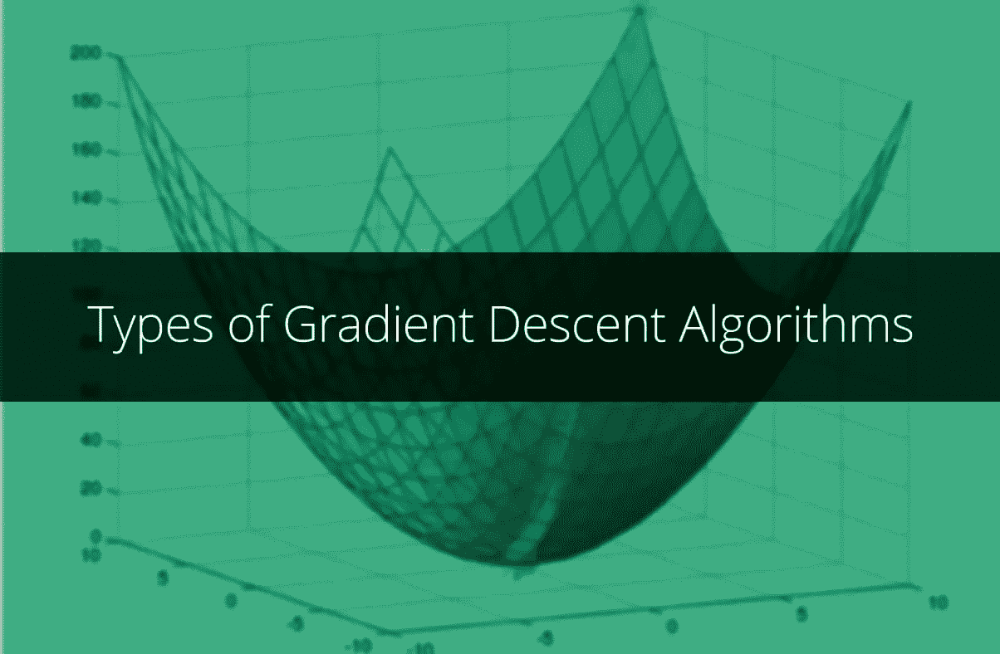

Types of Gradient Descent Algorithms

# 在本文中，我将详细讨论梯度下降，解释除标准梯度下降算法之外的不同优化算法。

为了讨论各种梯度下降算法，我将使用逻辑回归的损失函数作为要优化的“*”函数。*

*对于那些不知道逻辑回归的人来说，*

> *逻辑回归是一种统计技术，将输入变量(自变量或回归变量)作为连续变量，将输出变量(因变量或回归变量)作为二元变量。就效果而言，输入变量的单位变化会使输出变量的几率乘以一个常数因子。*

*逻辑回归作为一种分类技术被广泛使用。让我们考虑下面的回归方程，其中响应变量 *y* 是具有两类的分类变量。*

*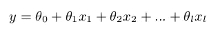*

*Logistic Regression Equation*

*为了对对象进行分类，我们将获得对象属于类别“1”的概率。为了预测概率，我们将使用线性模型和逻辑函数的输出:*

*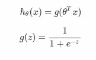*

*Finding probability of an example belonging to a class*

*梯度下降的目的是找出优化给定函数的最佳参数。在逻辑回归算法中，通过最小化以下损失函数找到最佳参数 *θ* :*

*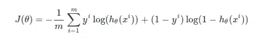*

*Loss function of Logistic Regression (m: number of training examples)*

*最小化上述函数的最基本和广泛使用的优化技术是 ***梯度下降。*** 它是一种求函数最小值的迭代优化算法。为了使用梯度下降找到局部最小值，采取与函数在当前点的梯度的负值成比例的步骤。如果取正方向，算法找到局部最大值，这个过程称为 ***梯度上升。****

*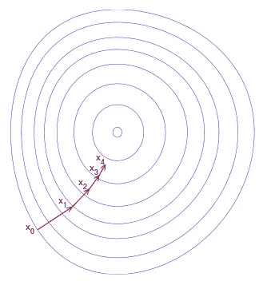*

*Illustration of each iteration of Gradient Descent [Source: Wikipedia]*

> *梯度下降是基于这样的观察:如果多变量函数 *F* 在点 *x* 的邻域中被定义并且是可微分的，那么如果从点 *x* 沿着点 *x* 处的 *F* 的负梯度方向前进，函数 *F* 下降最快。*

*对于上面定义的损失函数 *J* ，点 *j* 处的梯度定义为:*

*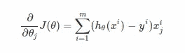*

*Gradient at a point — ΔJ*

*上述等式的推导如下所示，[Credits: [Avitus](https://math.stackexchange.com/users/80800/avitus)*

*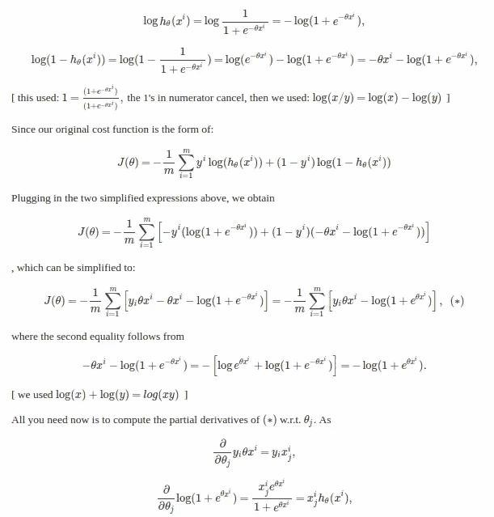*

*Derivation of Gradient at a point*

# *标准梯度下降算法*

*标准梯度下降算法定义如下，其中 *η* 是学习率。*

*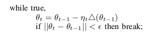*

*Gradient Descent Algorithm*

*在最后一次迭代之后，上述算法给出了函数 *J* 最小的 *θ* 的最佳值。该算法的缺点在于，在每次迭代中，必须根据 *m* 个训练示例来计算 *m* 个梯度。如果训练集非常大，上述算法将是内存低效的，并且如果训练集不适合内存，可能会崩溃。在这种情况下，随机梯度下降算法会很有帮助。*

# ***随机梯度下降***

*与计算真实梯度的传统算法不同，在随机梯度下降算法的迭代中，梯度是针对单个随机选择的训练样本计算的。该算法定义如下。*

*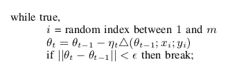*

*Stochastic Gradient Descent Algorithm*

*在每次迭代中，在 *1* 和 *m(训练样本数)*之间选择一个随机索引，并且只针对所选索引处的训练样本计算梯度。可以对训练集进行多次遍历，直到算法收敛。如果做到了这一点，就可以在每次传递时打乱数据以防止循环。*

*当然，这种方法有其优点和局限性。*

1.  *有噪声的更新导致波动(有噪声的近似)。*
2.  *每一步只需要一个例子。*
3.  *可用于在线设置。*
4.  *学习率 *η* 要慎重选择。*

*在计算批次梯度和单个示例的梯度之间的折衷是在每个步骤针对多个训练示例(称为“小批次”)计算梯度。*

# ***小批量梯度下降***

*在小批量梯度下降中，在每次迭代中，在 *1* 和 *m* 之间选择 *z* 个随机指数，并在这些随机指数下对训练样本计算梯度。该算法定义如下。*

**

*Mini Batch Gradient Descent Algorithm*

*这比所描述的随机梯度下降法的性能要好得多，因为代码可以利用矢量化库，而不是单独计算每一步。它还可以导致更平滑的收敛，因为在每一步计算的梯度是在更多训练样本上平均的。*

# *动量梯度下降*

*在这里，我将讨论随机梯度下降算法的一个简单补充，称为动量，它通常比随机梯度下降算法工作得更好更快。动量或带动量的随机梯度下降是一种有助于在正确方向上加速梯度向量的方法(如下所示)，从而导致更快的收敛。这是最流行的优化算法之一，许多最先进的模型都是用它来训练的。在深入数学之前，让我们探索动量梯度下降算法背后的思想*

*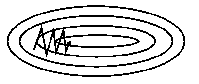*

*SGD without momentum (Source: [Genevieve B. Orr](https://www.willamette.edu/~gorr/classes/cs449/momrate.html))*

**

*SGD with momentum (Source: [Genevieve B. Orr](https://www.willamette.edu/~gorr/classes/cs449/momrate.html))*

*指数加权平均值处理的是数字序列。假设，我们有一些有噪声的序列。对于这个例子，我绘制了余弦函数，并添加了一些高斯噪声。看起来是这样的:*

*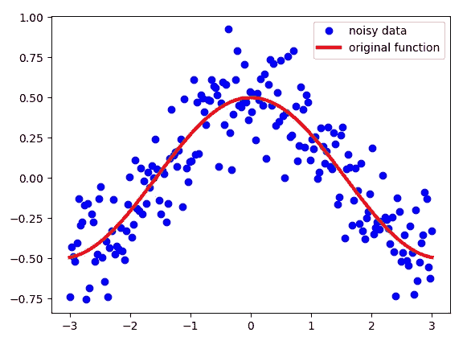*

*Credits: [Vitaly Bushaev](https://towardsdatascience.com/@bushaev?source=user_popover)*

*请注意，尽管这些点看起来非常接近，但它们都不共享 *x* 坐标。对于每个点来说，这是一个唯一的数字。这个数字定义了序列中每个点的索引。*

*我们想对这些数据做的是，不是使用它，而是想要某种“移动”平均值，这将对数据进行“去噪”，并使其更接近原始函数。指数加权平均值可以给我们一个看起来像这样的图片:*

*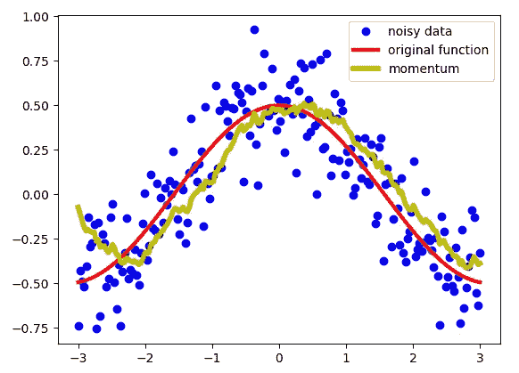*

*Credits: [Vitaly Bushaev](https://towardsdatascience.com/@bushaev?source=user_popover)*

*如你所见，这是一个非常好的结果。我们得到的不是有很多噪音的数据，而是更平滑的线，比我们得到的数据更接近原始函数。指数加权平均值用下面的等式定义了新的序列 V:*

*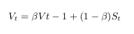*

*序列 V 就是上面标为黄色的那个。 *β* 是另一个超参数，取值从 0 到 1。我用的是 *beta* = 0.9 以上。这是一个很好的值，最常用于带动量的 SGD。直观上，你可以把 *β* 想成如下。我们对序列的最后 *1 / (1- β)* 个点进行近似平均。让我们看看 *β* 的选择如何影响我们的新序列 v。*

*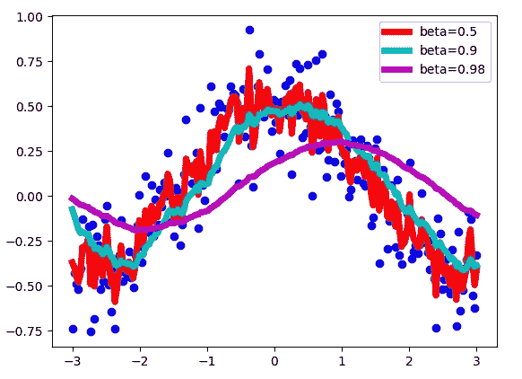*

*如您所见，β值越小，新序列的波动越大，因为我们对更小数量的样本求平均值，因此更接近噪声数据。β值越大，如β *=0.98* ，我们得到的曲线越平滑，但它稍微向右偏移了一点，因为我们对大量示例进行了平均(β *=0.98* 时约为 50)。β *= 0.9* 在这两个极端之间提供了良好的平衡。*

*动量梯度下降算法定义如下。*

*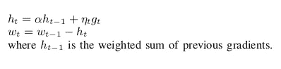*

*Momentum gradient descent algorithm*

# *内斯特罗夫动量梯度下降算法*

***内斯特罗夫动量**是动量更新的一个略有不同的版本，最近越来越受欢迎。在这个版本中，我们首先看当前动量指向的点，并从该点计算梯度。当你看这幅画时，它变得清晰多了。*

*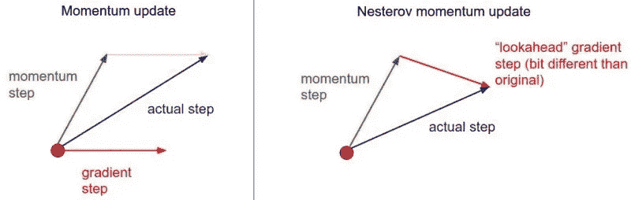*

*内斯特罗夫动量算法定义如下。*

*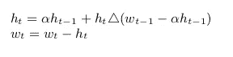*

*Nesterov momentum algorithm formulas*

# *结论*

*我希望这篇文章能帮助你学习不同类型的关于逻辑回归的梯度下降算法。动量梯度下降实际上是深度学习中最流行的优化算法之一，比更高级的算法使用得更频繁。*

*我将发表另一篇文章描述先进的梯度下降算法，如 Ada Grad，RMS Prop，Adam 梯度下降等。*

*请在下面的评论中发表你对这篇文章的看法。*

# *参考*

1.  *Coursera 上的高级机器学习课程*
2.  *蒸馏，[为什么动量真的起作用](https://distill.pub/2017/momentum/)*
3.  *[走向数据科学](/stochastic-gradient-descent-with-momentum-a84097641a5d)*

**

*Photo by [Toa Heftiba](https://unsplash.com/photos/D_mFA0GZuAs?utm_source=unsplash&utm_medium=referral&utm_content=creditCopyText) on [Unsplash](https://unsplash.com/search/photos/skiing?utm_source=unsplash&utm_medium=referral&utm_content=creditCopyText)*