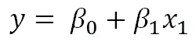
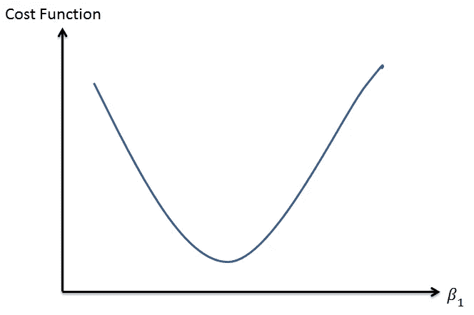

# 梯度下降:简单解释？

> 原文：<https://towardsdatascience.com/gradient-descent-simply-explained-1d2baa65c757?source=collection_archive---------2----------------------->

This is how the 2D cost function can look when plotted with two 2 independent variables.

我经常被问到这两个问题，那就是“你能解释一下梯度下降吗？”以及“梯度下降在机器学习中是如何体现的？”。

通过我多年的训练，我想我会在这篇博文中分享什么是梯度下降，以及为什么它是机器学习的“基本成分”。

现在我在这里做一个非常重要的假设，那就是读者理解微积分，尤其是 2 阶的微分。

**成本函数**

对于那些正在学习或已经学习机器学习的人来说，你知道每个机器学习模型都有一个成本函数。*简单来说，这是一种确定机器学习模型在给定每个参数的不同值的情况下表现如何的方法。*

例如，线性回归模型，参数将是两个系数，β1 和β2。

Linear Regression Model

成本函数将是最小二乘法的总和。

由于成本函数是参数β1 和β2 的函数，我们可以用每个β值绘制成本函数。(即给定每个系数的值，我们可以参考成本函数来了解机器学习模型的表现有多好。)

鉴于有许多参数，你可以想象一旦成本函数确定， ***一个多维平面的轮廓被布置出来。*** (类似于三维空间中的山区)。

**注:**这就是很多混乱的地方。基本上我见过很多人被横轴弄糊涂了。他们认为横轴实际上是 Xs，或者独立变量，但这不是真的，因为*Xs 将在整个训练阶段*保持不变。请记住，在训练阶段，我们的重点是选择参数的“最佳”值(即系数)。

当我们训练模型时，我们试图找到系数的值(对于线性回归的情况，是β),这将使我们的成本最低。换句话说，对于线性回归的情况，我们正在寻找系数的值，该值将把成本降低到最小值，也就是山区的最低点。

**“梯度”下降**

现在让我们来看看模型的训练阶段。

现在，假设我们将一个代理放入这个多维平面(还记得山区)，起始位置是随机给定的(即，为每个系数随机分配一个值)。这个随机分配的起始位置在机器学习界被称为**“初始化”**，一共是一整个研究领域。

这个代理只能看到一个东西，那就是它所站的点的梯度，也就是给定系数单位变化的成本变化率。梯度的这种直觉是从微积分中的一阶微分得到的。这解释了梯度下降的“梯度”。

**渐变“下降”**

如果你学习了任何关于梯度下降的材料，你会遇到另一个专业术语，叫做学习率。学习率实际上指的是代理人在“山区”旅行时迈出了多大的一步，意味着我们正在采取的参数的变化有多大。所以如果在站立点坡度很陡，你迈出一大步，你会看到成本大幅下降。

或者，如果梯度小(梯度接近于零)，那么即使采取大的步长，假定梯度小，成本的变化也将小。

**把所有的放在一起**

因此，在梯度下降中，在代理所处的每个点，代理只知道梯度(对于每个参数)和要采取的步长。*考虑到梯度和步长，每个参数的当前值将被更新。*使用参数的新值，再次重新计算梯度，并与步长一起计算参数的新值。这样不断重复，直到我们达到收敛(我们将在稍后讨论)。给定许多重复的步骤，代理将慢慢下降到山区的最低点。

现在你可能会问为什么代理将移动到最低点，而不是做一个上升。我将留给读者去发现更多，但让我提供一些研究方向。这与成本函数是凸函数以及参数值如何更新有关。

**收敛**

一旦代理人在许多步骤后意识到成本并没有提高很多，而是停留在非常接近某个特定点(最小值)的位置，从技术上来说，这就是所谓的收敛。最后一步的参数值称为“最佳”参数集(在线性回归模型中，我们有两个 Betas 的“最佳”值)。我们有一个训练有素的模特。

总之，梯度下降是我们计算相关参数的最佳值集的一种方法。

步骤如下:

1-给定梯度，计算参数相对于步长的变化。

2-使用参数的新值，计算新的梯度。

3 —返回步骤 1。

一旦我们达到收敛，这一系列的步骤就会停止。我希望这有助于你理解梯度下降。

所以，让我欢迎你来到梯度下降的世界，如果你足够冒险(我希望你在这篇博客文章之后会这么做)，一定要看看 Sebastian Ruder 的这篇博客文章，它讲述了梯度下降算法的其他变体。

希望这篇博文有用。祝您的数据科学学习之旅愉快，请访问我的[其他博客文章](http://koopingshung.com/blog)和 [LinkedIn 个人资料](https://www.linkedin.com/in/koopingshung/)。

**注:**考虑注册我的[时事通讯](https://koopingshung.substack.com/p/coming-soon)或前往我的[网站](https://koopingshung.com/)获取最新消息。