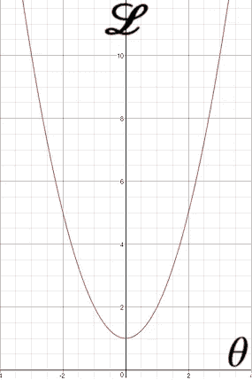
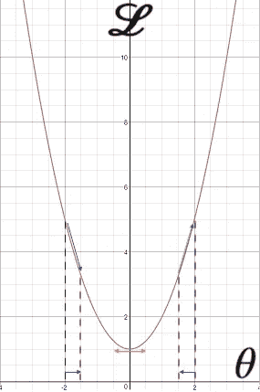
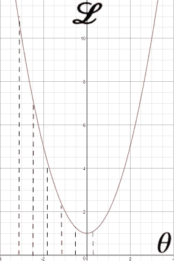
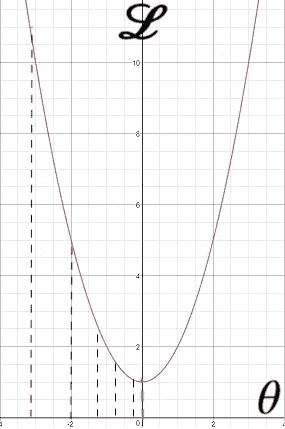
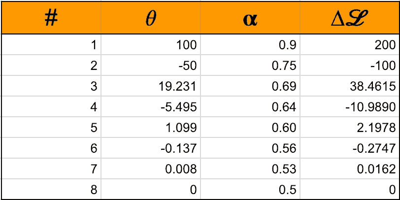

# 梯度下降，最简单的方法

> 原文：<https://towardsdatascience.com/gradient-descent-the-easy-way-5240ca9a08da?source=collection_archive---------6----------------------->

## 理解梯度下降的温和而直观的方法。

梯度下降是所有深度学习的核心。这篇文章用简单的细节解释了这种方法的技术细节。

**更新**:学习和练习强化学习的最好方式是去 http://rl-lab.com

考虑一个系统，它接受一个输入，然后根据给定的参数进行一些计算，然后输出结果。

然后将输出与一些预期结果进行比较，我们希望看到的是输出尽可能接近那些预期结果。

以旧电视机或收音机为例，当有信号时，您可以使用一个按钮来微调设备，以获得最佳的音频/视频，几乎没有或没有噪音。

## 那么如何用数学方法做到这一点呢？

输出和预期结果之间的差异由我们称之为损失函数的函数来描述(𝓛).

为简单起见，我们将假设系统的损失函数是抛物线形式的:

𝓛 = a𝜃 + b
其中𝜃是微调参数，a 和 b 是一些值。

该损失函数如下图所示:

上图给出了基于参数𝜃.的输出误差量
目的是最小化误差，从图中很容易看出最小误差在曲线的底部(点:𝜃 = 0，𝓛 = 1)。

## 怎么求误差最小？

通常，解析解是可能的，但当损失函数变得复杂时，这并不总是容易的，因此我们退回到迭代解。

我们进行的方式相当直观，我们改变𝜃，看看𝓛是否减少。我们一直这样做，直到找到𝓛最小值的𝜃值。

我们可以看到，当𝜃从-2 移动到-1.4 时，𝓛下降，这意味着𝜃正朝着正确的方向移动。另一方面，当𝜃从+1.5 移动到+2 时，𝓛增加，这意味着𝜃在向错误的方向移动，它必须向箭头所示的相反方向移动。

## 现在的问题是如何找到最小化𝓛的𝜃？

显然，我们需要改变𝜃，但改变多少，向哪个方向改变？
正如我们在上面看到的，当我们将𝜃从最低值变化到最高值时(例如:-∞到﹢∞)，我们跟踪了𝓛.的变化如果𝓛继续减少，我们继续增加𝜃，否则，如果𝓛开始增加，我们开始减少𝜃，直到我们找到正确的值。这解决了方向问题，但是𝜃应该变化的量呢？
一个简单的解决办法是取𝓛的一小部分变异，我们称之为𝛂.

将所有这些特征混合在一起，我们得到以下公式:

𝜃𝑛₊₁ = 𝜃𝑛 -𝛂 . ∆𝓛

这个公式清楚地表明，𝜃的下一个值，是以前一个值减去𝓛.变化的一个分数为基础的如果𝓛在减少，那么∆𝓛将是 0，-𝛂也是。∆𝓛 > 0 所以𝜃会增加。如果𝓛在增加，那么∆𝓛将会是 0，-𝛂也是。∆𝓛 < 0 所以𝜃会减少。

## 如何计算∆𝓛？

当然，最直接的方法是∆𝓛 = 𝓛(end) — 𝓛(start)，但这需要一些管理。一个更好的方法是计算导数，这将给出𝓛在每一点的变化。
例如，𝓛 = a𝜃 + b 的导数变成了 d𝓛/d𝜃 = 2a𝜃，因此通过插入𝜃的值，我们得到了 d𝓛.对于某个𝜃.，当 d𝓛为零时，𝓛最小
目标现在变成找到给出 d𝓛 = 0 的𝜃

## 如何选择𝛂？

𝛂通常由经验决定，应该尝试几个值来找到使转换更快的值，但这里仍然有一个问题，即参数的常数(稍后将详细介绍)。

## 例子

假设𝛂= 0.9，𝓛 = 𝜃，ɛ= 0.00001，这个值告诉我们∆𝓛应该变得多小才能被认为是零。
迭代梯度下降公式后(𝜃𝑛₊₁ = 𝜃𝑛 -𝛂。∆𝓛)我们得到下表。

我们可以看到，为了使∆𝓛小于 0.00001，并且能够找到可接受的𝜃.值，需要 77 次迭代它有点长，这是因为我们有一个恒定的𝛂！
原因是，即使接近最小值时，我们也在走同一步，而事实上，我们应该用更小的步来重新调整下降。

示意性地，梯度下降类似于下图(PS。这不是准确的表示，但它给出了一种直觉)

然而，真正需要的是，当我们接近最小值时，我们必须调整我们的步骤，以确定最小值，并避免绕过它。因此，我们需要类似下面这样的东西:

实现这一点的一种方式是随着我们的继续减少𝛂，例如，随着每次迭代 *i* 计算因子 *f = 1 + (i/10)* 然后在梯度下降公式中将𝛂除以 *f* :

𝜃𝑛₊₁ = 𝜃𝑛 -𝛂/ *f* 。∆𝓛

这一修改将产生更好的结果，我们只需 8 次迭代就能得到解决方案，如下表所示:

最后，这里有一个 python 代码，它将计算任何损失函数的梯度下降，只要函数 dF(x)中给定了右导数

## 结论

梯度下降是一种寻找损失函数最小值的便捷工具，在深度学习领域非常有用。