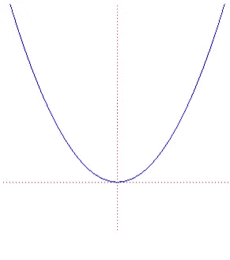
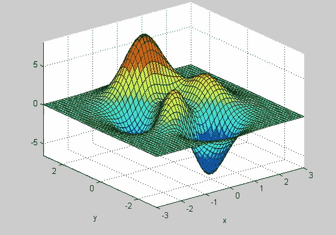
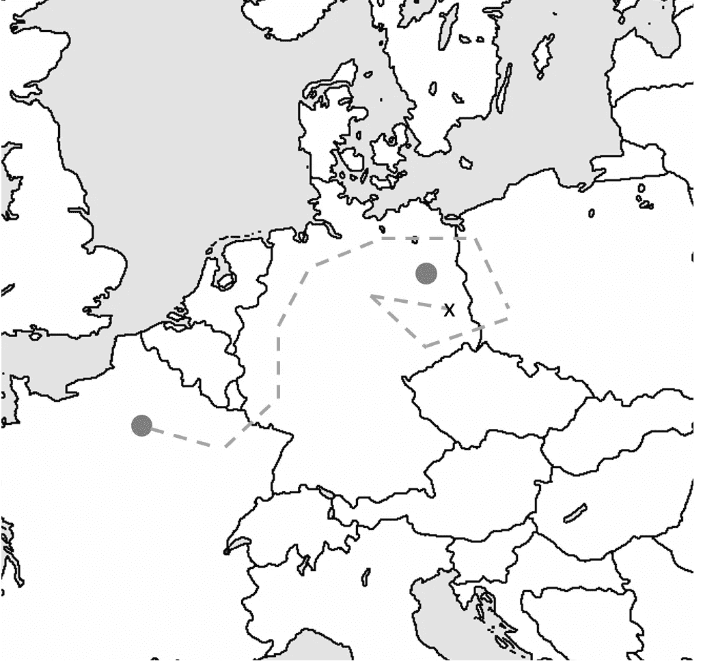
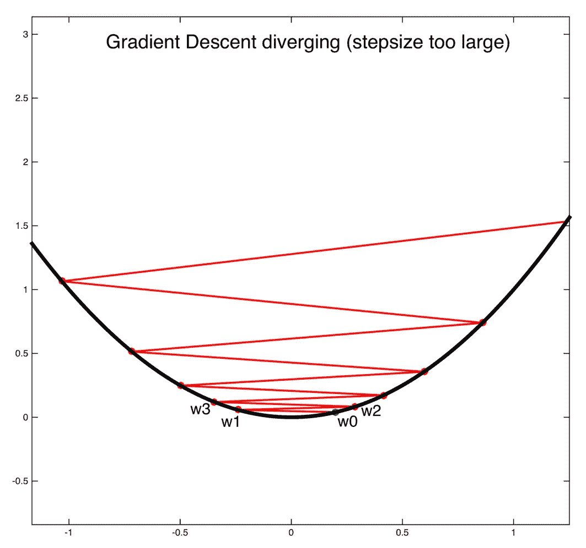
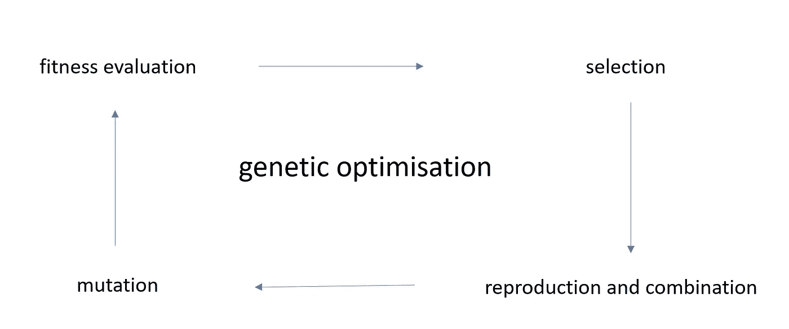
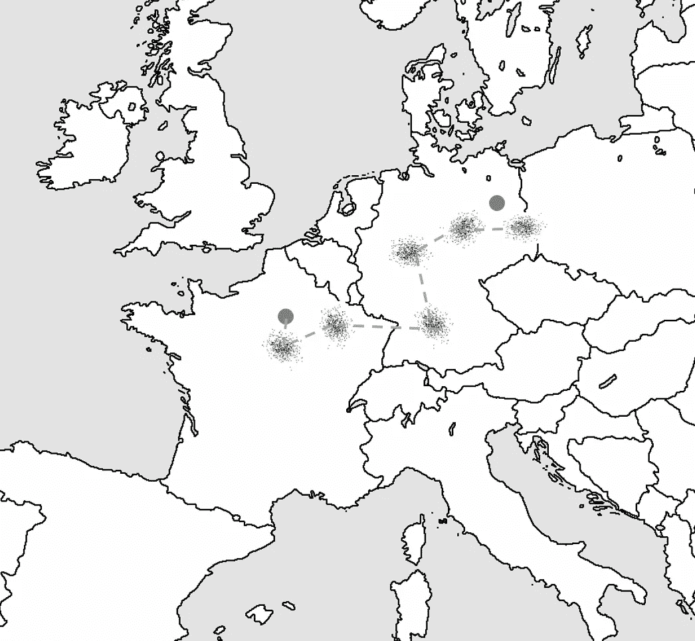

# 梯度下降与神经进化

> 原文：<https://towardsdatascience.com/gradient-descent-vs-neuroevolution-f907dace010f?source=collection_archive---------3----------------------->

2017 年 3 月，OpenAI 发布了一篇关于进化策略的[博文，这是一种已经存在了几十年的优化技术。他们论文的新颖性在于，他们成功地将该技术应用于强化学习(RL)问题背景下的深度神经网络。在此之前，深度学习 RL 模型(通常有数百万个参数)的优化通常是通过反向传播实现的。使用进化策略进行深度神经网络(DNN)优化似乎为深度学习研究人员打开了一个令人兴奋的新工具箱。](https://blog.openai.com/evolution-strategies/)

本周，优步人工智能研究所发布了一套五篇论文，都聚焦于“神经进化”。术语神经进化指的是通过进化算法优化神经网络。研究人员假设遗传算法是一种训练深度神经网络以解决强化学习问题的有效方法，并且在某些领域优于传统的 RL 方法。

Neuroevolution relates to natural evolution as an airplane relates to a bird. Neuroevolution has borrowed some fundamental concepts from nature, similarly as neural networks, planes, etc.

# 概观

那么这意味着什么呢？在不久的将来，所有的 DNN，从有监督的到无监督的以及 RL 应用，都会使用神经进化进行优化吗？神经进化是深度学习的未来吗？神经进化到底是什么？在这篇博文中，我将尝试介绍神经进化，并将其与传统的反向传播算法进行比较。我也将尝试回答上述问题，并把神经进化技术放在更大的 DL 图像中。

首先，我将从框架优化问题开始，这是反向传播和神经进化试图解决的核心问题。我还将尝试明确区分监督学习和强化学习之间的区别。

接下来，我将讨论反向传播，并解释它与神经进化的关系。鉴于 OpenAI 和优步人工智能研究所都刚刚发表了关于这项技术的论文，我有很多课题要解决。幸运的是，由于深度学习神经进化处于研究的早期阶段，神经进化的机制仍然是相当容易理解的。

# 最优化问题

正如在[我之前的博文](/understanding-objective-functions-in-neural-networks-d217cb068138)中所讨论的，机器学习模型本质上是函数逼近器。无论是分类、回归还是强化学习，最终目标几乎都是找到一个将输入数据映射到输出数据的函数。您可以使用训练数据来推断参数和超参数，并使用测试数据来验证近似函数在看不见的数据上是否表现良好。

输入可以是手动定义的特征或原始数据(图像、文本等)。)并且输出是分类中的类或标签、回归中的真实值以及强化学习中的动作。在这篇博文中，我们将把函数逼近器的类型限制在深度学习网络中，但同样的讨论也适用于其他模型。因此，需要推断的参数对应于网络中的权重和偏差。“在训练和测试数据上表现良好”通过客观测量来表达，例如分类的对数损失、回归的均方误差(MSE)和强化学习的回报。

因此，核心问题是找到导致最低损失或最高回报的参数设置。简单！给定需要作为网络参数的函数进行优化的优化目标，即损失或回报，目标因此是以优化目标最小化或最大化的方式来调整参数。

为了使这个形象化，让我们用两个例子。在这两种情况下，我们都制定了优化目标。在抛物线的图像中，x 轴代表模型的单个参数，y 轴代表优化目标(如测试数据)。

在下图中，x 轴和 y 轴代表模型的两个参数，z 轴代表优化目标(如测试数据)。

事实上，由于参数的数量以及它们在深度学习网络中的非线性组合，不可能绘制出“优化表面”。然而，同样的想法也适用，优化表面通常是高维的和复杂的，有许多山丘、摇篮、山谷等。

现在的目标是找到一种优化技术，允许我们在优化面上爬行，找到最小值或最大值。请注意，这些曲面的大小和形状与参数的数量有关，无论我们使用的是连续参数还是离散参数，探索所有选项都是不可行的。现在问题变成了如下:给定优化面中的一个随机起点，找到绝对最小值或最大值。

深度神经网络是很好的函数逼近器(甚至在一定程度上是通用函数逼近器)，但它们也很难优化。在这种情况下，难以优化意味着很难在“优化面”上找到全局最大值或最小值。在接下来的章节中，我将讨论如何使用梯度下降和神经进化来寻找好的解决方案。

# 梯度下降

梯度下降(反向传播)的一般思想已经存在了几十年。由于大量的数据、计算能力和新颖的创新，它已经成为优化深度学习模型参数的主要技术。

梯度下降的大致思路是这样的:
-假设你在法国巴黎，你需要到达德国柏林。在这种情况下，欧洲是优化面，巴黎是随机起点，柏林是绝对最小值或最大值。由于你没有地图，你向随机的陌生人询问去柏林的方向。一些随机的陌生人知道柏林在哪里，但其他人不知道，所以虽然大多数时候，你走在正确的方向，但也有可能你会走错方向。只要陌生人是正确的而不是错误的，它就应该是可行的(例如，随机梯度下降，或带有小批次的梯度下降)。
——你朝陌生人给你指的方向走 5 英里(步长或学习速度)。这个过程一直重复，直到你相信你离德国足够近。结果可能是你刚进入德国，离柏林(当地的 optima)很远。没有办法验证你是否达到了你的最终目标，你只能根据你周围的环境(测试损失或奖励)来估计。

Gradient descent: walking around in Europe without a map.

回到两个可视化的例子，你可以想象在抛物线和更复杂的表面的情况下梯度下降是如何工作的。本质上，使用梯度下降，您是在优化曲面上行走。在抛物线的例子中，这很简单，因为你只需要走下斜坡。如果学习率太高，你可能永远无法达到绝对最小值。

The importance of a proper stepsize (image taken from the Cornell course)

在第二个例子中，情况更加复杂。为了达到绝对最小值，你必须克服几座山和几个谷。几个梯度下降变量，试图模仿物理行为，如一个有动量的球滚下表面(如亚当)，以避免陷入局部最优。

An example path that gradient descent might take. Notice that depending on the hyperparameters you might get stuck in the initial local minima.

我强烈推荐这篇关于梯度下降变体的[博文。它清楚地解释和说明了不同变体之间的差异，以及它们如何解决梯度下降所面临的不同问题。在这个优化问题中经常有几个局部最优解、障碍和不同的路径，不同的梯度下降法通常试图解决一些(或所有这些)问题。如今，亚当乐观主义者似乎是最有影响力的一个。](http://ruder.io/optimizing-gradient-descent/index.html#fn:15)

梯度下降的本质是计算适当的梯度，推动你走向一个好的解决方案。在监督学习中，有可能通过标记数据集相对容易地获得“高质量梯度”。然而，在强化学习中，你只能得到很少的回报，因为随机的初始行为不会带来很高的回报。此外，这种奖励只发生在几次行动之后。虽然分类和回归中的损失是你试图逼近的函数的相对较好的代理，但是强化学习中的回报通常不是你想要学习的行为或函数的非常好的代理。

鉴于强化学习中的梯度并不总是高质量的，进化算法最近被优步和 OpenAI 用于改善学习。

# 神经进化

神经进化、遗传算法、进化策略都围绕着遗传进化的概念。

当你在 DNN 优化的背景下进行遗传优化时，你从模型的初始**群体**开始。典型地，模型被随机初始化，并且基于该初始模型导出几个**后代**。在 DNN 的情况下，你初始化一个模型(就像你平常做的那样)，然后你添加小的随机向量，从一个简单的高斯分布中取样，到参数中。这导致模型的云，它们都驻留在优化表面的某个地方。请注意，这是梯度下降的第一个重要区别。您开始(并继续工作)一群模型，而不是一个单一的(点)模型。

从这个原始种群开始，**基因优化周期**开始。接下来，我将在进化策略的背景下描述遗传优化。进化策略、遗传算法等。关于如何进行遗传优化，所有的方法都略有不同。

Overview of genetic optimisation.

首先，执行**健康评估**。适应性评估对应于检查模型在优化表面中的位置，并确定哪个模型表现最好(例如，最适合)。有些型号的性能会比其他型号好，这仅仅是因为它们的初始化方式。
接下来，基于健康评估执行**选择**。在进化策略中,(伪)子代被简化为一个单一的模型，通过适应度评估进行加权。对 DNN 来说，适应度被定义为损失或回报。本质上，你就这样在优化面上走来走去，并利用后代朝着正确的方向前进。请注意，这是梯度下降的第二个主要区别。你不是计算梯度，而是设置多个“天线”,并朝着看起来最好的方向移动。在某种程度上，这类似于“结构化随机”搜索。选择阶段的最终结果是你有一个单一的模型。
接下来，执行**再现和组合**。具体地，重复与初始阶段相同的过程。基于新选择的‘主要’模型，导出一组新的后代。然后这个过程在这个后代身上继续。
通常，在遗传优化中，**突变**也被执行以改善后代的多样性。突变的一个例子是改变如何产生不同的后代(即不同参数的不同噪声水平)。

es 的优点之一是可以在不同的核上计算群体中不同模型的适合度评估(核外计算)。适应性评估后需要共享的唯一信息是它们的性能(标量值)以及用于生成模型的随机种子值。因此，不再需要与所有机器共享整个网络。OpenAI 和优步都使用了成千上万的机器来做实验。随着云计算的兴起，运行这些实验变得非常可扩展，并且只受计算能力的限制。

下图展示了 es 和梯度下降之间的两个主要区别。使用多个模型来移动，并且不计算梯度，而是基于它们的性能对不同的模型进行平均。正如优步的研究所示，对群体而不是单一模型进行优化会产生更高的稳健性，并显示出与 DNN 优化的贝叶斯方法的相似性。

Neuroevolution: walking around Europe in a group.

我强烈推荐看看优步博客文章中的精彩插图。这些说明了如何使用 ES 来规避梯度下降面临的一些问题(例如，陷入局部最优)。本质上，进化策略执行梯度近似。虽然当真实梯度可用时，使用真实梯度更好，但当真实梯度只有相对较差的近似可用时，以及当需要探索优化表面时，例如在强化学习场景中，该方法确实显示出前景。

# 结论

OpenAI 和优步的研究人员能够表明，进化策略的“梯度近似”导致监督学习场景中令人满意的(但不一定是新的最先进的)解决方案。另一方面，他们能够在强化学习场景中展示其方法的高性能(在某些领域可与最先进的技术相媲美)。

神经进化会是深度学习的未来吗？可能不会，但我相信它对困难的优化问题有很好的前景，比如在强化学习场景中。此外，我相信神经进化和梯度下降方法的结合将导致 RL 性能的显著改善。神经进化的一个缺点是训练这些系统需要大量的计算能力，这可能会限制这些技术的民主化。

鉴于著名的研究小组正在关注这些问题，我仍然很高兴看到未来会发生什么！