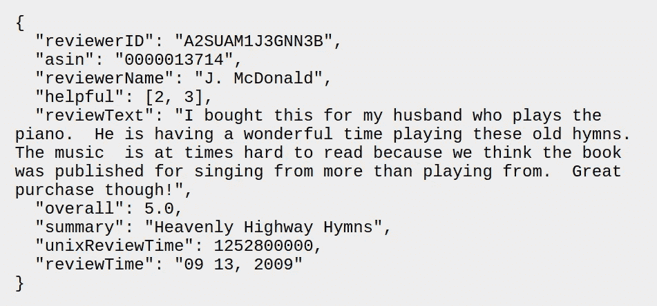
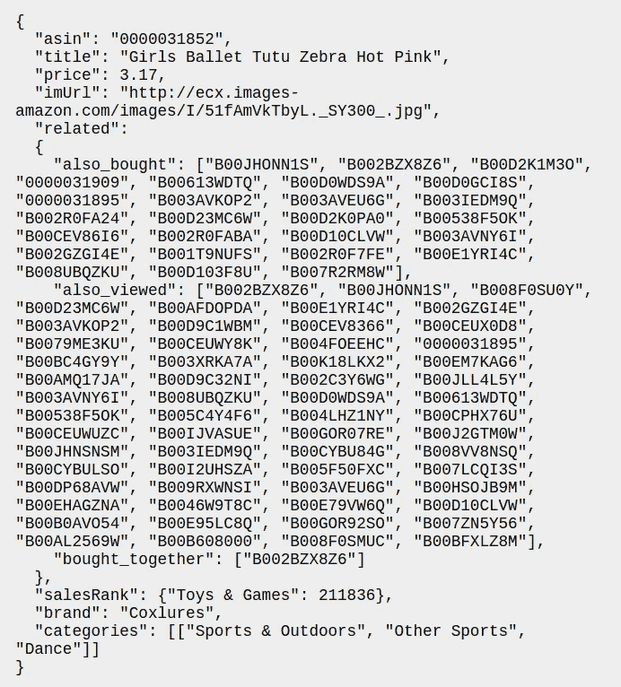
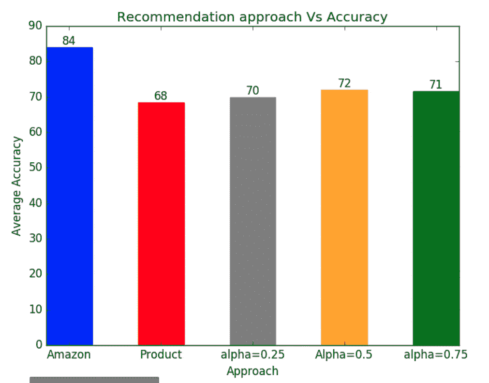
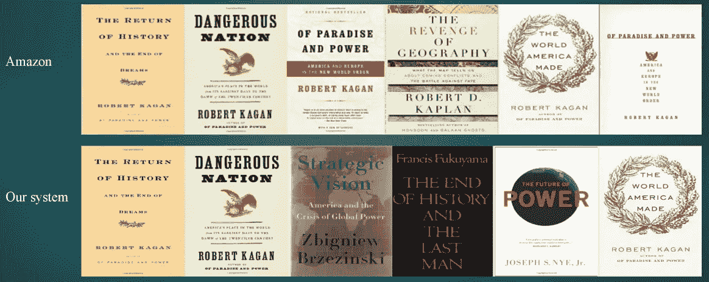

# 基于图形的亚马逊产品推荐引擎

> 原文：<https://towardsdatascience.com/graph-based-recommendation-engine-for-amazon-products-1a373e639263?source=collection_archive---------2----------------------->

在我攻读硕士学位期间，我和我的同事为大数据课程做了一个很酷的项目。我们发现了一个最近发布的包含亚马逊产品和评论的数据集，因此我们决定基于这些产品构建一个推荐引擎。我们最初看到了[协同过滤论文](https://www.cs.umd.edu/~samir/498/Amazon-Recommendations.pdf)，它是亚马逊和网飞等多家大公司推荐引擎的基础。然而，我们决定采用另一种方法，在一个大图中表示产品，并在图的边缘捕捉产品交互。在这篇文章中，我将描述我们使用的数据，我们如何建立图表，我们如何评估我们的系统，以及我们的引擎失败的不同情况，以及如何潜在地改进它。

# 数据

我们在这个项目中使用了两个数据集。你可以从[这里](http://jmcauley.ucsd.edu/data/amazon/links.html)下载。第一个数据集包含从 1996 年 5 月到 2014 年 7 月在亚马逊上销售的产品的客户评论。每条评论都有一段用户体验的文字描述，一个有问题的产品的评级，以及一个有用性投票，它代表了这条评论对其他客户的帮助程度。原始数据有 1.428 亿条评论，但是，我们使用了该数据的子集，这样每个产品至少有 5 条评论。我们的子集数据有 4113 万条评论。

Product review sample

*   reviewerID —审阅者的 ID，例如 A2SUAM1J3GNN3B
*   asin —产品的 ID，例如 0000013714
*   审阅者姓名—审阅者的姓名
*   有帮助性—评价的帮助性等级，例如 2/3
*   审阅文本—审阅的文本
*   总体—产品评级
*   摘要—审核的摘要
*   unixReviewTime —查看的时间(unix 时间)
*   审阅时间—审阅的时间(原始)

第二个数据集是产品元数据。它包括产品描述，价格，销售排名，品牌信息和共同购买链接。共同购买链接的划分如下

*   也查看:客户在查看此产品后查看的其他产品
*   also _ built:客户购买该产品后购买的其他产品
*   buyed _ together:客户与目标产品一起购买(一揽子交易)的其他产品。

Product metadata sample

*   asin —产品的 ID，例如 0000031852
*   标题—产品的名称
*   价格—以美元为单位的价格(爬行时)
*   imUrl —产品图像的 Url
*   相关—相关产品(也购买、也查看、一起购买、查看后购买)
*   销售等级-销售等级信息
*   品牌——品牌名称
*   类别—产品所属类别的列表。

# 构建图表

使用上述数据，我们构建了一个图，其中每个节点是一个产品，每个边是两个产品之间的关系。图中的每个节点都有一个权重，用于计算图的边权重。

## 产品得分

我们使用第一个数据集来计算这个分数。对于一个目标产品，我们得到该产品的所有评论，对于每个评论，我们提取有用性投票和总得分。思维过程如下:总得分越高，产品越好。此外，有用性越高，购买该产品时考虑该评论的人就越多。因此，我们需要建立一个与总体分数和有用性投票成正比的产品分数。两个模型出现了:

*   乘法模型:得分=有用性*总体
*   加法模型:得分= alpha*有用性+ (1-alpha) *总体

我们考虑这两个模型进行评估，看看哪一个表现更好。

## 图形边缘

使用第二个数据集，我们创建产品之间的边。使用共同购买的链接，我们在目标产品和每个共同购买的产品之间构建边，如下所示:

*   对于 buy _ together 产品，权重=1 的边
*   对于同时购买的产品，权重=2 的边
*   对于同时查看的产品，权重=3 的边

在创建初始边权重之后，我们基于每个节点的乘积分数和初始边权重来计算新的权重。产品 P1 和产品 P2 之间边 E 的新得分如下:

E(P1，P2) =初始边权重*(1-产品得分 P1)*(1-产品得分 P2)

这样，具有较高产品分数和较好初始交互的产品在图中更接近。

这样，我们构建了一个包含 150 万个节点和 5200 万条边的图。

# 搜索 K-最近产品

为了找到每个目标产品的推荐，我们搜索 k 个最接近的产品，并将它们返回给用户。

1.  首先将产品 A 的所有直接连接添加到候选列表中
2.  对于候选列表中的每个项目:
    -如果候选列表中没有 K 个项目，则添加它
    -否则，只有到产品 A 的距离小于列表中所有产品的最大距离时，才添加它
3.  对候选人排序
4.  返回前 K 个作为推荐

# 估价

这就是我们最初陷入困境的地方，不知道如何评估我们的模型。这不是我们训练一个模型并在子集数据上测试它的情况。经过研究，我们发现推荐系统通常用行业中的 A/B 测试来测试，其中业务相关的指标(例如总销售额)在用户的统计代表性样本上被跟踪。我们决定做一个迷你版。我们随机选择了 10 种产品，并考虑了这 4 种型号的建议:

*   乘法模型
*   alpha=0.25 的加法模型
*   alpha=0.5 的加法模型
*   alpha=0.75 的加法模型
*   以 Amazon.com 的亚马逊推荐为基准

我们将这些建议提供给 5 名参与者，并要求他们报告每个目标产品中哪些项目是相关的建议。从那里，我们能够计算相关性分数，作为来自全部样本的全部相关推荐的比率。

Relevancy scores

正如所料，亚马逊的推荐是最相关的(否则我们会成为亿万富翁)。对于我们的模型，加法模型比乘法模型表现更好。经过一些调查，我们发现许多评论的有用性得分为 0，因此无论总得分是多少，产品得分都是 0。

至于相加模型，我们发现，与其中一个参数占主导地位的情况相比，对产品总体得分和有用性赋予相同的权重会产生略好的结果。

# 个案研究

在我们用于评估的 10 个产品中，我们有一个案例，我们的系统比亚马逊提供了更好的推荐。目标产品是儿童相关产品，我们的模型给出了 4 个儿童相关产品，而亚马逊给出了 2 个儿童相关产品和 3 部手机。

在另一个案例中，目标产品是迈克尔·杰克逊的音乐专辑。亚马逊推荐了同一位艺术家的其他音乐专辑。我们的系统确实推荐了其他音乐专辑，但它们来自不同的艺术家。

此外，有一次我们的系统没有给出任何建议。这是因为选择的产品与任何其他产品都没有优势，因此搜索无法找到任何可推荐的产品。

# 进一步改进

如果有更多的时间在这个项目上工作，我们有几个想法要进一步实施。其中之一是对评论文本执行 NLP，以从每个评论中提取情感。我们会根据评论的积极或消极程度来打分。这将导致我们计算不同的产品得分函数。我们可以通过使用元数据数据集中给出的产品在其类别中的排名来进一步提高产品得分。

另一种可能性是为每个产品添加一个类别特性。通过介绍类别是如何相似的，我们确保没有产品是没有边连接的，因为这将在相似类别的产品之间创建新的边。

评估方面，我们可以添加更多的参与者和更多的产品，以更好地评估我们产品的相关性。这将通过创建一个为用户提供选择建议的应用程序来简化。

这种方法的优点是只需要构建一次图。之后，只需向其他产品添加节点和边，就可以非常容易地向其中添加产品。此外，搜索算法是在线功能，在返回推荐方面速度很快。

谢谢你。

这篇文章最初发表在我的[博客](https://maviator.github.io/2018/01/04/Recommendation-engine/)