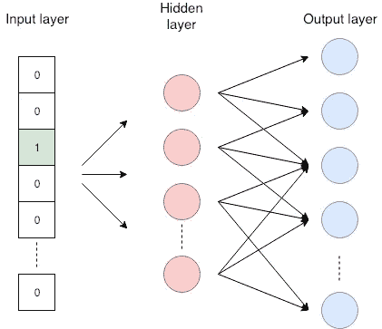
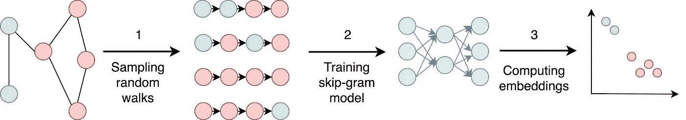
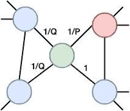
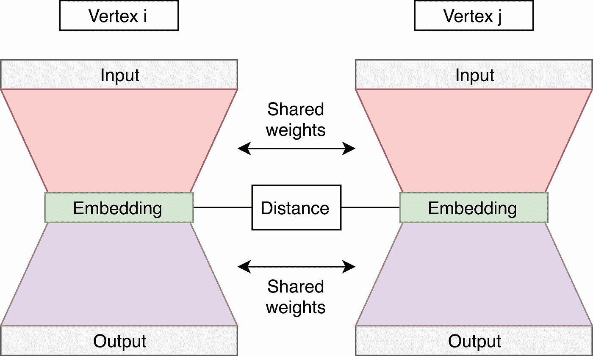
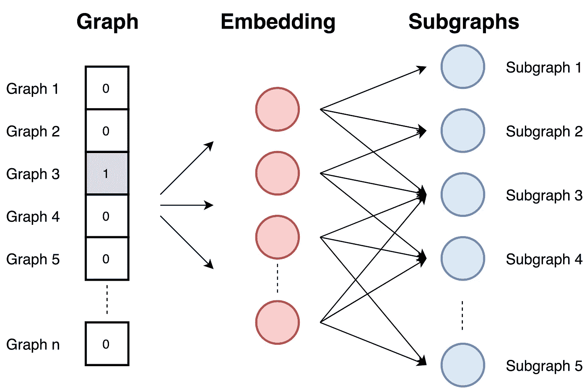

# 图形嵌入——综述

> 原文：<https://towardsdatascience.com/graph-embeddings-the-summary-cc6075aba007?source=collection_archive---------2----------------------->

## 本文介绍了什么是图嵌入，它们的用途，以及最常用的图嵌入方法的比较。

Pixabay — geralt

raphs 通常用于不同的实际应用中。社交网络是人们相互追随的大型图表，生物学家使用蛋白质相互作用的图表，而交流网络本身就是图表。他们在文本挖掘领域使用单词共现图。对在图上执行机器学习的兴趣正在增长。他们试图预测社交媒体中的新友谊，而生物学家则预测蛋白质的功能标签。对图表的数学和统计操作是有限的，并且将机器学习方法直接应用于图表是具有挑战性的。在这种情况下，嵌入似乎是一种合理的解决方案。

## 什么是图嵌入？

图嵌入是属性图到一个向量或一组向量的变换。嵌入应该捕获图的拓扑、顶点到顶点的关系，以及关于图、子图和顶点的其他相关信息。嵌入器编码的属性越多，在以后的任务中可以检索的结果越好。我们可以大致将嵌入分为两组:

*   **顶点嵌入:**我们用它自己的矢量表示对每个顶点(节点)进行编码。当我们想要在顶点级别上执行可视化或预测时，例如 2D 平面中的顶点的可视化，或者基于顶点相似性的新连接的预测，我们将使用这种嵌入。
*   **图嵌入:**这里我们用一个向量来表示整个图。当我们想要在图表水平上进行预测时，以及当我们想要比较或可视化整个图表时，例如化学结构的比较时，使用这些嵌入。

稍后，我们将介绍第一组中的一些常用方法(DeepWalk、node2vec、SDNE ),以及第二组中的 graph2vec 方法。

## 为什么我们使用图嵌入？

图形是一种有意义且易于理解的数据表示形式，但是需要图形嵌入有几个原因:

*   **图上的机器学习是有限的。**图由边和节点组成。那些网络关系只能使用数学、统计学和机器学习的特定子集，而向量空间有更丰富的方法工具集。
*   嵌入是压缩的表示。邻接矩阵描述了图中节点之间的连接。它是一个|V| x |V|矩阵，其中|V|是图中节点的数量。矩阵中的每一列和每一行代表一个节点。矩阵中的非零值表示两个节点相连接。使用邻接矩阵作为大型图的特征空间几乎是不可能的。想象一个有 1M 个节点和 1M×1M 的邻接矩阵的图。嵌入比邻接矩阵更实用，因为它们将节点属性打包在一个维数更小的向量中。
*   **向量运算比图形上的可比运算更简单更快**。

## 挑战

嵌入方法需要满足更多的要求。这里我们描述了嵌入方法面临的诸多挑战中的三个:

*   **我们需要确保嵌入很好地描述了图的属性**。它们需要表示图形拓扑、节点连接和节点邻域。预测或可视化的性能取决于嵌入的质量。
*   网络的大小不应该降低嵌入过程的速度。图通常很大。想象一下拥有数百万人的社交网络。一个好的嵌入方法需要在大型图上是有效的。
*   **一个重要的挑战是决定嵌入维度。**较长的嵌入比排序嵌入保留了更多的信息，但也带来了更高的时间和空间复杂度。用户需要根据需求做出取舍。在文章中，他们通常报告说 128 到 256 之间的嵌入大小对于大多数任务来说是足够的。在方法 Word2vec 中，他们选择了嵌入长度 300。

## Word2vec

在我们介绍嵌入图的方法之前，我将讨论 Word2vec 方法和 skip-gram 神经网络。它们是图形嵌入方法的基础。如果想更好的理解，建议查看[这个](http://mccormickml.com/2016/04/19/word2vec-tutorial-the-skip-gram-model/)优秀教程或者这个[视频](https://www.youtube.com/watch?v=ERibwqs9p38)。

Word2vec 是一种将单词转换成嵌入向量的嵌入方法。相似的词应该有相似的嵌入。Word2vec 使用 skip-gram 网络，这是一种具有一个隐藏层的神经网络。跳跃语法被训练来预测句子中的相邻单词。这个任务被称为假任务，因为它只是在训练阶段使用。网络在输入端接受该单词，并进行优化，使其能够以很高的概率预测句子中的相邻单词。下图显示了输入单词(标有绿色)和预测单词的示例。通过这个任务，作者实现了两个相似的单词具有相似的嵌入，因为具有相似含义的两个单词很可能具有相似的邻近单词。

The word colored with green is given to the network. It is optimized to predict the word in the neighborhood with higher probability. In this example, we consider words that are the most two places away from the selected words.

下图所示的 skip-gram 神经网络具有输入层、一个隐藏层和输出层。网络接受独热编码字。独热编码是长度与单词字典相同的向量，并且除了 1 之外全是 0。第一个是编码单词在字典中出现的位置。隐藏层没有激活功能，其输出呈现单词的嵌入。输出层是预测邻域单词的 softmax 分类器。关于 skip-gram 的更多细节可以在之前提到的教程 I [中找到。](http://mccormickml.com/2016/04/19/word2vec-tutorial-the-skip-gram-model/)

Skip-gram neural network

我将介绍四种图形嵌入方法。其中三个嵌入节点，而一个用一个向量嵌入整个图。他们在三种方法中使用了 Word2vec 的嵌入原理。

## 顶点嵌入方法

我将介绍三种在图中嵌入节点的方法。选择它们是因为它们通常在实践中使用并且通常提供最好的结果。在我们开始之前，我可能会提到节点嵌入的方法可以分为三大类:因式分解方法、随机漫步方法和深度方法。

**深度行走**使用随机行走产生嵌入。随机游走从一个选定的节点开始，然后我们从当前节点移动到随机邻居，移动了定义的步数。

该方法基本上包括三个步骤:

*   *采样:*用随机漫步对一个图进行采样。很少从每个节点进行随机行走。作者表明，从每个节点进行 32 到 64 次随机行走就足够了。他们还表明，好的随机漫步有大约 40 步的长度。
*   *训练 skip-gram:* 随机游走与 word2vec 方法中的句子相当。skip-gram 网络接受随机行走中的一个节点作为独热向量作为输入，并最大化预测邻居节点的概率。它通常被训练来预测大约 20 个邻居节点——左侧 10 个节点和右侧 10 个节点。
*   *计算嵌入:*嵌入是网络的一个隐层的输出。DeepWalk 计算图中每个节点的嵌入。

Phases of DeepWalk approach

深度行走方法随机地执行随机行走，这意味着嵌入不能很好地保持节点的局部邻域。Node2vec 方法解决了这个问题。

**Node2vec** 是 DeepWalk 的修改版，与随机漫步的区别很小。它有参数 P 和 Q。参数 Q 定义随机行走发现图中未发现部分的可能性，而参数 P 定义随机行走返回前一个节点的可能性。参数 P 控制节点周围微观视图的发现。参数 Q 控制更大邻域的发现。它推断社区和复杂的依赖关系。

The figure shows probabilities of a random walk step in Node2vec. We just made a step from the red to the green node. The probability to go back to the red node is 1/P, while the probability to go the node not connected with the previous (red) node 1/Q. The probability to go to the red node’s neighbor is 1.

嵌入的其他步骤与 DeepWalk 方法相同。

**结构化深度网络嵌入(SDNE)** 与前两种方法没有任何共同之处，因为它不执行随机行走。我之所以提到它，是因为它在不同任务上的表现非常稳定。

它被设计成使得嵌入保持一阶和二阶近似。一阶近似是由边链接的节点之间的局部成对相似性。它描述了本地网络结构的特征。如果网络中的两个节点与边相连，则它们是相似的。当一篇论文引用另一篇论文时，意味着它们涉及相似的主题。二阶接近度表示节点邻域结构的相似性。它捕捉全球网络结构。如果两个节点共享许多邻居，它们往往是相似的。

作者提出了一个自动编码器神经网络，它有两个部分—见下图。自动编码器(左和右网络)接受节点邻接向量，并被训练来重建节点邻接。这些自动编码器被称为普通自动编码器，它们学习二阶近似。邻接向量(邻接矩阵中的一行)在表示连接到所选节点的节点的位置上具有正值。

网络中还有一个被监督的部分——左翼和右翼之间的联系。它计算从左侧和右侧嵌入之间的距离，并将其包括在网络的公共损耗中。训练网络，使得左和右自动编码器得到通过输入上的边连接的所有节点对。距离部分的损失有助于保持一阶近似。

网络的总损耗计算为左右自动编码器的损耗与中间部分的损耗之和。

## 图形嵌入方法

最后一种方法嵌入整个图形。它计算一个描述图形的向量。我选择了 graph2vec 方法，因为这是我所知道的最好的图形嵌入方法。

Graph2vec 基于使用跳格网络的 [doc2vec](https://medium.com/scaleabout/a-gentle-introduction-to-doc2vec-db3e8c0cce5e) 方法的思想。它从输入中获得文档的 ID，并被训练以最大化从文档中预测随机单词的概率。

Graph2vec 方法包括三个步骤:

*   **从图中采样并重新标记所有子图。**子图是出现在所选节点周围的一组节点。子图中的节点距离所选边数不超过。
*   **训练跳格模型**。图表类似于文档。因为文档是一组单词，所以图是一组子图。在这个阶段，训练跳格模型。它被训练成最大化预测输入图上存在的子图的概率。输入图作为一个热点向量提供。
*   **计算嵌入**，在输入端提供一个图 ID 作为一个热点向量。嵌入是隐藏层的结果。

由于任务是预测子图，所以具有相似子图和相似结构的图具有相似的嵌入。

## 其他嵌入方法

我提出了四种基于常用文献的方法。由于这个主题目前非常流行，所以有更多的方法可用。在这里，我列出了其他可用的方法:

*   **顶点嵌入方法:** LLE，拉普拉斯特征映射，图分解，GraRep，HOPE，DNGR，GCN，线
*   **图嵌入方法:** Patchy-san、sub2vec(嵌入子图)、WL 核和深度 WL 核

## 参考

[1] C. Manning，R. Socher，*第二讲|词向量表示法:word2vec* (2017)， [*YouTube*](https://www.youtube.com/watch?v=ERibwqs9p38) 。

[2] B. Perozzi，R. Al-Rfou，S. Skiena，DeepWalk:社会表征的在线学习(2014)，[*arXiv:1403.6652*](https://arxiv.org/abs/1403.6652)。

[3]麦考密克。 [Word2Vec 教程—跳格模型](http://mccormickml.com/2016/04/19/word2vec-tutorial-the-skip-gram-model/)(2016)[*http://mccormickml.com*](http://mccormickml.com)*。*

[4] T. Mikolov，K. Chen，G. Corrado，J. Dean，向量空间中词表征的高效估计(2013)，[*arXiv:1301.3781*](http://arxiv.org/abs/1301.3781)。

[5] A .纳拉亚南，m .钱德拉莫汉，r .文卡特桑，l .陈，y .刘，s .贾伊斯瓦尔，graph2vec:学习图的分布式表示(2017)， [*arXiv:1707.05005*](https://arxiv.org/abs/1707.05005)*。*

[6] P. Goyal，E. Ferrara，*图嵌入技术、应用和性能:一项调查(2018)，* [*基于知识的系统*](https://www.sciencedirect.com/science/article/abs/pii/S0950705118301540) *。*

[7] D .王，p .崔，w .朱，结构化深度网络嵌入(2016)， [*第 22 届 ACM SIGKDD 知识发现与数据挖掘国际会议论文集。*](https://dl.acm.org/citation.cfm?id=2939753)

[8] A. Grover，J. Leskovec，node2vec:面向网络的可扩展特征学习(2016)， [*第 22 届 ACM SIGKDD 知识发现与数据挖掘国际会议论文集。*](https://dl.acm.org/citation.cfm?id=2939754)