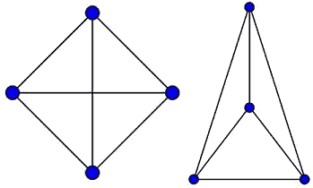
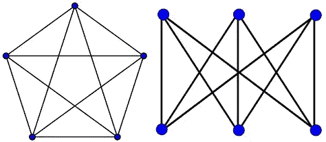
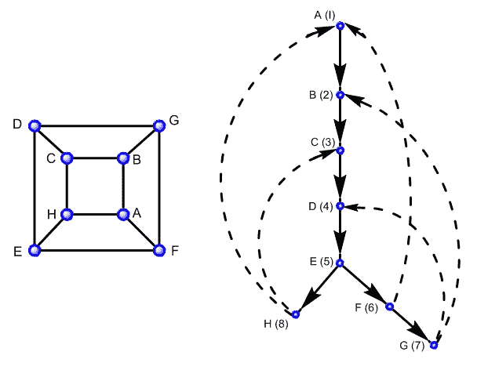
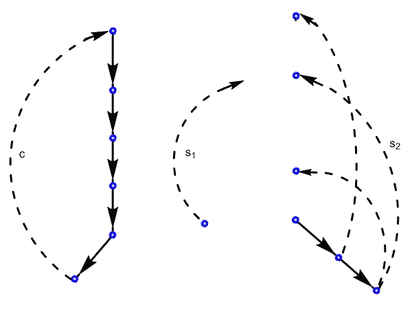
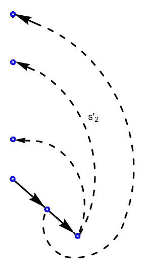

# 平面测试的 Hopcroft-Tarjan 图的平面性和路径加法

> 原文：<https://towardsdatascience.com/graph-planarity-and-path-addition-method-of-hopcroft-tarjan-for-planarity-testing-c56d2df2b0b3?source=collection_archive---------3----------------------->

## 给定一个无向图，[平面性测试](https://en.wikipedia.org/wiki/Planarity_testing)问题是确定是否存在围绕每个顶点的顺时针边序，使得该图可以在没有任何交叉边的平面上绘制。

*平面图形*在计算几何的许多问题中扮演着核心角色。如果化学结构是平面的，确定化学结构的同构就简单了。另一个例子是当工程师希望在芯片上嵌入组件网络时。元件由导线表示，任何两根导线交叉都会造成短路。这个问题可以通过把网络看作一个图并找到它的平面嵌入来解决。

下面是一些需要的基本概念。一个[图](https://en.wikipedia.org/wiki/Graph_theory) *G=(V，E)* 是 ***平面*** 如果可以把它画在一个平面上，使得除了端点之外没有边相交。这样的图叫做**平面嵌入**。平面图的一个例子是 *K4* ，4 个*顶点的完整图形(图 1)。*

Figure 1: K4 (left) and its planar embedding (right).

并非所有的图形都是平面的。图 2 给出了两个非平面图的例子。它们被称为 *K5* ，五个顶点上的完全图，以及 *K_{3，3}* ，两个大小为 3 的集合上的完全二部图[。无论选择哪种复杂的曲线来表示边，当最后一条边无法在不与其他边交叉的情况下插入时，嵌入它们的尝试总是会失败，如图所示。](https://en.wikipedia.org/wiki/Bipartite_graph)

Figure 2: K5, the complete graph of *5* vertices, and K_{3, 3}, the complete bipartite graph on two sets of size *3*

连接 *u* 和 *v* 的连续边序列被称为从 *u* 到 *v* 的 *G* 的*路径。如果一条路所有顶点都是不同的，那么这条路是最简单的。从顶点到自身的路径是一条*封闭路径*。从 *v* 到 *v* 带有一条或多条边的闭合路径是一个*循环*，如果它的所有边都是不同的并且唯一出现两次的顶点是 *v* 。我们用*p:u*** v*来表示 *p* 是 *G* 中从 *u* 到 *v* 的一条路径。*

(有向、有根)树 *T* 是具有一个根 *r* 的有向图，使得 *T* 中的每个顶点都可以从 *r* 到达，没有边进入 *r* ，并且恰好有一条边进入 *T* 中的每个其他顶点。关系“ *(v，w)是 T 中的一条边”*用 *v* → *w* 表示。用 *v* → ** w* 表示关系“*T*中有一条从 v 到 w 的路径”。如果 *v* → *w* ， *v* 是 *w* 的*父*， *w* 是 *v* 的*子*。如果 *v* → ** w* ， *v* 是 *w* 的*祖先*， *w* 是 *v* 的*后代*。每个顶点都是自己的祖先和后代。如果 *G* 是有向图，一棵树 *T* 是 *G* 的生成树如果 *T* 是 *G* 的[子图](https://en.wikipedia.org/wiki/Glossary_of_graph_theory_terms#subgraph)包含 *G* 的所有顶点。

一个图的边 *(x，y)* 的*细分*是通过创建一个新的节点 *z* ，并用新的边 *(x，z)**(z，y)* 替换 *(x，y)* 得到的。一个图的*细分*是通过一系列细分操作可以从中获得的任何图。

由于 *K5* 和 *K_{3，3}* 是非平面的，显然这些图的细分也是非平面的。因此，有一个子图是 *K5* 或 *K_{3，3}* 的子图的图一定是非平面的。这样一个子图被称为对一个 *K_{3，3}* 或一个 *K5* 的*同胚*。图论中的一个著名结果是 Kuratowski 定理，该定理指出，没有一个 *K5* 或一个 *K_{3，3}* 的细分也足以证明一个图是平面的。

一般来说，图算法需要一种探索图的系统方法。平面性测试算法使用的最重要和最常用的技术是*深度优先搜索*。

[**深度优先搜索**](https://en.wikipedia.org/wiki/Depth-first_search) **(DFS)** 是以特定的方式访问一个图的所有顶点 *G* 的方法。它从任意选择的顶点 *G* 作为根节点开始，并继续从当前顶点移动到未探索的相邻顶点。当当前顶点没有未探索的相邻顶点时，遍历回溯到具有未探索的相邻顶点的第一个顶点。请看下图中的 *DFS 示例。*

Figure 3: An example of graph G and its palm tree T

*DFS* 到达 *G* 顶点所使用的边形成了 *G* 的一棵生成树 *T* ，称为*棕榈树*，或 *DFS 树*。所以这个搜索以某种方式将 G 转换成一个有向图。 *T* 的根是访问开始的顶点。 *T* 的边称为*树边*，而 *G* 的其余边称为*背边*，在棕榈树中用虚线表示。深度优先搜索很重要，因为棕榈树中的路径结构非常简单。

如果对于每对顶点 *u* 和 *v* , *G* 包含一条从 *u* 到 *v* 的路径，则无向图 G 是*连通的*。图的*连通分支*是最大连通子图。

图中的*关节顶点*是删除后断开图的顶点。如果一个图没有连接顶点，那么它就是双连通的。图的*双连通分支*是最大双连通子图。

*库拉托夫斯基子图*是一个子图，它有 *K5* 或 *K_{3，3}的细分。*

> [**库拉托夫斯基定理**](https://en.wikipedia.org/wiki/Kuratowski%27s_theorem) (库拉托夫斯基【Ku30】)有限图是平面的当且仅当它不包含库拉托夫斯基子图。

狄拉克和舒斯特(1954)对这个定理的证明可以在[BM76]中找到。证明相当冗长，其中两个主要引理和定理的主要证明都使用了矛盾。对顶点数使用归纳法的另一个证明是由于汤姆森(1980) [GT87]。虽然这个证明不是最短或最容易的，但它很有启发性，因为它还产生了关于平面嵌入的其他结果。一个结果是单纯图的平面嵌入的边可以选择为直线的 Fary 定理(其他的是 Tutte 定理和 Whitney 定理)。此外，汤姆森的证明很容易转换成一个平面算法，这是多项式的顶点数。

**平面性测试的朴素算法**

有人可能会想，上面的 *Kuratowski* 的优雅定理是否可以用一种简单的方式作为测试图形平面性的标准。答案是肯定的，基于这个定理的朴素算法有指数级的运行时间，如下图。

顶点的**度**或**价**是该顶点的关联边数。设 *u* 为图 *G=(V，E)* 中度数为 *2* 的顶点，设 *e1* 和 *e2* 为 *u* 上的边，设 *e1=(u，V)，e2=(u，w)* 。通过“在 *u* 处平滑”得到的图形，其顶点集合为 *V* / *{u}* ，其边集合为 *E* / *{e1，e2}* ，加上一条在 *v* 和 *w* 之间的新边。细分这个新边将反转 *u* 处的平滑操作。然后我们有以下结果，这是库拉托夫斯基定理的一个结果:

设 *G* 为图。对于 *E* 的每个子集，其移除仅留下一个非平凡分量 *H* ，通过连续平滑 *H* 中的价 *2* 的每个顶点来构建“平滑图” *H^{smooth}* ，如果 *H* 是一个循环，则可能除了最后一个顶点之外。如果某个 *H^{smooth}* 同构于 *K5* 或 *K_{3，3}* 那么这个图是非平面的，否则， *G* 是平面的。

因为有 *2^{|E|}* 边子集要考虑，这个朴素算法有指数运行时间。

**hop croft 和 Tarjan 的路径添加算法**

解决平面性问题的最好方法似乎是试图构造给定图的平面嵌入的表示。如果这样的表示能够完成，那么该图是平面的；如果不是，那么这个图是非平面的。一个这样的算法是 Hopcroft 和 Tarjan [HT74]的*路径添加方法*。他们首先表明平面度测试可以在线性时间内完成。

在给出算法的草图之前，我们可以做一些注释来限制所考虑的图 *G* 的类别。很明显，一个图是平面的当且仅当它的所有连通分量都是平面的。因此，我们可以假设 *G* 是连通的。

一个图是平面的当且仅当它的所有双连通分支都是平面的([Be64])。此外，铰接顶点可以在线性时间内找到([HT73]，[Ta72])，因此单独嵌入每个双连接组件，然后通过它们的邻接铰接顶点连接它们就足够了。因此，我们可以假设 *G* 是双连通的。

下面的结果是著名的欧拉定理:

> (欧拉 1750)设 *G* 是一个连通的平面图，设 *n，m，f* 分别表示 *G* 的顶点数、边数和面数。然后 *n-m+f=2* 。

这个定理可以通过对边数 *m* 的归纳来证明。我们需要的是以下推论:

> 如果 *G* 是一个有 *n (≥ 3)* 个顶点和 *m* 条边的平面图，那么 *m ≤ 3n - 6* 。

现在我们准备给出路径加法的概要。

**算法示意图**

*   统计边数，如果 *|E| > 3 |V|- 6* 那么它是非平面的(利用上面的推论去掉边太多的图)。
*   应用 DFS，将图形转换成棕榈树 T，并对顶点进行编号。
*   在树中找到一个循环并删除它，留下一组不相连的片段(使用 Auslander，Parter，Goldstein 的算法，[AP61]，[Go63])。
*   检查每个零件加上原始循环的平面度(通过递归应用算法)。
*   确定各部分的嵌入是否可以组合，以给出整个图的嵌入。

对算法的每次递归调用都需要找到一个循环，并一次添加一条简单的路径。每一条这样的新路径通过新的边和顶点连接两个旧的顶点(有时整块被翻转过来，围绕着某条线；为了做到这一点，我们需要利用众所周知的 ***乔丹曲线定理*** 的一个推论:一条简单的闭合曲线将平面恰好分成两个连通的区域)。这解释了“路径添加方法”的名称。这也解释了使用 *DFS* 将图形分成简单路径的重要性，这些路径可以组合成平面性测试所需的循环。我将以上面图 *3* 中的图 *G* 和图 *DFS* 树 *T* 为例进行说明。

Figure 4: First cycle c and disconnected pieces s1 and s2

现在考虑第一个周期 *c* 。它将由一系列树边组成，后面是 *T* 中的一个后沿。顶点的编号是这样的，顶点沿着循环按编号顺序排列。所以在这个例子中周期 *c* 是*1*→*2*→*3*→*4*→*5*→*8*→*1*。当 *c* 被拆下后， *G* 会分成几个相连的块。不属于循环的每个片段将由单个后边缘 *(v，w)* (本例中的片段 *s1* )或树边缘 *(v，w)* 加上带有根 *w* 的子树，加上从子树引出的所有后边缘(本例中的片段 *s2* )组成。根据*乔丹曲线定理*，每一个棋子可以走“内”或“外” *c* 。当我们添加一个部分时，某些其他部分必须从内部移动或“翻转”到外部，或者如果必要的话反之亦然(以保持平面性)，直到一个部分不能被添加或者整个图形被嵌入到平面中。该示例没有显示“翻转”情况，但是可以参考文章中的图 *4* 和图 5 进行说明。对 *DFS* 的修改将有助于生成路径的顺序，使得一个片段中的所有路径都在任何其他片段中的路径之前生成(在这种情况下 *s1* 有一个路径，而 *s2* 有三个路径)，并且按照 *v* 的递减顺序浏览这些片段，其中 *v* 是路径的起点，如上所述。

Figure 5: Piece s2 after transformation

根据 Jordan 曲线定理，一块必须完全嵌入在 *c* 的一边。为了嵌入一个片段(比如说 *s2* ，我们在其中找到一条路径 *p* 。我们选择一面，比如左边，在上面嵌入 *p* 。我们将 *p* 与之前嵌入的后沿进行比较，以确定 *p* 是否可以嵌入。如果没有，我们从左向右移动后边缘阻挡 *p* 的棋子。如果移动棋子后 *p* 可以嵌入，我们就嵌入。然而，如果我们将棋子从左边移到右边，我们可能必须将其他棋子从右边移到左边。因此可能无法嵌入 *p* 。如果是这样，我们声明这个图是非平面的。如果 *p* 可以嵌入，我们尝试通过递归使用算法来嵌入剩余的片段( *s2* )。然后我们试着嵌入下一块。在本例中，需要将棋子 *s2* 转换为棋子*S2’*，如图 5 所示。

尽管算法的内部工作是基于对输入图的平面表示的搜索，但是没有描述如何实际产生它的平面嵌入。二十年后，Mehlhorn 和 Mutzel 填补了这一空白，描述了如何在测试阶段收集构建平面嵌入所需的信息，这些信息被隐含地用于显示平面性[MM96]。

**结论**

平面图形和平面性测试在计算几何中的各种问题中起着重要作用，包括地理信息系统、点定位。例如，集成电路的设计需要知道电路何时可以嵌入到平面中。

在 *1974* 中，Hopcroft 和 Tarjan【H提出了第一个线性时间平面性测试算法。该算法也称为路径添加算法，从一个循环开始，一次添加一条路径。然而，该算法是如此复杂和难以实现，以至于其他几个贡献跟随他们的突破。例如，在[HT74]之后大约二十年，Mehlhorn 和 Mutzel [MM96]发表了一篇论文，阐明了如何构造通过原始 Hopcroft 和 Tarjan 算法发现是平面的图的嵌入。

**参考**

[AP61] Auslander，l .和 Parter，S. V .，*关于平面中的嵌入图*，数学杂志。还有械甲怪。10, 517–523, 1961.

图的理论及其应用。伦敦梅图恩，1964 年。

J. A. Bondy，U. S. R. Murty，*图论及其应用*，北荷兰，1982 年。

[Go63] Goldstein，A. J .，*一个测试一个图是否可以嵌入一个平面的有效的和构造性的算法*，图论和组合学会议。，合同编号 1858-(21)，1963 年。

[GT87]乔纳森·l·格罗斯，托马斯·w·塔克，*拓扑图论*，威利-Interscience，1987。

【Hhop croft，j .和 Tarjan，r .*图操纵的有效算法*，Comm. ACM 16，372–378，1973。

[HT74]约翰·霍普克罗夫特；Tarjan，Robert E .，*有效的平面性测试*，《计算机械协会杂志》21(4):549–568，1974 年。

[Ku30] Kuratowski，c .，*关于地形学中的 corbes gauches 问题*，数学基础 15，271–283，1930 年。

[MM96]库尔特·梅尔霍恩和佩特拉·穆策尔。，*关于 Hopcroft 和 Tarjan 平面性测试算法的嵌入阶段。《算法》，16:233–242，1996 年。*

[Ta72] Tarjan，r .，*深度优先搜索和线性图算法*，SIAM J. Comput。1, 2 146–159, 1972.