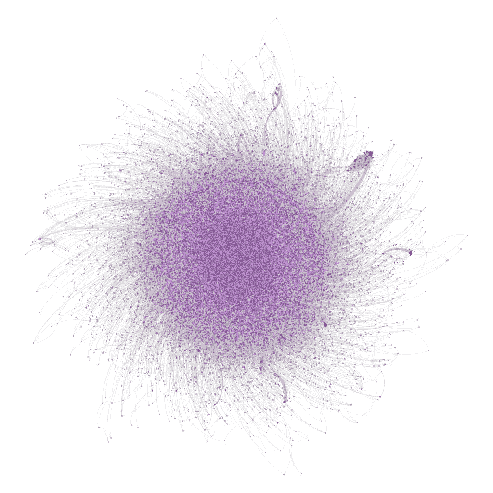
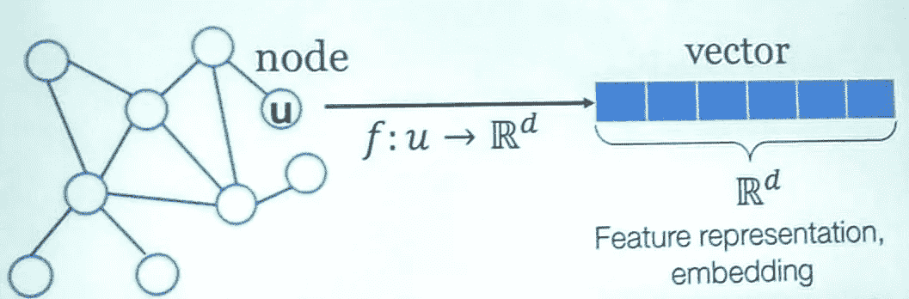
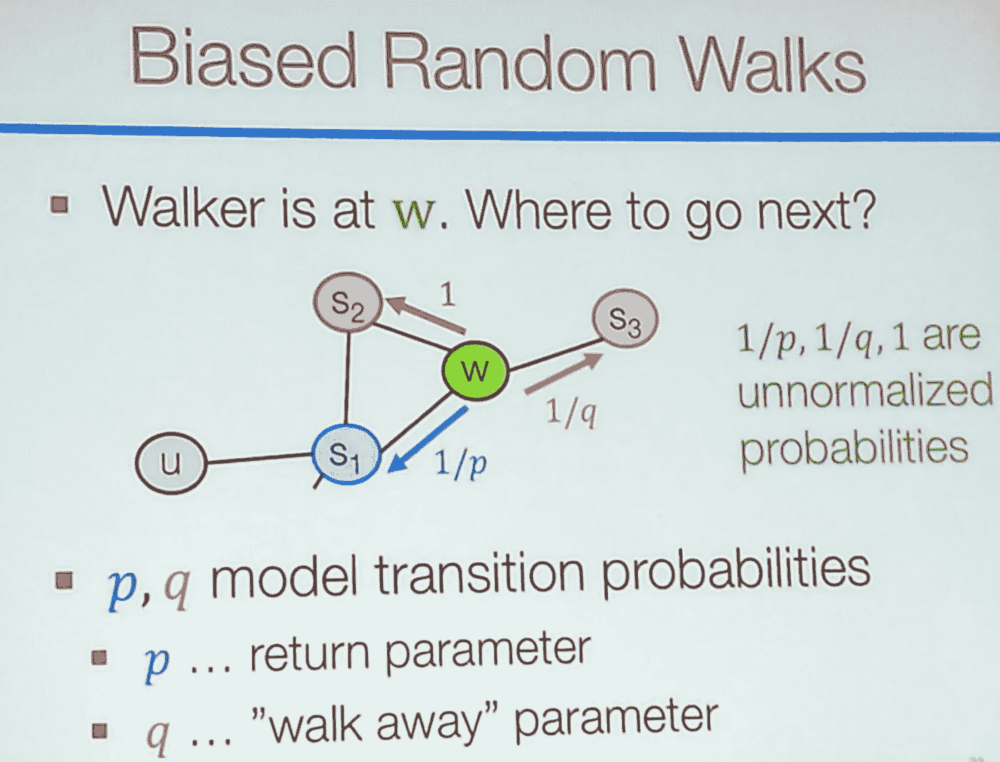
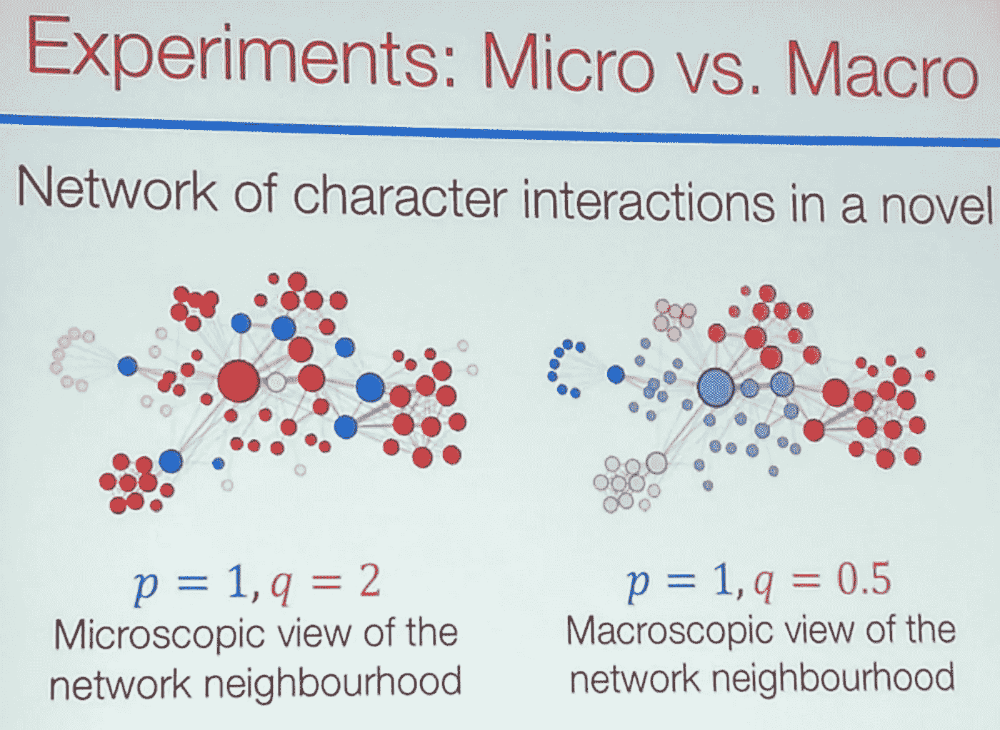
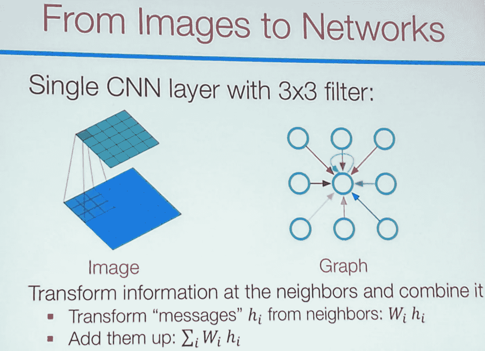
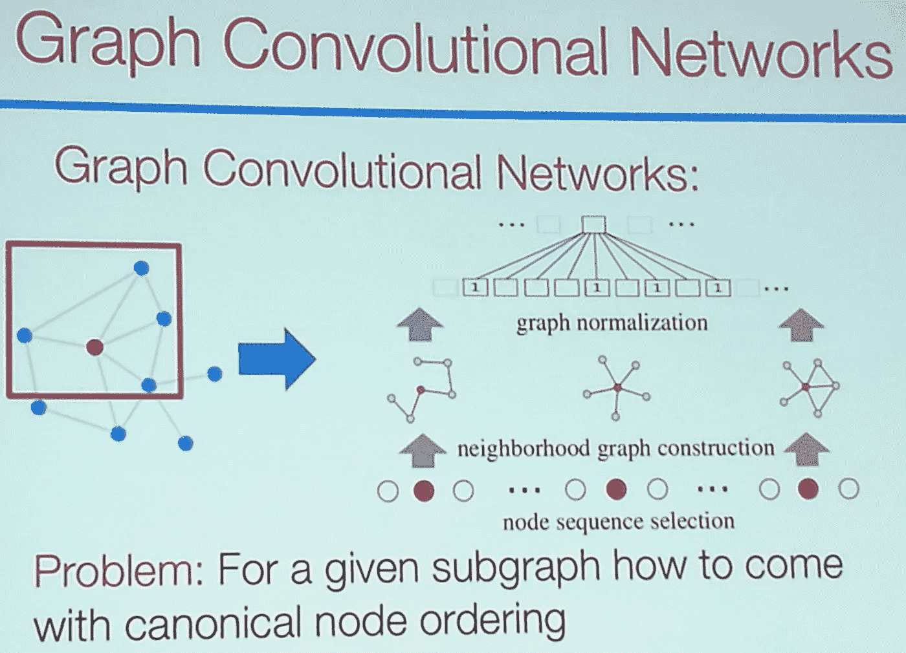
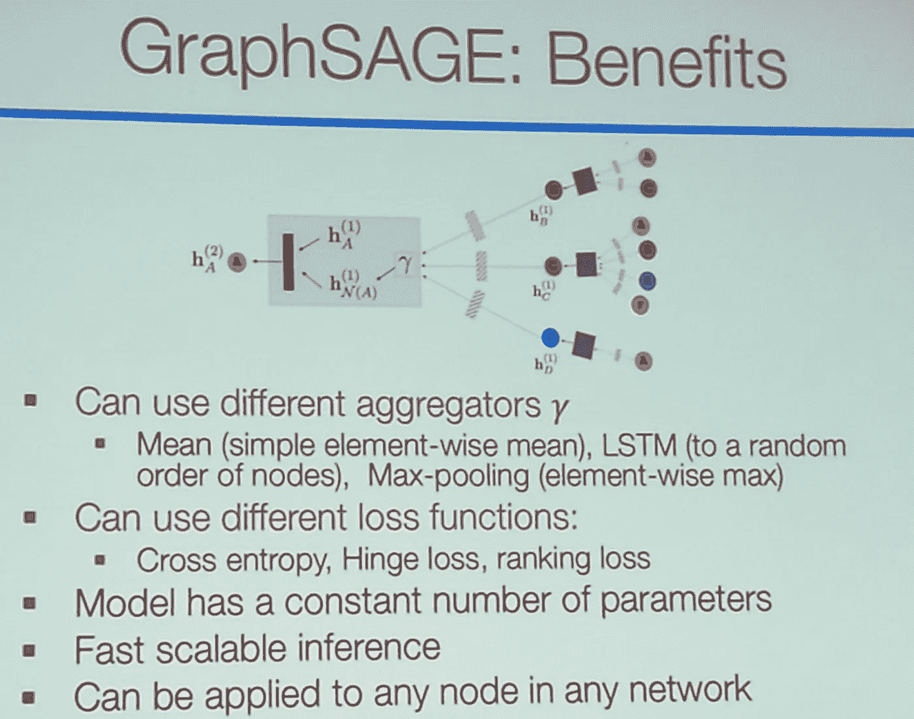
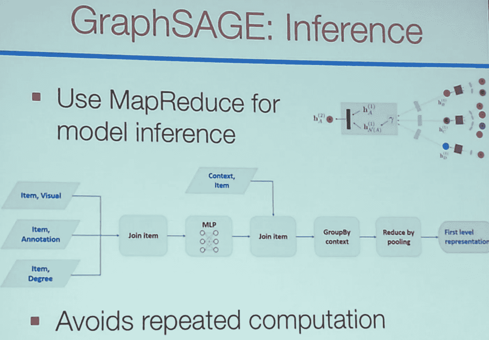
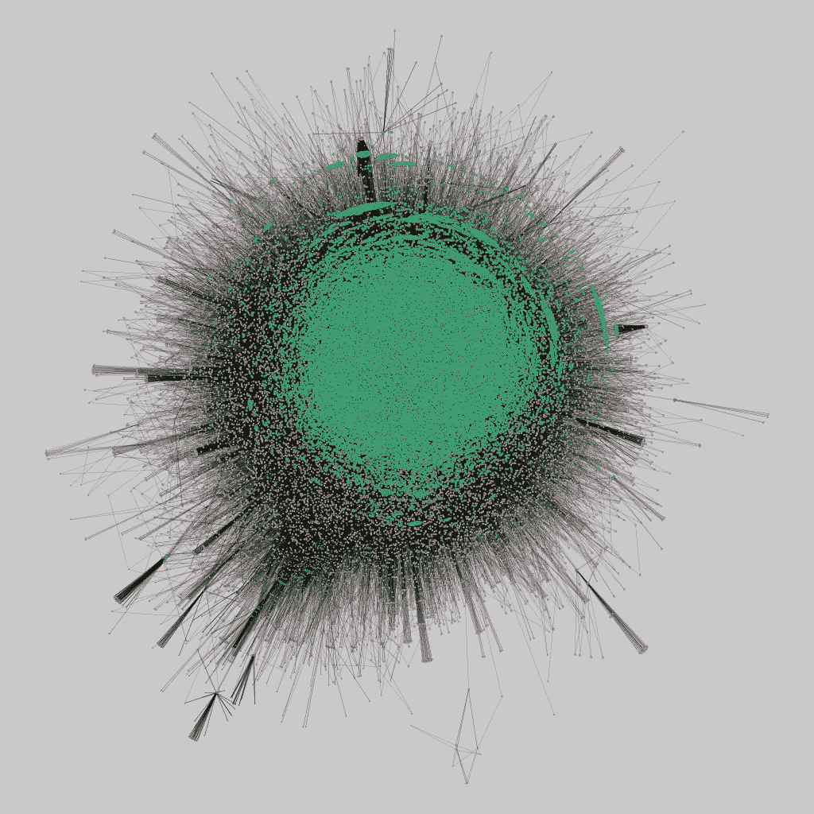

# 图形表示学习

> 原文：<https://towardsdatascience.com/graph-representation-learning-dd64106c9763?source=collection_archive---------3----------------------->

Graph captured on the [Floating Piers study](https://marco-brambilla.com/2017/08/31/analysis-of-user-behaviour-and-social-media-content-for-art-and-culture-events/) conducted in our data science lab.

在使用复杂信息的任何科学和工业领域，图模型普遍用于描述信息。

在图中需要解决的经典问题有:节点分类、链接预测、社区检测等等。

当网络庞大时，分析它们会变得很有挑战性。一般来说，机器学习技术在网络上效果不佳。

因此，考虑到实际的网络结构，要点变成**学习网络中节点的特征。**这些被称为特征表示或嵌入。因此，任何节点都被描述为一个向量。

## 目标是将每个节点映射到一个低维空间，同时保留大部分网络信息。

基于这种低维表示，我可以进行任何下游分析。

主要的挑战是，如果与图像、音频或文本相比，网络的结构非常不规则。图像可以被看作是刚性的图形网格。运行机器学习更容易。

相反，图是非欧几里得的:节点的数量是任意的，它们的连接也是任意的。例如，如何将它输入神经网络？这就是为什么我们需要图形嵌入。

# node2vec:无监督特征学习

主要思想是找到保持相似性的维度为 *d* 的节点的嵌入。目标也是嵌入使得附近的节点靠得很近。我需要计算一个节点的邻域，然后运行一个最大化问题，以一种 *f(u)* 预测邻域 *N(u)* 的方式计算节点 *u* 的特征学习。这可以通过 softmax 函数来实现，假设节点的因式分解(独立性)。

邻域的定义可以基于 BFS(宽度优先)或 DFS(深度优先)策略。BFS 提供网络的局部微观视图，而 DFS 提供网络的宏观视图。一个聪明的解决方案是 BFS 和 DFS 的插值。这是一个二阶随机游走，因为我们记得最后访问的节点，并且在每一步我们都要决定是返回最后访问的节点还是继续前往新的节点。本质上，在每一步，我都有三个选择:

*   节点回到更靠近原节点的位置 *u*
*   与当前节点距离相同的节点相对于 *u*
*   距离节点*更远的节点 u*

我可以设置概率 *p* (返回)和 *q* (离开)来决定每一步是离 u 远还是近。然后我可以运行随机梯度下降(线性时间复杂度)算法来寻找最佳路径。

基于我如何设置 p 和 q 的值，我可以得到对网络完全不同的解释:随着更大的 *q* ，我倾向于检测节点的“角色”，随着更小的 *q* ，我倾向于检测节点的“接近度”。

这是一种独立于任务的特征学习方法，在某种意义上，它不依赖于你对结果的使用。复杂度是线性的。网络的规模。

# GraphSAGE:监督特征学习

相反，这种方法是受卷积神经网络的启发，通过将它们从简单网格(图像网格)的处理推广到一般图形。但是如何推广卷积呢？

您可以将图像视为一个图表，其中每个像素都连接(并以某种方式影响)附近的像素。

一种选择是使用图的邻接矩阵(加上节点的可能特征),并将其输入神经网络。问题:输入的数量与网络的规模成线性关系(巨大)。

一个改进是使用子图(例如，定义节点邻域的一片邻近节点)。这个邻域定义了一个计算图，我用它来传播和转换所考虑节点的所有邻居的信息(即属性)。本质上，对于每个节点，计算图是一个不同的神经网络，我可以运行它来学习参数。我有许多神经网络，它们使用相同的一组参数，所以这就像在进行监督学习。

如下所述，整个框架可以方便地以 MapReduce 方式执行，因为这自动避免了计算任务的重复。

本质上，我们定义了图的卷积网络概念。

在 Pinterest 中的实验已经成功地在 3 个 BLN 节点和 17 个 BLN 边上运行。

Graph captured on the [Floating Piers study](https://marco-brambilla.com/2017/08/31/analysis-of-user-behaviour-and-social-media-content-for-art-and-culture-events/) conducted in our data science lab.

这篇报道是关于 2017 年 12 月在波士顿举行的第四届 IEEE BigData 会议上由 [**Jure Leskovec**](https://cs.stanford.edu/people/jure/) (与斯坦福大学和 Pinterest)发表的主题演讲。

演讲的完整幻灯片[可以在 Jure 的主页上找到:](http://i.stanford.edu/~jure/pub/talks2/graphsage-ieee_bigdata-dec17a.pdf)

[http://I . Stanford . edu/~ jure/pub/talks 2/graph sage-IEEE _ big data-dec 17a . pdf](http://i.stanford.edu/~jure/pub/talks2/graphsage-ieee_bigdata-dec17a.pdf)