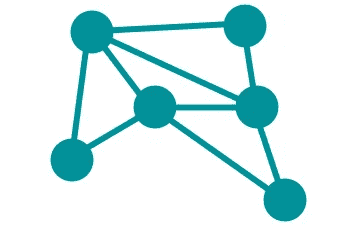
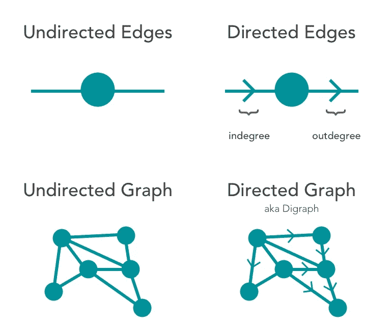
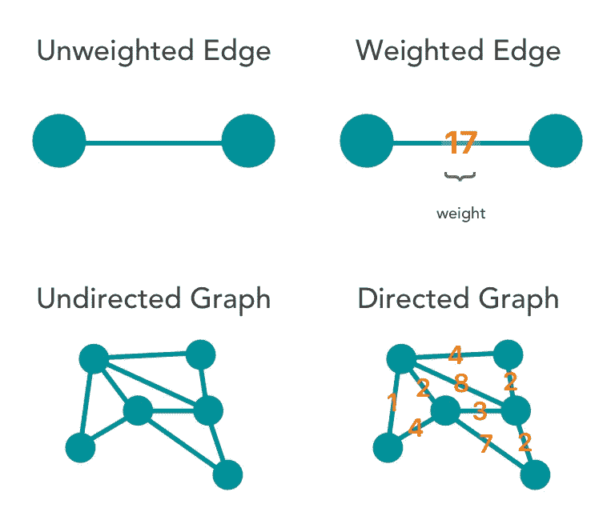
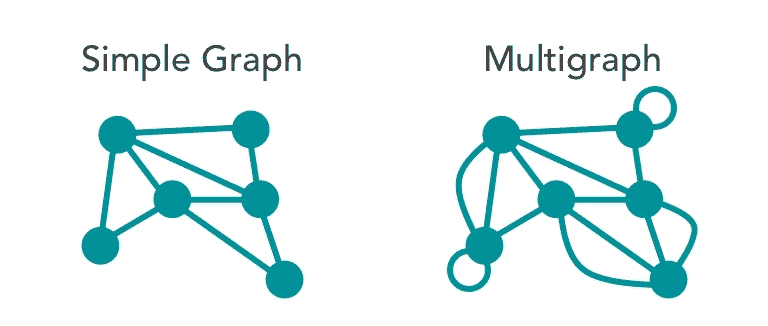
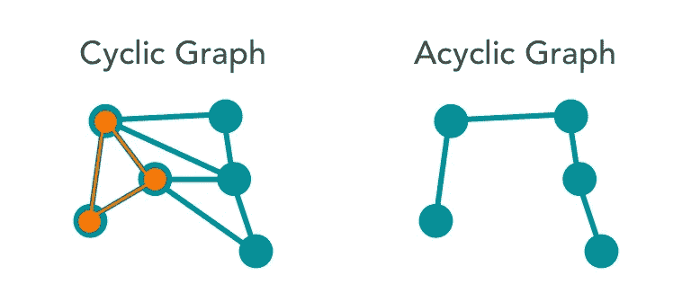

# 图论——基本性质

> 原文：<https://towardsdatascience.com/graph-theory-basic-properties-955fe2f61914?source=collection_archive---------15----------------------->

## 第三部分——从简单的图表开始

让我们后退一步，以便在图论的基础知识中更进一步。本系列的前一篇文章主要围绕着解释&标注一个*简单图形*。我们现在将返回来强调一个简单图形的属性，以便为本文的其余部分提供一个熟悉的起点。

simple graph — part I & II example

[在之前的文章](https://medium.com/@jesus_notchrist/graph-theory-set-matrix-notation-7dfb04b8ed24)中，我们将我们的图定义为*简单*由于四个关键性质: ***边是无向的&未加权的；该图不包括多条边&有向回路*** *。*这绝不是所有图形属性的详尽列表，但是，这足以让我们继续我们的旅程。本文将通过介绍关键的图属性，把我们从简单的图带到更复杂的(但相当常见的)图。

# 常见图表属性

图形，就像它们所代表的物体的动态系统一样，呈现出难以估量的形状和大小；因此，创建一组属性有助于指定唯一的图形属性。让我们检查一下简单图形示例的定义属性:

1.  无向边
2.  未加权的边
3.  排除多条边和循环

## 无向图与有向图

上例中的边除了连接两个顶点外，没有其他特征。他们明显缺乏方向。

最清晰和最大的图分类形式始于图中的*类型的边* *。存在两种主要类型的边缘:有方向的和没有方向的。无向图，如示例简单图，是由无向边组成的图。在一个有向图中，或者一个*有向图*，每个顶点至少有一个输入边&和一个输出边——表示每个边相对于它的两个连接顶点的严格方向。*

## 未加权与加权图形

类似地，*加权边*仅仅是具有相关数字或值的边，或者称为 ***权重*** (通常以非负整数的形式)。权重值允许对更复杂的问题进行建模，从而通过图形更准确地表示现实生活中的系统。在许多实际应用中，边的权重通常也称为边的*成本*；图中边权重的实际例子包括测量路径的长度、电缆的容量或穿过特定路径所需的能量。下图为我们的示例图提供了一个快速的视觉向导，如果它包含加权边，该图看起来会是什么样子:

## 多重边缘和循环

我们的示例图中突出显示的第三个简单属性引入了两个独立的图关系，它们都基于相同的属性:基于顶点关系的图的*简单性*。

在我们的示例图中，每个顶点有*条边*连接到另一个顶点——没有顶点通过多条边连接到另一个顶点。此外，没有顶点循环回自身。一个图，如果*包含其中一个或两个，多条边&自循环，称为*多重图。**

下图通过右图突出了这两个区别:

## 循环-非循环与循环图

我们之前没有列出这个属性，因为非循环图和循环图都可以算作简单图，但是，图的循环属性是一种重要的分类形式，值得一提。在图论中，一个 ***圈*** 是一条由边&个顶点组成的路径，其中一个顶点可以从自身到达；换句话说，如果一个人可以从一个顶点回到自身，而不沿着路径重复(折回)一个边或顶点，那么这个循环就存在。

包含至少一个循环的图称为*循环*图。没有单圈的图称为无圈图。在下面的示例中，我们将在简单的图表中突出显示多个循环中的一个，同时在右侧展示一个非循环图表:

***来源***

[图论介绍](https://amzn.to/2GZFyf6)

[图论](https://amzn.to/2YVtxNF)

现在已经对与图相关的关键属性有了基本的了解，是时候跳到一个非常激动人心的图论主题了:网络！在下一篇文章 &中，我们将开始在更深层次上构建对网络的理解——最终将这些原则应用于网络分析。