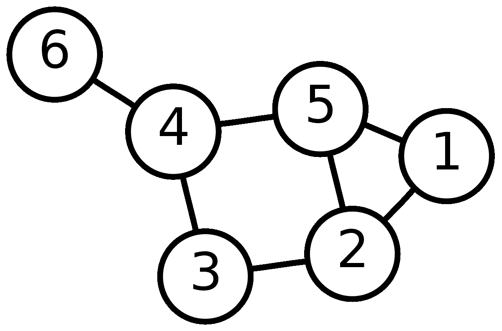
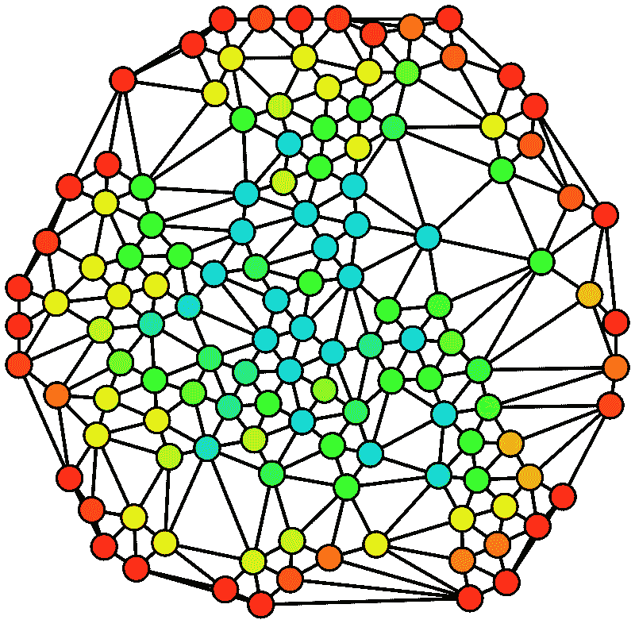

# 图论帮助英国变得不那么臭了

> 原文：<https://towardsdatascience.com/graph-theory-helped-the-british-become-less-stinky-de4b439a7784?source=collection_archive---------12----------------------->

这是为那些可能在数据科学环境中使用图论的人解释图论原理的系列文章中的第二篇。第一篇文章，主要讲图论的起源和图的基本性质，这里可以找到**。**

*19 世纪中期的一个 7 月的早晨，伦敦人醒来时闻到一股令人作呕的恶臭。他们不能离开家而不生病。更富裕的人在手帕上涂上香水，走来走去，永远遮住他们的脸。许多穷人离开城镇去农村找工作，因为他们实在无法忍受。毫无疑问，这是英国历史上最卑鄙的事件。*

*这就是后来被称为 1858 年大恶臭的开始。泰晤士河，被中世纪木制下水道系统直接倾倒的人类排泄物填满了几个世纪，终于得到了它的报复。霍乱肆虐的淤泥被冲上河岸，在异常炎热的夏季温度下晒成了一股恶臭，方圆数英里都无法逃脱。*

*伦敦金融城公司(City of London Corporation)当时并不以在公共卫生方面特别积极而闻名，该公司意识到适可而止，并邀请提交该市新污水排放计划的设计方案。约瑟夫·巴扎格特的计划被接受了，他现在被认为是伦敦历史上主要的市民英雄之一。作为一名才华横溢的土木工程师，他监督了一个巨大的公共工程项目，该项目改变了伦敦的卫生水平和生活质量。Bazalgette 的下水道网络被广泛认为是创建现代城市的第一步，也是伦敦霍乱终结的开始。*

**

*The Great Stink of 1858 was solved with the help of graph theory.*

*Bazalgette 的下水道网络仍然运行良好，将数百万人的废物向东运送到泰晤士河口的处理设施。作为一个工程项目，这是人类努力的一个令人震惊的例子:22，000 公里的下水道，3.18 亿块砖，270 万立方米的挖掘土。*

*Bazalgette 以他自己的努力工作而闻名。他想尽一切办法让这项巨大的努力经得起未来的考验。确保水流的重力和坡度，隧道的直径，所有这些都是他非常关心的细节。但是有两个问题从一开始就必须回答，以使项目可管理和可持续:第一，我们如何将网络中任何两点之间的污水路线最小化，第二，哪一个是最重要的连接点？*

*Bazalgette 的工程壮举是图论新兴领域的一些最初用途的一个例子，并说明了我们今天一直在关注的与网络有关的两个概念的重要性:*顶点之间的距离*和*顶点的重要性*。*

**

# *测量图形中的距离*

*距离在图论中是一个相当简单的概念，但在实践中非常有用。回想一下本系列的[上一篇文章](/facebook-and-twitter-were-born-in-18th-century-europe-2efdf6816693)，图由一组顶点和一组连接成对顶点的边组成。给定任意两个顶点，它们之间的距离定义为它们之间最短路径的边数。这有时也被称为“测地线距离”,如果顶点之间不存在路径，则按照惯例被描述为“无穷大”。例如，在上面的简单图形中，顶点 2 和顶点 6 之间的距离是 3(有两条这样长度的路径可以到达那里)。*

*距离是一个非常有用的概念，因为我们经常想要优化它。在复杂的工程网络中，最小化距离是一个非常常见的要求。在对人的研究中，最小距离也是一个常见的利益问题。六度分离问题认为世界上的任何两个人可以通过最多六个中间顶点或七条边相互连接，这是一个图网络中的最小距离问题。最近对脸书的研究显示，该网络中个人之间的平均最小距离为 4.57。*

*但是最大距离也可能是有趣的，因为它意味着不熟悉和不同。例如，可以使用某些公司数据来开发一个表示员工之间过去协作的图表。然后，在公司活动中，你将人们组织成讨论组，如果你想最大限度地形成新的联系和观点的多样性，你可以问这样的问题:我们如何将这 100 人分成 10 组，每组 10 人，这样这些组有最大的平均距离，因此最不可能以前彼此合作过？以这种方式使用，图论可以对组织内的人们的体验产生有意义的影响。*

**

# *测量图中顶点的重要性*

*在任何图中，有些节点更重要。例如，在 Bazalgette 的下水道网络中，将会有一些需要更多监控的连接点，因为任何故障或泄漏都会对整个网络产生更大的影响。同样，在一个人的网络中，某些个人由于其相对于网络中其他人的定位和连接性而具有更大的影响力。*

*衡量重要性的一个简单方法是顶点的价数 T2。这是连接到顶点的不同边的数量。以脸书为例，你的价就是你拥有的联系数量。但这并没有完全掌握影响力或重要性的概念，不是吗？并不是每个拥有大量人脉的人都在网络中扮演着真正重要的角色。*

*根据我的经验，衡量网络重要性的最佳标准是*中间中心度*。简单地说，给定顶点的介数中心性是该顶点在网络中两个其他顶点之间的最短路径上出现的次数。具有高度介数中心性的顶点在更大程度上影响信息的传播，并且它们从网络中的损失往往对其整体连通性具有更显著的影响。在上图中，红色顶点的中间中心度最小，而蓝色顶点的中间中心度最大。*

*理解中间中心性在人际网络中非常重要。它可以帮助确定投资于哪些个人，以确保某个信息尽可能广泛地传播。通过介绍给合适的人，它可以帮助你结交新朋友。它有助于确定你应该对从网络中失去一个人及其对其他人的潜在影响有多担心。*

*中间中心性很难测量，因为你需要计算网络中所有顶点对之间的路径。对于大型网络，这可能是高度计算密集型的。然而，有一些优秀的数据科学软件包可以用来计算网络特征，包括介数中心性。在我工作的 *R* 生态系统中，`igraph`包特别方便。*

*下一次，我们将看看信息是如何在网络中流动的，这对谣言和趋势的研究有着非常有趣的应用。 [*这里读一下*](/network-analytics-started-with-a-diseased-irish-cook-c40424aaa06e) *。**

*最初我是一名纯粹的数学家，后来我成为了一名心理计量学家和数据科学家。我热衷于将所有这些学科的严谨性应用到复杂的人的问题上。我也是一个编码极客和日本 RPG 的超级粉丝。在[*LinkedIn*](https://www.linkedin.com/in/keith-mcnulty/)*或者在*[*Twitter*](https://twitter.com/dr_keithmcnulty)*上找我。**