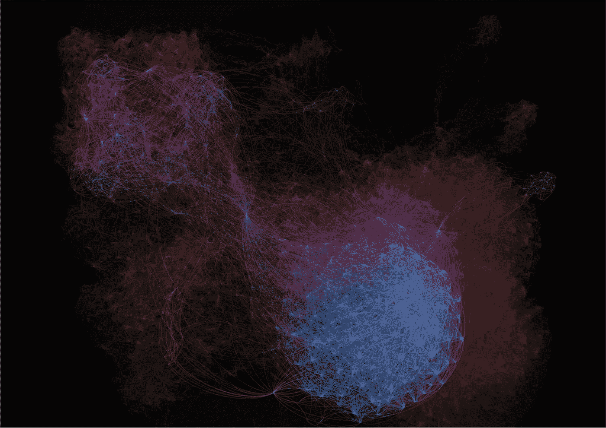
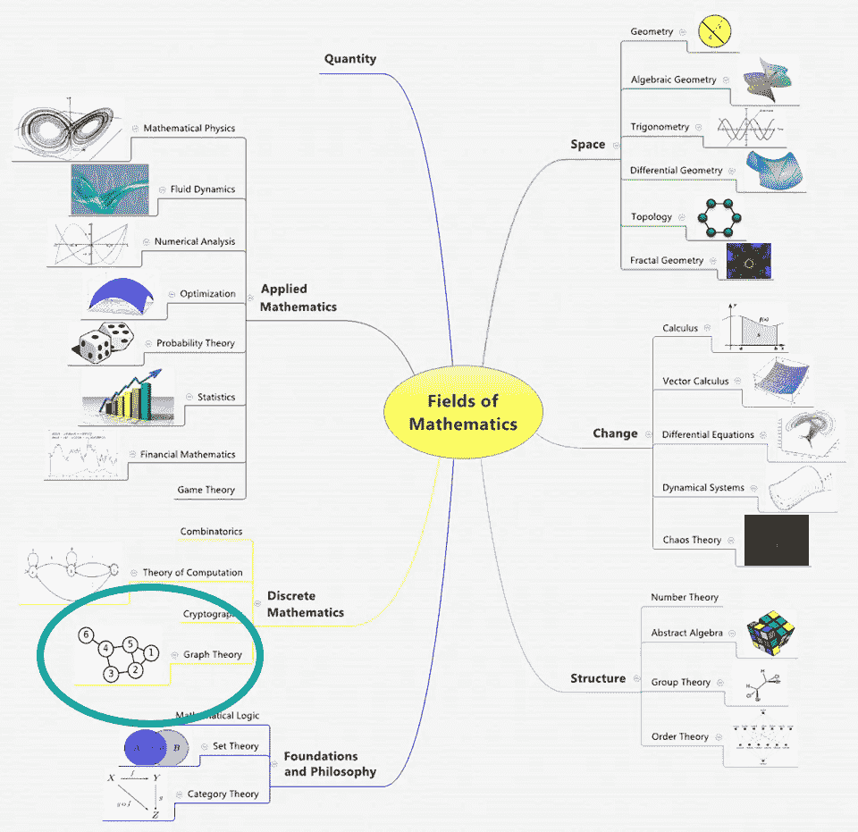
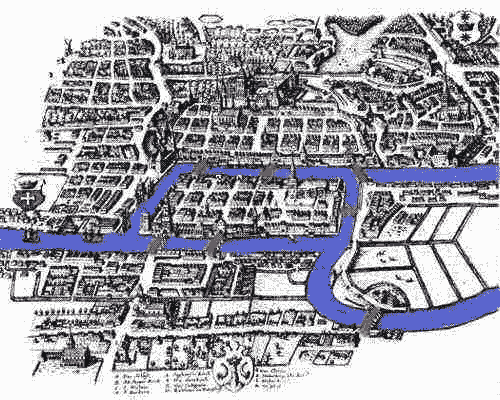

# 图论——历史和概述

> 原文：<https://towardsdatascience.com/graph-theory-history-overview-f89a3efc0478?source=collection_archive---------4----------------------->

## 第一部分——什么是图论&为什么它与今天相关？

Originally Published On [https://www.setzeus.com/](https://www.setzeus.com/)

**图表，尤其是网络图，*引起我的注意。***

也许这是一种直觉，用图来分析系统会增加我对分散式和集中式网络的理解。我这个数学家看到了明确的网络分析是如何极大地有利于激励驱动系统的研究的。或者可能是我这个设计师很大程度上被上图这种与生俱来的艺术魅力所吸引——视觉上很吸引人，但最终还是信息丰富的*。*

*不管出于什么原因，在软件开发中遇到了作为树的图，在区块链研究中遇到了作为网络的图，或者在 r/databasebeable click-bait 中遇到了作为诱饵的图之后，我决定深入图论的世界&它是网络理论的一个分支。*

**

*Article Originally Published On [https://www.setzeus.com/](https://www.setzeus.com/)*

*数学领域是 ***大*** 。它的知识之树分支到越来越多的子领域。对描述一组分支的&进行细分的最高级别方法之一是通过给定问题中*号*的类型。问题中的数字既可以是 ***离散的*** *，如固定的、可终止的数值*如自然数 1、2、3、4。或者它们可以是 ***连续的*** ，这些数字更准确地将我们的现实映射为*动态的、不断变化的数值*比如物体的速度。*

*离散数字对于老式数字钟就像连续数字对于现代模拟时钟(一种滑动而非滴答的时钟)一样。在前者中，上午 11:32 和下一分钟 11:33 之间不存在任何数字。在后一种情况下，秒针*持续*移动，这意味着当秒针从一秒滑动到下一秒时，模拟时钟在技术上每一个瞬间都显示不同的值*。包含离散数字的数学分支的最好例子是组合学，研究对象的有限集合。基于连续数的数学分支的最好例子是微积分，它研究事物如何变化。**

*图论是离散数学的一个分支，是对事物之间联系的最高层次的研究。这些*事物*，更正式地被称为*顶点，顶点或者*节点*节点*，而连接本身被称为*边。**

# *图论的历史*

*图的基本概念是由瑞士数学家莱昂哈德·欧拉在 18 世纪首先提出的。他对著名的柯尼斯堡桥问题的尝试和最终解决方案(如下所示)通常被引用为图论的起源:*

**

*Article Originally Published On [https://www.setzeus.com/](https://www.setzeus.com/)*

*德国城市柯尼斯堡(今俄罗斯加里宁格勒)坐落在普雷戈利亚河畔。地理布局由**四个**陆地主体共**七座**桥梁连接而成。向欧拉提出的问题很简单:*有没有可能步行穿过城镇，穿过每座桥一次，而且只穿过一次(被称为欧拉步行)？**

*欧拉认识到相关的约束条件是四块陆地&七座桥，他画出了第一张现代图形的可视表示。如右下方的图像 C 所示，现代图形由一组称为 **v** 顶点或节点的点表示，这些点由一组称为 **e** dges 的连接线连接。*

**

*Article Originally Published On [https://www.setzeus.com/](https://www.setzeus.com/)*

*通过首先尝试在上图中绘制路径，然后用顶点和边数交替变化的多个理论图进行实验，他最终推断出一条一般规则:*

**为了能够走欧拉路径(又名不重复边)，一个图可以没有或者有两个奇数个节点？**

*从那以后，被称为图论的数学分支潜伏了几十年。然而，在现代，它的应用终于爆炸了。*

***图论的应用***

**图论*归根结底是对**关系**的研究。给定一组节点&连接，它们可以抽象出从城市规划到计算机数据的任何东西，图论提供了一个有用的工具来量化&简化动态系统的许多移动部分。通过一个框架来研究图形为许多排列、网络、优化、匹配和操作问题提供了答案。*

*随着我们继续学习图形集和矩阵符号的基础知识 **(2)** ，通过介绍一些应用来激发我们自学的动机不会有什么坏处——一窥图论的应用:*

*在软件工程中，它们被认为是一种相当常见的数据结构，被恰当地命名为决策树。在电气工程领域，整个学科都围绕着多部分*电路的创建、计算和维护，这些电路通常按照图论原理绘制。与此同时，在分子生物学领域，科学家们推断预测模型来跟踪疾病的传播或繁殖模式。最后，在充满争议的社交媒体网络分析领域，我们见证了图论被用来创建现在的标准功能，如 LinkedIn 的分离度&脸书的朋友推荐功能。[让我们进入下一篇文章，熟悉常见的图形符号](https://medium.com/@jesus_notchrist/graph-theory-set-matrix-notation-7dfb04b8ed24)。**

****原载于****

*[https://www.setzeus.com/](https://www.setzeus.com/)*

****来源****

*[图论介绍](https://amzn.to/2GZFyf6)*

*[图论](https://amzn.to/2YVtxNF)*