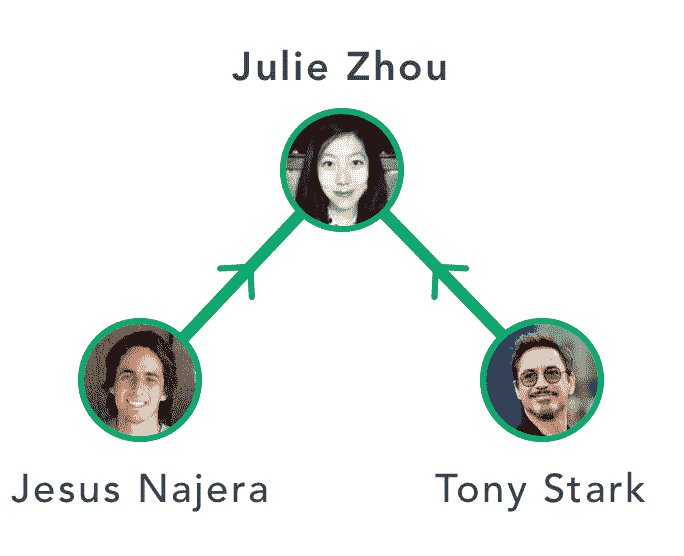
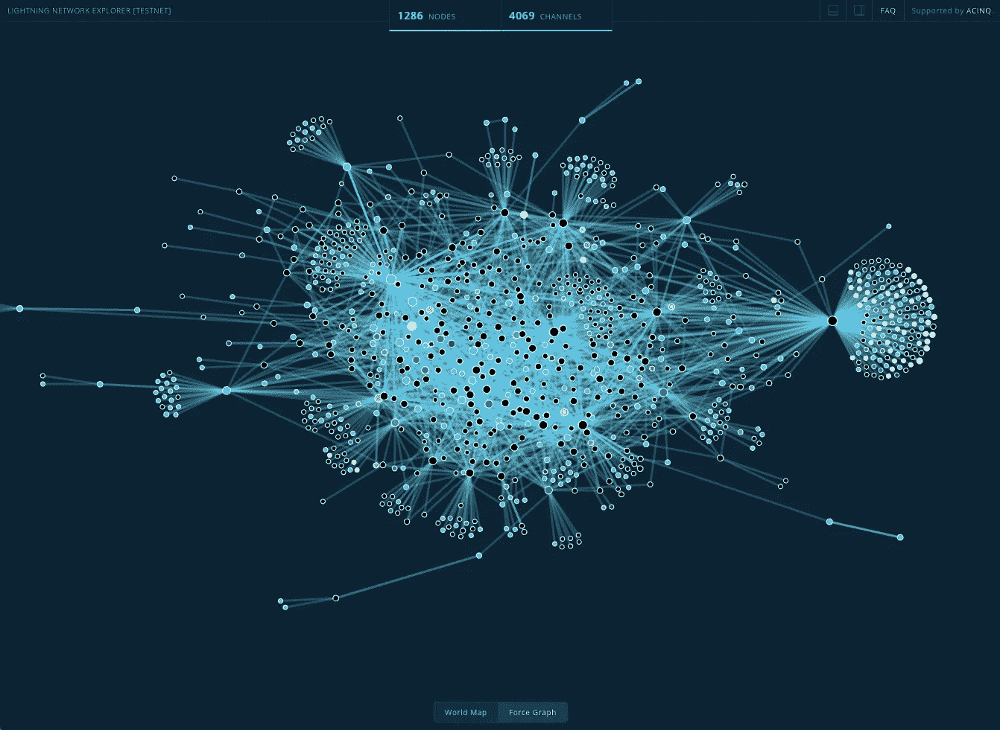

# 图论——网络理论

> 原文：<https://towardsdatascience.com/graph-theory-on-to-network-theory-379b390fb19b?source=collection_archive---------13----------------------->

## 第四部分——网络理论的基础

Originally Published On [https://www.setzeus.com/](https://www.setzeus.com/)

最后，[我们在这一系列图论文章中的路径](https://medium.com/@jesus_notchrist/graph-theory-basic-properties-955fe2f61914)把我们带到了图论的一个新兴分支的核心:**网络理论。**

> *网络理论是图论原理在复杂、动态互动系统研究中的应用*

当提供额外的相关信息时，它为进一步分析相互作用的代理的结构提供技术。网络理论的应用，正如这篇文章之前的文章中所说的 **(3)** ，是深远的&行业不可知论。从计算机科学，到电子工程，到博弈论&社会媒体分析，网络理论的基础提供了一个强大的心智模型来增加我们对现代系统的理解。

在不破坏太多未来文章的情况下，提供一个网络理论通常用来解决的*类问题*的快速概述可能是有意义的。其中，有几个经典网络理论问题的例子:

1.  最短路径问题——图中任意两个节点之间的最短(成本方面)路径是什么？
2.  网络流量—有向路径是否有足够的容量来承载沿途每个节点接收到的“流量”？
3.  匹配问题——一个图是否包含一对或多对匹配的独立边集？
4.  关键路径分析——在一个相互依赖的活动系统中，哪一条路径最长？

# 一目了然——社交媒体网络

通过图论原理研究主流社交媒体的异同，我们可以加深对这些日常实体的理解和欣赏。让我们通过类似迷你图的表示来分解《媒介与脸书》的结构。

## 中等

代表 Medium(这个站点)的图表看起来像什么？从划分用户之间的*关系开始。*在介质上，用户可以跟随另一个用户，而第二个用户不一定要跟随第一个用户回来——这意味着介质图上的每条边都有*方向。*因此，Medium 的网络采用了*有向图的形式。*例如，如下图所示，我的一个朋友托尼·斯塔克(Tony Stark)既可以追随朱莉·卓(Julie Zhuo)(我追随 IRL 的一位才华横溢的脸书产品设计师&多产媒体作家)；然而，由于她没有兴趣看我们写的东西，她没有跟着我们回去——从朱莉到托尼我自己没有回去的路。这在下面的例子中直观地表达出来:

Article Originally Published On [https://www.setzeus.com/](https://www.setzeus.com/)

## 脸谱网

现在让我们比较一下上面的媒介代表和蓝色的有争议的有罪快感，脸书。除了相对较新的“关注”功能，脸书用户*已经*成为朋友，以便共享对彼此内容的访问。一个脸书用户请求第二个脸书用户成为*的朋友。*然而，一旦请求被接受，谁向谁发送请求就不再重要了。方向性不再存在:*双方用户将在各自的时间轴上看到对方的内容。*让我们继续看看影响者 Julie 的例子，我自己也有两个普通用户& Tony Stark。在脸书，托尼很可能是我的朋友；然而，我们俩都不是朱莉的朋友:

Article Originally Published On [https://www.setzeus.com/](https://www.setzeus.com/)

我们已经对主流社交媒体进行了两次思维实验，以直观地理解它们各自的图形结构。让我们来看看加密货币这个激动人心的世界，以便浏览另外两个例子。

# 加密货币一览

我们现在将分析另一个类似图表的现代奇迹:加密货币。下面，我们将分析比特币的闪电网络和 IOTA 的纠结共识机制的支持网络的文字截图，而不是通过例子来思考。

## 闪电网络

Article Originally Published On [https://www.setzeus.com/](https://www.setzeus.com/)

上图是 [Lightning Network](https://lightning.network/) 的截图，这是一个用于比特币的 p2p、链外结算层，是最有希望实现即时、近乎免费的比特币交易的扩展解决方案之一。闪电网是由*个节点&个支付通道(又名边缘)组成的网络。*支付通道严格由两个终端节点组成，通过发送初始金额来打开支付通道，这使得两个连接节点之间的比特币交易速度极快。为了加入 Lightning 网络，一个节点需要与另一个节点至少有一个*支付通道。*

节点& *支付渠道，*如上所述，组合成一个图形结构的典型例子。一旦支付通道*打开*，两个用户都可以无休止地将交易发送回&——方向是双向的，这意味着闪电网络代表了一个无向图。

## 一丝纠结

Article Originally Published On [https://www.setzeus.com/](https://www.setzeus.com/)

另一方面，IOTA 项目基于 DAG — *有向无环图*，为他们的区块链版本推出了一种特殊的共识机制。

在上面显示的[纠结](https://blog.iota.org/the-tangle-an-illustrated-introduction-4d5eae6fe8d4)中，每个交易都被表示为图中的一个顶点。当一个新的事务加入这个纠结时，它选择两个先前未确认的事务进行确认，向图中添加两个新的边&节点。一旦确认，已确认的交易*不能再被进来的未确认交易*确认；但是最近加入未确认交易的&很可能会被下一个*确认的*传入，未确认交易。因此，根据交易是已确认还是未确认，导致图形中的方向性。通过上面的观察，我们可以通过注意到图形底部附近的大多数奇异顶点有两条边&顶点悬挂在它们上面来验证这一点(等待确认的未确认事务)。

## 最后

从图论历史的最基础开始，从哥尼斯堡的七座桥开始，我们现在一直前进到网络理论的中心。然而，这只是实际图形和网络理论应用的启动平台，下一步是使用许多制作精良的图形和网络可视化和分析工具，如下面链接的工具:

 [## 免费的开源社交网络分析工具

### 社会网络分析:社会网络可视化(SocNetV)是一个用户友好的免费软件工具，为社会…

socnetv.org](https://socnetv.org/)  [## ge phi——开放图形平台

### Gephi 是各种图形和网络的领先可视化和探索软件。Gephi 是开源的…

gephi.org](https://gephi.org/)  [## 免费在线网络可视化工具。在浏览器中创建交互式网络。不需要编码。

### 面向非开发人员的在线交互式可视化工具。

rhumbl.com](https://rhumbl.com/) 

***最初发表于***

[https://www.setzeus.com/](https://www.setzeus.com/)

***来源***

[图论介绍](https://amzn.to/2GZFyf6)

[图论](https://amzn.to/2YVtxNF)