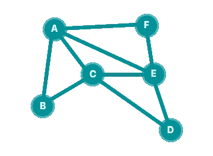
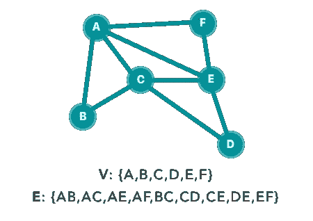
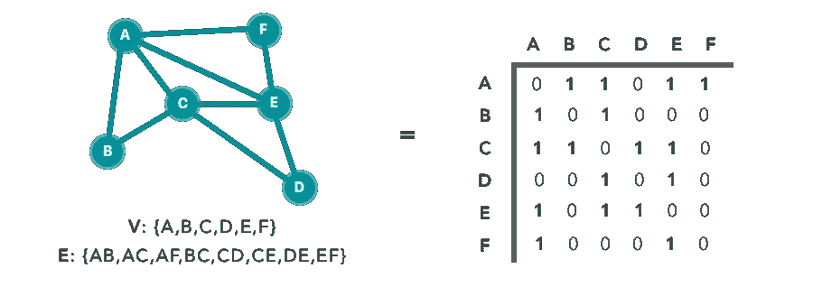
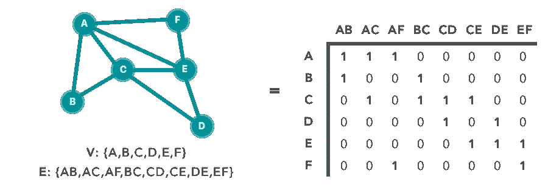

# 图论——集合和矩阵符号

> 原文：<https://towardsdatascience.com/graph-theory-set-matrix-notation-7dfb04b8ed24?source=collection_archive---------12----------------------->

## 第二部分——图论符号的基础

Article Originally Published On [https://www.setzeus.com/](https://www.setzeus.com/)

> 一个图 **G** 由两组项组成:顶点( **V** ) &边( **E** )。换句话说，一个图 G = < V，E >。

## 简单图形—集合符号

在本文中，与本系列的第一篇[相比，我们将通过图表示例来工作。我们要查看的第一个示例图包含了将其归类为 ***简单图的特定属性。*** 简单图是指其*顶点未加权、无向、&不含多条边&自向环的图。*不理解前面的术语没关系，因为我们将在下面的文章中广泛讨论图形属性。现在，让我们从下面的可视化示例开始:](https://medium.com/@jesus_notchrist/graph-theory-history-overview-f89a3efc0478)

Article Originally Published On [https://www.setzeus.com/](https://www.setzeus.com/)

如上图所示，可视化图形表示包含大量有用的信息；然而，为了以一种可操作的方式揭示这些数据，我们需要一种不同的方式来描述图表。首先，为了更好地理解开头的 ***G = < V，E >*** 公式，让我们继续记下上面的例图。为了开始标注，因为我们的顶点缺少标签，我们继续&分配*任何*随机节点标签“A”——然后遍历图形，用比前一个大的字母数字字符标记每个节点。还没有什么新奇的东西，我们所做的只是给上图中的顶点分配一个代表性的角色:

Article Originally Published On [https://www.setzeus.com/](https://www.setzeus.com/)

现在，让我们继续&通过创建两个数字集合来构造图形的数字符号:**顶点&边**。示例图的第一组*顶点*相当简单:它是一组字符 A-F(包括 A-F)。但是我们的优势呢？简单。回想一下，边是连接两个节点的*。因此，一条边可以用它所连接的两个节点来表示；这意味着*边集合包含一系列类似坐标的顶点*。例如，顶点 A &和顶点 B 之间的第一条边最好表示为 ***AB*** 。让我们继续&写出图表其余部分的集合表示:*

updated thanks to [Simon Dedman](https://medium.com/u/c23963b474f7?source=post_page-----7dfb04b8ed24--------------------------------)

如上图所示，我们的图 G 的标准符号可以用两个独立的集合来完美地描述，一个表示顶点*，&一个表示边*。**

*然而，这是进行数学和分析运算的最好方法吗？把它喂给电脑处理怎么样？事实证明，矩阵提供了一个强有力的工具来为一个更加计算机友好的数据集转录图形。让我们回顾一下这两种主要的方法&相应地标注我们的示例图。*

## ***简单图形—矩阵符号***

*计算机更擅长处理数字，而不是识别图片。这也是为什么以矩阵形式向计算机传达图形规格更为常见的原因之一。两种主要类型的矩阵设置是行业惯例:*邻接矩阵&关联矩阵。**

***邻接矩阵***

*相连的顶点被称为*邻居*，或者彼此相邻的*。一个*邻接矩阵*因此描述两个顶点是*邻接(1)* 还是*非(0)* 。邻接矩阵中的每一项都是简单的描述连通性的布尔值。**

**在邻接矩阵中，具有顶点集合 V 和边集合 E 的图 G 转化为大小为 V 的矩阵。在矩阵内部，我们发现 0 或 1——1 表示在行&中标记的顶点与列中标记的顶点是相连的，或者用更恰当的术语来说，它们是相邻的。因此，邻接矩阵是表示为矩阵的图，其中相邻的顶点是唯一的焦点。让我们继续&将我们的示例图转录为下面的邻接矩阵:**

****

**Article Originally Published On [https://www.setzeus.com/](https://www.setzeus.com/)**

****关联矩阵****

**将图形转换成矩阵的第二种常见语法是通过*关联矩阵。*在关联矩阵中，具有顶点集合 V &和边集合 E 的图 G 转化为大小为 V 乘以 E 的矩阵。行&列分别在顶点&边后标注。在矩阵内部，我们再次发现所有的项目都被标记为 0 或 1——更多的布尔值。然而这次，1 表示行&中标注的 ***顶点*** 与列中标注的 ***边*** 相连。**

**关联矩阵的一个有趣的性质是:将一个*列中的每一项相加总会得到两个*。这在直觉上是有意义的，因为简单图中的任何&每条边都只有两个顶点与之相连。让我们继续&将我们的示例图写成关联矩阵:**

****

**Article Originally Published On [https://www.setzeus.com/](https://www.setzeus.com/)**

**比较这两种矩阵符号，我们可以推出一些区别。首先，由于边总是比顶点多，因此邻接矩阵的列数比关联矩阵少。相应地，关联矩阵更稀疏(0 到 1)，因此每个矩阵项的信息量可能更少。最后，邻接矩阵总是遵循正方形矩阵模式，而关联矩阵更可能代表矩形。**

***关键区别在于，前者的行&列代表顶点，而后者的行&列分别代表顶点&边。***

## **过去简单图形**

**现在基本符号已经过时了，是时候继续研究基本的图形属性了，这些属性通常用于描述不同类型的图形。回想一下，我们的示例图早先被定义为简单的图；我[在下一篇文章中，我们将在跳到图论中最激动人心的话题:网络理论之前探索一些图。](https://medium.com/@jesus_notchrist/graph-theory-basic-properties-955fe2f61914)**

*****原载于*****

**[https://www.setzeus.com/](https://www.setzeus.com/)**

*****来源*****

**[图论介绍](https://amzn.to/2GZFyf6)**

**[图论](https://amzn.to/2YVtxNF)**