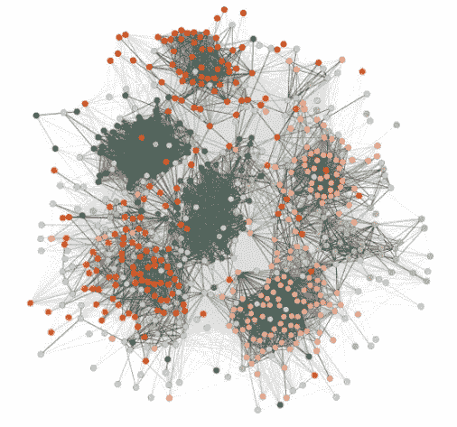
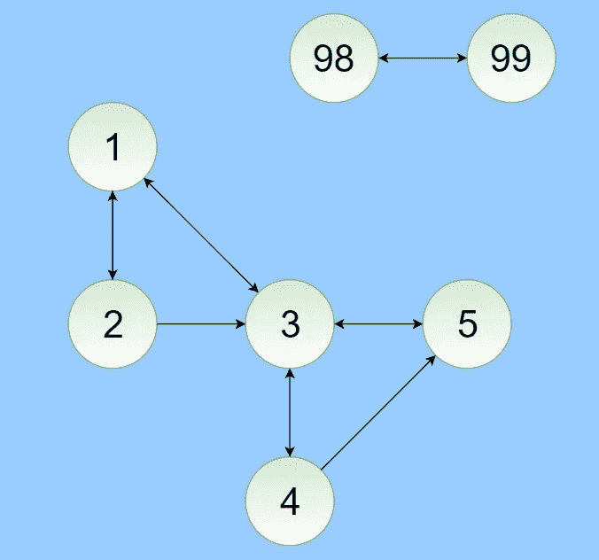
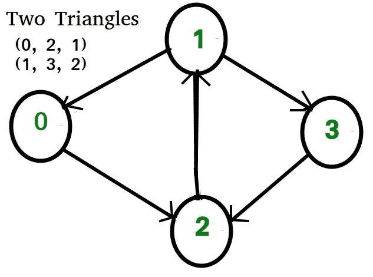

# Jupyter 中的 GraphFrames:实用指南

> 原文：<https://towardsdatascience.com/graphframes-in-jupyter-a-practical-guide-9b3b346cebc5?source=collection_archive---------0----------------------->

最初用于计算生物学的图分析已经成为社交网络分析(社区挖掘和建模作者类型)和推荐系统中越来越重要的数据分析技术。一个简单而直观的例子是曾经非常著名的脸书朋友聚类图，它可视化了你的脸书网络的隐藏结构。

有一段时间，权力图分析一直是学术界、脸书或 Twitter 内部人士的一门学科。但是自从 GraphX 和 Graphframes 之类的软件包发布以来，每个拥有一点数据和一个 Jupyter 笔记本的人都可以很容易地在迷人的图形世界中玩耍。



lostcircles.com

在这篇文章中，我提供了一个关于 Jupyter 笔记本中 Graphframes API 的大范围的玩笑。首先，我们通过设置 Jupyter 笔记本环境来使用 GraphFrames 包(在 Windows 机器上)。然后，我们将了解基本功能以及如何将数据导入框架，最后解释一些常用的高级功能。请注意，本文假设您对 Spark 和 Spark 数据帧有基本的了解。

> GraphX 对于 rdd 就像 GraphFrames 对于 DataFrames 一样。

GraphFrames 和 GraphX 的功能基本相同，唯一的区别是 GraphFrames 基于 Spark 数据帧，而不是 rdd。如果你习惯使用 GraphX，那么浏览一下 [API 文档](https://graphframes.github.io/api/python/graphframes.html)，Graphframes 应该很容易学会。

# 设置环境

在继续之前，首先要检查的是确保 Spark 和 pyspark 正确安装在您的机器上。为了简单起见，在本教程中，我们将在本地模式下运行 spark。检查这一点最简单的方法是在 Python 发行版的外壳中输入 *pyspark* 。如果两者都安装正确，您应该会看到如下内容:

```
Welcome to
      ____              __
     / __/__  ___ _____/ /__
    _\ \/ _ \/ _ `/ __/  '_/
   /__ / .__/\_,_/_/ /_/\_\   version 2.xx.xx
      /_/

Using Python version 3.xx.xx
```

关于设置 Apache Spark 和 pyspark 的更多信息，我推荐[本教程](https://www.youtube.com/watch?v=WQErwxRTiW0)和[官方文档](https://spark.apache.org/docs/latest/api/python/index.html)。

接下来，您希望在 Jupyter 笔记本中设置环境变量来运行 pyspark(而不是 shell)。这可以通过添加两个环境变量来轻松实现:

```
set PYSPARK_DRIVER_PYTHON=jupyter
set PYSPARK_DRIVER_PYTHON_OPTS=notebook
```

然后导航到您想要存储新笔记本的位置，并在您的 shell 中再次运行 *pyspark* ，但是添加一个 *packages* 标志并指示您想要使用 GraphFrames 包。这里使用的是最新版本，但是任何旧版本都可以通过更改参数的最后一部分来使用:

```
pyspark --packages graphframes:graphframes:0.5.0-spark2.1-s_2.11
```

创建新笔记本，并确保您可以成功运行:

```
from graphframes import *
```

# 入门指南

令人惊讶的是，这个包的核心类是 GraphFrame。GraphFrame 总是从顶点数据帧(例如用户)和边数据帧(例如用户之间的关系)创建的。两个数据帧的模式都有一些强制列。顶点数据帧必须包含一个名为 *id* 的列，用于存储唯一的顶点 id。edges DataFrame 必须包含一个名为 *src* 的列，用于存储 edge 的源，以及一个名为 *dst* 的列，用于存储 edge 的目的地。所有其他列都是可选的，可以根据需要添加。

一个简单的例子是:

```
from pyspark import *
from pyspark.sql import *spark = SparkSession.builder.appName('fun').getOrCreate()vertices = spark.createDataFrame([('1', 'Carter', 'Derrick', 50), 
                                  ('2', 'May', 'Derrick', 26),
                                 ('3', 'Mills', 'Jeff', 80),
                                  ('4', 'Hood', 'Robert', 65),
                                  ('5', 'Banks', 'Mike', 93),
                                 ('98', 'Berg', 'Tim', 28),
                                 ('99', 'Page', 'Allan', 16)],
                                 ['id', 'name', 'firstname', 'age'])
edges = spark.createDataFrame([('1', '2', 'friend'), 
                               ('2', '1', 'friend'),
                              ('3', '1', 'friend'),
                              ('1', '3', 'friend'),
                               ('2', '3', 'follows'),
                               ('3', '4', 'friend'),
                               ('4', '3', 'friend'),
                               ('5', '3', 'friend'),
                               ('3', '5', 'friend'),
                               ('4', '5', 'follows'),
                              ('98', '99', 'friend'),
                              ('99', '98', 'friend')],
                              ['src', 'dst', 'type'])g = GraphFrame(vertices, edges)## Take a look at the DataFrames
g.vertices.show()
g.edges.show()## Check the number of edges of each vertex
g.degrees.show()
```

你当然希望使用真实的数据。您可以将从简单的 csv 文件到拼花文件的任何内容导入到数据帧中。然后适当地命名您的列，过滤(如果需要)并从那里继续前进。关于将数据导入 Spark 数据帧的更多信息可在[文档](https://spark.apache.org/docs/2.2.0/api/python/pyspark.sql.html#pyspark.sql.DataFrame)中找到。

我们刚刚创建的 GraphFrame 是一个有向图，可以如下图所示:



# 有向边与无向边

无向图的边没有方向。这些边表示双向关系，因为每个边都可以在两个方向上遍历。如果数据帧仅由双向有向边组成，您可能会对分析无向边感兴趣。如果 *src ≥ dst* (或者相反)，您可以通过在 edges 数据帧上映射一个函数来转换您的图形，该函数会删除该行。在 GraphX 中，您可以使用 *to_undirected()* 来创建一个深度的、无方向的图形副本，不幸的是 GraphFrames 不支持这个功能。

在下面的代码片段中可以找到一个简单的例子来解决这个缺失的功能。请注意,“跟随”边在无向图中没有实际意义，因为它不代表双向关系。

```
copy = edgesfrom pyspark.sql.functions import udf[@udf](http://twitter.com/udf)("string")def to_undir(src, dst):
    if src >= dst:
        return 'Delete'
    else : 
        return 'Keep'copy.withColumn('undir', to_undir(copy.src, copy.dst))\
.filter('undir == "Keep"').drop('undir').show()## for efficiency, it's better to avoid udf functions where possible ## and use built-in pyspark.sql.functions instead.
```

# 过滤和连接组件

GraphFrame 本身不能被过滤，但是从 Graph 中推导出的 DataFrames 可以。因此，*filter*-函数(或任何其他函数)可以像使用数据帧一样使用。唯一的陷阱可能是引号的正确使用:整个条件应该被引用。下面的例子应该可以澄清这一点。

```
g.vertices.filter("age > 30").show()g.inDegrees.filter("inDegree >= 2").sort("inDegree", ascending=False).show()g.edges.filter('type == "friend"')
```

图的连通分支是这样的子图，其中任意两个顶点通过一条或多条边相互连接，并且在超图中不连接任何额外的顶点。在下面的(无向)示例中，有三个相连的组件。连通分量检测对于聚类很有意义，而且可以使计算更有效。


Source: Wikipedia

实际上，GraphFrames 要求您设置一个目录来保存检查点。在您的工作目录中创建这样一个文件夹，并在 Jupyter 中放置下面一行(其中 *graphframes_cps* 是您的新文件夹)来设置检查点目录。

```
sc.setCheckpointDir('graphframes_cps')
```

然后，可以用 *connectedComponents* 函数很容易地计算出连通分量。

```
g.connectedComponents().show()
```

我们的迷你图有两个相连的组件，在*组件*列中对每个顶点进行了描述。

```
+---+------+---------+---+------------+
| id|  name|firstname|age|   component|
+---+------+---------+---+------------+
|  1|Carter|  Derrick| 50|154618822656|
|  2|   May|  Derrick| 26|154618822656|
|  3| Mills|     Jeff| 80|154618822656|
|  4|  Hood|   Robert| 65|154618822656|
|  5| Banks|     Mike| 93|154618822656|
| 98|  Berg|      Tim| 28|317827579904|
| 99|  Page|    Allan| 16|317827579904|
+---+------+---------+---+------------+
```

# 主题发现

寻找主题有助于执行查询以发现图形中的结构模式。网络主题是图形中重复出现的模式，代表顶点之间的关系。GraphFrames motif finding 使用声明性领域特定语言(DSL)来表达结构化查询。

可以通过使用*find*-函数调用查询，其中 motif(在引号中)被表示为函数的第一个参数。

下面的例子将搜索由边*e*连接的顶点对 *a* 、 *b* 和由边 *e2* 连接的顶点对 *b* 、 *c* 。它将返回图形中所有此类结构的数据帧，其中包含主题中每个命名元素(顶点或边)的列。

```
g.find("(a)-[e]->(b); (b)-[e2]->(a)").show()
```

如果边和/或顶点是匿名的，它们将不会显示在结果数据帧中。主题可以用分号连接，也可以用感叹号否定。关于领域特定语言的更多细节可以在[文档](http://graphframes.github.io/user-guide.html#motif-finding)中找到。

例如，我们可以尝试为任何一对用户 *a* 和 *c* 找到共同的朋友。为了成为共同的朋友 *b* , *b* 必须是既有 *a* 又有 *c* 的朋友(而不仅仅是后面跟着 *c* 之类的)。

```
mutualFriends = 
g.find("(a)-[]->(b); (b)-[]->(c); (c)-[]->(b); (b)-[]->(a)")\
.dropDuplicates()
```

要查询 *2* 和 *3* 之间的所有共同好友，我们可以过滤数据帧。

```
mutualFriends.filter('a.id == 2 and c.id == 3').show()
```

*b*-列将显示所有共同的朋友(在本例中只有一个)。

```
+--------------------+--------------------+--------------------+
|                   a|                   b|                   c|
+--------------------+--------------------+--------------------+
|[2, May, Derrick,...|[1, Carter, Derri...|[3, Mills, Jeff, 80]|
+--------------------+--------------------+--------------------+
```

# 三角形计数和 PageRank

最后，我们将发现两个额外的内置算法。TriangleCount 计算通过此图中每个顶点的三角形数量。三角形可以定义为一组相互关联的三个顶点，即 *a* 有一条边到 *b* , *b* 有一条边到 *c* ，以及 *c* 有一条边到 *a* 。下面的例子显示了一个有两个三角形的图形。



geeksforgeeks.org

在 GraphFrames 包中，你可以通过调用*triangle count*-函数来计算通过每个顶点的三角形数量。请注意，我们的简单示例总共只有两个三角形。三角形用于现实网络中的各种任务，包括社区发现、链接预测和垃圾邮件过滤。

```
g.triangleCount().show()
```

我们讨论的最后一个函数是 PageRank。PageRank 的工作原理是通过计算一个页面的链接数量和质量来粗略估计该网站的重要性。潜在的假设是，更重要的网站可能会从其他网站收到更多的链接。

PageRank 算法认为，一个假想的随机点击链接的冲浪者最终会停止点击。在任何一步，这个人继续下去的概率是一个阻尼因子。阻尼系数可以通过改变*重置概率*参数来设置。其他重要的参数是公差( *tol* )和最大迭代次数( *maxIter* )。

```
pr = g.pageRank(resetProbability=0.15, tol=0.01)## look at the pagerank score for every vertex
pr.vertices.show()## look at the weight of every edge
pr.edges.show()
```