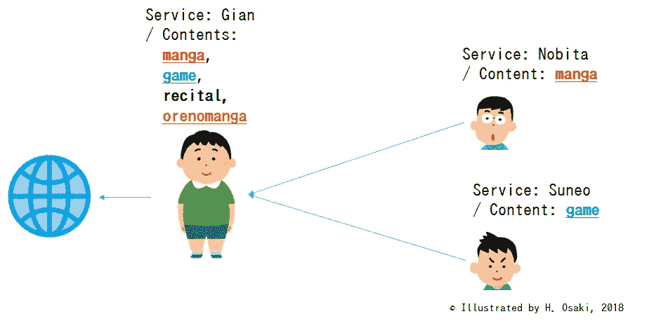
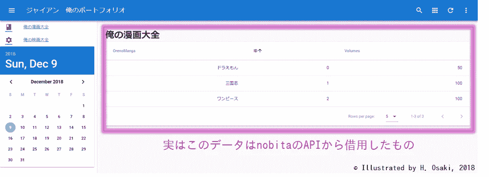
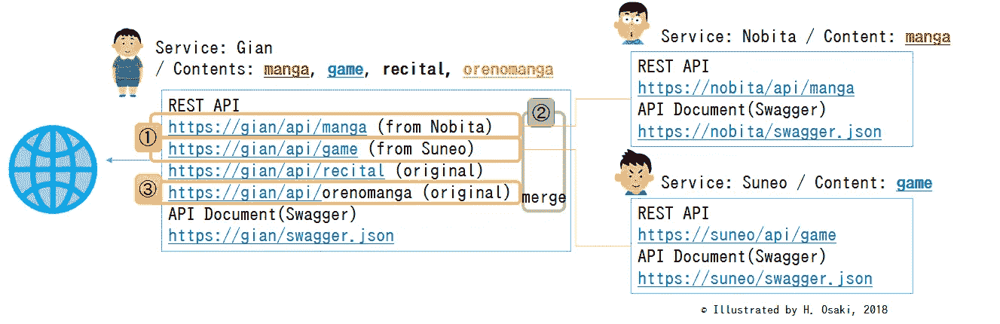
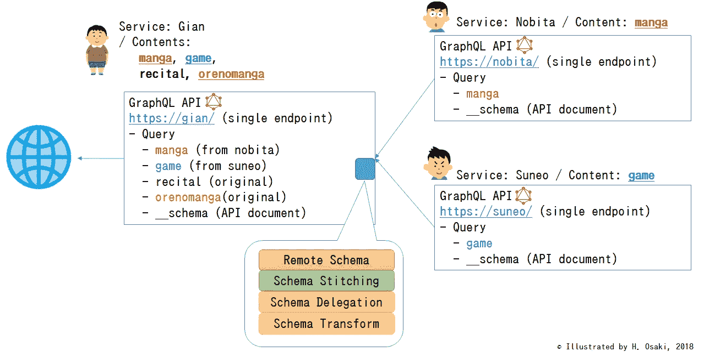
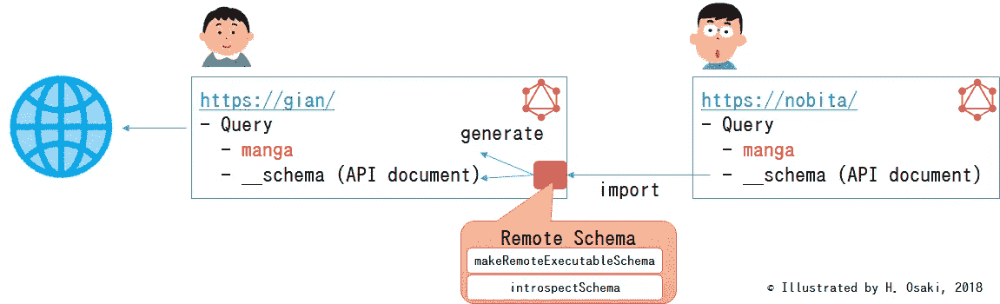
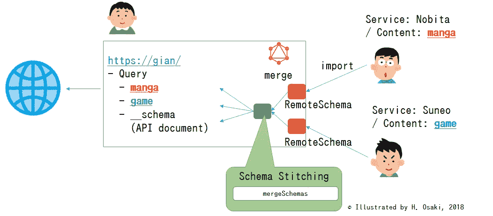
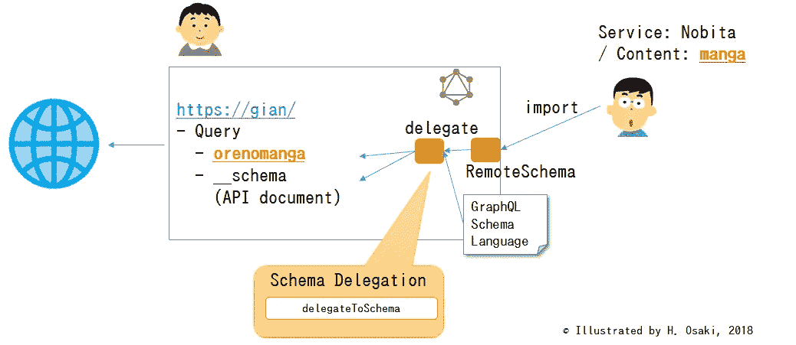
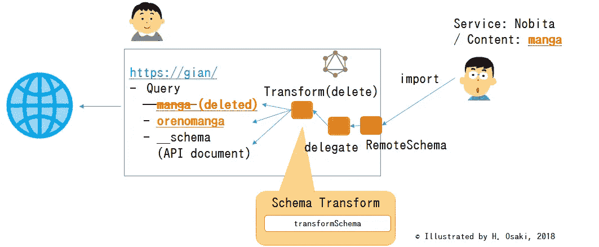

# GraphQL 模式用例及功能

> 原文：<https://towardsdatascience.com/graphql-schema-use-case-and-functions-731ec4a39061?source=collection_archive---------25----------------------->

## 使用 graphql-tools 复制、混合和定制现有的 API

在本文中，我介绍了 GraphQL API 的一些用例。对于新 API 的创建，有用的功能有“远程模式”、“模式拼接”、“模式转换”。它们能够复制、混合和定制现有的 API 模式。

# 用例

One API service called “Gian” is created from existing APIs called “Nobita” and “Suneo”

有时我们使用现有的 API 来创建新的 API。有人会从别人的 API 中复制 API 模式。其他人会将一个 API 模式与另一个 API 模式混合在一起。

“Gian” web service frontend utilizing API “manga” originated in “Nobita” API

## 如果您在 REST API 世界中

这是一个 web 服务“Gian”的用例。这个服务有一些 API(REST API)。大多数 API 源自其他服务“Nobita”和“Suneo”。

1.  “漫画”API 是从一个服务大雄**复制**而来，“游戏”API 是从一个服务 Suneo】复制而来
2.  服务巨人融合了服务大雄和服务太阳
3.  orenomanga 的 API 是原创的，但它的内容来自“漫画”API。服务 Gian 修改 API 的内容。(例如。添加新字段或重命名现有字段。)

您可以使用 API 网关工具，但是管理许多 API 是一件困难的事情。

# 有用的功能:在 GraphQL 世界中复制、混合和定制模式

GraphQL 和一些工具为复制、混合和定制 API 准备了有用的函数。

*   [初步]模式自省
*   API 复制的远程模式
*   用于 API 混合的模式拼接
*   用于 API 复制和定制的模式委托
*   用于 API 定制(修改)的模式转换

## 初步知识:GraphQL 中的模式检查

在 GraphQL 中，你只用 GraphQL Schema 语言定义数据类型，然后 GraphQL 服务器自动提供 API 和文档并发布。例如，服务 Nobita 定义了以下数据类型。

GraphQL 模式语言包括数据名称、类型和描述。这些信息被重组为 API 规范文档的格式，称为自省。您可以通过特殊查询`__schema.`向 GraphQL 服务器请求这些信息

GraphQL schema creates API and document (__schema) automatically.

自省使 GraphQL 服务器和客户机能够共享模式并验证查询。

## 功能 1(复制一个 API)“远程模式”

**远程模式**从远程 GraphQL 服务器获取 API 模式🤔。

Remote schema enables Gian to copy Nobita’s API schema and reproduce it.

当大雄 web 服务正在发布其 API 文档时，`graphql-tools makeRemoteExecutableSchema` [(→ref)](https://www.apollographql.com/docs/graphql-tools/remote-schemas.html) 可以获取 API 文档并复制 API。此函数接收远程 GraphQL 服务器 URL 作为参数。`introspectSchema`在通常情况下连用。

Web service Gian. (gian.ts)

`graphql-tools`中的`makeRemoteExecutableSchema`获取大雄的 API 文档(__schema)并在该服务器中生成可执行的 API 和自己的文档。😲

这个 web 服务器从下面几行开始😜

Starting web service Gian

## 功能 2(混合 API)“模式拼接”

融合大雄的 API 和 Suneo 的 API(模式拼接)🤔

`graphql-tools`的`mergeSchemas`(→[ref](https://www.apollographql.com/docs/graphql-tools/schema-stitching.html))作为模式拼接工具非常好用。

过程

*   使用远程模式获取 Nobita 和 Suneo 的模式(上一节)
*   将模式数组传递给`mergeSchemas` 参数`schemas`

现在我们有了一个新的服务，包括现有的多个 API😀

## 功能 3(复制和定制 API)“模式委托”

当您想要复制 API 模式并进行一些定制时(例如重命名查询字段)，可以使用`Schema Delegation`的[(→ref)`graphql-tools.`的](https://www.apollographql.com/docs/graphql-tools/schema-delegation.html)

你可以在 query `resolver`中使用`delegateToSchema`，然后你让你的服务器上的任何请求转移到指定的服务器并进行查询。

以下示例显示了将原始的`manga` 查询重命名为另一个名称`orenomanga`😳

## 功能 4(修改 API)“模式转换”

当你想定制一个现有的 API(例如删除查询字段)，你可以使用`Schema Transforms`[(→ref)`graphql-tools.`的](https://www.apollographql.com/docs/graphql-tools/schema-transforms.html)

以下示例暗示原始查询`manga`被 Gian 移除😱

`transformSchema`的第二个参数是转换类型。在本例中，它被设置为`FilterRootFields`，这意味着“场移除”。

其他转换

*   **过滤器类型** /移除类型/有时使用
*   有时重命名类型/使用
*   **TransformRootFields，RootField /** 修改查询、变异、订阅/很少使用之一
*   **FilterRootFields /** 删除字段/使用大部分
*   **重命名根字段** /重命名字段/常用
*   **ExtractField /** 换路径/不太懂……
*   **WrapQuery** /也许全能/不太懂…

# 摘要

GraphQL 和`graphql-tools` 是优秀的工具🍺

*   复制/ `makeRemoteExecutableSchema,` `introspectSchema` / **这么有用**
*   迸/ `mergeSchemas` / **有用的**
*   定制/ `transformSchema` /也许有用

我没有提到模式指令。您可以通过身份验证来限制访问。

# 遗留问题

如果重用 API，可能会遇到新的问题。

*   N+1 problem⌛️
    有时候，会出现性能问题。模式拼接可能会从一个请求带来 N+1 个请求的结果。用于批处理查询的数据加载器对于这类问题是有效的。数据加载器由来自脸书的 GraphQL 联合开发者 Lee Byron 开发。
*   版权问题👁
    当您使用任何其他人的 API 时，您必须遵守规则。例如，当重用的 API 需要 creative commons cc-by 时，必须说明作者的姓名。您可以向 GraphQL 响应添加元数据，并使用中间件进行定制。

# 摘要

GraphQL 工具(远程模式和模式拼接)支持复制、混合和定制 API。很简单。