# 图形和 ML:线性回归

> 原文：<https://towardsdatascience.com/graphs-and-linear-regression-734d1446e9cd?source=collection_archive---------5----------------------->

*为了启动机器学习的一系列 Neo4j 扩展，我实现了一组* [*用户定义的过程*](https://neo4j.com/docs/developer-manual/current/extending-neo4j/procedures/#user-defined-procedures) *，在图形数据库中创建线性回归模型。在这篇文章中，我演示了在 Neo4j 浏览器中使用线性回归来建议德克萨斯州奥斯汀的短期租赁价格。让我们来看看用例:*


Photo from Yelp user Benigno A. ([https://www.yelp.com/user_details?userid=GS2R_auCwoSzfQccLJIY6Q](https://www.yelp.com/user_details?userid=GS2R_auCwoSzfQccLJIY6Q))

德克萨斯州奥斯汀最受欢迎的地区是通过邮政编码的最后两位数字“04”来识别的。这里有最时尚的俱乐部、餐馆、商店和公园，“04”是游客经常去的地方。假设你是一个将要去度假的奥斯汀当地人。你想趁你不在的时候，通过出租你的房子来利用你的邻居的声望。然而，你在每晚收费多少上有点卡住了。

[此处](https://github.com/johnymontana/neo4j-listings/blob/master/Neo4j%20Short%20Term%20Rental%20Listings.ipynb) William Lyon 使用 Neo4j 对德克萨斯州奥斯汀的现有短期房屋租赁进行建模。除了每晚的价格，每个`Listing`节点还包含诸如卧室数量、浴室数量、容纳的客人数量和可用性等属性。你家有四间卧室，两间浴室，可以住五个客人。我们如何使用存储在 Will 图表中的住房数据来为您的列表预测合适的每夜房价？

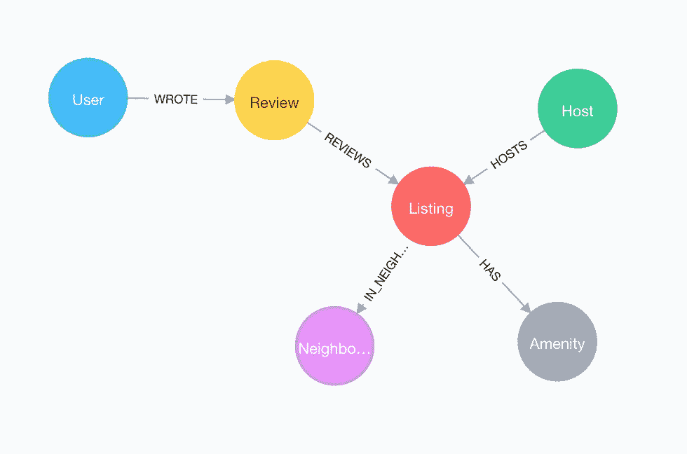

Will’s data model demonstrates that the data set is well suited for Neo4j

我们必须以某种方式量化*未知变量*(价格)和*已知变量*(卧室、浴室和可容纳的客人数量)之间的关系。住房市场中的许多价格预测者使用房间总数来预测住房价格。他们假设价格和房间数量之间的关系是线性的。我们将把这一理念扩展到短期租赁市场。*线性回归*是一种用于分析变量之间关系的工具，在这里，它可以用于量化每晚租金与列表中总房间数之间的关系。

# **一些背景:**

回归是建模两个变量之间关系的线性方法。**因变量**、 *y* ，是我们希望预测的数量(在本例中是租赁价格)。我们使用**独立**变量的已知值，“ *x* ”来预测因变量。简单线性回归的目标是创建一个以自变量为输入并输出因变量预测值的函数。记得代数课吗？由于模型是一条线，所以以`*y* = **a** + **b****x*` 的形式写出来，可以让它用两个参数唯一表示:
斜率( **b** )和截距( **a** )。


[https://en.wikipedia.org/wiki/Linear_regression](https://en.wikipedia.org/wiki/Linear_regression)

目测有几个( *x* ， *y* )数据点的图。简单的线性回归找出通过点的直线，这些点与数据最“符合”。为了确定最佳拟合线，我们使用最小二乘法的[方法找到系数 **a** 和 **b** ，这些系数根据线性模型`*y* = **a** + **b****x*`最小化每个观察值的**实际** *y* 值与其**预测** *y* 值之间的平方差之和。](http://mathworld.wolfram.com/LeastSquaresFitting.html)

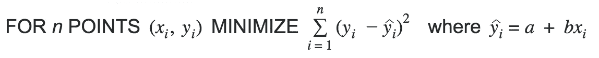

有几种测量方法试图量化模型的成功，或它与数据的“拟合”程度。例如，*决定系数(R )* 是从自变量中可预测的因变量方差的比例。系数 R = 1 表示因变量的方差完全可以从自变量中预测出来(因此模型是完美的)。

线性回归是统计学中最流行的工具之一，它经常被用作机器学习的预测器。

# 等等，这是图的问题吗？

最小二乘法可以追溯到 19 世纪早期。它不依赖于数据可能存储在图中的事实。如果不是图形问题，为什么要在 Neo4j 中实现线性回归？因为在我们的例子中，我们感兴趣的数据已经存在于一个图表中了！

图表是租赁数据模型的合理选择，因为短期租赁数据固有的关联特性，建模为
`(:User)-[:WRITES]->(:Review)-[:REVIEWS]->(:Listing)`
以及列表、用户和评论的持续更新。线性回归可能不是图的问题，但数据集总体上肯定是。价格预测只是我们想要做的整体分析的一部分。在 Neo4j 中实现回归程序可以让我们避免将数据导出到另一个软件中的麻烦。通过这种方式，我们可以利用图形数据库的独特功能，同时也不会忘记更传统的统计方法，如线性回归。我们还创建了另一个构建模块，用于在我们的图形数据上运行更复杂的分析管道。

关于这些[用户自定义过程](https://neo4j.com/docs/developer-manual/current/extending-neo4j/procedures/#user-defined-procedures)的实现细节，请查看我的[下一篇文章](https://medium.com/@lauren.shin/a-developers-look-ml-models-in-neo4j-7d4cbacb320c)。在这里，我们将在创建过程之后进行分析。

# 我们开始吧

## 安装程序

在 [Neo4j 桌面](https://neo4j.com/download/)中创建项目和数据库。从最新的[线性回归版本](https://github.com/neo4j-graph-analytics/ml-models/releases/latest)下载 jar 文件。将 JAR 文件放到数据库的 plugins 文件夹中。将`regression`包的内容添加到*管理- >设置*底部的已识别程序中。如果你已经安装了 [APOC](https://neo4j-contrib.github.io/neo4j-apoc-procedures/) 和[图形算法](https://neo4j.com/developer/graph-algorithms/)，它看起来会像这样:

```
dbms.security.procedures.whitelist=algo.*,apoc.*,regression.*
```

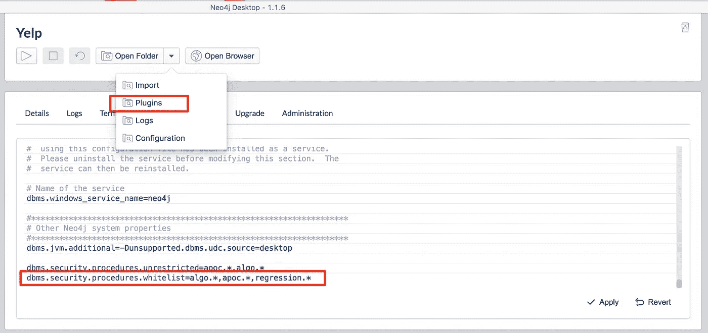

How to add to a Neo4j Desktop Database

重新启动数据库。奔跑

`CALL dbms.procedures() YIELD name WHERE name CONTAINS 'regr' RETURN *`

检查`regression.linear.*`程序是否可以使用。

## 导入数据

打开 Neo4j 浏览器。从 Neo4j 浏览器运行`:play http://guides.neo4j.com/listings`,按照导入查询创建威尔的短期租赁列表。

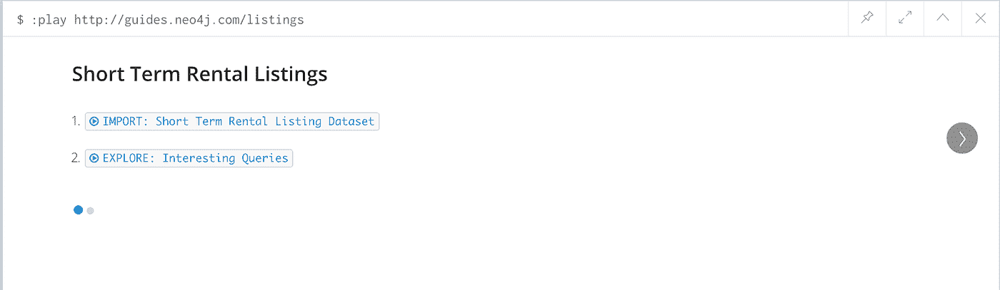

Neo4j Browser Guide (Slides) for the Rental Listings

## 添加我们的列表

创建一个新的`Listing`节点，代表我们希望添加到“04”短期租赁市场的房屋。在图中，每个`Neighborhood`都可以通过存储在属性`neighborhood_id`中的邮政编码来识别。

```
MATCH (hood:Neighborhood {neighborhood_id:'78704'})
CREATE (list:Listing 
      {listing_id:'12345', bedrooms:4, bathrooms:2, accommodates:5}) 
MERGE (list)-[:IN_NEIGHBORHOOD]->(hood)
```

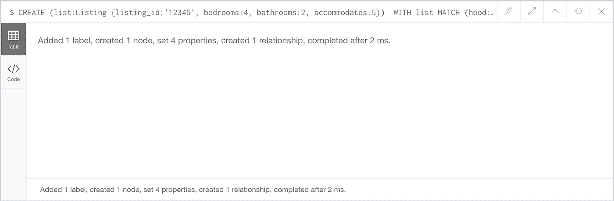

## 分割训练和测试数据

我们应该使用哪个房屋数据子集来创建模型？房价因位置而异，所以让我们只使用位于“04”附近的列表来创建一个模型。列表节点包含`bedrooms`和`bathrooms`属性，所以我们将这两个值的和作为房间总数的近似值。因此，我们的数据集是“04”邻域中具有有效的`price`、`bedrooms`和`bathrooms`属性的所有列表。

我们可以使用整个数据集来训练模型，但这样我们就无法在看不见的数据上测试模型的性能。因此，我们将数据集分成 75:25(训练:测试)的样本。从所有合格的列表节点中收集节点 id，并使用`regression.linear.split`函数随机选择 75%的数据集。用`Train`标记这个子集。

```
MATCH (list:Listing)-[:IN_NEIGHBORHOOD]->(:Neighborhood {neighborhood_id:'78704'}) 
WHERE exists(list.bedrooms) AND exists(list.bathrooms)
AND exists(list.price) 
WITH regression.linear.split(collect(id(list)), 0.75) AS trainingIDs
MATCH (list:Listing) WHERE id(list) in trainingIDs 
SET list:Train
```

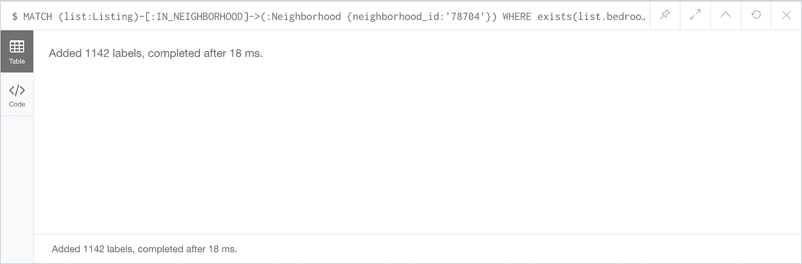

将`:Test`标签添加到数据集中剩余的列表节点。

```
MATCH (list:Listing)-[n:IN_NEIGHBORHOOD]->(hood:Neighborhood {neighborhood_id:'78704'})
WHERE exists(list.bedrooms) AND exists(list.bathrooms)
AND exists(list.price) AND NOT list:Train SET list:Test
```

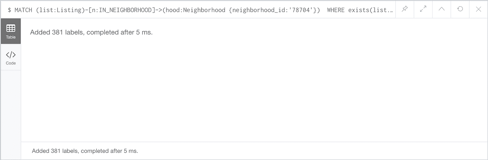

## 初始化模型

查看我们的`create`程序，它有这样的签名:

```
create('model-name', 'model-type' = 'Simple',
       constantTerm? = true, noOfIndependentVars = 1)
```

为了给将来使用相同的`create`程序实施多元线性回归创造灵活性，您必须输入模型类型`'Simple'`。create 过程还将模型是否应该包含常数项和独立变量的数量作为参数。这些默认设置分别等于`true`和`1`。如果您知道您的数据在其整个域***上遵循一个*线性关系，并且*必须经过原点*，则仅使用`false`排除常数项。****

**`CALL regression.linear.create('rental prices', 'Simple', true, 1)`**

**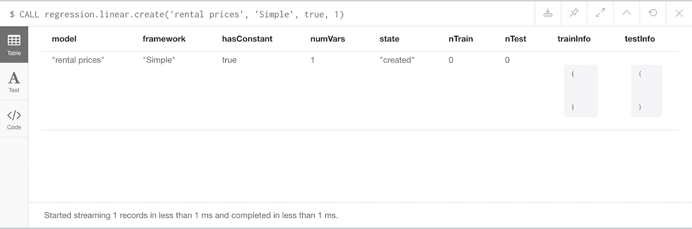**

## **添加培训数据**

**找到所有标有`Train`的`Listing`节点，添加每个对应的(`bedrooms`、`price`)数据点。如果我们不小心多次添加来自同一个列表的数据，我们的模型将会不太准确。作为额外的预防措施，让我们用标签`Seen`来标记`Listing`节点，以表明训练数据已经被添加到模型中:**

```
MATCH (list:Listing:Train) WHERE NOT list:Seen 
CALL regression.linear.add('rental prices',
     [list.bedrooms+list.bathrooms], list.price) 
SET list:Seen
```

> **注意，`regression.linear.add`程序采用`List<Double>`类型的独立变量，即使这是简单的线性回归。这保留了将来创建多元线性回归(具有多个独立变量)并继续使用相同程序的灵活性。**

**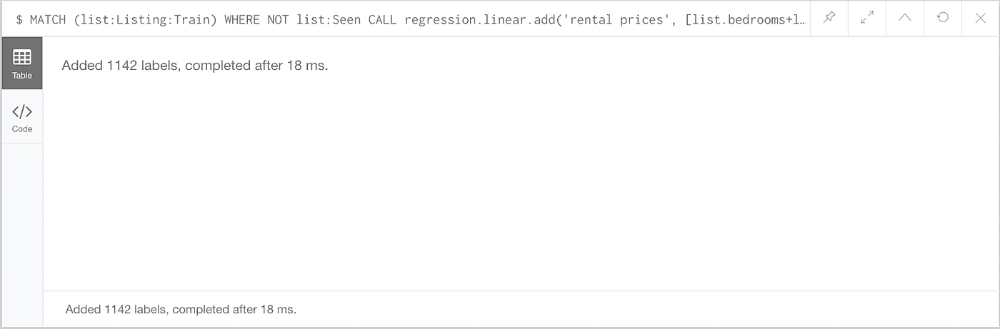**

## **检查模型**

**注意*在*的任何一点，你都可以调用`info`程序。它将总是返回关于模型的信息流，并且如果模型的状态表明这些字段是有效的，它将使用关于训练和测试数据的统计来填充`trainInfo`和`testInfo`映射。**

```
CALL regression.linear.info('rental prices')
```

**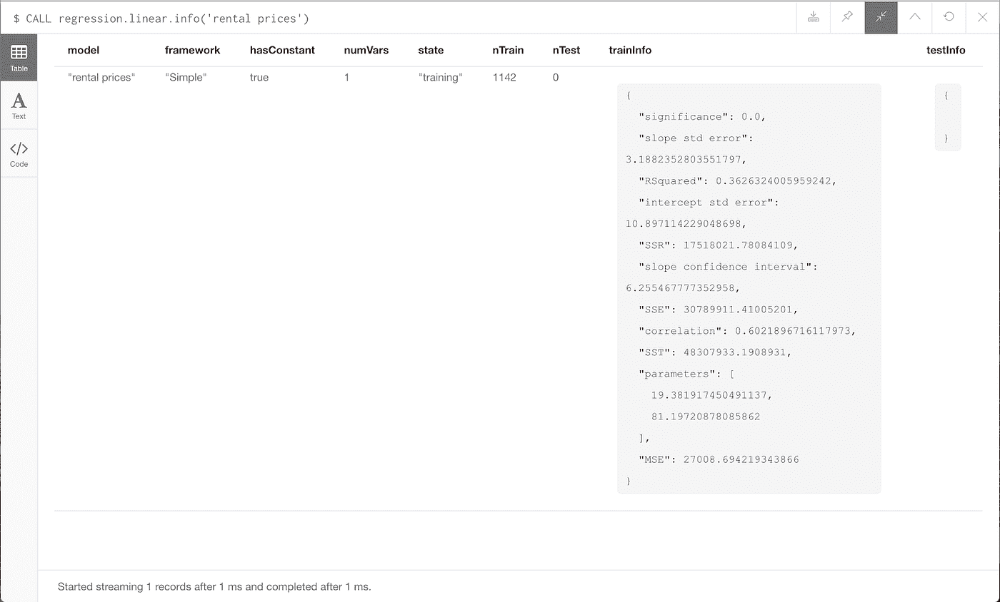**

# **添加测试数据**

**既然我们已经训练了模型，我们需要在看不见的数据上测试它的性能。添加测试数据:**

```
MATCH (list:Listing:Test) WHERE NOT list:Seen 
CALL regression.linear.add('rental prices', 
               [list.bedrooms + list.bathrooms], list.price, **'test'**) 
SET list:Seen
```

> **注意，为了添加测试数据，我们使用相同的`add`过程，但是将数据类型(采用默认值`'train'`)设置为`'test'`。**

**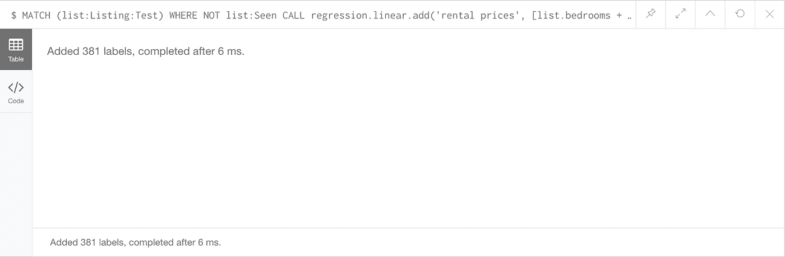**

# **执行测试计算**

**一旦我们最终确定了测试数据，调用`test`程序来分析模型。**

```
CALL regression.linear.test('rental prices')
```

**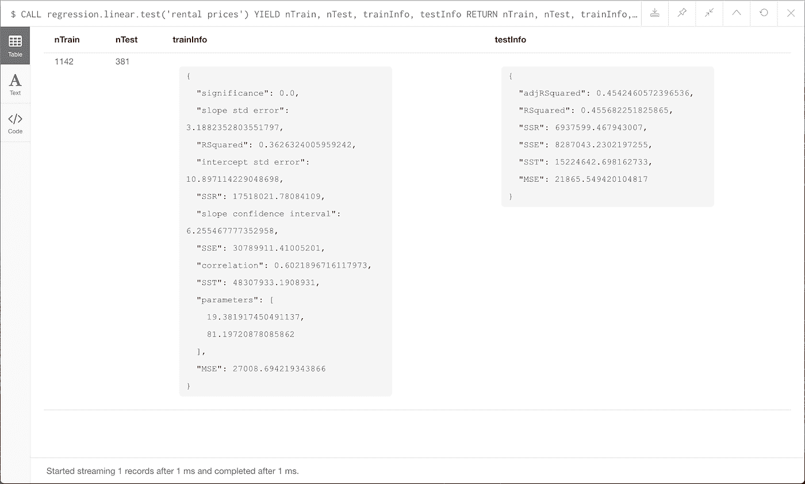**

**在这种情况下，**训练** R = 0.363，**测试** R = 0.456。该模型预测测试数据中出现的方差比训练中出现的方差比例更大！虽然这两个值都比我们希望的要低一点(理想情况下，R 为 0.6 或更大)，但这些数字表明模型在看不见的数据上表现相似。为了直观的理解，您可以看到测试数据比训练数据更接近趋势线。这是因为采样的测试数据点较少:**

**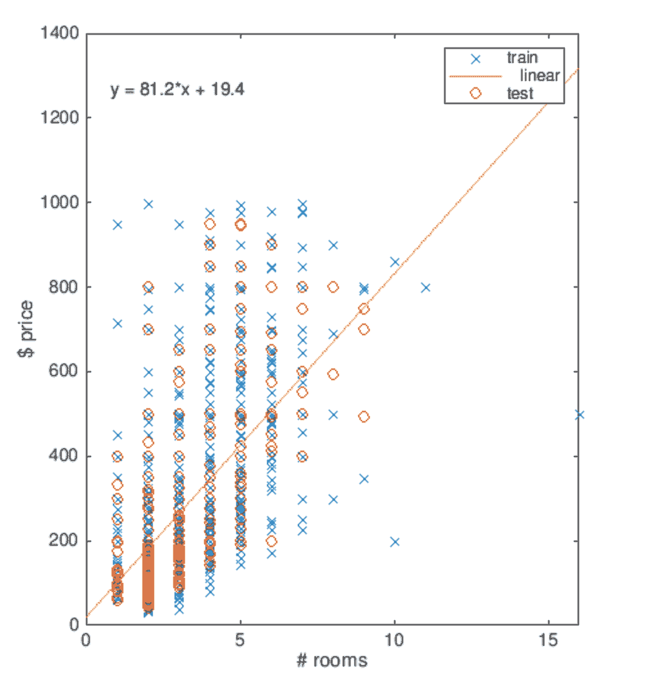**

# **做出并存储预测**

**这些线性回归过程是用来自 [Commons Math](http://commons.apache.org/proper/commons-math/javadocs/api-3.3/org/apache/commons/math3/stat/regression/SimpleRegression.html) 库的`SimpleRegression`构建的。虽然过程`regression.linear.train`确实存在，并且将用于具有多个独立变量的未来线性模型，但是对于简单回归，不需要调用`train`过程(如果调用，它将只返回关于模型的信息)。只要模型中有两个或更多数据点，模型就能够做出预测*。作为用户，您可以决定是否在进行预测之前对模型进行测试。***

**既然我们已经测试了模型，我们可以做出明智的价格预测。我们可以使用用户定义的**函数** `regression.linear.predict`来预测您在“04”中列出的 4 卧室、2 浴室(总共大约 6 个房间)的价格:**

```
RETURN regression.linear.predict('rental prices', [6])
```

**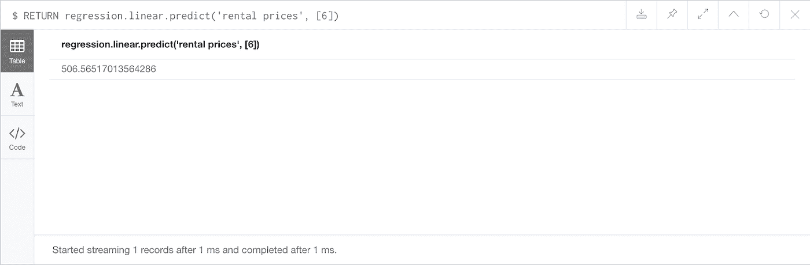**

**或者在图表中为每个价格未知的“04”列表进行预测并存储预测:**

```
MATCH (list:Listing)-[:IN_NEIGHBORHOOD]->
      (:Neighborhood {neighborhood_id:'78704'})
WHERE exists(list.bedrooms)and exists(list.bathrooms) 
  AND **NOT exists(list.price)**WITH list, list.bedrooms + list.bathrooms as rooms
SET list.predicted_price = 
  regression.linear.predict('rental prices', [rooms])
RETURN DISTINCT rooms, list.predicted_price AS predictedPrice 
ORDER BY rooms
```

**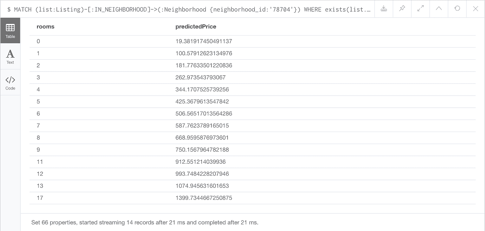**

**现在，所有“04”列表都存储了推荐价格，可以提供给主机，以帮助他们做出明智的价格选择。**

# **编辑测试/培训数据**

**我们对数据集一无所知，只知道所有列表都位于“04”中，并且包含有效的`bedrooms`、`bathrooms`和`price`数据。让我们通过排除不受欢迎的列表来改进我们的模型。我们将只列出属于`(:Review)-[:REVIEWS]->(:Listing)`关系的数据点，这表明该列表至少有一个审查。希望这将消除来自新上市房源的数据(潜在的不可靠定价)。**

**首先，通过**从“租赁价格”模型中复制培训数据**来创建一个新模型。**

```
CALL regression.linear.create('popular rental prices', 'Simple')
```

****

```
CALL regression.linear.copy('rental prices', 
                            'popular rental prices')
```

**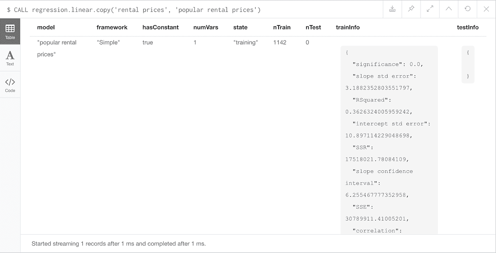**

**然后通过从没有评论的列表中删除数据来编辑模型。**

```
MATCH (list:Listing:Train) 
WHERE **NOT (:Review)-[:REVIEWS]->(list)** 
CALL regression.linear.**remove**('popular rental prices',  
       [list.bedrooms+list.bathrooms], list.price) 
REMOVE list:Train, list:Seen
```

**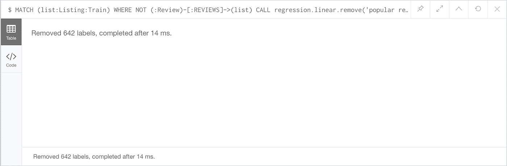**

**现在，我们必须从没有审查的列表中删除测试数据。随着测试数据被添加到模型中，使用在训练期间创建的模型参数来执行计算。因此，如果任何训练数据被更新，则模型改变，并且所有测试计算无效。更改训练数据会自动使测试数据无效。因此，我们必须从没有评论的列表中删除`Test`标签，然后重新添加所有剩余的测试数据。**

> **请注意，如果在模型测试期间，您希望更新测试数据，您可以调用`regression.linear.add`或`regression.linear.remove`而无需重新添加所有测试数据。只要**训练数据**保持不变，这就会起作用。**

```
MATCH (list:Listing:Test) WHERE NOT (:Review)-[:REVIEWS]->(list) REMOVE list:Test
```

**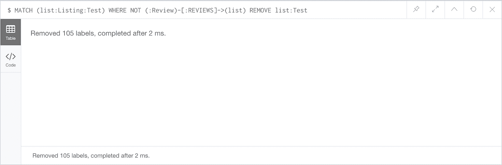**

```
MATCH (list:Listing:Test) 
CALL regression.linear.add('popular rental prices', 
              [list.bedrooms + list.bathrooms], list.price, 'test') 
RETURN count(list)
```

**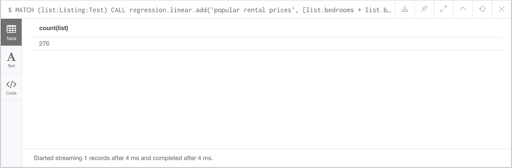**

```
CALL regression.linear.test('popular rental prices')
```

**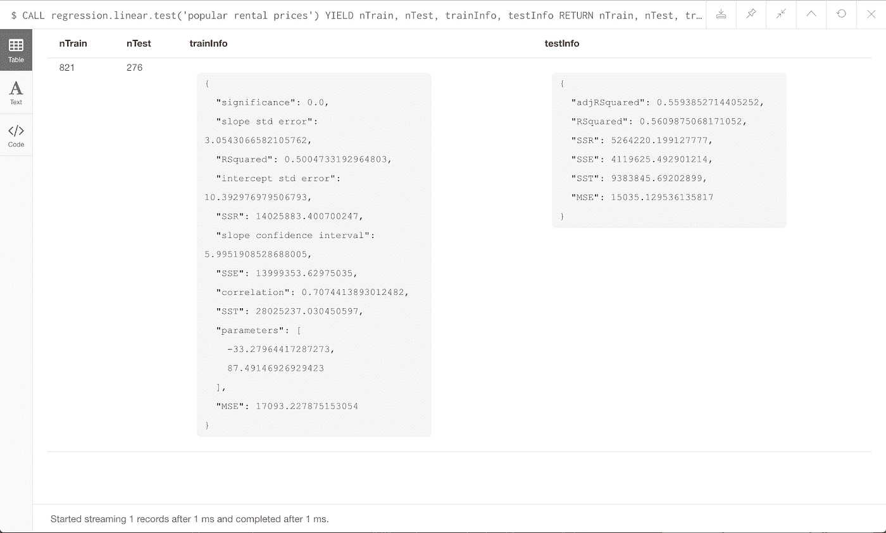**

**哇，消除“不受欢迎”的列表数据提高了我们模型的拟合度！现在，训练 R = 0.500，测试 R = 0.561。两者都增加了，而且测试 R 再次高于训练。这表明我们的模型更好地解释了价格数据中的差异，并在看不见的数据上表现良好。让我们更新图表中的预测价格:**

```
MATCH (list:Listing)-[:IN_NEIGHBORHOOD]->
      (:Neighborhood {neighborhood_id:’78704'})
WHERE exists(list.bedrooms)and exists(list.bathrooms) 
      AND NOT exists(list.price)WITH list, list.bedrooms + list.bathrooms AS rooms
SET list.predicted_price = 
      regression.linear.predict('popular rental prices', [rooms])RETURN DISTINCT rooms, list.predicted_price AS predictedPrice 
ORDER BY rooms
```

**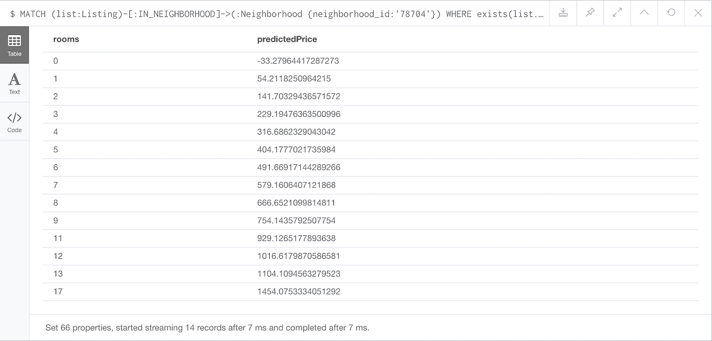**

## **存储、删除和重新加载模型**

**我们完成了今天的分析！让我们保存刚刚创建的模型。`SimpleRegression`的每个命名实例都作为静态变量存储在用户定义的过程中。只要数据库关闭，这些变量就会被清除。确保在关闭数据库之前，您存储了您想要在图中或外部保留的任何模型的序列化版本:**

```
MERGE (m:ModelNode {model: 'popular rental prices'})
SET m.data = regression.linear.data('popular rental prices')
```

**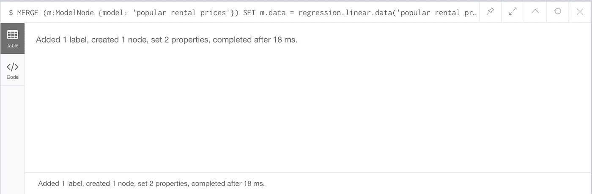**

**删除模型:**

```
CALL regression.linear.delete('popular rental prices')
```

**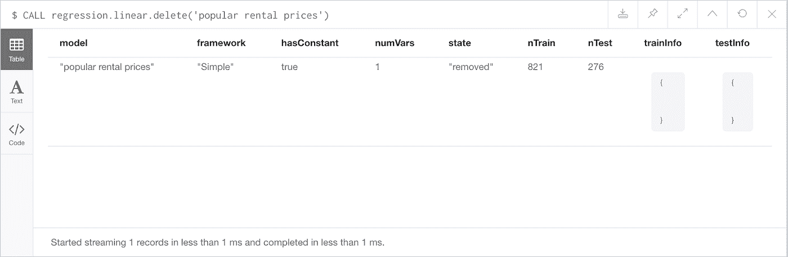**

**当您重新启动数据库时，将模型从图中加载回过程中:**

```
MATCH (m:ModelNode {model: 'popular rental prices'})
CALL regression.linear.load(m.model, m.data, 'Simple')
YIELD model, framework, hasConstant, numVars, state, nTrain, nTest, trainInfo, testInfo
RETURN *
```

**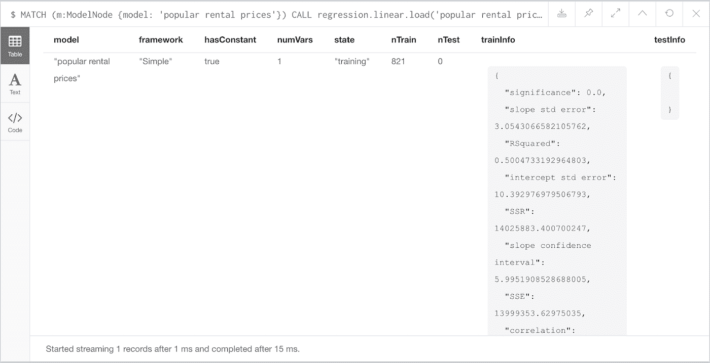**

**现在，模型已经准备好进行额外的数据更改、测试和预测了！注意，新加载的简单回归不包含任何测试数据。**

# **附加功能**

**请注意，以下程序存在，但不在本文讨论范围内:**

*   **`regression.linear.clear`-默认情况下清除模型中的所有数据，或者只清除带有附加参数的测试数据`'test'`**
*   **`regression.linear.addM`-从输入/输出数据列表中添加相应的数据点。如果从外部来源(如 CSV 文件)添加数据，会很有帮助**
*   **`regression.linear.removeM`-从输入/输出数据列表中删除相应的数据点**

> **有问题吗？评论？你是更新测试数据回归平方和(SSR)计算公式的专家吗(我需要一些帮助)？请联系 [LinkedIn](https://www.linkedin.com/in/laurenshin/) 或 [@ML_auren](https://twitter.com/ML_auren)**
> 
> **特别感谢格蕾丝·特诺里奥对这个项目的帮助。查看她的博客或在推特上与她交谈**