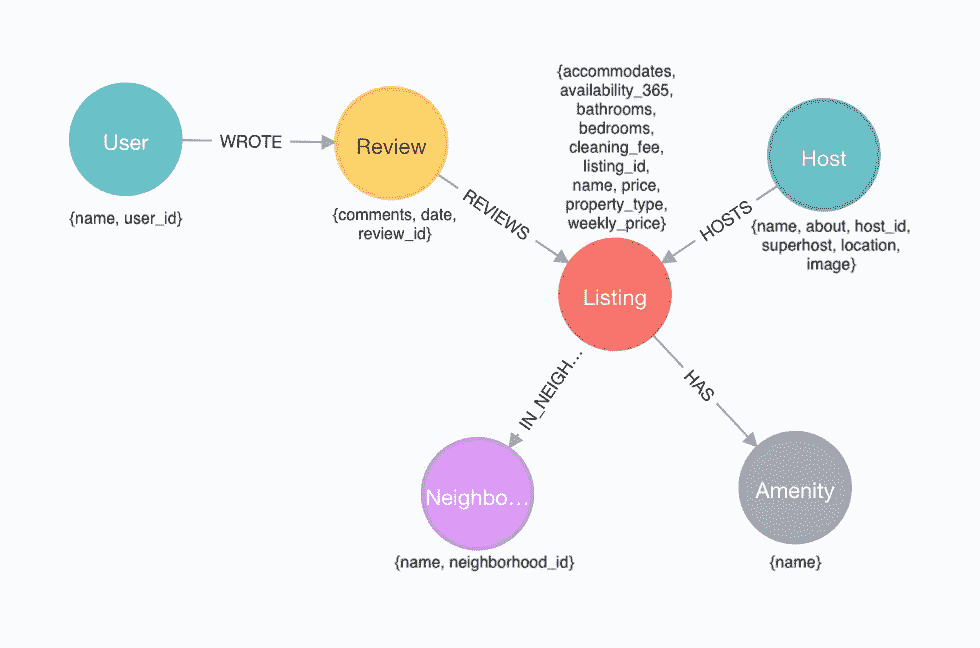
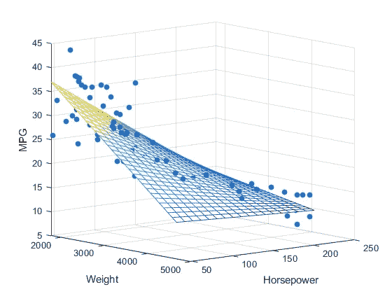
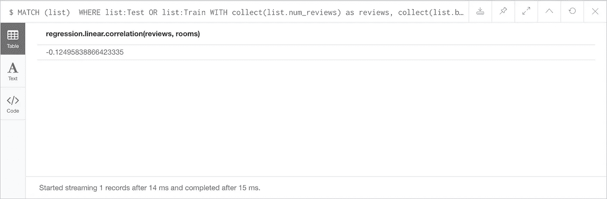
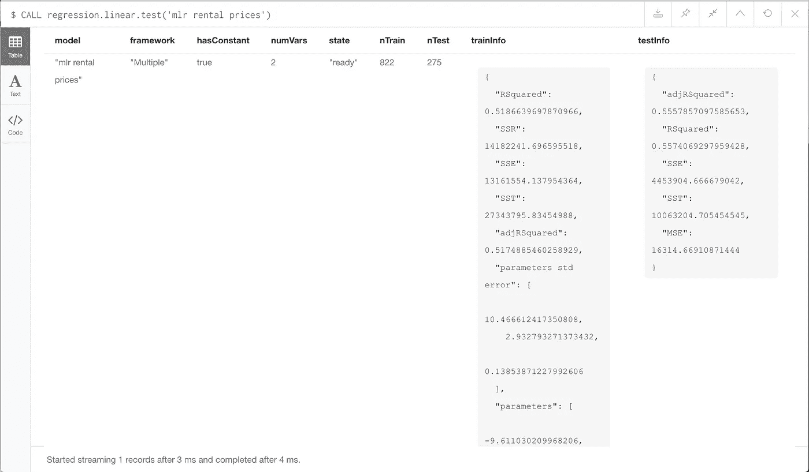

# 图形和 ML:多元线性回归

> 原文：<https://towardsdatascience.com/graphs-and-ml-multiple-linear-regression-c6920a1f2e70?source=collection_archive---------4----------------------->

[*上一次*](/graphs-and-linear-regression-734d1446e9cd) *，我用* ***简单的*** *线性回归从 Neo4j 浏览器创建了一个德克萨斯州奥斯汀的短期租房的模型。在这篇文章中，我演示了如何通过一些小的调整，同一套* [*用户定义的过程*](https://github.com/neo4j-graph-analytics/ml-models) *可以创建一个带有多个* *独立变量的线性回归模型。这被称为多元线性回归。*


Nightlife in Austin, TX ([https://www.nestvr.com/](https://www.nestvr.com/))

我们之前使用短期租赁列表中的房间总数来预测每晚的价格。然而，显然还有其他因素可能会影响价格。例如，一个列表接近热门旅游区可能会极大地影响其价值。让我们再来看看 Will 的数据模型，看看还有哪些额外的信息可以用来预测租赁价格。



Will Lyon’s rental listing data model with node properties

因为我们没有地址，所以很难分析一个列表相对于奥斯汀最受欢迎的目的地的位置。相反，考虑一下`(:Review)-[:REVIEWS]->(:Listing)`关系。在我之前的文章中，我限制我的数据集只包括至少有一个评论的列表。我这样做是为了剔除定价可能不可靠的新上市商品，这大大提高了我的模型的拟合度。现在，让我们更深入一点，除了房间数量之外，使用一个列表的*评论数量*来预测每晚的价格。

> 请注意，我只是玩玩，并没有真正的统计理由来假设评论数量影响上市价格。我这样做主要是为了演示如何创建一个有多个自变量的模型。接下来分析评论并以某种方式量化文本的正面/负面反馈会很有趣。

# 一些背景

在我们回到奥斯汀租赁市场之前，我将回顾一下多元线性回归的重要细节。请记住，在简单线性回归中，我们希望使用单个**独立**变量“ *x* ”的值来预测**因变量**、 *y* 的值。不同的是，在多元线性回归中，我们用*多个*自变量( *x1，x2，…，xp* )来预测 *y* 而不是只有一个。

对多元线性回归的直观理解有点复杂，取决于自变量的数量( *p)* 。如果 *p* = 1，这只是简单线性回归的一个实例，并且( *x1，y* )数据点位于标准的二维坐标系中(具有 x 和 y 轴)。线性回归通过*最“适合”数据的点找到*线*。*


Visual for *p = 1 (*[https://en.wikipedia.org/wiki/Linear_regression](https://en.wikipedia.org/wiki/Linear_regression))

如果 *p* = 2，这些( *x1，x2，y)* 数据点位于三维坐标系中(具有 *x，y，*和 *z* 轴),多元线性回归找到最适合数据点的*平面*。



Visual for p = 2 ([https://www.mathworks.com/help/stats/regress.html](https://www.mathworks.com/help/stats/regress.html))

对于更多数量的独立变量，视觉理解更抽象。对于 *p* 自变量，数据点( *x1，x2，x3 …，xp，y* )存在于一个 *p + 1* 维空间中。真正重要的是，线性模型(是 *p* 维)可以用 *p + 1* 系数**β0** ， **β1** ，…， **βp** 来表示，这样 *y* 就可以用公式`*y =* **β0** + **β1****x1* + **β2****x2* + … + **βp****xp*`来近似。

# 小心！

多元线性回归有两种:[普通最小二乘法(OLS)](https://www.albert.io/blog/key-assumptions-of-ols-econometrics-review/) 和[广义最小二乘法(GLS)](https://www.statlect.com/fundamentals-of-statistics/generalized-least-squares) 。两者之间的主要区别在于，OLS 假设任何两个独立变量之间都有很强的相关性。GLS 通过转换数据来处理相关的独立变量，然后使用 OLS 用转换后的数据建立模型。

这些程序使用 OLS 的方法。因此，要建立一个成功的模型，你应该首先考虑你的变量之间的关系。将`bedrooms`和`accommodates`作为两个独立变量可能不是一个好主意，因为客房数量和入住的客人数量可能有很强的正相关性。另一方面，评论数量和房间数量之间没有明确的逻辑关系。为了进行更定量的分析，挑选独立变量，使每一对变量的皮尔逊相关系数接近于零(见下文)。

# 多个 LR 在工作

好了，让我们来看一组在 Neo4j 中构建多元线性回归模型的查询。

## 建立

从最新的[线性回归版本](https://github.com/neo4j-graph-analytics/ml-models/releases/latest)下载并安装 jar 文件。从 Neo4j 浏览器运行`:play http://guides.neo4j.com/listings`,按照导入查询创建威尔的短期租赁列表。请参阅我之前的文章[以获得安装 *g* 线性回归程序和导入奥斯汀租赁数据集的更全面的指南。](/graphs-and-linear-regression-734d1446e9cd#4fc4)

## 分割训练和测试数据

导入数据集并安装程序后，我们将数据集分成 75:25(训练:测试)的样本。让我们从上次的最终模型开始，再次只考虑至少有一个评论的列表。用`:Train`标注 75%。

```
MATCH (list:Listing)-[:IN_NEIGHBORHOOD]->(:Neighborhood {neighborhood_id:'78704'}) 
WHERE exists(list.bedrooms) 
  AND exists(list.bathrooms)
  AND exists(list.price) 
  **AND (:Review)-[:REVIEWS]->(list)** WITH regression.linear.split(collect(id(list)), 0.75) AS trainingIDs
MATCH (list:Listing) WHERE id(list) in trainingIDs 
SET list:Train
```

并给剩下的 25%加上`:Test`的标签。

```
MATCH (list:Listing)-[n:IN_NEIGHBORHOOD]->(hood:Neighborhood {neighborhood_id:'78704'})
WHERE exists(list.bedrooms) 
  AND exists(list.bathrooms)
  AND exists(list.price) 
  **AND (:Review)-[:REVIEWS]->(list)** 
  AND NOT list:Train 
SET list:Test
```

## 量化相关性

如果您想知道自变量之间的皮尔逊相关性，请使用函数`regression.linear.correlation(List<Double> first, List<Double> second)`。此函数的一个`List<Double>`输入包含来自许多列表的聚合“评论数”数据，并且每个“评论数”是通过聚合来自每个列表的关系来计算的。我们不能在同一个查询中执行两个级别的聚合(`collect(count(r))`)。因此，我们必须执行两个查询。

首先在数据集列表上存储一个`num_reviews`属性。

```
MATCH (:Review)-[r:REVIEWS]->(list) 
WHERE list:Train OR list:Test
WITH list, count(r) AS num_reviews
SET list.num_reviews = num_reviews
```

然后从所有列表中收集(num_reviews，rooms)数据并计算相关性。

```
MATCH (list) 
WHERE list:Test OR list:Train
WITH collect(list.num_reviews) as reviews, 
     collect(list.bedrooms + list.bathrooms) as rooms
RETURN regression.linear.correlation(reviews, rooms)
```



皮尔逊相关系数在[-1，1]范围内，0 表示不相关，1 表示完全正相关，而-1 表示完全负相关。评论数量和房间数量具有相关性-0.125，这表明非常弱的负相关性。对于这种小相关性，OLS 是一种可接受的方法，因此我们可以继续使用该模型。阅读更多关于[解释相关系数](https://www.dummies.com/education/math/statistics/how-to-interpret-a-correlation-coefficient-r/)的信息。

## 初始化模型

我们调用相同的`create`过程，但是现在我们的模型框架是`'Multiple'`而不是`'Simple'`，独立变量的数量是`2`而不是`1`。

```
CALL regression.linear.create(
          'mlr rental prices', **'Multiple'**, true, **2**)
```

## 添加培训数据

以与简单线性回归相同的格式添加已知数据。只需在自变量列表中添加另一个条目(评论数量)即可。

```
MATCH (list:Train)
WHERE NOT list:Seen 
CALL regression.linear.add(
          'mlr rental prices', 
          [list.bedrooms + list.bathrooms**, list.num_reviews**], 
          list.price) 
SET list:Seen RETURN count(list)
```

## 训练模型

我们必须训练模型，使线参数(βi)、决定系数(R)等。是在接受测试数据或做出预测之前计算出来的。如果您忘记了这一步，然后尝试添加测试数据或进行预测，您的模型将会自动首先接受训练。

```
CALL regression.linear.train('mlr rental prices')
```

> 注意，在调用`train`过程后，您仍然可以添加更多的训练数据。你只需要在测试新型号之前再打一个电话给`train`！

## 添加测试数据

根据看不见的数据分析模型的性能。请记住，当您添加测试数据时，需要一个额外的参数`'test'`作为过程`regression.linear.add`的输入。

```
MATCH (list:Test) 
WHERE NOT list:Seen
CALL regression.linear.add(
          'mlr rental prices', 
          [list.bedrooms + list.bathrooms, list.num_reviews], 
          list.price, 
          **'test'**) 
SET list:Seen 
RETURN count(list)
```

## 测试模型

现在所有的测试数据都已添加，调用`test`过程来计算测量值(在下面的`testInfo`中),以便我们分析模型的性能。

```
CALL regression.linear.test('mlr rental prices')
```



您也可以通过调用`info`过程随时返回关于模型的信息。

```
CALL regression.linear.info('mlr rental prices') 
```

再来看[调整后的 R](http://blog.minitab.com/blog/adventures-in-statistics-2/multiple-regession-analysis-use-adjusted-r-squared-and-predicted-r-squared-to-include-the-correct-number-of-variables) 。这个值类似于我们在上一篇文章中考虑的 R，但它被调整了，这样，随着独立变量被添加到模型中，调整后的 R 不会增加，除非模型被改进得比它偶然得到的更多。因此，当将我们的多元线性回归模型(有两个独立变量)与之前的模型(只有一个独立变量)进行比较时，调整后的 R 是更好的成功衡量标准。

我们通常寻找大于 0.6 的 R 值，但是更接近 1 的值表示更好的线性拟合。这里，训练调整 R = 0.517，测试调整
R = 0.556。上次我们训练和测试的 R 值分别是 0.500 和 0.559。使用多元线性回归创建的模型在训练数据上比上次的简单回归模型表现得好一点，在测试数据上表现得差不多。能不能找到更好的自变量，改进我的工作？

# 后退一步

在 Neo4j，我和我的同事们目前面临着这样一个问题:*机器学习和人工智能在图数据库中处于什么位置？这个问题有几个答案，但没有一个是“正确”的。在我以前的帖子中，我演示了如何根据图中的数据建立一个简单的机器学习模型，以避免导出到另一个软件。在这篇文章中，另一个有趣的方面出现了:用存储在图的结构中的数据构建模型的能力。我们能够通过计算每个列表上的`(:Review)-[:REVIEWS]->(:Listing)`关系的数量来轻松检索“评论数量”数据。在这方面，图形数据库增加了我们可以轻松访问的数据类型，以便建立机器学习模型。*

展望未来，我很想探索机器学习模型如何更有效地利用数据集的*图结构*来学习和做出预测。

# 摘要

下面是使用多元线性回归的`regression.linear.*`过程时必须做出的调整的快速列表:

*   在`regression.linear.create`期间指定型号`“Multiple”`
*   在`regression.linear.create`期间指定独立变量的数量
*   *没有*或`regression.linear.remove`方法用于测试或训练数据
*   你*不能*用`regression.linear.copy`将训练数据从一个模型复制到另一个模型
*   在测试、分析或预测之前，您应该通过调用`regression.linear.train`来训练模型
*   查看`adjusted R²`以更准确地比较具有不同数量独立变量的模型
*   `regression.linear.data`返回模型的参数，*不*将其字节【序列化】。所以不能用`regression.linear.load`。(我想解决这个问题)

> 这个项目是实验性的，所以我真的很感谢任何反馈。检查程序[存储库](https://github.com/neo4j-graph-analytics/ml-models)并联系 [LinkedIn](https://www.linkedin.com/in/laurenshin/) 或 [@ML_auren](https://twitter.com/ML_auren) 。
> 
> 对我来说，是时候离开这个线性建模的世界，转而使用逻辑回归构建分类器了。敬请关注新的一组程序和新的数据集！