# 模型调整的网格搜索

> 原文：<https://towardsdatascience.com/grid-search-for-model-tuning-3319b259367e?source=collection_archive---------0----------------------->

模型 ***超参数*** 是模型外部的模型特征，其值无法从数据中估计。必须在学习过程开始之前设置超参数的值。比如支持向量机中的 *c* ，k-最近邻中的 *k* ，神经网络中的*隐层数*。

相反， ***参数*** 是模型的内部特性，其值可以从数据中估计。例如，线性/逻辑回归的β系数或支持向量机中的支持向量。

> 网格搜索用于寻找模型的最佳*超参数*，从而产生最“准确”的预测。

让我们通过在[乳腺癌数据集](https://archive.ics.uci.edu/ml/datasets/breast+cancer+wisconsin+(original))上建立分类模型来看看网格搜索。

## 1.导入数据集并查看前 10 行。

输出:

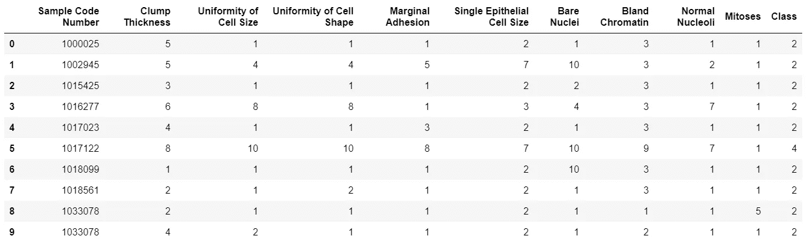

数据集中的每一行都有两个可能的类别:良性(用 2 表示)和恶性(用 4 表示)。此外，该数据集中有 10 个属性(如上所示)将用于预测，除了作为 id 号的样本代码号。

## 2.清理数据，并将类值重命名为 0/1，用于建模(其中 1 表示恶性病例)。还有，我们来观察一下班级的分布。

输出:

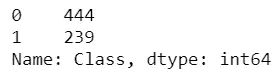

良性病例 444 例，恶性病例 239 例。

## 3.在构建分类模型之前，让我们构建一个虚拟分类器来确定“基线”性能。这就回答了这个问题——“如果只是猜测，这个模型的成功率会是多少？”我们使用的虚拟分类器将简单地预测多数类。

输出:

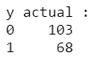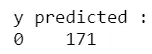

从输出中，我们可以观察到测试数据集中有 68 个恶性和 103 个良性案例。然而，我们的分类器预测所有病例都是良性的(因为它是多数类)。

## 4.计算此模型的评估指标。

输出:

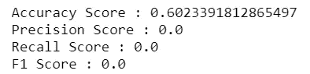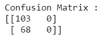

模型的准确性为 60.2%，但这是准确性可能不是评估模型的最佳度量的情况。那么，让我们来看看其他评估指标。

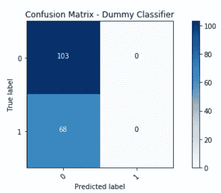

上图是混淆矩阵，添加了标签和颜色以便更直观(生成该矩阵的代码可以在[这里](https://scikit-learn.org/stable/auto_examples/model_selection/plot_confusion_matrix.html#sphx-glr-auto-examples-model-selection-plot-confusion-matrix-py)找到)。总结一下混淆矩阵:真阳性(TP)= 0，真阴性(TN)= 103，假阳性(FP)= 0，假阴性(FN)= 68。评估指标的公式如下:

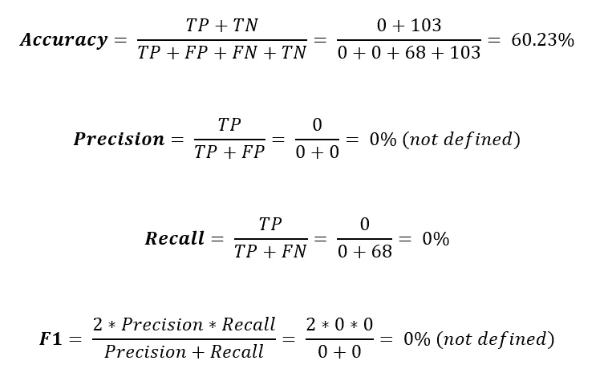

由于该模型没有对任何恶性病例进行正确分类，因此召回率和精确度指标为 0。

## 5.现在我们已经有了基线精度，让我们用默认参数建立一个逻辑回归模型并评估这个模型。

输出:

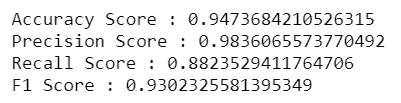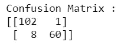

通过用默认参数拟合逻辑回归模型，我们得到了一个“更好”的模型。准确率为 94.7%，同时精度更是惊人的 98.3%。现在，让我们再次看一下该模型结果的混淆矩阵:

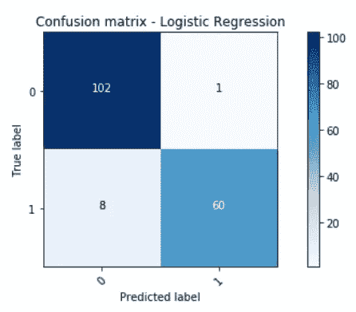

查看错误分类的实例，我们可以观察到 ***8 个恶性病例被错误地分类为良性(假阴性)*** 。此外，只有一个良性病例被归类为恶性(假阳性)。

假阴性更严重，因为疾病被忽略了，这可能导致患者死亡。同时，假阳性会导致不必要的治疗——产生额外的费用。

让我们通过使用网格搜索来寻找最佳参数，从而尽量减少假阴性。网格搜索可用于改进任何特定的评估指标。

> 我们需要关注的减少假阴性的指标是**召回**。

## 6.网格搜索最大化回忆

输出:

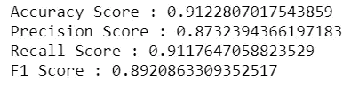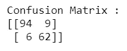

我们调整的超参数是:

1.  [惩罚](/l1-and-l2-regularization-methods-ce25e7fc831c) : l1 或 l2，指定惩罚中使用的标准。
2.  [C](https://stackoverflow.com/questions/22851316/what-is-the-inverse-of-regularization-strength-in-logistic-regression-how-shoul) :正则化强度的倒数——C 值越小，正则化越强。

此外，在网格搜索功能中，我们有一个评分参数，可以指定评估模型的指标(我们选择了 recall 作为指标)。从下面的混淆矩阵中，我们可以看到假阴性的数量减少了，然而，这是以假阳性增加为代价的。网格搜索后的召回率从 88.2%上升到 91.1%，而准确率从 98.3%下降到 87.3%。

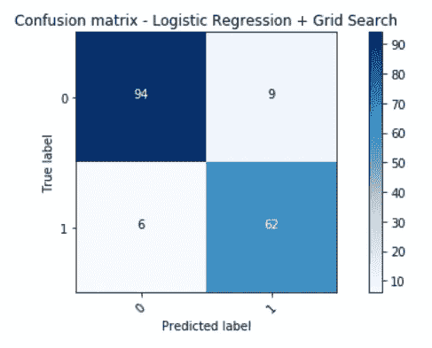

通过使用“f1”分数作为评估指标，您可以进一步调整模型，以在精确度和召回率之间取得平衡。查看这篇[文章](/beyond-accuracy-precision-and-recall-3da06bea9f6c)，更好地理解评估指标。

网格搜索为指定的每个超参数组合建立一个模型，并评估每个模型。一种更有效的超参数调整技术是随机搜索，其中超参数的随机组合用于寻找最佳解决方案。

连接 LinkedIn[和 Github](https://www.linkedin.com/feed/)查看完整的笔记本。

 [## rohanjoseph 93/用于数据科学的 Python

### 用 Python 学习数据科学。通过创建帐户，为 rohanjoseph 93/Python-for-data-science 开发做出贡献…

github.com](https://github.com/rohanjoseph93/Python-for-data-science/blob/master/Grid%20Search%20-%20Breast%20Cancer.ipynb)