# GSoC 2017:神功文档的 Eclipse 插件

> 原文：<https://towardsdatascience.com/gsoc-2017-eclipse-plugin-for-siddhi-documentation-c4d82e8089cb?source=collection_archive---------11----------------------->

WSO2 复杂事件处理器(WSO2 CEP)是一个实时复杂事件处理引擎，在识别传入的事件流/大型数据馈送中的模式时具有快速的响应时间，并且存储空间最小。WSO2 CEP 的核心是 Siddhi，这是一种类似 SQL 的查询语言，用于模式和序列检测等复杂查询，几乎解决了复杂事件处理中抑制应用程序性能指标的所有问题。

除了组织给出的项目[目标](https://docs.wso2.com/display/GSoC/Project+Proposals+for+2017#ProjectProposalsfor2017-Proposal5:EclipsePluginforSiddhi)之外，还完成了从 Antlr 到 Xtext 的语法文件转换，并修复了神功语法中的歧义。

迄今为止所做的工作如下。

*   神功语法文件的 Antlr 到 Xtext 转换
*   修正神功语法中的歧义
*   语法和语义突出显示
*   内容辅助
*   错误报告

## Antlr 到 Xtext 神功语法文件转换

[原始神功语法文件](https://github.com/siddhi-io/siddhi/blob/master/modules/siddhi-query-compiler/src/main/antlr4/io/siddhi/query/compiler/SiddhiQL.g4)是用 Antlr 写的。因为 Xtext 被确定在这个项目中使用，所以将 Antlr 语法文件转换成 Xtext 是必要的。Xtext 框架是在 Antlr LL(*)解析器生成器之上开发的。尽管 Antlr 和 Xtext 的语法大致相似，但在 Siddhi 语法中处理左递归是我在转换语法文件时面临的一个挑战，因为 Xtext 处理它的方式不同。因为 LL 解析器是一个自顶向下的解析器，并且输入是从左到右传递的，所以需要小心处理左递归。EveryPatternSourceChain、PatternSourceChain、LeftAbsentPatternSource、RightAbsentPatternSource、LeftAbsentSequenceSource、RightAbsentSequenceSource、SequenceSourceChain 和 MathOperation 是为 Xtext 解析器生成器设置了[左递归调用图](https://en.wikipedia.org/wiki/Left_recursion)的规则。下面描述一个例子。

神功最初的 EveryPatternSourceChain 和 PatternSourceChain 规则如下。

```
every_pattern_source_chain    : 
'('every_pattern_source_chain')' within_time?     
| EVERY '('pattern_source_chain ')' within_time?       
| every_pattern_source_chain  '->' every_pattern_source_chain    
| pattern_source_chain    
| EVERY pattern_source within_time?     ; pattern_source_chain    : 
'('pattern_source_chain')' within_time?    
| pattern_source_chain  '->' pattern_source_chain    
| pattern_source within_time?    ;
```

规则 every_pattern_source_chain 在“every _ pattern_source_chain”->“every _ pattern _ source _ chain”替代元素中留下了递归，并且规则 pattern _ source _ chain 在“pattern _ source _ chain”->“pattern _ source _ chain”替代元素中留下了递归，因为最左边的符号是规则本身。这些被转换成 Xtext 语法，如下所示。

```
EveryPatternSourceChain:
EveryPatternSourceChain1 =>({EveryPatternSourceChain.left=current} op= ‘->’ right=EveryPatternSourceChain1)*;EveryPatternSourceChain1 returns EveryPatternSourceChain:
=>(OPEN_PAR eps=EveryPatternSourceChain CLOSE_PAR wt=WithinTime?)
|psc=PatternSourceChain
|every=EVERY psc=PatternSourceChain1;PatternSourceChain:
PatternSourceChain1 -> ({PatternSourceChain.left=current} op=’->’ right=PatternSourceChain1)*;PatternSourceChain1 returns PatternSourceChain:
=>(OPEN_PAR psc_2=PatternSourceChain CLOSE_PAR wt=WithinTime?)
|ps=PatternSource wt=WithinTime?;
```

移除 MathOperation 规则中的左递归是一项不同的任务，因为它需要考虑语法的运算符优先级。运算符优先级越高，规则调用得越晚。例如，下面解释规则的一部分。

原始 MathOperation 规则的一部分如下。

```
math_operation    :
'('math_operation')'                         
|null_check                                   
|NOT math_operation
|math_operation (multiply='*'|devide='/'|mod='%') math_operation    
|math_operation (add='+'|substract='-') math_operation                 
|function_operation                           
|constant_value                               
|attribute_reference;
```

这里“math _ operation(multiply = ' * ' | devide = '/' | mod = ' % ')math _ operation”和“math _ operation(add = '+' | subtract = '-')math _ operation”是左递归规则。由于乘法的运算符优先级高于加法，所以应该在 Xtext 中首先调用与加法相关的规则，如下所示。

```
MathOperation:
MathAddsubOperation;MathAddsubOperation returns MathOperation:
MathDivmulOperation =>({MathAddsubOperation.left=current} (add='+'|substract='-') right=MathDivmulOperation)*;MathDivmulOperation returns MathOperation:
MathOtherOperations =>({MathDivmulOperation.left=current} (multiply='*'|devide='/'|mod='%') right=MathOtherOperations)*;MathOtherOperations returns MathOperation:
=>({NotOperation} not=NOT op=MathOperation)
|OPEN_PAR op=MathOperation CLOSE_PAR
|=>NullCheck
|mathOtherOperations1=MathOtherOperations1;MathOtherOperations1:
const_val=ConstantValue
|fo=FunctionOperation
|attrRef=AttributeReference;
```

其他 Antlr 至 Xtext 转换可在此处找到[。](https://github.com/udeshika-sewwandi/siddhi_editor/blob/master/org.xtext.example.siddhi/src/org/xtext/example/siddhi/Siddhi.xtext)

## 修正语法中的歧义

语法中的模糊性会导致特定输入有几个解析树，而解析器无法确定它应该遍历的确切路径。特别是在 Xtext 中，歧义可以通过使用句法谓词、左因子分解和在工作流中启用回溯来解决。启用回溯并不是一个好的选择，因为它隐藏了由模糊语法引起的大问题。

我使用了 [Antlrworks](https://blogs.itemis.com/en/debugging-xtext-grammars-what-to-do-when-your-language-is-ambiguous) 调试工具来识别语法中的歧义，以及输入如何通过解析器进行解析。也就是说，它显示了在解析树表示中为特定用户输入解析了哪些规则。Antlrworks 以如下所示的典型方式显示语法规则中的歧义。两个彩色箭头显示了导致特定模糊性的两个可选路径。

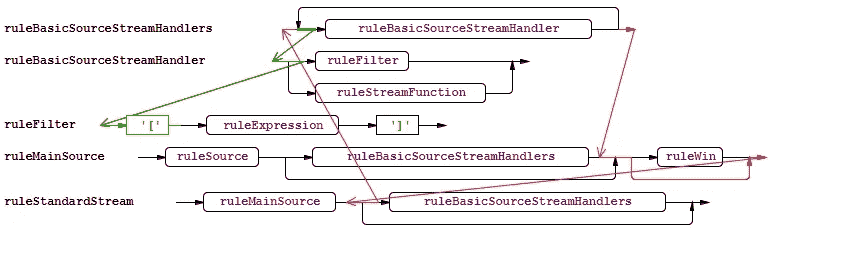

Xtext 中有两种类型的语法谓词运算符，即“->”和“= >”。“-->”是第一个标记谓词，表示如果您处于决策点，无法做出决策，请查看第一个标记并做出决策。" = > "表示如果你正处于一个决定点，难以做出决定，检查语法的特定部分并做出决定。

例如，LogicalStatefulSource 规则中的歧义是使用如下的句法谓词解决的。

```
LogicalStatefulSource: 
=>(stdSource+=StandardStatefulSource and=AND)stdSource+=StandardStatefulSource    
|=>(stdSource+=StandardStatefulSource or=OR) stdSource+=StandardStatefulSource;
```

这意味着，如果解析器处于 LogicalStatefulSource，需要做出决定，请考虑“(STD source+= StandardStatefulSource AND = AND)”或“= >(STD source+= StandardStatefulSource OR = OR)”来决定选择哪个备选项。

另一个例子是 ExecutionPlan 的歧义修复，如下所示。

最初的规则是，

```
siddhi_app    : 
(app_annotation|error)*      ( (definition_stream|definition_table|definition_trigger|definition_function|definition_window|definition_aggregation|error) (';' (definition_stream|definition_table|definition_trigger|definition_function|definition_window|definition_aggregation|error))* ';'?      || (execution_element|error) (';' (execution_element|error))* ';'?      || (definition_stream|definition_table|definition_trigger|definition_function|definition_window|definition_aggregation|error) (';' (definition_stream|definition_table|definition_trigger|definition_function|definition_window|definition_aggregation|error))* (';' (execution_element|error))* ';'? )    ;
```

这里第一个和第三个替代元素是不明确的。Xtext 中的模糊固定规则是，

```
ExecutionPlan: 
(appAnn+=AppAnnotation)*(  (=>defStream+=DefinitionStream|=>defTable+=DefinitionTable| =>def_window+=DefinitionWindow| =>defTrigger+=DefinitionTrigger|=>defFunction+=DefinitionFunction|=>defAgrregation+=DefinitionAggregation)=>(';'   (=>defStream+=DefinitionStream|=>defTable+=DefinitionTable| =>def_window+=DefinitionWindow| =>defTrigger+=DefinitionTrigger|=>defFunction+=DefinitionFunction|=>defAgrregation+=DefinitionAggregation))*  =>(';'(exElement+=ExecutionElement))* ';'?);
```

更多歧义固定可以在[这里](https://docs.google.com/document/d/1AHfncxIG5WmYWITkxM6-7FkRfDJ5PJL1h8tLQq0cxIU/edit?usp=sharing)找到。

## 语法突出显示

句法突显由词汇突显和语义突显两部分组成。对关键词、数字和标点符号进行词汇突出显示。语义突出显示在变量名上，如流名、表名、触发器名、窗口名、函数名和紫色事件名。如下图所示，实现了词汇和语义突出显示。

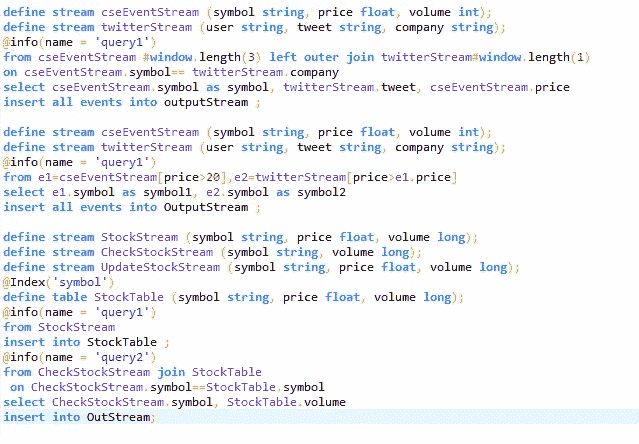

Lexical and Semantic highlighting for Siddhi

## 代码自动完成

内容辅助在任何编辑器中都是一个非常重要的特性。在这个插件中，根据如下所示的语法为关键字和标点符号提供了内容帮助。

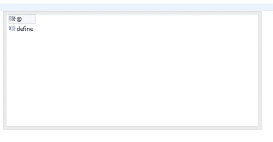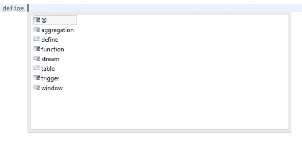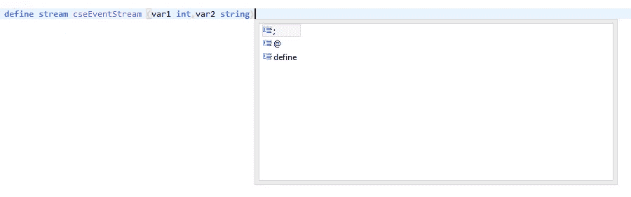

代码自动完成是针对执行计划中不同位置使用的流名、表名、窗口名、属性名和事件名完成的。这主要是通过使用 Xtext 中的局部作用域和交叉引用来实现的，因为它只需要提出属于一个执行计划的变量。交叉引用的一个例子将在下面解释。

```
Source:
strId=[Source1|IdNew];Source1:
inner='#'? name=IdNew;DefinitionStream:
{DefinitionStream}(ann += Annotation)* DEFINE (STREAM|TABLE) src=Source1 OPEN_PAR (feature += Features )(',' feature += Features )* CLOSE_PAR;StandardStream:
MainSource =>((postWindowHandlers = BasicSourceStreamHandlers)?);MainSource:
src=Source basicSSh=BasicSourceStreamHandlers1;
```

此处，源规则具有对 IdNew 类型(标识符)的 Source1 的交叉引用。因此，在流定义中定义的流名称可以在查询输入规则的 StandardStream 元素中访问。在[语法文件](https://github.com/udeshika-sewwandi/siddhi_editor/blob/master/org.xtext.example.siddhiql/src/org/xtext/example/siddhiql/SiddhiQL.xtext#L198)中还使用了其他几个交叉引用，如 SourceOrEventReference、FeaturesOrOutAttrReference 和 AttributeNameReference。

查询输入中实现的代码完成如下所示。当所需变量的字母作为建议给出时，建议变量名。

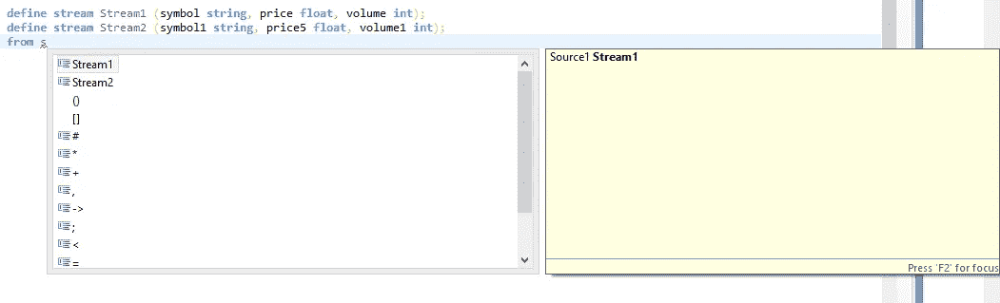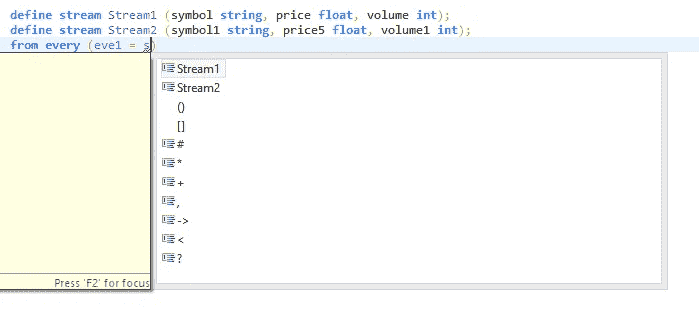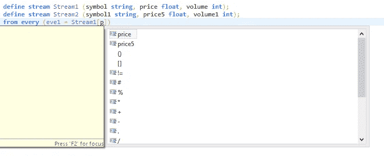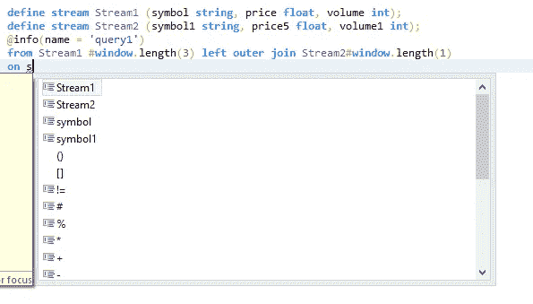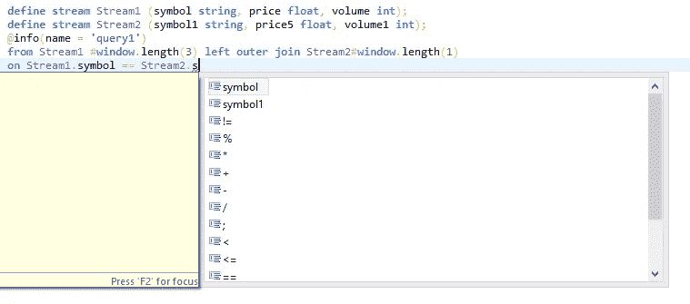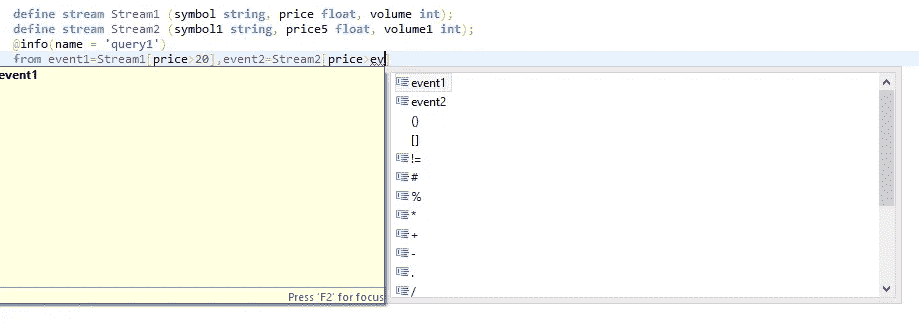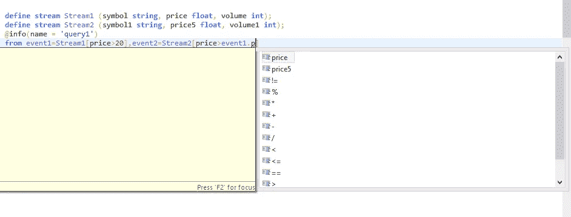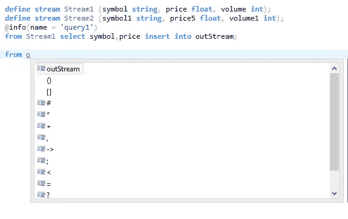

为查询部分实现的代码完成如下。

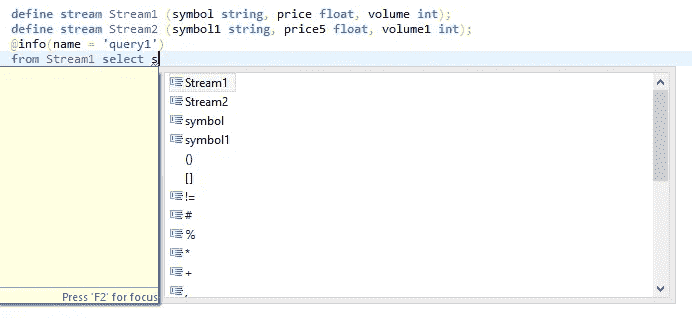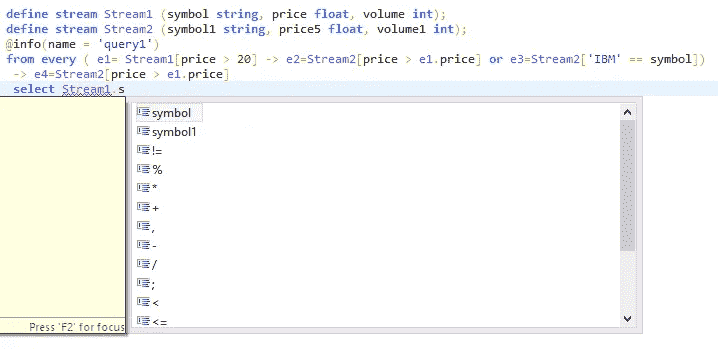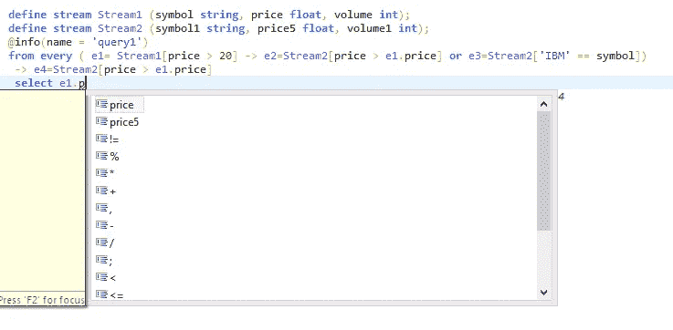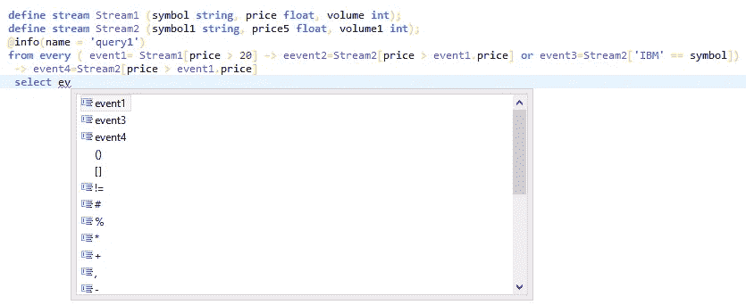

定义了查询部分功能操作的一般方案，方便了用户的使用。当键入“，”或“:”时触发。

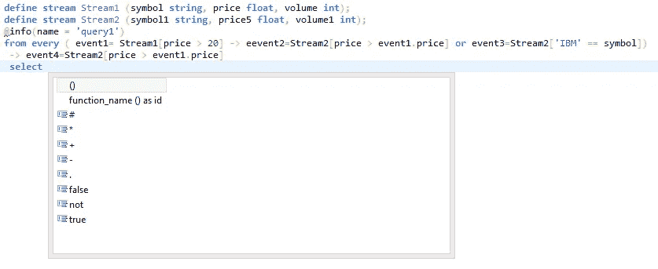

该建议可以定制如下。

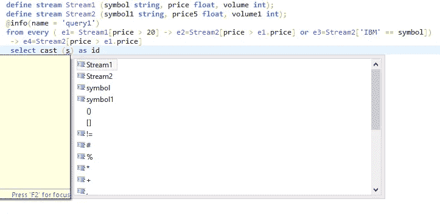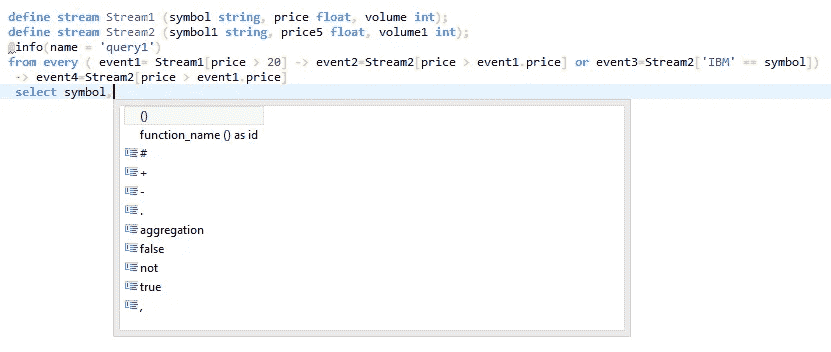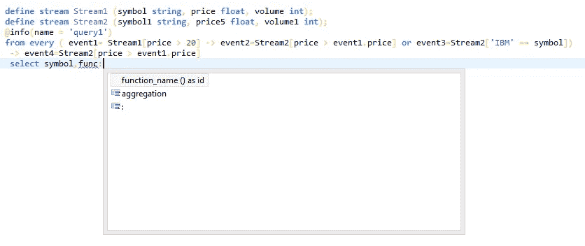

## 错误报告

语法错误由 Xtext 框架本身捕获，并显示在编辑器中。逻辑错误，比如把错误的变量放在错误的地方，是在对流名、表名等进行了局部作用域之后捕获的。

语法错误显示在编辑器中，如下所示。

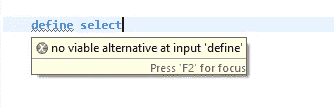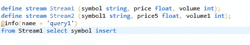

逻辑错误显示给用户，如下所示。

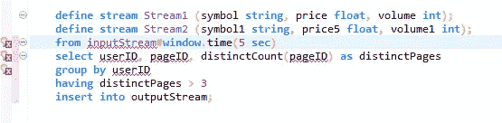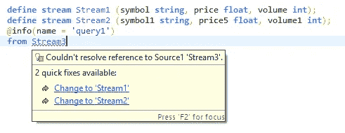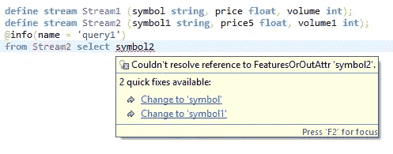

***github 中共享代码的链接:***[https://github.com/udeshika-sewwandi/siddhi_editor](https://github.com/udeshika-sewwandi/siddhi_editor)

***已实现特性的 Eclipse 编辑器插件链接:***[https://drive . Google . com/drive/folders/0 B3 tawrcyox 59 C1 pxa 2 vdammzuu？usp =共享](https://drive.google.com/drive/folders/0B3tawRCYox59c1pXa2VDamMzcUU?usp=sharing)

## 如何安装插件？

要在 Eclipse 中安装插件，需要遵循以下步骤。

*   下载并安装 Eclipse IDE(例如 Mars 2 可以在这里下载)

按照下面的过程在 Eclipse 中安装 Xtext。

*   点击帮助菜单->安装新软件
*   将[http://download . eclipse . org/modeling/tmf/xtext/updates/composite/releases/](http://download.eclipse.org/modeling/tmf/xtext/updates/composite/releases/)放入**与**字段一起安装 Xtext
*   获取后，从列表中的 Xtext 类别中选择 Xtext complete SDK 并安装 Xtext

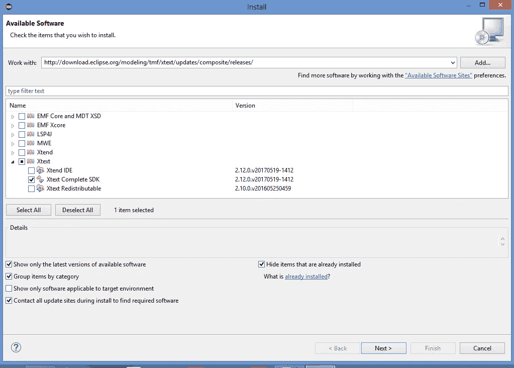

*   一段时间后，Xtext 将被安装并完成安装
*   重启 Eclipse

然后安装神功插件

*   在这里下载[中的插件文件夹。](https://drive.google.com/drive/folders/0B3tawRCYox59VDdXcVNKY05SRnM?usp=sharing)
*   点击帮助->安装新软件
*   点击“添加”按钮
*   点击“本地”按钮，选择主插件文件夹，然后点击“确定”


*   为“名称”字段命名，然后单击“确定”

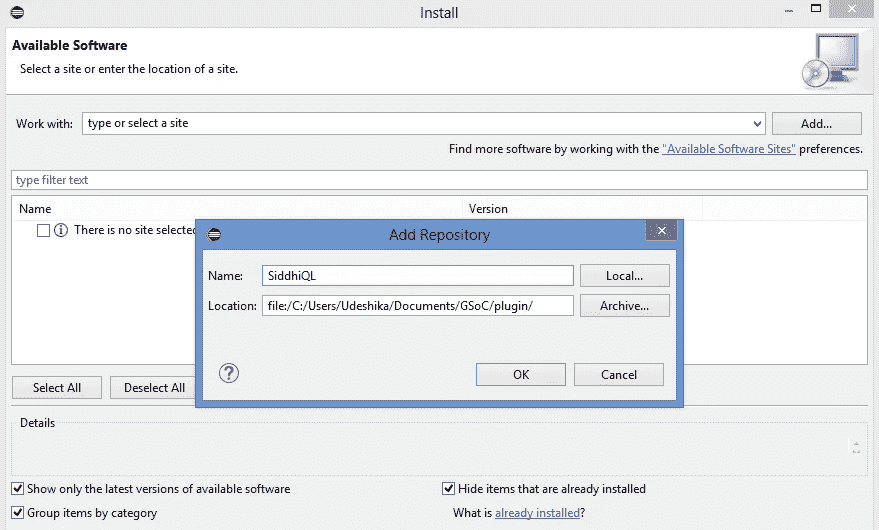

*   从列表中选中该功能，取消选中“按类别分组项目”,然后单击“下一步”

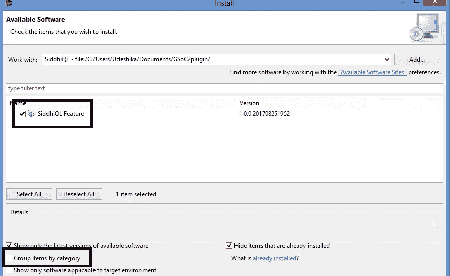

*   经过一些下载过程后，插件将安装到 Eclipse IDE 中
*   重启 Eclipse

安装两个插件后，按照下面的步骤创建一个. siddhi 文件。

*   点击文件->新建->项目
*   选择常规->项目
*   右键单击创建的项目并选择新建->文件
*   将文件名命名为 file_name.siddhi
*   点击完成
*   Eclipse 将询问“您想将项目转换成 Xtext 项目吗？”->单击是
*   然后创建了。神功文件可以如下图所示使用


## 未来的工作

实现 Siddhi Eclipse 编辑器的运行和调试功能需要在将来完成，以便使用该插件。运行功能可以通过使用 Xtext 框架提供的代码生成器存根为特定于领域的语言定制来提供。

## 确认

这是我在大学生活中第一次参加 2017 年谷歌代码之夏，为 WSO2 的一个项目做贡献，WSO2 是一家开源的知名公司。Sriskandarajah Suhothayan 和 Nirmal Fernando 是我在 WSO2 的导师。虽然这是我第一次为 WSO2 做贡献，但是导师们真的很有帮助，在整个夏天都在这个项目上指导我。非常感谢导师和 WSO2 给我机会，指导我确定项目目标。我真的很高兴在 GSoC 2017 中为 WSO2 做出贡献，我也愿意在这款产品以及其他产品上为 WSO2 做出贡献。

GSoC 是一个鼓励大学生为开发自由和开源软件做出贡献的项目。我很高兴成为 2017 年 GSoC 的一员，我非常感谢谷歌每年组织这个项目，这为学生提供了一个在虚拟工作环境中工作来提高许多技能的大好机会。

如果需要任何澄清，请通过*sewwandikaus . 13 @ CSE . mrt . AC . lk*联系我。

## 关于 Xtext 的进一步阅读

[1][https://eclipse . org/Xtext/documentation/102 _ domainmodelwalk . html](https://eclipse.org/Xtext/documentation/102_domainmodelwalkthrough.html)

[2][https://eclipse . org/Xtext/documentation/301 _ grammar language . html](https://eclipse.org/Xtext/documentation/301_grammarlanguage.html)

[3][https://eclipse . org/Xtext/documentation/307 _ special _ languages . html](https://eclipse.org/Xtext/documentation/307_special_languages.html)

[https://github.com/MartijnDwars/Xtext/wiki/Expressions](https://github.com/MartijnDwars/Xtext/wiki/Expressions)