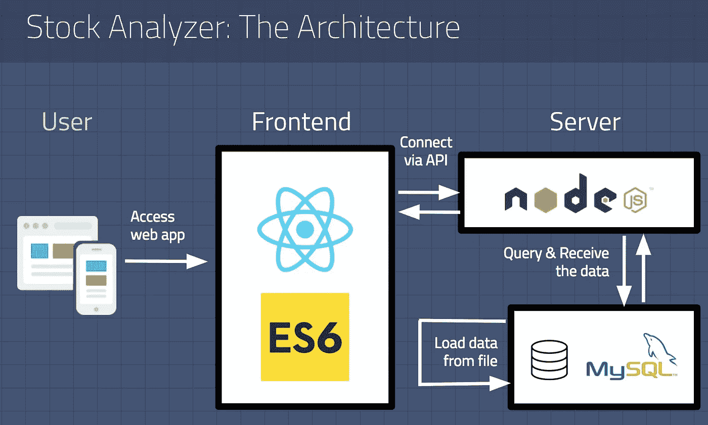
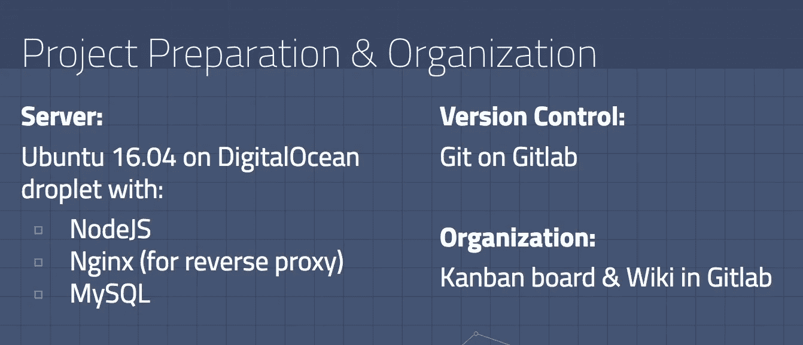
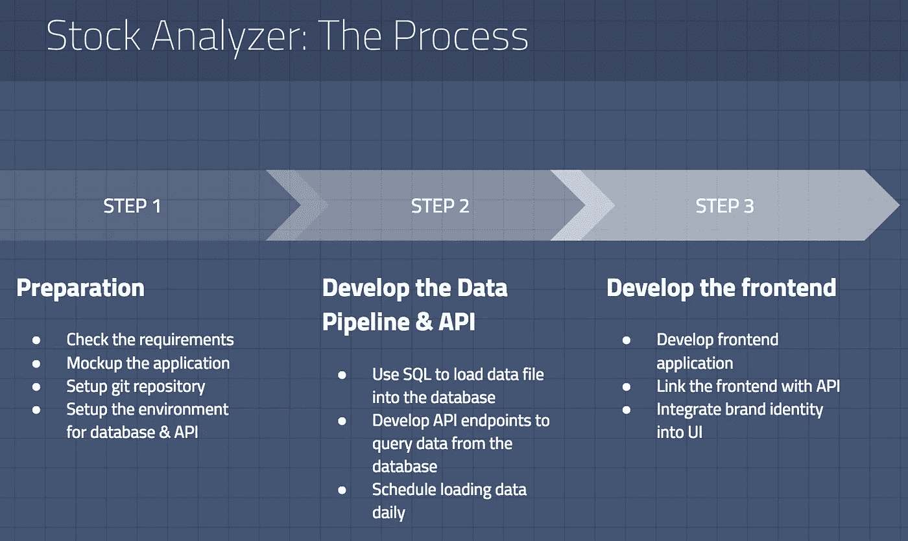
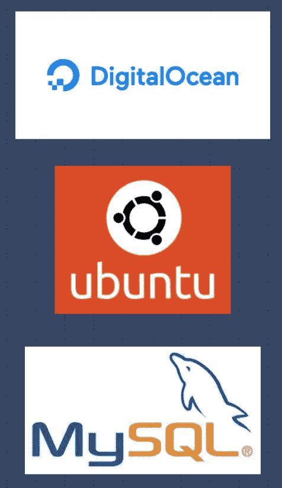
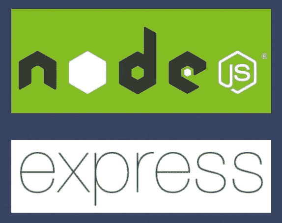
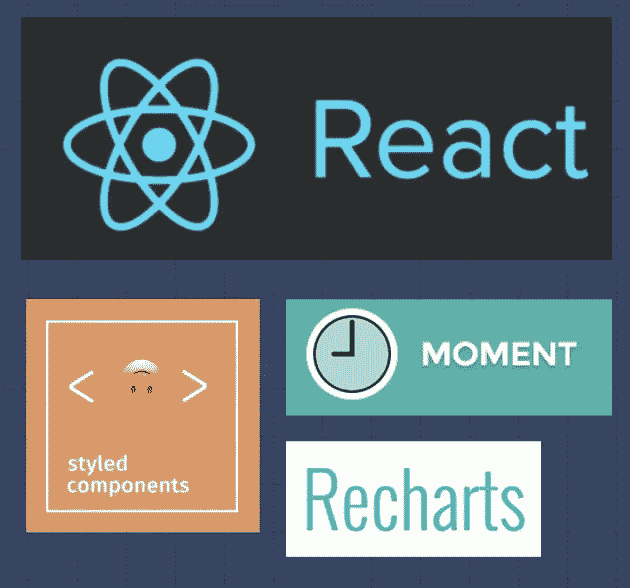
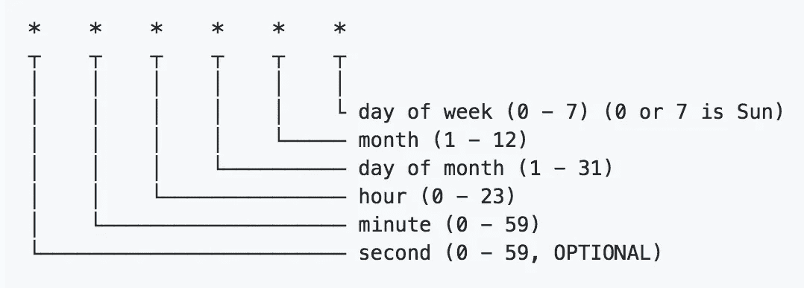
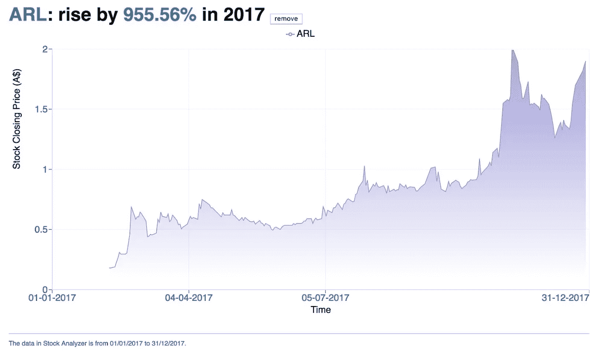
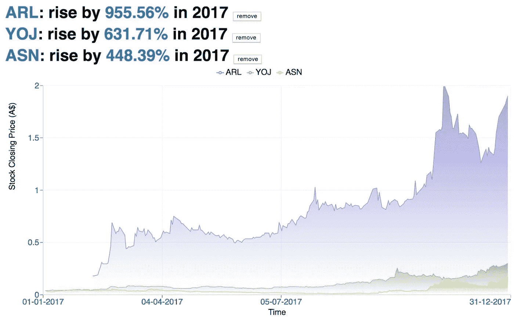

# [指南]使用 React、NodeJS 和 MySQL 构建数据科学 Web 应用程序

> 原文：<https://towardsdatascience.com/guide-building-data-science-web-application-with-react-nodejs-and-mysql-1c55416ff0fb?source=collection_archive---------3----------------------->

数据科学是任何企业的强大工具。然而，为了将数据科学应用到业务中，我们必须开发一种工具，普通用户可以轻松地使用它来从查看数据中获益。

Tableau 或 PowerBI 等数据可视化工具是数据探索工具如何为任何业务增加巨大价值的绝佳例子。

最近，我有机会为股票市场数据从头开始开发另一个数据探索工具。由于我必须处理从服务器到开发 API 和前端应用程序的所有事情，我觉得这些知识和经验可能对其他希望开发数据科学 web 应用程序的人有所帮助。

在这篇博文中，我将带您了解构建我几周前构建的 web 应用程序的过程和开发。如果你有兴趣看代码，请随时通过 Twitter ( [@woraperth](https://twitter.com/woraperth) )告诉我。以后我可能会考虑在我的 [Github](https://github.com/woraperth) 上开源代码。[由于许多请求，我已经清理了代码并将其发布在 [Github 库](https://github.com/woraperth/stock-analyzer)上]

## 股票分析器 Web 应用程序

这是我在 1 周内构建的 web 应用程序。它不是最漂亮的，但我希望界面足够简单，让用户看得懂。

## 我们为什么需要这个应用程序？

分析师想要分析股票市场中可能成为他们潜在客户的公司。逐一查看每家公司会花很多时间。他们需要易于使用的工具来帮助他们加快这个过程。

**“股票分析器”**的目标是利用股票市场数据并构建简单的界面来帮助分析师找到合适的客户。

## 我们有哪些数据，在哪里可以找到这些数据？

数据由每个股票市场中每只股票每天的股价组成。

股票市场数据可以从财经网站获得，如 [Yahoo！金融](https://au.finance.yahoo.com)。它允许您指定日期范围，并下载每只股票历史数据的 CSV 文件。

## 项目架构:React & NodeJS & MySQL



(Image by author)

最重要的部分是计划我需要什么技术，以及我如何将它们联系在一起。我决定通过使用 NodeJS 构建 API 并将数据发送到 React 前端来挑战自己。这是我第一次编写 NodeJS 代码，也是我第一次以现代方式构建 web 应用程序(将后端与前端分离)。

我看到很多现代网站都是这样发展的，而且他们的网站都很快。我知道我可能很难开发它，因为我以前没有这样做过，但从长远来看，了解它是如何工作的会让我受益匪浅。

## 下面是这个应用程序如何在幕后工作:(请按照上面的架构图像，从左到右&从上到下)

1.  用户访问一个网站，看到由 **React** 构建的前端
2.  当用户请求数据时，前端会连接 **NodeJS** 构建的 API 端点请求数据
3.  NodeJS 将从 **MySQL** 数据库中查询数据，然后将结果发送回前端
4.  **MySQL** 数据库会将文本文件中的数据加载到数据库中，每隔一段固定的时间，例如每天。

## 项目准备和组织:数字海洋和 Git



(Image by author)

因为我计划将后端和前端分离，所以我可以在不同的服务器上设置后端和前端，没有任何问题。

对于后端，我选择在 DigitalOcean 上安装云服务器(类似于 AWS 的服务，但使用起来简单得多)。我喜欢 DigitalOcean，因为它易于安装，支持团队提供了许多关于如何在他们的云服务器上安装不同软件的有用文章。

**下面是我用来安装 NodeJS、Nginx 和 MySQL 的文章列表:**

*   **NodeJS 安装教程**(这也将教你使用 PM2，它有助于在后台服务 NodeJS 应用程序。因此我们不必保持终端窗口打开):[https://www . digital ocean . com/community/tutorials/how-to-set-up-a-node-js-application-for-production-on-Ubuntu-16-04](https://www.digitalocean.com/community/tutorials/how-to-set-up-a-node-js-application-for-production-on-ubuntu-16-04)
*   **Nginx 安装教程**(为了暴露 NodeJS 端口，我们需要 Nginx 做反向代理。我们必须首先启用防火墙，然后允许 SSH。否则我们将被锁在服务器之外):[https://www . digital ocean . com/community/tutorials/how-to-install-nginx-on-Ubuntu-16-04](https://www.digitalocean.com/community/tutorials/how-to-install-nginx-on-ubuntu-16-04)
*   **MySQL 安装教程:**[https://www . digital ocean . com/community/tutorials/how-to-install-MySQL-on-Ubuntu-16-04](https://www.digitalocean.com/community/tutorials/how-to-install-mysql-on-ubuntu-16-04)

对于上面的 Nginx 部分，确保运行这个命令来允许 SSH:

```
sudo ufw enable
sudo ufw allow ssh
```

对于前端，我可以使用任何可以提供 HTML 页面的 web 服务器。

## 开发流程和技术堆栈



(Image by author)

为了开发这个应用程序，我首先按照上面提到的教程设置了 git 存储库和服务器环境。然后我开始开发 API 端点。测试完 API 后，我开发了前端应用程序来连接 API。

我用的技术是数据库用的 **MySQL** ，后端 API 用的 **NodeJS** ，前端用的 **React** 。选择这些技术是有原因的:

## 为什么选择 MySQL



(Image by author)

*   因为股票数据存储在结构化数据文件(CSV)中，所以它可以轻松地存储在关系数据库(如 MySQL)中
*   MySQL 是开源的，受欢迎的，并且支持标准的 SQL 命令。对我们来说，转换到任何支持 SQL 的数据库软件都很容易
*   通过在 NodeJS 中使用“mysql”模块，可以自动对输入进行转义以防止 sql 注入

## 为什么 NodeJS



(Image by author)

*   另一种流行的开发后端的编程语言。用于 LinkedIn 和易贝等大公司
*   快速运行并支持并行查询
*   使用 Express 构建 API 很简单
*   使用 JavaScript 语法，这使得代码和知识可以与前端共享
*   最重要的是，我以前没有用过它，想学习如何使用它

## 为什么要反应



(Image by author)

*   易于维护、扩展、重用网页上的组件
*   庞大的第三方组件库，可以即插即用
*   良好的用户体验，因为它非常快
*   JSX 太棒了

## 数据管道:使用 NodeJS 调度数据加载



Screenshot from [Node-schedule project at GitHub](https://github.com/node-schedule/node-schedule)

我使用 NodeJS 包[节点调度器](https://github.com/node-schedule/node-schedule)来安排在每天凌晨 1 点将数据加载到 MySQL 数据库中。语法与设置 cronjob 相同。因此，我们可以使用在线工具来帮助编写 cron，如 [crontab](http://corntab.com/?c=0,30_6_*_*_1-5) 。

注意，我是数据工程领域的新手。因此，这可能不是计划任务的最有效方式。我还发现，通过 NodeJS 加载数据比用 MySQL 命令行直接加载数据需要更多的 RAM。

## 用 NodeJS 记录日志


(Image by author)

日志记录非常有用，尤其是当我们在后台运行进程时，例如数据加载。我们可以随时打开日志文件，看看在我们睡觉的时候是否出了什么问题。

我使用 NodeJS 包 [winston](https://github.com/winstonjs/winston) 来管理日志。winston 允许我将错误从警告信息中分离出来，这非常方便。

这个项目中有两个日志文件:

*   **logs/error.log** — SQL 错误
*   **logs/combined.log** —警告&信息

## 额外的功能:股票比较

股票分析器的第一个版本可以一次看到一只股票的表现:



(Image by author)

> *“数据点只有在与其他数据点进行比较并在它们之间建立联系时才能获得价值。我不相信一个组织可以在没有标杆的情况下存在。”*
> 
> *——Jan-Patrick Cap，引自《外部观察》(2017)*

我觉得一次只显示一只股票很枯燥。它也没有给将要使用这个工具的分析师带来多少价值。

最近，我读了一本名为《外部洞察力》的好书，书中谈到了我们如何利用外部数据的力量。有一个关于**标杆管理**的话题让我很感兴趣。

我决定进一步开发这个应用程序，增加比较多只股票的功能。这样，分析师可以看到这些公司在市场上的实际表现。在某些情况下，我们可能会发现，与其他公司相比，业绩非常好的公司可能收益很小。



(Image by author)

## 我从这个项目中学到了什么

这是一个伟大的项目，我学会了使用新技术和新方法将不同的技术联系在一起。与 CMS 后端的传统网站相比，我发现 NodeJS API 的反应非常快，而且成本很低(我每月为云支付 5 美元)。然而，当交通拥挤时，速度可能会很慢。

将来，我可以改进数据工程过程，以达到行业标准。因为我以前没有这方面的经验，所以我有兴趣学习更多关于数据工程的知识。也很难找到实用指南。如果你知道研究这个的好地方，请随意分享:)

我还想探索其他数据库软件，看看哪一个性能最好。我在考虑使用 Postgres，或者像 MongoDB 这样越来越受欢迎的 NoSQL，或者像 BigQuery 这样的云数据存储也可能是一个不错的选择，因为这个应用程序更像 OLAP 而不是 OLTP。

我希望这个博客对正在寻找开发数据科学 web 应用程序的人有用。如有任何问题，请随时在 Twitter @woraperth 上联系我。

## 附录

这是我从这个项目中学到的有用的东西。如果您想使用相同的技术栈来开发项目，它会派上用场。

## 常见问题

1.  **运行“npm start”后出现错误“listen EADDRINUSE 8080”**
    运行“killall -9 node”通常可以修复该问题。阅读更多关于 [StackOverflow](https://stackoverflow.com/questions/9898372/how-to-fix-error-listen-eaddrinuse-while-using-nodejs) 的信息。
2.  **要求等待许多任务完成后再做下一部分**
    我们可以用 Promise 来处理异步。很久以前，我用样本代码写了一个[博客，但它仍然运行得很好(除了 2018 年我们不再需要 polyfill)](http://www.byperth.com/2015/11/22/javascript-paromise-tutorial/)
3.  **试图通过 NodeJS API 端点**
    加载数据时没有足够的 RAM 如果浏览器标签失效，也没关系，因为这是由于浏览器超时造成的。如果节点失效，请将 droplet 的内存增加到 2GB 或 4GB，然后再试一次。
4.  **服务器时间不在墨尔本时间**
    运行此命令设置时区:sudo dpkg-reconfigure tzdata
    检查当前服务器时间:timedatectl
5.  **如何检查 mysql 是否正在运行**
    运行此命令检查 MySQL 状态:system CTL status MySQL . service
    如果 MySQL 没有运行，运行此命令启动 MySQL: sudo systemctl start mysql

*最初发表于* [*沃拉特纳珀斯*](http://www.byperth.com/2018/04/19/guide-building-data-science-web-application-with-react-nodejs-and-mysql/) *。*