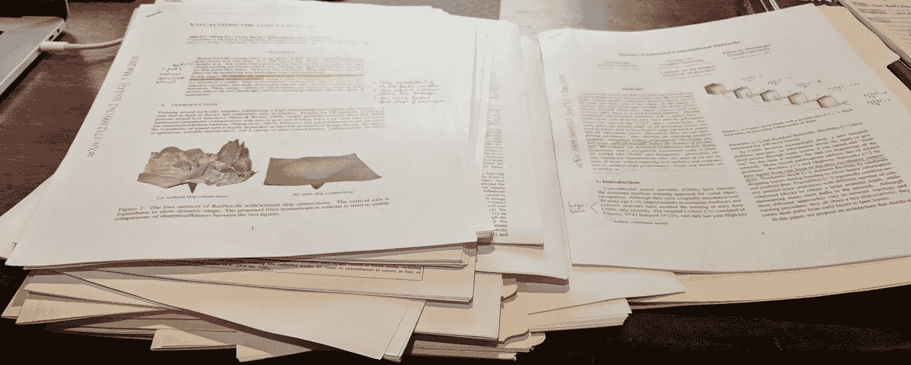
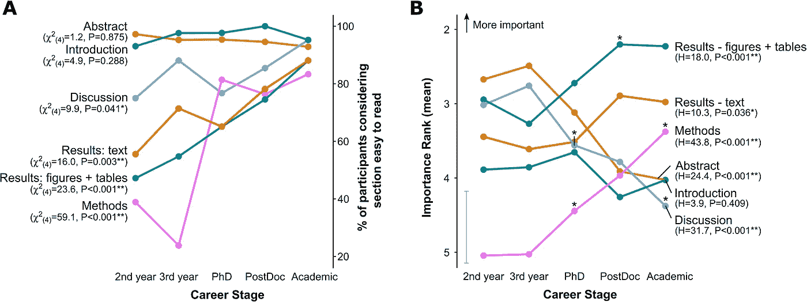

# 学术研究论文阅读指南

> 原文：<https://towardsdatascience.com/guide-to-reading-academic-research-papers-c69c21619de6?source=collection_archive---------2----------------------->

## 学会用系统的方法处理这个费力的过程！



My desk full of papers. Slightly shuffled around for dramatic purposes of course.

在数据科学和机器学习领域工作是一个令人兴奋和具有挑战性的领域。新的技术和工具在不断渗透，老实说，这种感觉让人无法抗拒。许多这些新发展都是在学术研究文章中发现并首次披露的。从这些文章中提取知识是困难的，因为这些论文的预期读者往往是其他研究人员。然而，为了跟上时代潮流，阅读论文是一项基本技能——幸运的是，这项技能可以通过勤奋和练习来提高。

在研究生院，你很擅长(应该会很擅长…)阅读论文和吸收研究成果。不是每个人都会接受这方面的培训，但这并不意味着你不能从这些文章中获益。公共税收是这项研究的大部分资金来源。这里的目标是使学术界民主化，只是一点点，并为你在浏览论文时提供一个应用的脚手架。

我阅读论文的方式并不特别独特，但它很有效，对我很有帮助。请记住，这不是唯一的方法，有很多技巧，随着你阅读的越来越多，我相信你会找到自己独特的风格。

本指南细分如下:

1.  学习这个技能**会**帮到你！我保证
2.  我听说读论文很难。为什么？
3.  论文通常是如何组织的？
4.  我阅读论文的“*防弹*法
5.  帮助您完成工作的工具

# 为什么要学看论文？

阅读报纸当然可以培养性格，因为这通常要花很多时间，而且不能保证你能看完整个故事。这并不是贬低你，而仅仅是为了公开透明。阅读论文是困难的，这是毫无疑问的。机器学习、深度学习、数据科学、数据库和数据工程等领域的进步通常以学术研究的形式出现，其语言是学术论文。想想你可能会用到的一些技术:[卷积神经网络](http://yann.lecun.com/exdb/publis/pdf/lecun-90e.pdf)、 [PCA](https://www.tandfonline.com/doi/abs/10.1080/14786440109462720) 、 [AdaBoost](https://ac.els-cdn.com/S002200009791504X/1-s2.0-S002200009791504X-main.pdf?_tid=1197dcb8-c1dc-4289-98f1-314d1c0655a5&acdnat=1532149238_cdf4072d598aa27334f6315be13a16e8) (甚至[深度增强](http://proceedings.mlr.press/v32/cortesb14.pdf)！).这些都来自研究，是的，他们都有论文。此外，考虑到有许多关于这些技术的应用和使用的论文，当您试图解决一个特定的问题时，这些论文可能是至关重要的。除了跟上当前的研究之外，回到过去读一读旧论文也是值得的。你会学到很多东西。我保证。

纵观深度学习领域，似乎每隔几天或几周就会有一篇新的批判性论文问世。掌握它的唯一方法是拿起报纸读一读。

# 哪里出现困难…

这是哈伯德和邓巴 2017 年发表的一篇科学论文中的一个数字，关于阅读科学论文。科学论文盗梦空间！



**Fig 2\. Different sections of scientific papers are considered easy to read and important at different stages of academic careers.**

> **答**:参与者认为某一部分容易阅读(表现为“有些容易”、“容易”、“非常容易”的组合)的比例，作为职业阶段的函数。卡方检验的结果显示在左侧。 **B:** 作为职业阶段函数的部门平均重要性等级。为清楚起见，省略了单个点的误差线，唯一的灰色误差线表示任何数据点的最大 95%置信区间。数据点上方的星号表示与之前的职业阶段相比，响应有显著差异，这由 Mann-Whitney 事后测试确定。

一个不足为奇的结果表明，学术上的进展越深入，他们就越容易阅读论文的每一部分。有趣的一点是，各个职业阶段如何看待每个部分的重要性。方法、结果和数字似乎非常重要，表面上是因为作为*的学者*他们在自己的领域有更高的技能，这使得他们可以对论文的方法提出批评。这也意味着他们非常了解自己的领域，因此，引言和摘要就不那么重要了。早期阶段的博士生发现这些方法、结果和数字很难理解。这非常有意义，因为这些领域是论文中最需要某个领域知识的部分。你很可能有类似的经历。

到底是什么让这个过程如此困难和耗时？

*   作者倾向于假设读者的重要背景知识
*   学术语法非常密集，因此读者很难分析
*   数学表达式通常被压缩，为了简洁，方程被重新排序，经常跳过推导的步骤
*   如果读者阅读了被引用的论文，大量的知识空白就被填补了(有点像——你需要经验才能得到工作，但需要工作才能得到经验！)
*   不是所有的**结论都是正确的。小样本量和功效、糟糕的研究设计、研究者偏见和选择性报告确保了你**必须**成为批判性读者！**

显然，阅读论文时需要考虑很多问题。害怕吗？是时候放松一下了。这里有一篇[有趣的文章](https://www.sciencemag.org/careers/2016/01/how-read-scientific-paper)，由[科学](http://science.sciencemag.org/)的亚当·鲁本博士写的关于阅读论文的恐惧。这表明，即使是科学家也同意，论文很难阅读，而且考虑到它们的密度，会让你保持规律。

想想看，你读的论文越多，你学到的就越多，这个阅读的过程就变得越快。趋势开始浮现在眼前，你开始洞察[科学方法](https://www.sciencebuddies.org/science-fair-projects/science-fair/steps-of-the-scientific-method)，了解某些作者和团体正在做什么，并对你正在学习的领域形成一种欣赏。随着时间的推移，所有这些知识和技能都会让你更快、更有效、更成功地阅读论文。学习读报类似于学习吃饭。一开始很乱，你的调色盘也不是很发达。但是随着时间的推移，你的饮食经验会增加，你会更多地了解你喜欢什么和不喜欢什么，以及厨师的饭菜是好是差。

# 论文是如何组织的

这里有好消息。绝大多数论文或多或少遵循相同的组织惯例:

1.  标题:希望朗朗上口，可能性感！包括关于作者和他们的机构的附加信息
2.  摘要:高度概括
3.  引言:该领域的背景信息和导致本文的相关研究
4.  方法:非常详细的部分研究进行，它是如何设置的，使用的任何工具，最后，过程和工作流程
5.  结果:作者谈论的是创造或收集的数据，它应该被理解为对所发生的事情的无偏见的描述
6.  讨论:作者在这里解释结果，并说服读者他们的发现和假设
7.  参考资料:在正文中引用的任何其他作品都会在这里显示
8.  附录:更多的数字，相关数学的额外处理，或者额外感兴趣的项目可以在附录中找到它们的方式

# 开发系统方法

当你坐下来阅读时，制定一个计划是很重要的。仅仅从第一页开始阅读到最后一页可能对你没有好处。除了保留有限的信息之外，你会精疲力尽，而且付出巨大的努力却收获甚微。这是很多人止步的地方。

做好计划，从**花 3-6 个小时**真正消化一篇论文，记住它们*非常*密集！准备好并愿意让**通过论文**几次，每次都希望提取不同的信息和理解。请帮你自己一个忙，不要在你第一遍的时候从头到尾读完这篇论文。

下面是两个列表。我在阅读论文时或多或少采取的系统方法。)我在浏览论文时试图回答的一系列问题。我通常会根据论文增加更具体的问题。

我们开始吧！

1.  试着找一个安静的地方呆几个小时，拿上你最喜欢的饮料(可能是咖啡、茶，或者任何其他东西)。现在我经常发现自己在华丽的咖啡店里工作。
2.  从阅读**标题**和**摘要**开始。旨在获得论文的高水平概述。作者的主要目标和高水平的结果是什么。摘要通常为论文的目的提供一些线索。把摘要想象成广告。
3.  花大约 15 分钟略读这篇论文。快速浏览图表，并注意阅读文本时要注意的关键词。试着**对报纸的布局**和东西的位置有个概念。稍后，你将在不同的部分和页面之间来回引用，这有助于了解资料的位置。试着不要花时间做笔记或强调/强调任何事情。
4.  把注意力转向**简介**。我对论文/领域越不熟悉，我花在介绍上的时间就越长。作者倾向于做好巩固背景信息和提供大量参考资料的工作。这一部分通常是最容易阅读的，感觉就像你在读教科书一样。记下你不知道或不想进一步研究的其他参考资料和背景信息。
5.  这部分极其关键。仔细浏览每一个**图形**，试着感受它们告诉你的东西。当我还是本科生的时候，我的神经科学导师给了我一些很好的建议。转述:“*图包含了论文中一些最重要的信息。作者花了大量的时间创建它们，并认为它们包含的信息足够重要，可以通过视觉传达给读者。请特别注意它们。“第一次浏览时，你不会很好地理解所有的数字，但你会对作者认为最重要的东西有所了解，而且你还会透露出阅读其他部分时需要注意的有价值的信息。*
6.  到目前为止，你可能已经花了大约一个小时。休息一下。散散步，享受羊角面包！
7.  现在你已经准备好第一次通过纸张了。这次你应该开始做一些高水平的笔记。你会遇到对你来说陌生的词汇和想法。不要觉得你需要在每一件没有意义的事情上停下来，你可以简单地标记它，然后继续前进。目标是花大约一个半小时。你不想陷入所有血淋淋的细节。第一遍的目标是熟悉论文。就像第一次约会。你要了解报纸，问一些好问题，也许会让它发笑。但你不会想深入每一个细节。那是粗鲁的。从**摘要**开始，快速浏览**简介**，给**方法**部分一个勤奋的通行证。请注意整体设置，方法部分包括大量的细节，此时您不需要仔细检查每个部分。最后，阅读**结果**和**讨论**部分，了解关键发现以及这些发现是如何确定的。请记住，作者试图说服你，读者，他们工作的价值和发现。
8.  被铃声救了。休息一下，做一些跳跃运动，让血液流动起来。除非你在咖啡店里。那就别这么做。
9.  现在你已经对论文有了一个很好的概述，你将进入**数字**的本质。在阅读了方法、结果和讨论部分之后，你应该能够从这些数字中提炼出更多的精华。找到那些宝石。目标是再花 30 分钟到 1 小时在这些数字上。
10.  你应该对第二次全面通过试卷充满信心。这一次你将会以批判的眼光阅读。这个过程可能需要一两个小时，你也可以把它留到当天晚些时候，或者第二天。特别注意你标记为难以理解的地方。不要留下未定义的单词，并确保你理解每个句子。这一关你是在尝试真正的学习论文。浏览你有信心的领域(摘要、介绍、结果)。重点应该是巩固你以前不理解的内容，掌握方法部分，最后成为讨论部分的批判性读者。在讨论部分，你可以考虑作者的推理/理性，并把你从阅读论文中学到的东西与论文中提供的证据进行权衡。这一部分应该会引发一些有趣的问题，让你问你的朋友或同事。你甚至可以给论文作者发电子邮件，提出一个有见地的问题！他们可能需要一段时间才能给你回复，但是作者确实喜欢就他们的研究进行对话，并且通常非常乐意回答读者的问题。
11.  在这一点上，你应该有信心与同事谈论这篇论文，批判性地思考结果，并能够将这项工作与该领域的其他研究进行比较(如果你读过其他论文)。为了保留和强化你所学到的东西，我建议你写关于论文的内容。它可以简单地是几段关于你学到了什么和结果的意义。当你通读这篇论文时，你可以参考你所回答的问题列表。

如上所述，这里有一个通用的问题列表来帮助指导你。如果你能回答这些问题，你就对这篇论文有了很好的理解，至少你能就此与他人进行明智的交流。

```
1\. What previous research and ideas were cited that this paper is building off of? (this info tends to live in the introduction)
2\. Was there reasoning for performing this research, if so what was it? (introduction section)
3\. Clearly list out the objectives of the study
4\. Was any equipment/software used? (methods section)
5\. What variables were measured during experimentation? (methods)
6\. Were any statistical tests used? What were their results? (methods/results section)
7\. What are the main findings? (results section)
8\. How do these results fit into the context of other research and their 'field'? (discussion section)
9\. Explain each figure and discuss their significance.
10\. Can the results be reproduced and is there any code available?
11\. Name the authors, year, and title of the paper!
12\. Are any of the authors familiar, do you know their previous work? 
13\. What key terms and concepts do I not know and need to look up in a dictionary, textbook, or ask someone?
14\. What are your thoughts on the results? Do they seem valid?
```

我建议亲自或在网上找人来讨论这篇论文。建立一个日志俱乐部，目标是每月完成 1-2 篇论文。通过与朋友讨论论文，我获得了巨大的额外洞察力。纪念..唯一比独自忍受论文的痛苦更好的事情，就是和朋友一起忍受它！

另外，Keshav 写了一篇关于如何阅读论文的好文章。他介绍并探索了一种三阶段方法，您可能会感兴趣。也读一读吧！

# 帮助您完成工作的工具

您可以从以下几个来源找到论文:

*   一个 [rXiv](https://arxiv.org/) :是一个开放存取的知识库(维护在康乃尔)，在这里你可以免费下载和阅读许多定量领域的预印研究论文。这里是更多关于 arXiv 的[一般信息](https://arxiv.org/help/general)。你在网上找到的许多论文都会链接到 arXiv 论文。
*   PubMed :他们说得最好:“ *PubMed Central (PMC)是美国国立卫生研究院国家医学图书馆(NIH/NLM)的生物医学和生命科学期刊文献的免费全文档案。如果你正在寻找医学或生命科学相关的论文，PubMed 有一个强大的搜索功能。*
*   谷歌学术:我会像使用谷歌一样使用谷歌学者。只需搜索一个主题、作者或论文，谷歌就会代表你开始工作。正如谷歌所说的“*”谷歌学术提供了一种广泛搜索学术文献的简单方法。从一个地方，你可以搜索许多学科和来源:文章，论文，书籍，摘要和法院意见，从学术出版商，专业协会，在线仓库，大学和其他网站。谷歌学术帮助你在学术研究领域找到相关的工作。*
*   社交媒体:我通过跟踪和保持与几个积极发表文章的人的联系，发现了很多新论文。附加奖金..他们通常会推送他们感兴趣的、你可能想了解或阅读的其他论文。
*   朋友和同事:找到和你兴趣相同的人，和他们一起读论文，互相学习。我从朋友那里得到好论文的推荐。它们是很好的过滤器。
*   大学:去你当地的学院或大学(如果附近有)可以让你接触图书馆，图书馆员(非常有用的搜索向导！)和许多期刊，在那里你可以找到并阅读在线付费墙后面的文章。

当你开始阅读更多的文件时，你会想把它们存放在某个地方。将 pdf 文件放入你硬盘上的一个文件夹中固然很好，但是缺少了一些物质享受。大多数研究人员和研究生使用一个[咨询经理](https://www.apa.org/science/about/psa/2013/12/reference-manager.aspx)。 [Zotero](https://www.zotero.org/) 和[门德利](https://www.mendeley.com/)很受欢迎，我喜欢 Zotero。最近一直在用[纸堆](https://paperpile.com/app)。我喜欢 PaperPile，因为它是轻量级的，存在于我的浏览器中，并使用 Google Drive 来备份和存储我所有的 pdf。它有一个简单的，令人耳目一新的用户界面，它有一个非常好的标签和文件夹层次系统。我还可以在我的浏览器中注释 pdf，并在写作时建立引用列表。几乎任何参考资料管理器都有很多这样的功能，但我碰巧最喜欢 PaperPile。

随着你收集和阅读越来越多的论文，推荐人将很快成为你最好的朋友。

感谢您通读这篇文章。我希望它对你有所帮助，并且在你处理下一篇论文时给你一些好的想法。大多数人在看论文的时候都有自己独特的流程。我相信你会及时开发你自己的调整，希望这是一个很好的模板让你开始。

现在只需要*相信过程*。

我也希望我们能从读者那里得到一些好的反馈和评论，以及其他的提示和技巧。

干杯，

狭海峡

> 联系我:datasci@kmshannon.com
> 
> linkedin.com/in/kmshannon/
> 
> twitter.com/ButFirstData

[1]哈伯德，K. E .，&邓巴，S. D. (2017)。对科研文献的看法和阅读论文的策略取决于学术生涯阶段。 *PloS one* ， *12* (12)，e0189753。

[2]在 [CoffeeCycle](https://www.facebook.com/coffee.cycle/) 向克里斯大喊！简直是圣地亚哥最好的咖啡。

[3]凯沙夫，S. (2007 年)。如何阅读一篇论文？ *ACM SIGCOMM 计算机通信评论*， *37* (3)，83–84。