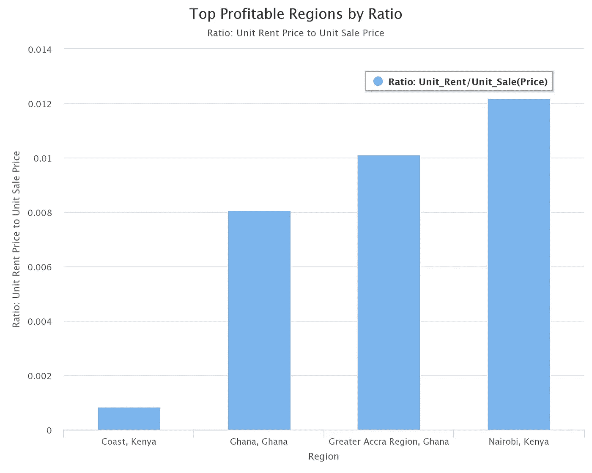
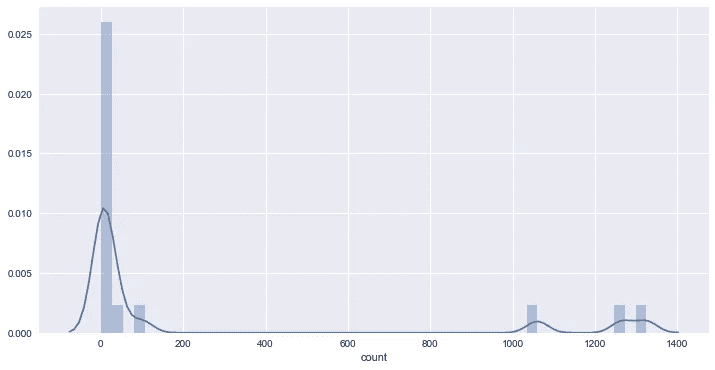
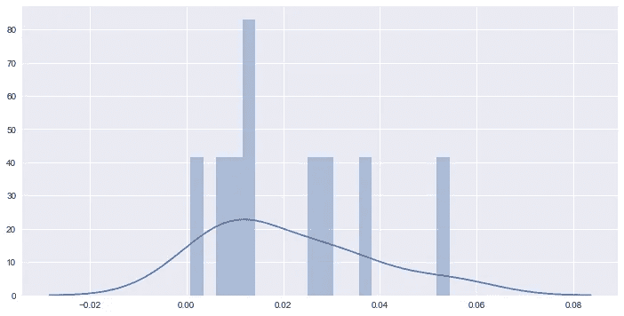
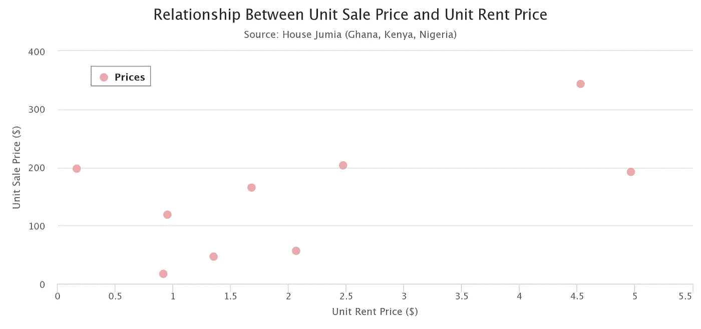
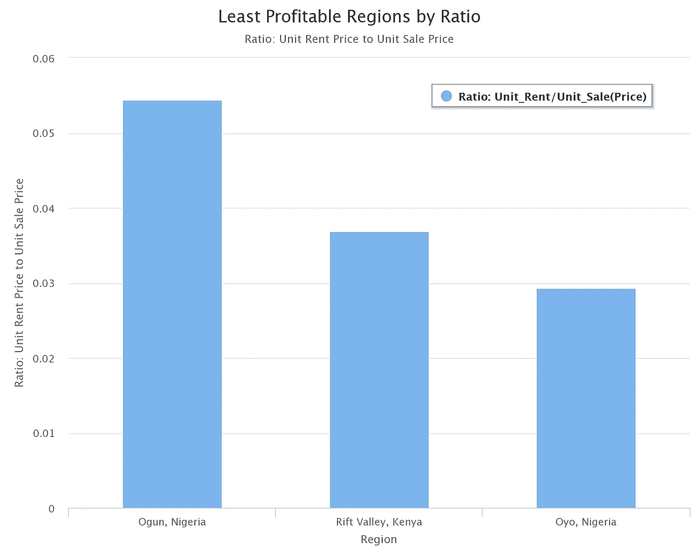

# 用数据科学指导你在非洲的下一笔房地产投资

> 原文：<https://towardsdatascience.com/guide-your-next-property-investment-in-africa-with-data-science-5a9fd623bb52?source=collection_archive---------5----------------------->

[*信息:该分析最初由余晚晚发表。点击此处查看原始代码和内容。*](https://github.com/nycdatasci/bootcamp004_project/blob/master/Project3-WebScraping/Wendy%20Yu/Data%20analysis-final.ipynb)

这里的目标是在选定的非洲国家( [**【加纳】**](https://house.jumia.com.gh/) ， [**肯尼亚**](https://house.jumia.co.ke/) 和 [**尼日利亚**](https://house.jumia.com.ng) )中确定**利润最高和利润最低的**国家/地区，以便用数据科学技术指导您的房地产投资决策。

投资房地产的理想社区应该有

1.  高租金
2.  低价出售。因此，租金将高于每月的按揭付款，以赚取利润。

为此，我们需要一种方法来比较租赁价格和销售价格。对于每个街区，我们计算了两件事:

1.  租赁价格的每平方英尺单价和销售价格的每平方英尺单价
2.  假设 20%的首付、19.67%的年利率(选定国家的平均值)和 30 年的抵押贷款期限，平均每月抵押贷款额。

在我们开始比较租赁价格和销售价格之前，先看一下数据集是很重要的。

我注意到一些社区很少有甚至没有挂牌。列表数量少可能会带来不稳定性并导致错误的结果。因此，我删除了等于或少于 5 个列表的邻域，以确保数据的质量。

Data showing distribution by number of property listings by region

以下是一些拥有 3 个以上房源的小区的例子。例如，在尼日利亚阿布贾的一平方英尺租金为 4.53 美元，购买价格为 344 美元，而在大阿克拉地区的一平方英尺租金为 1.68 美元，购买价格为 165 美元。肯尼亚内罗毕——租金 2.47 美元，房价 203 美元。

# 评估盈利能力

为了衡量一个地区的利润，我们计算了租金单价与销售单价的比率。这意味着:单位租售比越高，该地区的利润越低。见下图:

Profitability Ratio Distribution

根据我们的盈利能力评估，下面的图表显示了所有选定国家中房地产投资盈利最多和最少的地区。

Top Profitable Regions by Ratio

Least Profitable Regions by Ratio

# 最后

这种分析可能并不完美，因为这些国家之间没有标准的汇率。因此，价格可能会有变化(*尼日利亚本身至少有四种不同的美元汇率*)。此外，数据源([*web scraped from House Jumia*](http://house.jumia.com.ng))可能不包含所有列出的属性，因此有点偏。

然而，这并没有放弃应用于该分析的技术。

我想听听你对分析的反馈。请留言或发送推文@ [elesinOlalekan](https://twitter.com/elesinOlalekan)

我们希望这能对你的房地产投资决策有所帮助。

*感谢* [*余晚晚*](https://www.linkedin.com/in/chungwenyu/) *让我重现她的分析*