# 使用 KNIME 分析平台的引导式分析

> 原文：<https://towardsdatascience.com/guided-analytics-using-knime-analytics-platform-b6543ebab7e2?source=collection_archive---------11----------------------->

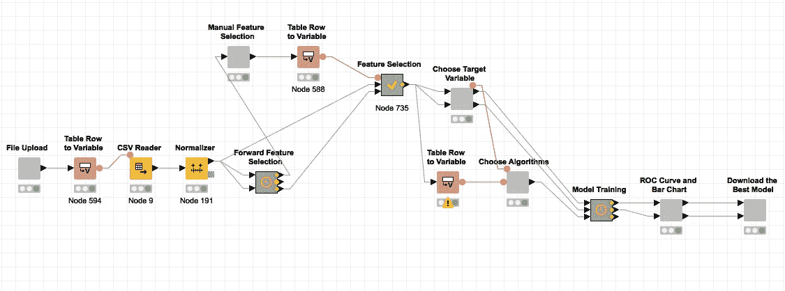

Guided Analytics KNIME workflow

## 什么是引导式分析？

虽然“引导式分析”这个词会让你的思维进入一种复杂的状态，但它仅仅意味着自动化数据科学。引导式分析允许数据科学专业知识较少的人浏览流程，并看到隐藏在现有数据中的新见解。例如，学校的 IT 管理员可以跟踪这一过程，并预测未来的结果，如特定班级的学生在特定科目上的表现。

## 什么是 KNIME？

[KNIME Analytics platform](https://www.knime.com/knime-introductory-course/chapter1) 是数据科学中最受欢迎的开源平台之一，用于自动化数据科学流程。KNIME 的[节点库](https://www.knime.com/knime-introductory-course/chapter1/section2/node-repository)中有数千个节点，这允许您将节点拖放到 KNIME 工作台中。相关节点的集合创建了一个工作流，在将工作流部署到 KNIME 服务器之后，该工作流既可以在本地执行，也可以在 KNIME web 门户中执行。KNIME 通过帮助自动化过程，帮助在 KNIME 平台中创建作为工作流的引导分析过程。

## 数据科学生命周期

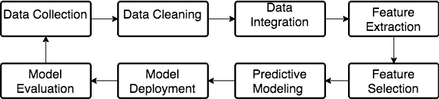

Data science lifecycle

上图描绘了从数据清理到模型评估的递归数据科学生命周期。在向 [Cinglevue](https://www.cinglevue.com/our-company/) 的 [Virtuoso 平台](https://www.cinglevue.com/products/virtuoso/)引入引导式分析时，我们基本上专注于为 Virtuoso 最终用户提供灵活性和用户友好性。我们开发的引导式分析流程的范围从功能选择到模型评估，假设用户已经清理了数据。最上面的图说明了 KNIME 引导的分析工作流，该工作流用于实现前面提到的从特征选择到模型评估的过程。当您在 KNIME server 中部署这个工作流时，您可以通过 web 门户访问它，并获得用户友好的向导。基本上，它允许用户将数据集上传为 csv 文件，如下所示。

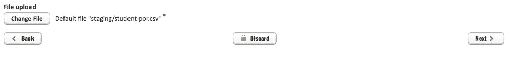

File upload wizard

然后将这些特征以表格的形式列出，其中包含使用[正向特征选择](https://www.knime.com/nodeguide/analytics/preprocessing/perform-feature-selection)方法获得的精度值。基本上，前向特征选择所做的是，它一次迭代地向模型添加一个特征，并在添加特定特征后找到模型的准确度分数。用户可以浏览列表，并通过考虑准确性来选择他认为将在模型中工作的一些特征。

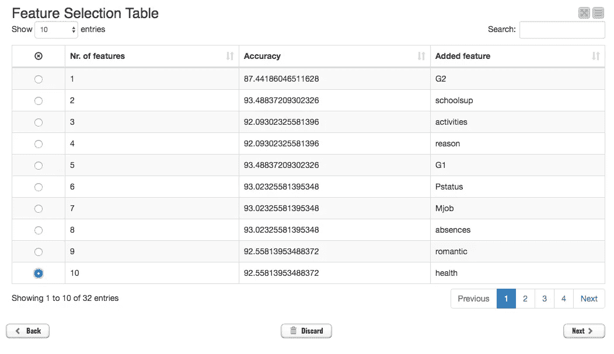

Feature Selection wizard

下一个屏幕要求用户选择目标变量，如下图所示。

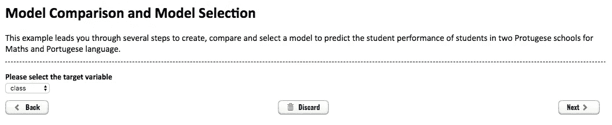

Target variable selection wizard

第四个屏幕显示了用户可以用来训练数据集的分类算法列表。

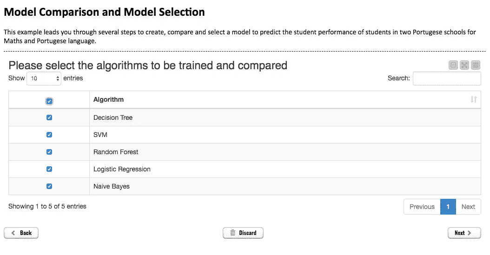

ML Algorithm selection wizard

在下一个屏幕中，用户可以通过 ROC 曲线和条形图查看所选算法中哪个算法执行得最好，以便于理解。下图描述了这种情况。

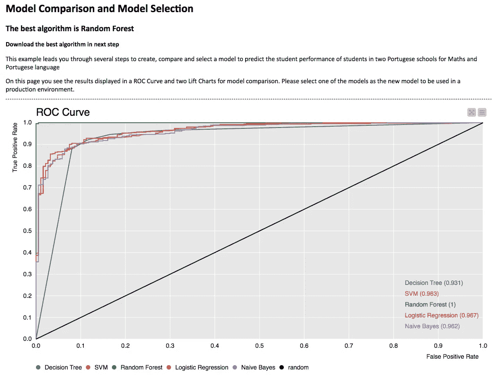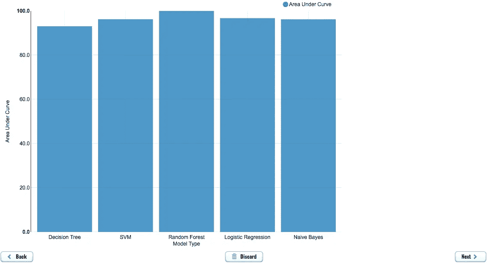

Graphical model comparison

最后一步允许用户下载 PMML 格式的最佳模型，它允许在任何企业应用程序中使用。

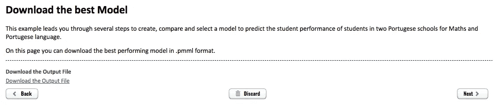

**架构**

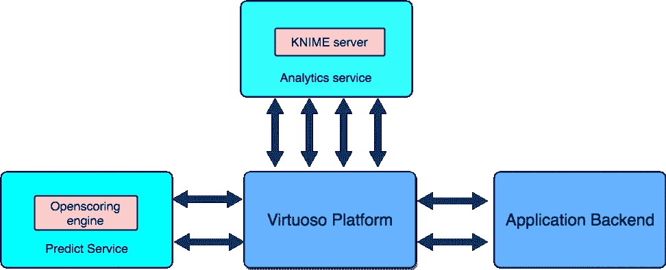

High level architecture

上图描述了所采用的引导式分析流程的高级架构。分析服务包装在 KNIME 服务器上，它允许列出并执行已部署的 KNIME 工作流。Virtuoso 平台直接与分析服务对话，并执行与特征选择和建模相关的工作流。预测服务在[开放评分引擎](https://github.com/openscoring/openscoring)之上实现。Virtuoso 平台直接与预测服务对话，并利用 openscoring 的模型部署和模型评估功能。

**cing levu 是如何在 Virtuoso 平台中引入导向分析的？**

为了将引导式分析引入 Virtuoso 平台，我们必须将最上面的图中描述的 KNIME 工作流分解为针对分类和回归类型问题的特征选择和模型训练。

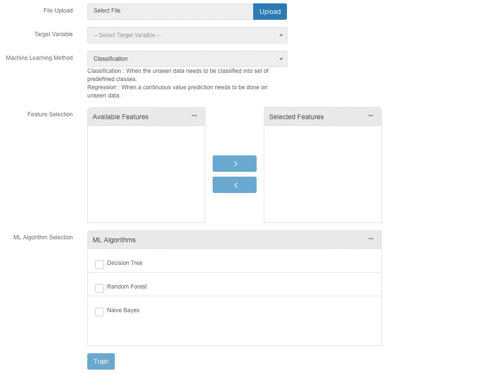

数据源访问本身是在前端完成的。重要的是，任何 csv 格式的数据集都可以利用这一工作流程获得新的见解。上传数据集后不久，用户需要选择目标变量。选择目标变量后，其余提取的特征列在可用特征列表框中，用户可以选择他认为会影响结果的任何特征。所选择的特征通过分析服务被发送到 KNIME 服务器，以运行工作流并发送回所获得的评估度量(准确性)。使用前向特征选择方法通过迭代添加特征来获得准确度值。如下图所示，所获得的精度值显示在所选特征下。

我们使用准确度作为分类类型问题的前向特征选择标准，而使用 [R](https://en.wikipedia.org/wiki/Coefficient_of_determination) 作为回归类型问题的前向特征选择标准。如前所述，主引导分析工作流已被分解为几个子工作流，特征选择是一个子工作流。我们在后台使用的工作流程如下图所示。

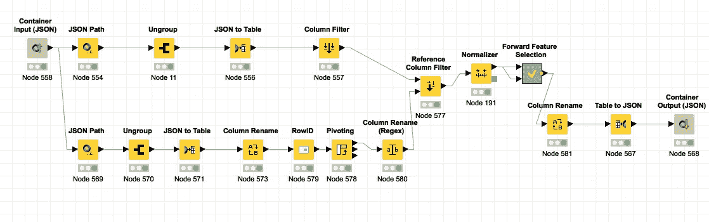

Feature Selection KNIME workflow

对于分类类型问题，我们在前向特征选择元节点中使用朴素贝叶斯算法来预测添加特征的精度值，如下图所示。

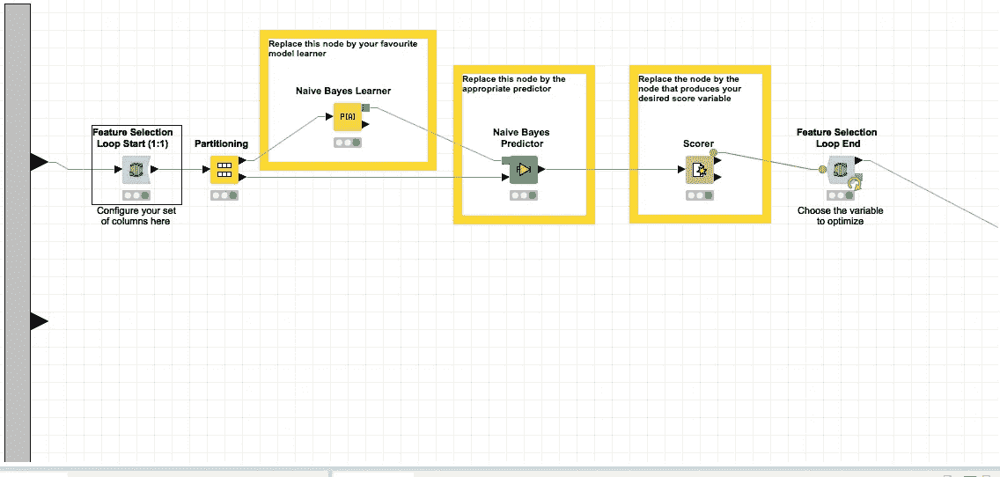

Forward feature selection using Naive Bayes algorithm

对于回归类型的问题，我们在正向特征选择元节点中使用线性回归算法来预测添加特征的 R 值，如下图所示。

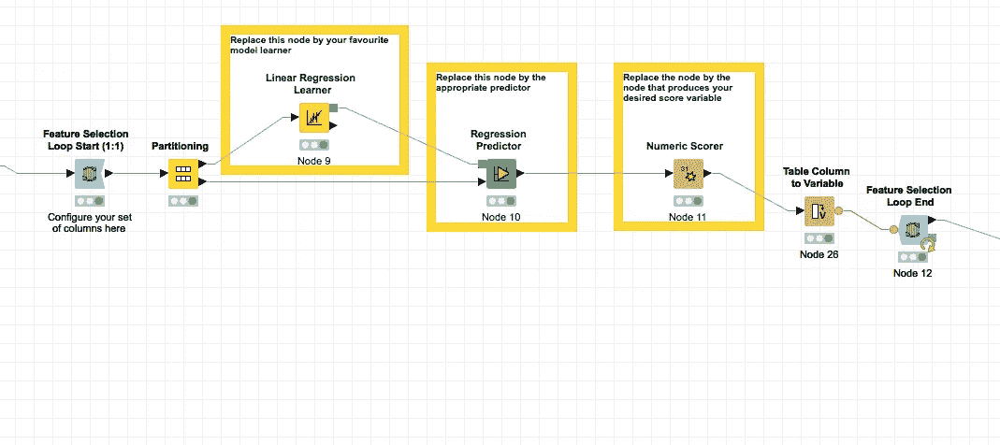

Forward feature selection using Linear Regression algorithm

然后下一步是根据在机器学习方法选择下选择的挖掘函数来选择列出的机器学习算法。如果选择了分类方法，则会列出分类算法；如果选择了回归方法，则会在算法选择下列出回归算法。所选算法以及数据集和所选要素被发送到 KNIME 服务器，以 PMML 格式返回所选算法的精度或性能 R 值以及最佳模型。结果显示为条形图，如下图所示。

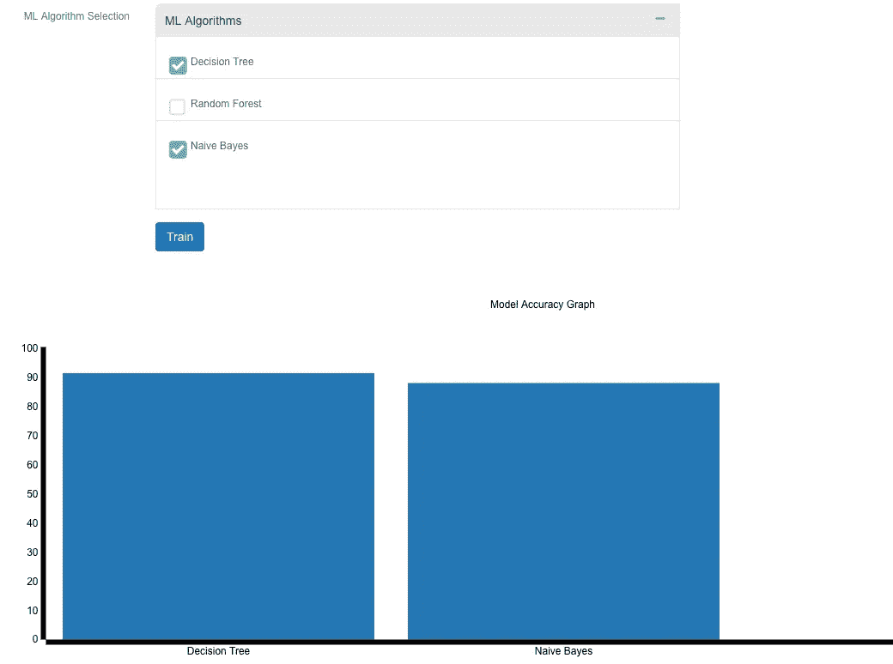

Algorithm Selection for a classification type problem

Algorithm Selection for a regression type problem

下图显示了用于分类和回归类型问题的模型训练的后端 KNIME 工作流。模型训练元节点内部使用的 ML 算法根据挖掘功能的性质(分类或回归)而变化。

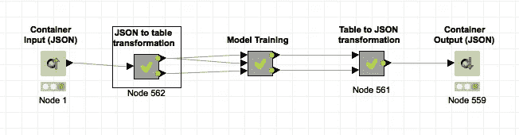

在这个阶段，我们已经完成了特征选择和模型训练这两个步骤。然后是模型部署和模型评估。Virtuoso 平台利用 Openscoring 引擎的功能来实现这两个目的。

我们获得的最佳模型的 PMML 文件使用用户给定的模型 id 部署到 Openscoring 引擎中。部署的模型如下图所示。

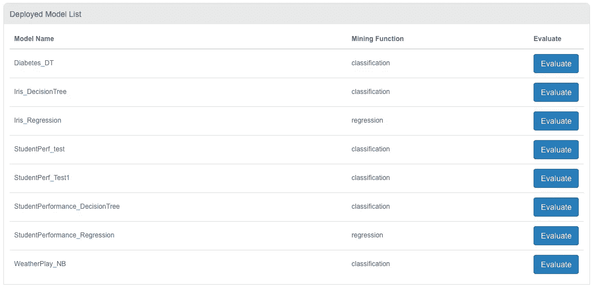

Deployed ML model list

一旦用户点击特定模型的评估按钮，与该模型相关的输入字段将与有效边界一起列出，如下图所示。

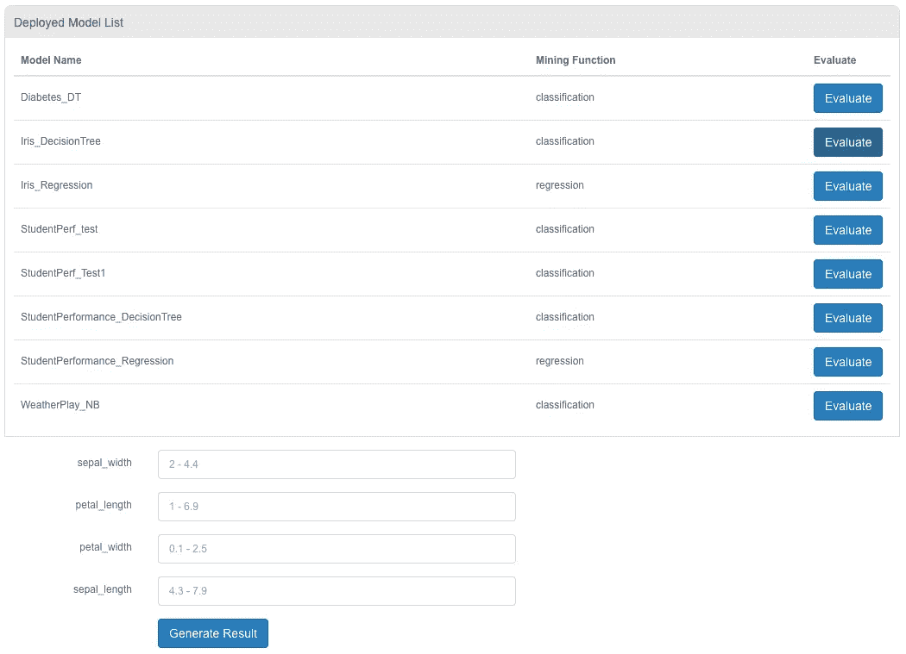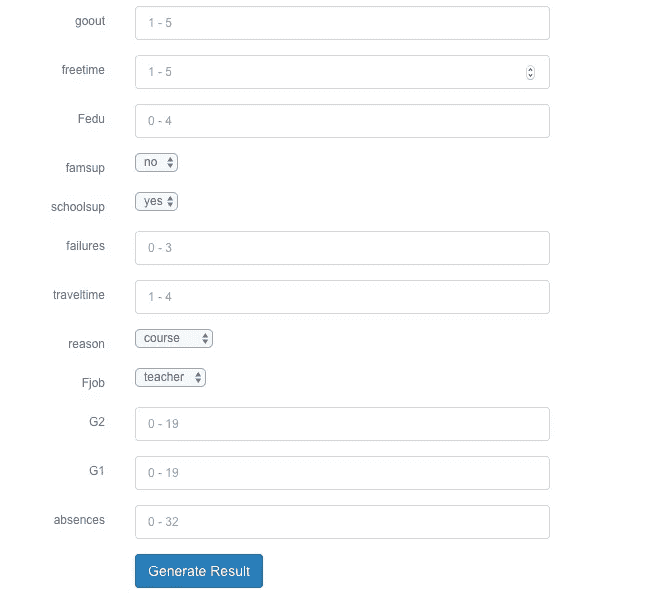

Input fields for model features

下一步是使用这个接口评估模型的不可见数据，如下图所示。

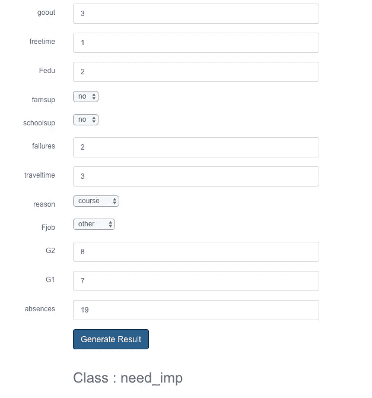

下一步将是验证获得的结果，并将新数据输入到重新训练模型中，以获得更好的预测。将会带来另一篇有趣的博文，讲述如何通过继续数据科学生命周期来重新训练模型。

如果您需要任何澄清，请通过[udeshika.sewwandi@cinglevue.com](http://udeshika.sewwandi@cinglevue.com)联系我。非常感谢您对这种自动化数据科学流程的方法的宝贵意见。

**延伸阅读**

[1]https://www.knime.com/blog/principles-of-guided-analytics

[2][https://www . knime . com/knime-software/knime-analytics-platform](https://www.knime.com/knime-software/knime-analytics-platform)

[3][https://en.wikipedia.org/wiki/Data_science](https://en.wikipedia.org/wiki/Data_science)

[4]https://en.wikipedia.org/wiki/Machine_learning

[5]https://en.wikipedia.org/wiki/Automated_machine_learning