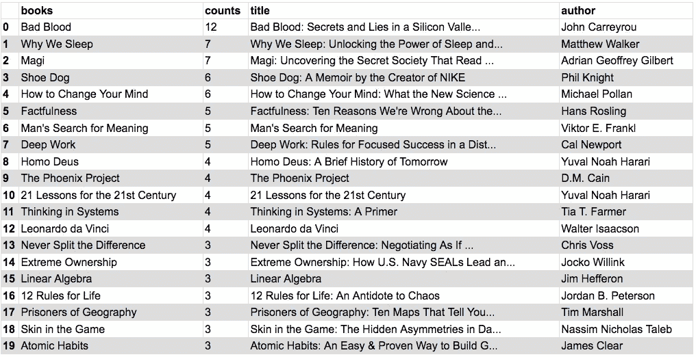

# 用 Python 分析黑客新闻书籍建议

> 原文：<https://towardsdatascience.com/hacker-news-book-suggestions-64b88099947?source=collection_archive---------9----------------------->

## 一个黑客新闻线程的分析，使用 Python，黑客新闻 API 和 Goodreads API，以及权威的前 20 名书籍建议列表！


几天前，传统的“你今年读了什么书”主题出现在黑客新闻上。[线程](https://news.ycombinator.com/item?id=18661546)充满了非常好的书籍建议。我试图为明年做一份阅读清单，我认为收集数据并分析它会很有趣。在接下来的文章中，我将展示我如何使用 Hacker News 的 API 来收集文章内容，我如何选择最常见的标题并对照 Goodreads API 进行检查，最后我如何得出最值得推荐的 20 本书。和往常一样，处理文本数据一点也不简单。不过最后的结果还是挺满意的！

# 抓取线程:黑客新闻 API

第一步是获取数据。幸运的是，黑客新闻提供了一个[非常好的 API](https://github.com/HackerNews/API) 来免费抓取它的所有内容。API 有帖子、用户、热门帖子和其他一些的端点。对于本文，我们将使用一个帖子。用起来很简单，下面是基本语法:`v0/item/{id}/.json`其中 id 是我们感兴趣的项目。在这种情况下，线程的 id 是 [18661546](https://hacker-news.firebaseio.com/v0/item/18661546.json').json()) ，因此这里有一个关于如何获取主页面数据的示例:

```
import requests 
main _page = requests.request(‘GET’, ‘[https://hackernews.firebaseio.com/v0/item/18661546.json').json()](https://hacker-news.firebaseio.com/v0/item/18661546.json').json()))
```

相同的 API 调用也用于线程或帖子的子帖子，其 id 可以在父帖子的`kids`键中找到。在孩子们身上循环，我们可以得到线程中每个帖子的文本。

# 清理数据

现在我们有了文本数据，我们想从中提取书名。一种可能的方法是寻找文章中所有的 Amazon 或 Goodreads 链接，并按此分组。这是一种干净的方法，因为它不依赖于任何文本处理。然而，只要快速浏览一下这个帖子，就可以清楚地看到，绝大多数建议都没有任何关联。所以我决定走一条更难的路:将 n gram 分组，并将这些 n gram 与可能的书籍匹配。

因此，在从文本中剔除特殊字符后，我将二元模型、三元模型、四元模型和五元模型组合在一起，并计算出现的次数。这是一个计算二元模型的例子:

```
import re
from collections import Counter
import operator# clean special characters
text_clean = [re.sub(r"[^a-zA-Z0-9]+", ' ', k)  for t in text for k in t.split("\n")]# count occurrences of bigrams in different posts
countsb = Counter()
words = re.compile(r'\w+')
for t in text_clean:
    w = words.findall(t.lower())
    countsb.update(zip(w,w[1:]))# sort results
bigrams = sorted(
    countsb.items(),
    key=operator.itemgetter(1),
    reverse=True
)
```

通常在文本应用中，处理数据时首先要做的事情之一是消除停用词，即一种语言中最常见的词，如冠词和介词。在我们的例子中，我们还没有从我们的文本中删除停用词，因此这些 ngrams 中的大多数几乎都是由停用词组成的。事实上，下面是我们数据中最常见的 10 个二元模型的输出示例:

```
[((u'of', u'the'), 147),
 ((u'in', u'the'), 76),
 ((u'it', u's'), 67),
 ((u'this', u'book'), 52),
 ((u'this', u'year'), 49),
 ((u'if', u'you'), 45),
 ((u'and', u'the'), 44),
 ((u'i', u've'), 44),
 ((u'to', u'the'), 40),
 ((u'i', u'read'), 37)]
```

在我们的数据中有停用词是好的，大多数标题书中都会有停用词，所以我们希望保留这些停用词。然而，为了避免查找太多的组合，我们排除了仅由停用词组成的 ngrams，保留了所有其他的。

# 检查书名:Goodreads API

现在我们有了一个可能的 n gram 列表，我们将使用 [Goodreads API](https://www.goodreads.com/api) 来检查这些 n gram 是否对应于书名。如果有多个匹配项可供搜索，我决定将最近的出版物作为搜索结果。这是假设最近出版的书最有可能与这种环境相匹配。这当然是一个可能导致错误的假设。

Goodreads API 使用起来没有 Hacker News 那么简单，因为它以 XML 格式返回结果，比 JSON 格式更不友好。在这个分析中，我使用了`xmltodict` python 包将 XML 转换成 JSON。我们需要的 API 方法是`[search.books](https://www.goodreads.com/api/index#search.books)`，它允许通过标题、作者或 ISBN 来搜索书籍。以下是获取最近发布的搜索结果的书名和作者的代码示例:

```
import xmltodictres = requests.get("[https://www.goodreads.com/search/index.xml](https://www.goodreads.com/search/index.xml)" , params={"key": grkey, "q":'some book title'})xpars = xmltodict.parse(res.text)
json1 = json.dumps(xpars)
d = json.loads(json1)lst = d['GoodreadsResponse']['search']['results']['work']
ys = [int(lst[j]['original_publication_year']['#text']) for j in range(len(lst))]title = lst[np.argmax(ys)]['best_book']['title']
author = lst[np.argmax(ys)]['best_book']['author']['name']
```

这个方法允许我们将 ngrams 与可能的书籍关联起来。我们用 Goodreads API 对照全文数据检查匹配所有 ngrams 的图书列表。在进行实际检查之前，我们删除了书名，去掉了标点符号(尤其是半栏)和副标题。我们只考虑主标题，假设大部分时间只使用标题的这一部分(列表中的一些完整标题实际上很长！).根据线程中出现的次数对我们得到的结果进行排序，我们得到以下列表:



Books with more than 3 counts in the thread

所以《坏血》看起来是帖子里最受推荐的书。检查其他结果大部分似乎是有意义的，并与线程匹配，包括计数。我能在列表中发现的唯一一个大错误是在第二位，这本书*被列为魔法师*而不是列夫·格罗斯曼的《魔术师 T2》。后者在文中确实被引用了 7 次。这个错误是由于我们假设 Goodreads API 的结果中考虑了最新的书。至于原始数据上的结果，没有出现在列表中，除了*三体*，我找不到任何明显的结果。这本书或同一三部曲中的其他书在文中被多次引用，但因为它们被不同的名称或不同的标点符号引用，所以没有被这种方法提取出来。解决这个问题的一个方法是在这个步骤中使用模糊匹配。

# 结论

在本文的结论中，我展示了如何从黑客新闻中提取数据，解析数据以提取书名，使用 Goodreads API 检查书名，并将最终列表与原文进行匹配。这个任务被证明是相当复杂的，因为它需要几个假设和处理两个不同的 API。而且最终的结果还是有一些不正确的结果。

尽管如此，我设法得到了一个好的最终结果。以下是《黑客新闻》推荐的前 20 本书的名单:

*   《恶感:硅谷的秘密和谎言》约翰·卡瑞鲁
*   我们为什么睡觉:释放睡眠的力量，马修·沃克著
*   列夫·格罗斯曼的《魔术师》
*   鞋狗:耐克创始人菲尔·奈特回忆录
*   迈克尔·波伦《如何改变你的想法》
*   真实:汉斯·罗斯林的《我们看错世界的十个理由》
*   维克多·e·弗兰克尔《人类对意义的探索》
*   卡尔·纽波特的深入研究
*   《德乌斯人:明日简史》尤瓦尔·诺亚·哈拉里著
*   D.M .凯恩的凤凰计划
*   尤瓦尔·诺亚·哈拉里的《21 世纪的 21 课》
*   系统中的思考:多内拉·h·梅多斯的初级读本
*   沃尔特·伊萨克森的达芬奇
*   克里斯·沃斯的《永不分裂》
*   Jocko Willink 的极端所有权
*   吉姆·赫夫龙的线性代数
*   生活的 12 条规则:混乱的解毒剂
*   蒂姆·马歇尔的《地理囚犯》
*   纳西姆·尼古拉斯·塔勒布的《游戏中的皮肤》
*   詹姆斯·克利尔的原子习惯

*源码可以在*[*Github*](https://github.com/AlessandroMozzato/hn_books)*上查看。任何形式的评论或批评都将不胜感激。*