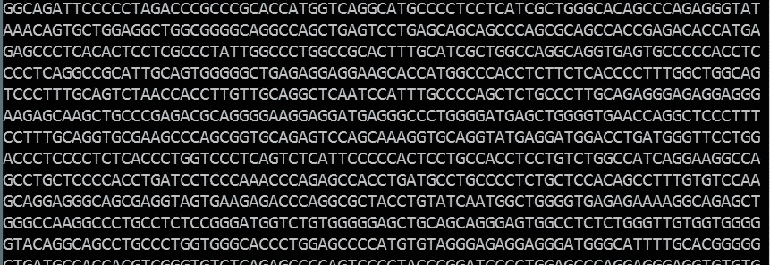
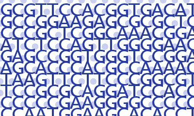
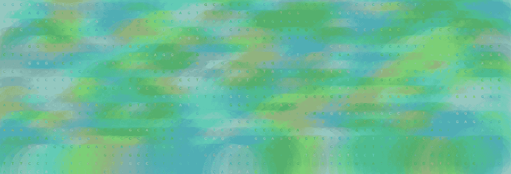
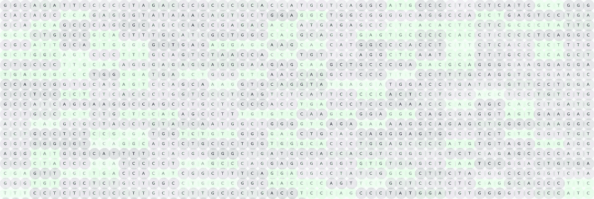
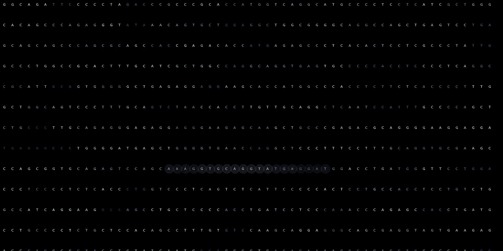
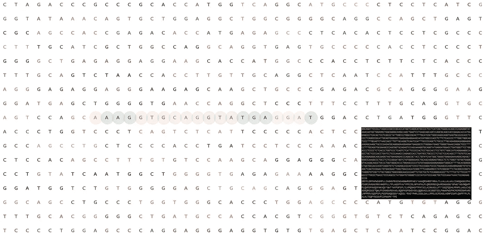
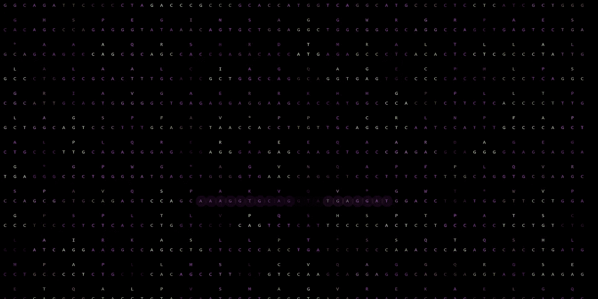
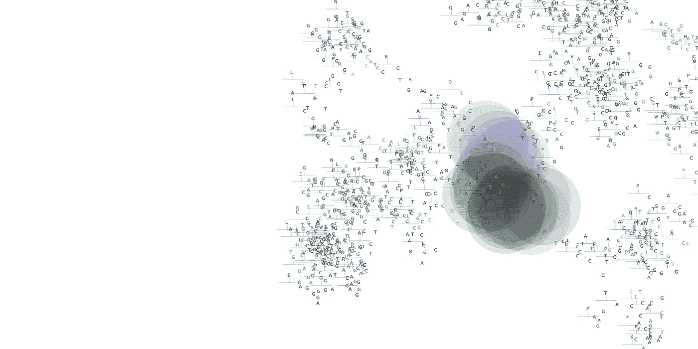
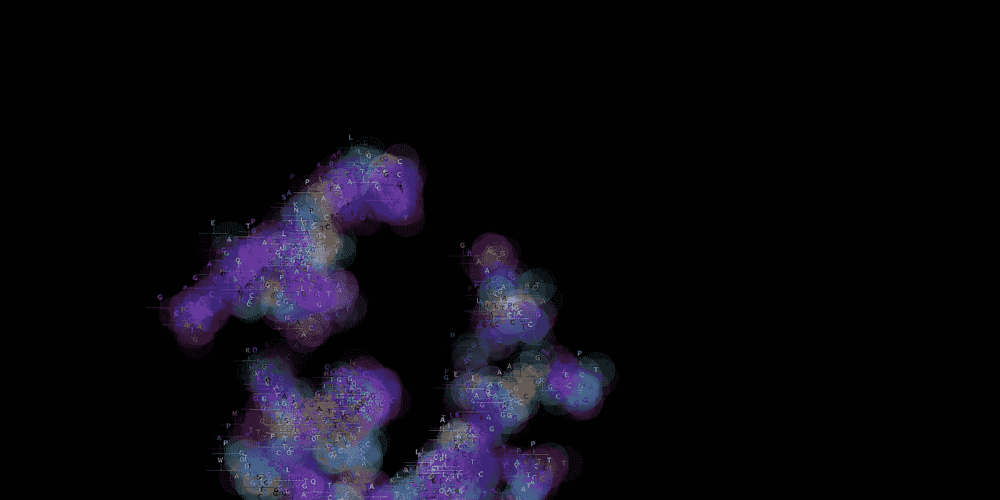

# 人工智能基因组黑客马拉松上的黑客数据艺术

> 原文：<https://towardsdatascience.com/hacking-data-art-at-an-ai-genomic-hackathon-62e16efb49ce?source=collection_archive---------3----------------------->

不久前，我注意到一个有趣的黑客马拉松即将到来。人工智能基因组学黑客马拉松聚焦于一种罕见的疾病()。是的，我曾向自己保证不再参加任何黑客马拉松，但这太难以抗拒了。它结合了我最喜欢的两件事:编程和科学。此外，找到一种罕见疾病的治疗方法的可能性非常有吸引力。所以我填好申请表，点击“发送”，然后等着听我是否被录用。

我在去度假前不久发现我被录取了。我乘喷气式飞机离开，完全忘记了黑客马拉松。几个星期以来，我漫步于伦敦、威尼斯和佛罗伦萨，欣赏艺术、建筑、旧地图和科学仪器。

在黑客马拉松的前几天，我精神焕发地回到家，准备继续编码和解决问题。但是说实话，我也有点时差。

黑客马拉松于周五晚上开始， [Onno Faber](https://twitter.com/onnofaber) 与 NF2 分享了他的个人故事。他谈到了为什么他把自己的基因组数据给了这个项目，以及他希望我们可以用它来帮助找到治疗方法。晚上剩下的时间充满了关于 NF2 周围的科学和我们在项目中可以使用的各种工具的有趣的谈话。

## 这不是黑客马拉松吗？我为什么做艺术？

最初，我计划在黑客马拉松上做一些生物信息学。或者对医疗日志进行一些自然语言处理。但是在活动的前几天，一些组织者看了我的作品集，Onno 问我是否可以用基因组数据创作一些艺术作品。

一个周末的黑客马拉松时间不多，尤其是对于创建数据艺术来说。但它有足够的时间来开始和发挥一些想法。艺术可能需要很长时间，但我喜欢在黑客马拉松上开始一个项目的想法……熟悉一些数据，更好地理解科学。

## 什么是 NF2？

NF2 基因与肿瘤抑制有关，当突变破坏蛋白质时，疾病就会发展，肿瘤就会沿着听神经生长。除了寻找治疗 NF2 的方法，研究 NF2 基因的一个动机是该基因可能以某种方式与其他癌症有关。

## Python (Biopython + PIL)

Python 是这个项目的合理选择，因为我要处理基因组数据。我很快选择了图书馆，因为我知道我可以以后再换。毕竟，这只是一个周末项目。

我知道有些数据是 FASTA 格式的，所以我查找了可以处理 FASTA 文件的库。Biopython 看起来记录良好且易于使用。

对于视觉草图，我保持简单并使用 Python 图像库([PIL/枕头](https://en.wikipedia.org/wiki/Python_Imaging_Library))，它可以写入各种图像文件格式。我以前用过它，所以我可以很快上手，而不需要学习新的库。

# 我的黑客马拉松

当大多数参与者组成小组并提出项目计划时，我在独自工作。我对我想要创造的东西有一些想法，但保持它们相当流畅，因为这将是一次创造性的探索。这与我以前在黑客马拉松中经历的任何事情都非常不同。在黑客马拉松期间，我发了几个帖子，上面有[正在进行的工作](https://www.patreon.com/posts/genomicart-now-12093338)的截图。

## 入门指南

对我来说，任何涉及数据的项目的第一步都是获取数据，并将数据打印到控制台或终端。

这是我的第一张草图。这是人类骨 gla 蛋白的 DNA 序列，我用 Biopython 从 FASTA 文件中提取的。这一步的全部目的是确保我从文件中获得了正确的数据段。在这种情况下，是第一串碱基(ATGC)编码了基因。FASTA 文件可以包含几个序列。

First Step: output data to terminal.

我还想更好地了解 Biopython 库，它有打开 FASTA 文件和从中提取数据的便利功能。

注意:出于隐私考虑，当我从代码和数据中创建图像时，我使用公开可用的基因组数据作为我的“快照”。

Creating an image file from the data.

一旦我将数据打印到终端，我就开始创建图像并将它们保存到我的本地文件系统。我的目标是解析数据，并根据数据中的值生成图像。在这种情况下，它是一串核苷酸(DNA)。

这个迭代的代码仍然有很多问题，但是它确实生成了一个新的图像，并且数据被用来创建这个图像。

Mosaic of images

我已经编写了 python 脚本来创建一个使用随机起始颜色的图像，所以每次运行脚本时都会创建一个新的调色板。当我看到我的图像渲染时，我惊讶地发现它们多么像彩色马赛克中的瓷砖。

一些形式的 NF2 不是种系，而是镶嵌或“自发”突变:这一事实激发了这幅早期草图。黑客马拉松第一天晚上的演讲开始激励我。

Getting transparency working with individual layers with PIL

下一个比我预期的要长一点。对我来说，棘手的部分是弄清楚如何让 python 图像库用一些透明度来绘制每个“点”,这样我就可以得到这种混合的视觉效果。

之前，我已经将序列字符串中的每个字母处理并呈现为一个中间图像，然后将其写入最终图像。但是为了获得透明度，每个点都必须单独写入最终图像。这需要大量的图像渲染。

第一稿代码很慢，效率很低…我需要优化，只将点的面积写入图像，而不是整个图像的面积…但在返回优化之前，我一直在玩视觉效果。让自己继续前进并不容易。我不得不不断提醒自己这是一次黑客马拉松，时间很短。

Starting to hint at the Codons in the sequence.

在这次迭代中，我想让这些点重叠，就一点点。我已经解决了透明度问题，结果不那么抽象，密码子作为三联体更加明显。在遗传学中，一个基因中的密码子就像一个句子中的单词；每个都有特定的含义。它们有三个核苷酸长，编码特定的氨基酸。例如，AUG 是一个“起始密码子”。它位于起始处，编码 Met 氨基酸。

Sleek

只是为了好玩，我尝试了不同的背景颜色。我很高兴黑色的背景让它看起来如此时尚。语境决定一切。小的改变可以带来大的不同。

Digging deeper into Biopython: translating Codons to Amino Acids

所以，我选择 Biopython 库不仅仅是因为它能够打开和读取 FASTA 文件。它也使得将 DNA 序列的密码子翻译成氨基酸序列变得容易。在这个阶段，我已经知道如何用 Biopython 翻译密码子，并将 DNA 和氨基酸序列输出到终端。

虽然我知道自己想要什么，但此时我还没有一个清晰的“愿景”。为了加快渲染速度，我限制了序列的绘制量，因为我尝试了视觉创意。

Amino Acid for each Codon

给 DNA 序列中的每个密码子加上氨基酸，就产生了一个令人愉快的模式。但在这一点上，我想打破网格布局。

Pretty Bug

编写代码来创建图像的一个好处是，有时你犯了一个错误(bug ),结果看起来还不错……或者至少很有趣。这里有一个完美的例子。虽然这不是我想要的视觉效果，但我真的很喜欢它的样子。所以我留着它。当我有更多的时间玩它的时候，我可能会回来。

What’s next?

黑客马拉松已经结束了。但这并不意味着我会停止处理这些数据。我仅仅触及了我能用 Biopython 库做的事情的表面，所以我当然想探索更多。我还想更多地玩视觉游戏，探索不同的想法和模式。

*   想了解更多关于黑客马拉松的信息，请查看官方的[活动网站](https://sv.ai/hackathon)。
*   要查看我在黑客马拉松期间的原创帖子，请查看 [my Patreon](https://www.patreon.com/posts/genomicart-now-12093338) 。