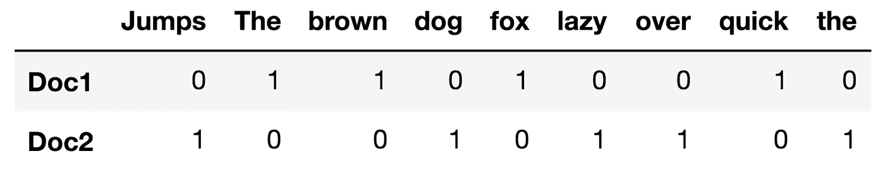
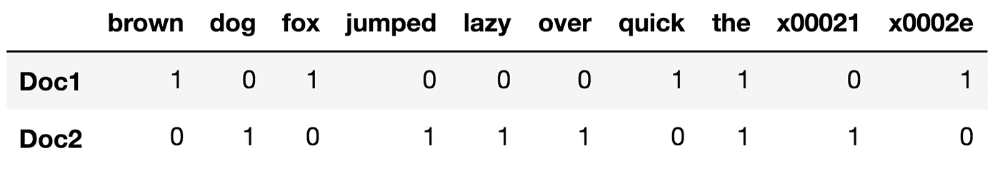
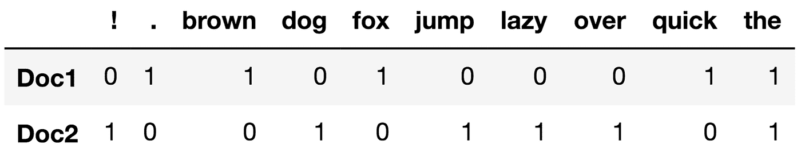
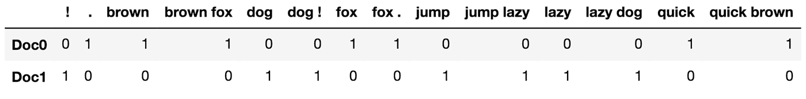
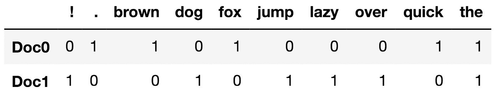
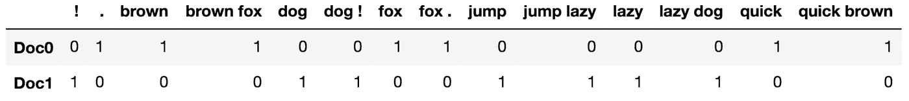

# 黑客 Scikit-Learn 的矢量器

> 原文：<https://towardsdatascience.com/hacking-scikit-learns-vectorizers-9ef26a7170af?source=collection_archive---------2----------------------->

**自然语言处理是一个令人着迷的领域。由于所有的预测因子都是从文本中提取的，因此数据清理、预处理和特征工程对模型的性能有着更加重要的影响。**

**在我自己的一个涉及 **NLP** 的机器学习项目中工作了几个月之后，我已经了解了关于 Scikit-Learn 的矢量器的一两件事，我想与大家分享一下。希望在这篇文章结束时，你会有一些新的想法用在你的下一个项目中。**

# **关于 Scikit-Learn 的矢量器**

**如你所知，尽管机器可能很先进，但它们不能像人类一样理解单词和句子。为了使文档的语料库更适合计算机，它们必须首先被转换成某种数字结构。有一些技术可以实现这一点，但在这篇文章中，我将重点关注**向量空间**模型，也称为 [**词汇袋**](https://en.wikipedia.org/wiki/Bag-of-words_model) (BoW)模型。**

****词汇袋**是解决该问题的一种非常直观的方法，该方法包括:**

1.  **按照某种模式将文档分割成令牌。**
2.  **给每个标记分配一个与它在文档和/或语料库中出现的频率成比例的权重。**
3.  **创建文档术语矩阵，每行代表一个文档，每列寻址一个标记。**

**Scikit-Learn 提供的矢量器对象开箱即用，非常可靠，它们允许我们一次有效地执行上述所有步骤，甚至可以应用预处理和关于标记数量和频率的规则。最重要的是，它们有三种不同的风格(还有其他版本，如 DictVectorizers，但它们并不常见):**

*   ****计数矢量器**:最简单的一个，它计算一个标记在文档中出现的次数，并使用这个值作为它的权重。**
*   ****哈希矢量器**:这个设计是为了尽可能的提高内存效率。矢量器不是将记号存储为字符串，而是应用[散列技巧](https://en.wikipedia.org/wiki/Feature_hashing)将它们编码为数字索引。这种方法的缺点是，一旦矢量化，就无法再检索要素的名称。**
*   ****TF-IDF 矢量器** : TF-IDF 代表“术语频率-逆文档频率”，这意味着分配给每个标记的权重不仅取决于它在文档中的频率，还取决于该术语在整个语料库中的出现频率。更多关于[这里](http://scikit-learn.org/stable/modules/feature_extraction.html#text-feature-extraction)。**

**下面是一个**计数矢量器**的例子。**

**出局:**

****

**要更深入地了解每个步骤，请查看我写的这段代码。它实现了 Sklearn 的 CountVectorizer 的一个简化版本，该版本被分解成一些小函数，使其更具可解释性。**

# **定制矢量器**

**矢量器本身非常强大，可以轻松地执行一些令人惊讶的复杂操作。也就是说，通过修改这些结构，可以将 Scikit-Learn 本身不支持的转换合并到单词包模型中。**

**创建自定义矢量器时主要使用两种方法:使用 Sklearn 默认分析器的修改版本实例化矢量器，以及创建从 CountVectorizer 继承的类。**

## **修改默认分析器**

**在幕后，Sklearn 的矢量器调用一系列函数将一组文档转换成文档术语矩阵。其中，三种方法最为突出:**

*   ****build_preprocessor** :返回一个 callable，用于在标记化之前对输入文本进行预处理。**
*   ****build_tokenizer** :创建一个函数，能够将文档的语料库拆分成标记。**
*   ****build_analyzer** :构建一个应用预处理、标记化、移除 [**停用词**](https://en.wikipedia.org/wiki/Stop_words) 并创建 [**n-grams**](https://en.wikipedia.org/wiki/N-gram) 的分析器函数。**

**简而言之，这些方法负责创建默认的**分析器**、**预处理器**和**标记器**，然后用于转换文档。通过用正确的参数实例化矢量器，我们可以轻松地绕过这些方法，创建一个定制的矢量器。让我们看一个如何实现的例子。**

**让我们模拟一个场景，我们从 web 上删除了一些文本。使用默认设置:**

**出局:**

****

**现在，让我们通过创建一个矢量器来稍微清理一下文档集，该矢量器在预处理步骤中删除了 [**HTML 实体**](https://dev.w3.org/html5/html-author/charref) ，并在文档被标记化时删除了 [**词汇**](https://en.wikipedia.org/wiki/Lemmatisation)**:****

****出局:****

********

****看看“x00021”和“x0002e”是如何被人类可读的“！”替换的和“.”而“跳跃”被简化为引理？另外，如果你以前从未使用过 [**spaCy**](https://spacy.io/) ，我建议你看一下它的文档。SpaCy 是一个高度优化的模块，能够同时执行多个复杂的 **NLP** 任务，它可以是一个救命稻草。****

****如果由于某种原因，您不能将转换分成预处理和标记化阶段(这种方式可能效率不高)，那么您可以选择创建一个定制的分析器来同时执行这两个步骤。****

## ****自定义矢量器类****

****尽管用户定义的分析器可能会派上用场，但它们会阻止矢量器执行一些操作，如提取 **n 元语法**和删除停用词。引用 Scikit-Learn 的文档:****

> ****“默认分析器都调用预处理器和标记器，但是定制分析器将跳过这一步。N-gram 提取和停用词过滤发生在分析器级别，因此自定义分析器可能需要重复这些步骤。****

****例如，当使用预处理器+记号赋予器组合时:****

****矢量器创建**单字**、**双字**并删除**停用词**如“The”:****

********

****另一方面，当尝试使用自定义分析器执行相同的操作时:****

****输出不显示**二元模型**，包含**停止字**:****

********

****发生这种情况是因为当使用用户定义的分析器时，`build_analyzer`方法不调用`_word_ngrams`，T1 负责移除**停止字**并提取 **n 元语法**。****

****避免这种情况的一种方法是创建定制的矢量器类。这个概念非常简单，只需创建一个从基础矢量器继承的新类，并根据需要覆盖`build_preprocessor`、`build_tokenizer`和/或`build_analyzer`方法。****

****所以，让我们再试一次，但是这次创建一个**自定义矢量器类**:****

****出局:****

********

****非常管用！尽管很耗时，但这种方法让分析器知道在矢量器实例化期间使用的任何参数，从而允许自定义函数与矢量器的其余部分无缝集成。****

# ****最后的想法****

****考虑到创建定制矢量器的不同方法，我的建议是总是首先尝试使用最简单的方法。这样你就减少了错误发生的几率，避免了许多不必要的麻烦。****

****此外，值得指出的是，这篇文章中讨论的结构本身非常通用，但只有在与 [**管道**](http://scikit-learn.org/stable/modules/generated/sklearn.pipeline.Pipeline.html) 中的其他变压器结合使用时，它们的真正潜力才会显现出来。你可以在这里了解更多关于这个[的信息。](http://scikit-learn.org/stable/modules/generated/sklearn.pipeline.Pipeline.html)****

****我希望这篇文章给你一套新工具，用在你的下一个项目上！****