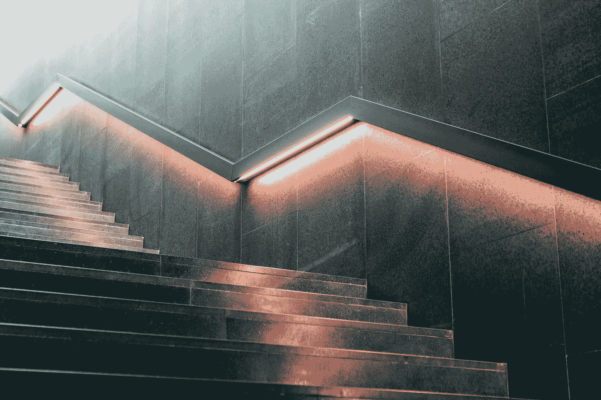
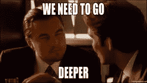

# 破解你的图像识别模型

> 原文：<https://towardsdatascience.com/hacking-your-image-recognition-model-909ad4176247?source=collection_archive---------5----------------------->

Staircase to 99% Classification Accuracy

一旦您找到/创建了一个数据集，构建了一个卷积网络，并训练了模型，您就有了您的性能指标。很有可能，一开始你可能对你的模型的性能不太满意。以下是提高图像识别模型性能指标的一些最常用策略:

根据实施的难易程度/耗时程度，它们被分为两组。

**黑客集群#1:易于实现**

**一、添加更多数据:**改善你的图像识别模型的一个最简单的办法就是给它添加更多数据！如果你已经建立了一个很深的网络，或者你没有太多的训练实例，这是非常有用的。如果你有一个小的数据集，比如每个类中有 50 张图片，这可能就是你需要的。如果你对为什么添加更多数据会产生更好的模型感到好奇，我推荐这篇著名的[文章](https://static.googleusercontent.com/media/research.google.com/en//pubs/archive/35179.pdf)。

**二。添加更多的层:**如果你有一个复杂的数据集，你应该利用深度神经网络的能力，在你的架构上添加更多的层。这些附加图层将允许您的网络学习更复杂的分类函数，从而提高分类性能。

Add more layers!

**三。增大/减小图像尺寸:**当您为训练和评估对图像进行预处理时，需要对图像尺寸进行大量实验。如果您选择的图像尺寸太小，您的模型将无法识别有助于图像识别的显著特征。如果您的图像太大，您可能没有足够的数据，或者您的模型可能不够复杂，无法处理它们。

一**五、更多的训练时间:**喝杯咖啡，用更多的纪元增量训练模型。以+25、+50、+100，..看看额外的训练是否提高了你的分类器性能。但是，您的模型将达到一个点，在这个点上，额外的训练时间不会提高准确性。在实验的同时，你也可以了解更多关于你的学习率参数。记得在每次实验迭代中加载并保存你的模型。

**五、颜色通道:**这里有很多选项可以选择 RGB、YUV、灰度，甚至灰度图像中的进一步处理像素值，所以它们只能取 X 数量的值，例如，[0，64，128，255]。颜色通道越复杂，数据集就越复杂，训练模型所需的时间就越长，但是，如果您有一个深度模型，这可能是一个很好的解决方案。

**黑客集群#2:更难实现**

六。迁移学习:避免让你的卷积神经网络学习边缘和线条等特征，相信聪明人已经用他们的 ResNet 做了很好的工作。将模型下载并加载到您的工作流中，然后更改完全连接的图层以适应您的问题。这篇[文章](/building-the-hotdog-not-hotdog-classifier-from-hbos-silicon-valley-c0cb2317711f)声称迁移学习帮助他从 71%提高到 96%的准确率。

**七世。数据扩充:**尝试通过翻转图像、添加噪声或任何其他您认为不会破坏数据集的失真，将合成数据添加到您的数据集。如果你是一个强大的机器学习工程师，你也可以尝试用 GANs 进行数据增强。

**VIII。改变内核大小，激活函数:**这种技术带有一个“我希望你知道你在做什么”的警告，因为有一些数学涉及到确保你在每个卷积层正确地转换数据。然而，如果你是一名机器学习研究人员，这可能是一个很好的解决方案。

这些是提高分类器性能、训练更长时间、添加更多数据、添加合成数据、改变图像大小、改变颜色通道、转移学习、添加层以及改变内核大小和激活函数的一些解决方案。这些解决方案中的任何一个都可以帮助您获得额外的 5%的图像识别准确性，这一点至关重要。感谢阅读，请留下一些掌声！

# [CShorten](https://medium.com/@connorshorten300)

Connor Shorten 是佛罗里达大西洋大学计算机科学专业的学生。对软件经济学、深度学习和软件工程感兴趣。