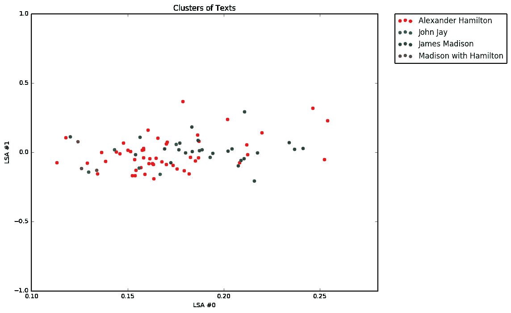

# 汉密尔顿:联邦党人文集的文本分析

> 原文：<https://towardsdatascience.com/hamilton-a-text-analysis-of-the-federalist-papers-e64cb1764fbf?source=collection_archive---------3----------------------->

## 用潜在语义分析探索汉密尔顿、麦迪逊和杰伊在联邦党人文集里的写作风格

[此处代码实现](https://github.com/matthewzhou/FederalistPapers)


Photo by [Ryan Quintal](https://unsplash.com/@ryanquintal?utm_source=medium&utm_medium=referral) on [Unsplash](https://unsplash.com?utm_source=medium&utm_medium=referral)

在这一点上，你可能已经听说过这部戏剧，汉密尔顿，这是席卷百老汇电路和复兴国家利益的“十美元无父开国元勋”。

这是一部极具娱乐性的引人入胜的故事，并且具有历史真实性(带有一些创作自由)。联邦制当然有了性感的改变。

在其中一首歌曲《马不停蹄》中，艾伦·伯尔的角色让我们来回顾一下这段关于《联邦党人文集》写作的令人难忘的台词:

“约翰·杰伊在写完第五部后生病了。麦迪逊写了二十九个。汉密尔顿写了另外 51 个。”


This line really resonated with people. [Source: [altarandwitchinghour](https://twitter.com/hamilton_text/status/684687903939805184)]

这是令人振奋的一句话，它激励我看一看《联邦党人文集》，看看在这个国家结束其 240 周年纪念日之际，这些政治巨人给美国人留下了什么样的遗产。这些文件打破了有利于批准宪法的政治平衡，为我们今天所珍视的民主奠定了基础。我想回答这样一个问题:现代文本分析是否能对这些有影响力的作品提供任何高层次的见解。

# 使用 Python 的 NLP

*注意:这一部分技术含量很高，所以如果你不喜欢 NLP，可以直接跳到结果部分。*

首先，下载 85 份联邦党人文集的文本。幸运的是，古腾堡计划是一个免费的在线电子书库，保存着联邦党人文集(以及大量其他书籍！)向公众提供。我下载了 1.2 MB 的 txt 文件，并将其加载到 Jupyter 笔记本中。

立刻，我可以看到文本必须被清理。古登堡计划许可证和 HTML 格式弄乱了文本，每篇论文都必须从单个文件中解析出来。我清理了格式，构建了一个文本刮刀，按照作者将每篇论文分离出来，并加载到一个包含作者、标题和语料库的 Pandas 数据框架中。到目前为止一切顺利！

接下来，我必须弄清楚如何对单词进行定量建模以便可视化。我最终使用了 sci-kit learn 的 Tf-idf 矢量化(术语频率-逆文档频率)，这是自然语言处理的标准技术之一。归结到基本术语，这种技术跟踪一个单词在单个文档中出现的频率，如果它在所有其他文档中也频繁出现，则惩罚该分数。这是衡量一个词的重要性和独特性的标准。

对每个单词都这样做，就可以为每篇联邦党人论文创建一个定量向量。在过滤掉常见的英语单词如“of”和“they”后，我们最终得到了 558，669 个独特的单词 n-grams。我们对 Tf-idf 分数高于某个阈值的短语进行优先排序，以便在论文中找到可能的关键词。

尽管如此，我们仍然处于困境。这给了我们一个(85 x 558669)向量——在我们当前的现实中是不可能用图表示的。我们正在尝试做的是一种叫做潜在语义分析(LSA)的东西，它试图通过对文本内容中的潜在模式进行建模来定义文档之间的关系。

信息时代是仁慈的，幸运的是，LSA 算法有开源实现，比如奇异值分解(SVD)。该算法降低了文本向量的维数，同时使我们能够保留数据中的模式。完美地满足了我们将数据降低到二维的可视化需求！

# 结果:奇怪的预示



The Federalist Papers, visualized. [Image By Author]

整洁的图表。这意味着什么？

每个点代表一份联邦党人文件，由作者用颜色编码。这两个轴代表转换后的数据—它们本身没有任何意义，但是它们作为相互比较的点是有价值的。你可以看到汉密尔顿和麦迪逊的论文倾向于占据图表上不同的空间——这表明他们在文章中优先考虑不同的语言。这可能是在论文中写不同主题的副产品。尽管如此，每个人选择写的主题仍然可以揭示意识形态。

鉴于詹姆斯·麦迪逊和亚历山大·汉密尔顿在 18 世纪 90 年代后期的分裂，《联邦党人文集》中的词汇差异获得了新的意义。约翰·杰伊广泛参与外交事务，是美国第一任首席大法官，他的著作主要论述了外国影响的危险以及联邦制度防范其他国家的必要性。

从高层次来看，这很棒，但是单词本身呢？我们可以对每篇联邦党人论文的前 10 个 Tf-idf 分数进行排序，看看哪些短语最有特色。下面我列出了两篇论文的输出示例。鉴于联邦党人论文 10(防范政治派别)和联邦党人论文 11(联邦主义对经济贸易的有益影响)的主题，关键短语似乎非常相关。

```
Paper 10         | madison

faction              0.0806265359389276
majority             0.05308879709884898
number citizens      0.05002710059542178
small republic       0.04879259622492929
parties              0.048153279676380355
other                0.045091031288949604
interests            0.04313049392358246
passion interest     0.04168925049618481
republic             0.041154310712061014
number               0.040803681072543126

 Paper 11         | hamilton

trade                0.08024350997462926
markets              0.06991189047603769
navigation           0.0674719898424911
navy                 0.0562800477401255
commerce             0.05284120721585442
ships                0.04681698985492806
commercial           0.03619823151914739
america              0.03323133785132385
maritime             0.03230134296600752
naval                0.03230134296600752
```

对每位作者最常用的 10 个单词进行统计后发现:

```
Most common words for James Madison:[('government', 12),
 ('states', 12),
 ('state', 9),
 ('people', 6),
 ('other', 4),
 ('representatives', 4),
 ('governments', 3),
 ('all', 3),
 ('knowledge', 3),
 ('powers', 3)]
```

即使在《联邦党人文集》中，詹姆斯·麦迪逊也表现出对州与联邦政府之间的关系、代表政党的作用以及人民意愿等主题的偏好。

相比之下:

```
Most common words for Alexander Hamilton:[('government', 8),
 ('president', 8),
 ('states', 8),
 ('power', 7),
 ('executive', 6),
 ('senate', 6),
 ('state', 6),
 ('national', 6),
 ('union', 5),
 ('court', 5)]
```

亚历山大·汉密尔顿通过关于联邦政府各部门的语言以及对强调各州联合的术语的偏好，表明了他强烈的联邦主义立场。虽然没有迹象表明汉密尔顿和麦迪逊在《联邦党人文集》中的意识形态分歧，但有趣的是，考虑到两者之间的词汇选择肯定反映了不同的优先事项。

```
Most common words for John Jay:[('government', 3),
 ('nations', 2),
 ('people', 2),
 ('congress', 1),
 ('navigation fleet let', 1),
 ('national government', 1),
 ('efficiency government', 1),
 ('senate', 1),
 ('navigation', 1),
 ('militia obeyed', 1)]
```

对于约翰·杰伊来说，他的作品更有限，因为他只写了五篇论文。他们都讨论了外国利益对美国的影响，以及如何需要一个强大的联盟来对抗其他国家。文本分析很好地反映了这些主题——讨论民兵、舰队和效率。

非常感谢 NLTK、sci-kit learn、numpy 和 pandas 的开发者。还要感谢托马斯·休斯教授的文本分析 tf-ifd 可视化教程([https://github.com/tmhughes81/dap](https://github.com/tmhughes81/dap))。

欢迎在 [LinkedIn](https://www.linkedin.com/in/matthew-zhou/) 、 [Twitter](https://twitter.com/matthewyzhou) 、 [Github](https://github.com/matthewzhou) 或 [Medium](https://medium.com/@mattzhou) 上与我联系！