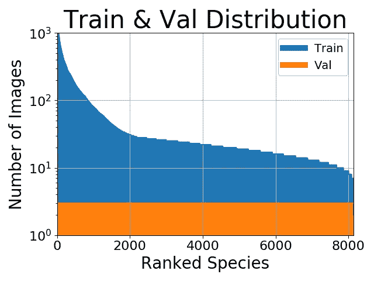
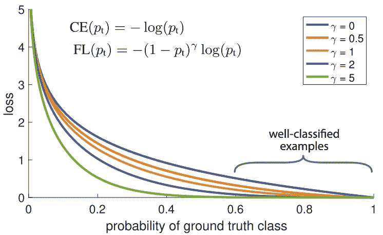

# 深度学习中不平衡数据集的处理

> 原文：<https://towardsdatascience.com/handling-imbalanced-datasets-in-deep-learning-f48407a0e758?source=collection_archive---------1----------------------->

## 给原力带来平衡！

Bring balance to the force!

> 想获得灵感？快来加入我的 [**超级行情快讯**](https://www.superquotes.co/?utm_source=mediumtech&utm_medium=web&utm_campaign=sharing) 。😎

并非所有的数据都是完美的。事实上，如果你能得到一个完美平衡的真实世界数据集，你将会非常幸运。大多数情况下，您的数据会有某种程度的类不平衡，这是因为您的每个类都有不同数量的示例。

# 为什么我们希望我们的数据是平衡的？

在将时间投入到深度学习项目中任何潜在的漫长任务之前，理解*为什么*我们应该这样做是很重要的，这样我们才能确定这是一项有价值的投资。只有当我们真正关心少数类时，类平衡技术才是真正必要的。

例如，假设我们正试图根据当前的市场状况、房子的属性和我们的预算来预测我们是否应该买房子。在这种情况下，非常重要的是，如果我们购买，那么这是正确的决定，因为这是如此巨大的投资。同时，如果我们的模型在我们应该买的时候说不要买，这也没什么大不了的。如果我们错过了一所房子，总会有其他房子可以买，但在如此巨大的资产上进行错误的投资将是非常糟糕的。

在这个例子中，我们绝对**需要**我们的少数“购买”类非常准确，而对于我们的“不购买”类来说，这没什么大不了的。然而，在实际情况下，由于在我们的数据中，购买比不购买要少得多，我们的模型将偏向于很好地学习“不购买”类，因为它拥有最多的数据，可能在“购买”类上表现不佳。这就需要平衡我们的数据，这样我们就可以更加重视正确的“买入”预测！

如果我们真的不关心少数阶级呢？例如，假设我们正在进行影像分类，您的类别分布如下所示:

乍一看，平衡我们的数据似乎会有所帮助。但也许我们对那些少数民族阶层不太感兴趣。也许我们的主要目标是获得**最高可能的百分比精度**。在这种情况下，做任何平衡都是没有意义的，因为我们大部分的百分比准确度都来自有更多训练例子的职业。第二，即使数据集不平衡，当目标是最高百分比准确度时，分类交叉熵损失往往表现得相当好。总之，我们的少数阶级对实现我们的主要目标没有多大贡献，所以平衡是不必要的。

综上所述，当我们遇到需要平衡数据的情况时，有两种方法可以帮助我们。

# (1)重量平衡

重量平衡通过改变每个训练示例在计算损失时携带的*重量*来平衡我们的数据。通常，我们的损失函数中的每个示例和类别将具有相同的权重，即 1.0。但是有时我们可能希望某些类或者某些训练例子更重要。再次参考我们购买房子的例子，因为“购买”类的准确性对我们来说是最重要的，所以该类中的训练例子应该对损失函数有显著的影响。

我们可以简单地通过将每个例子的损失乘以取决于它们的类别的某个因子来给这些类别加权。在喀拉斯，我们可以这样做:

我们创建了一个字典，基本上说我们的“购买”类应该为损失函数保留 75%的权重，因为“不购买”类更重要，我们相应地将它设置为 25%。当然，可以很容易地调整这些值，为您的应用找到最佳设置。如果我们的一个类比另一个类有更多的例子，我们也可以使用这种平衡方法。与其花费时间和资源试图为少数阶级收集更多，我们可以尝试使用重量平衡，使所有阶级平等地为我们的损失做出贡献。

我们可以使用的另一种平衡训练示例权重的方法是下面显示的**。主要思想是:在我们的数据集中，我们自然会有一些比其他人更容易分类的训练示例。在训练期间，这些示例将以 99%的准确率进行分类，而其他更具挑战性的示例可能仍然表现不佳。问题是那些容易分类的训练例子仍然是造成损失的原因。当有其他更具挑战性的数据点，如果正确分类，可以对我们的整体准确性做出更大贡献时，为什么我们仍然给予它们同等的权重？！**

****

**这正是焦点损失可以解决的问题！焦点损失*不是对所有训练样本赋予相等的权重，而是降低分类良好的样本*的权重。这实际上是将更多的训练重点放在难以分类的数据上！在我们有数据不平衡的实际设置中，我们的多数类将很快变得分类良好，因为我们有更多的数据。因此，为了确保我们也在我们的少数类上实现高准确度，我们可以在训练期间使用焦点损失来给予那些少数类样本更多的相对权重。聚焦损耗可作为自定义损耗函数在 Keras 中轻松实现:**

# **(2)过采样和欠采样**

**选择合适的类权重有时会很复杂。做一个简单的逆频率可能不总是工作得很好。焦点丢失可能会有所帮助，但即使这样也会使所有分类良好的*样本的权重下降。因此，平衡我们数据的另一种方法是通过抽样直接*进行。请看下面的插图。****

****

**Under and and Over Sampling**

**在上图的左侧和右侧，我们的蓝色类比橙色类有更多的样本。在这种情况下，我们有 2 个预处理选项，可以帮助训练我们的机器学习模型。**

**欠采样意味着我们将只从多数类中选择*一些*数据，只使用和少数类一样多的例子。应该进行这种选择以保持类的概率分布。那很容易！我们只是通过减少样本来平衡数据集！**

**过采样意味着我们将*创建少数类的副本*，以便拥有与多数类相同数量的实例。复制时将保持少数民族的分布。我们只是在没有获得更多数据的情况下平衡了数据集！如果您发现很难有效地设置类权重，那么采样是类平衡的一个很好的替代方法。**

# **喜欢学习？**

**在 twitter 上关注我，我会在这里发布所有最新最棒的人工智能、技术和科学！也在 LinkedIn 上与我联系！**